# Sentinel Intelligence Layer

<cite>
**Referenced Files in This Document**
- [sentinel.py](file://src/router/sentinel.py)
- [chaos.py](file://src/router/sensors/chaos.py)
- [regime.py](file://src/router/sensors/regime.py)
- [correlation.py](file://src/router/sensors/correlation.py)
- [news.py](file://src/router/sensors/news.py)
- [engine.py](file://src/router/engine.py)
- [governor.py](file://src/router/governor.py)
- [commander.py](file://src/router/commander.py)
- [state.py](file://src/router/state.py)
</cite>

## Table of Contents
1. [Introduction](#introduction)
2. [Project Structure](#project-structure)
3. [Core Components](#core-components)
4. [Architecture Overview](#architecture-overview)
5. [Detailed Component Analysis](#detailed-component-analysis)
6. [Dependency Analysis](#dependency-analysis)
7. [Performance Considerations](#performance-considerations)
8. [Troubleshooting Guide](#troubleshooting-guide)
9. [Conclusion](#conclusion)

## Introduction
This document describes the Sentinel intelligence layer that orchestrates market regime classification for the QuantMindX system. The Sentinel aggregates outputs from multiple sensors (chaos, regime, correlation, and news) into a unified RegimeReport, which informs downstream risk governance and bot dispatch decisions. It also documents the on_tick processing loop, the sensor fusion logic, and the mathematical relationships among chaos_score, regime_quality, and susceptibility. Guidance on logging, error handling, and performance for high-frequency tick processing is included.

## Project Structure
The Sentinel intelligence layer resides under the router module and integrates with supporting components for governance and execution.

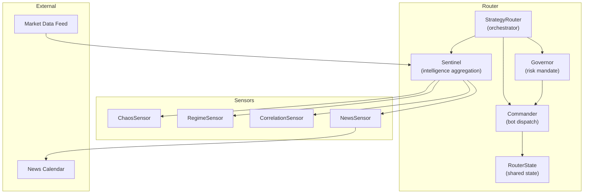

**Diagram sources**
- [sentinel.py](file://src/router/sentinel.py#L27-L84)
- [engine.py](file://src/router/engine.py#L16-L67)
- [governor.py](file://src/router/governor.py#L16-L54)
- [commander.py](file://src/router/commander.py#L11-L55)
- [chaos.py](file://src/router/sensors/chaos.py#L14-L56)
- [regime.py](file://src/router/sensors/regime.py#L16-L54)
- [correlation.py](file://src/router/sensors/correlation.py#L15-L44)
- [news.py](file://src/router/sensors/news.py#L16-L43)

**Section sources**
- [sentinel.py](file://src/router/sentinel.py#L1-L85)
- [engine.py](file://src/router/engine.py#L1-L68)

## Core Components
- Sentinel: Aggregates sensor outputs into a RegimeReport and classifies the market regime.
- ChaosSensor: Computes a chaos score using a Lyapunov-like proxy from recent price changes.
- RegimeSensor: Computes magnetization, susceptibility, and energy using a simplified Ising model from price-side spins.
- CorrelationSensor: Provides a placeholder for systemic risk detection via Random Matrix Theory (RMT) eigenvalues.
- NewsSensor: Tracks upcoming high-impact events and defines kill zones around scheduled releases.
- StrategyRouter: Coordinates the full sentient loop by invoking Sentinel, applying Governor rules, and dispatching bots.
- Governor: Issues risk mandates based on regime physics and systemic risk signals.
- Commander: Runs an auction to select and authorize bots per regime.
- RouterState: Shared state container for current regime and operational context.

**Section sources**
- [sentinel.py](file://src/router/sentinel.py#L17-L84)
- [chaos.py](file://src/router/sensors/chaos.py#L9-L56)
- [regime.py](file://src/router/sensors/regime.py#L9-L54)
- [correlation.py](file://src/router/sensors/correlation.py#L9-L44)
- [news.py](file://src/router/sensors/news.py#L10-L43)
- [engine.py](file://src/router/engine.py#L16-L67)
- [governor.py](file://src/router/governor.py#L9-L54)
- [commander.py](file://src/router/commander.py#L11-L55)
- [state.py](file://src/router/state.py#L8-L33)

## Architecture Overview
The Sentinel intelligence layer operates as the central orchestrator for real-time market regime classification. The end-to-end loop integrates tick ingestion, sensor updates, fusion logic, and downstream actions.

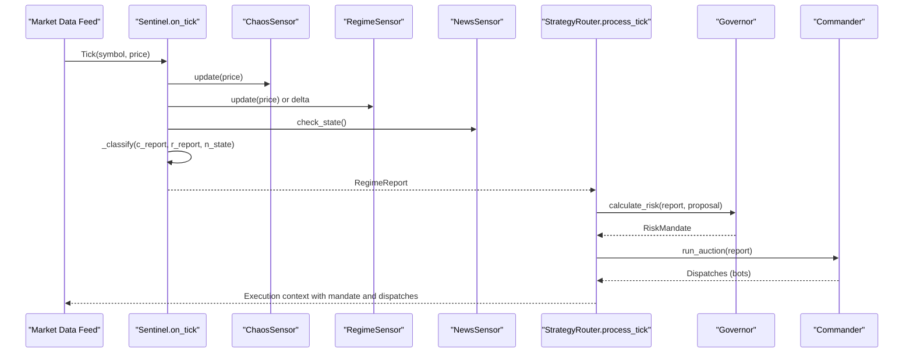

**Diagram sources**
- [sentinel.py](file://src/router/sentinel.py#L40-L63)
- [engine.py](file://src/router/engine.py#L29-L60)
- [governor.py](file://src/router/governor.py#L24-L54)
- [commander.py](file://src/router/commander.py#L19-L38)
- [chaos.py](file://src/router/sensors/chaos.py#L19-L24)
- [regime.py](file://src/router/sensors/regime.py#L21-L27)
- [news.py](file://src/router/sensors/news.py#L27-L43)

## Detailed Component Analysis

### RegimeReport Data Structure
RegimeReport encapsulates the unified assessment of market state produced by the Sentinel. It includes:
- regime: Enumerated label derived from sensor fusion.
- chaos_score: Normalized measure of market turbulence/predictability.
- regime_quality: Complementary quality metric computed as 1.0 minus chaos_score.
- susceptibility: Sensitivity indicator from the regime sensor.
- is_systemic_risk: Placeholder flag for systemic risk signals.
- news_state: Current macro news environment (e.g., SAFE, KILL_ZONE).
- timestamp: Placeholder for temporal anchoring.

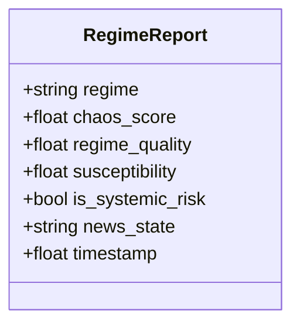

**Diagram sources**
- [sentinel.py](file://src/router/sentinel.py#L17-L26)

**Section sources**
- [sentinel.py](file://src/router/sentinel.py#L17-L26)

### On-Tick Processing Loop
The on_tick method performs three primary steps:
1. Sensor updates: ChaosSensor and RegimeSensor are updated with the latest tick data; CorrelationSensor remains stubbed; NewsSensor checks macro state.
2. Fusion and classification: _classify maps sensor outputs to a regime label.
3. Report compilation: A RegimeReport is constructed and returned.

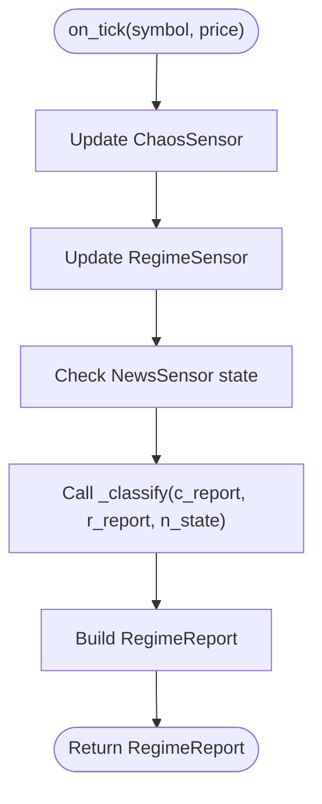

**Diagram sources**
- [sentinel.py](file://src/router/sentinel.py#L40-L63)

**Section sources**
- [sentinel.py](file://src/router/sentinel.py#L40-L63)

### Sensor Fusion Logic in _classify
The fusion logic prioritizes macro risk, then chaos, followed by regime criticality and stability conditions:

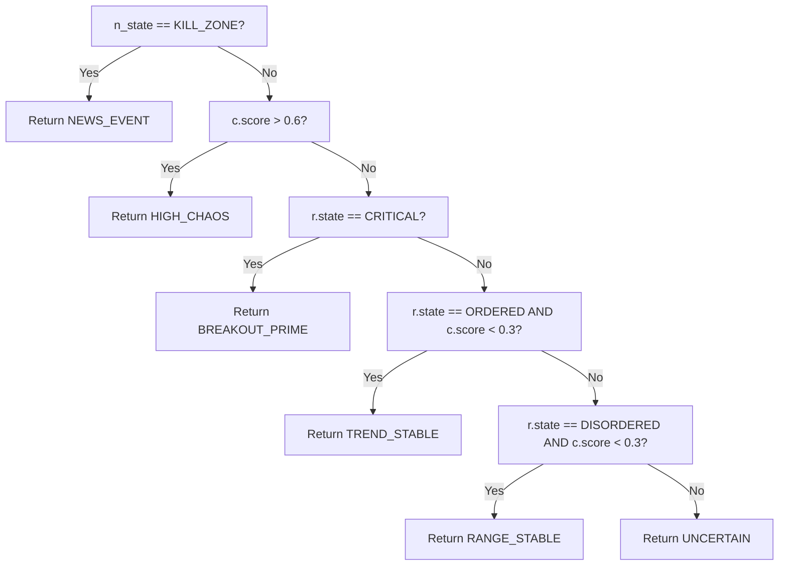

**Diagram sources**
- [sentinel.py](file://src/router/sentinel.py#L65-L84)

**Section sources**
- [sentinel.py](file://src/router/sentinel.py#L65-L84)

### Mathematical Relationships and Metrics
- chaos_score: Derived from a Lyapunov-like proxy computed from price returns and their divergences. Normalized to [0.0, 1.0].
- regime_quality: Defined as 1.0 minus chaos_score, serving as a complementary quality indicator.
- susceptibility: From the RegimeSensor, representing variance of spins (sensitivity near criticality).

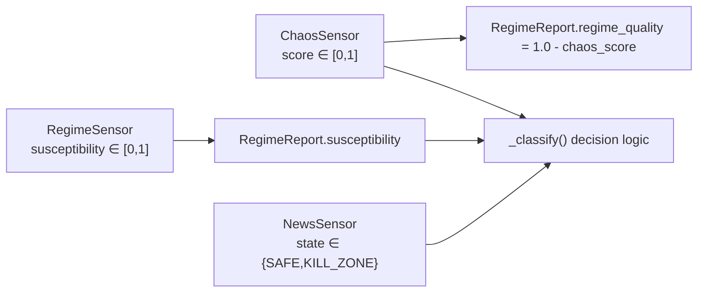

**Diagram sources**
- [sentinel.py](file://src/router/sentinel.py#L54-L62)
- [chaos.py](file://src/router/sensors/chaos.py#L26-L56)
- [regime.py](file://src/router/sensors/regime.py#L29-L54)
- [news.py](file://src/router/sensors/news.py#L27-L43)

**Section sources**
- [sentinel.py](file://src/router/sentinel.py#L54-L62)
- [chaos.py](file://src/router/sensors/chaos.py#L26-L56)
- [regime.py](file://src/router/sensors/regime.py#L29-L54)

### Implementation Examples

- Sensor Initialization
  - Initialize the Sentinel to construct its sensors and maintain the current report.
  - Example reference: [Sentinel.__init__](file://src/router/sentinel.py#L32-L38)

- Tick Processing Workflow
  - Call on_tick with symbol and price to receive a RegimeReport.
  - Example reference: [Sentinel.on_tick](file://src/router/sentinel.py#L40-L63)

- Decision-Making Algorithm
  - Use _classify to derive regime labels from sensor reports.
  - Example reference: [Sentinel._classify](file://src/router/sentinel.py#L65-L84)

- Governance and Dispatch
  - StrategyRouter ties together Sentinel, Governor, and Commander for end-to-end orchestration.
  - Example reference: [StrategyRouter.process_tick](file://src/router/engine.py#L29-L60)

**Section sources**
- [sentinel.py](file://src/router/sentinel.py#L32-L63)
- [engine.py](file://src/router/engine.py#L29-L60)

### Sensor Details

#### ChaosSensor
- Purpose: Measure market turbulence/predictability using a Lyapunov-like proxy from recent returns.
- Inputs: Price series window.
- Output: ChaosReport with score and label thresholds.

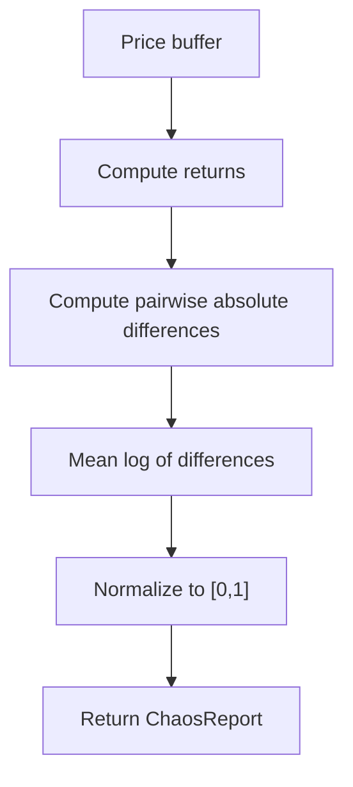

**Diagram sources**
- [chaos.py](file://src/router/sensors/chaos.py#L26-L56)

**Section sources**
- [chaos.py](file://src/router/sensors/chaos.py#L14-L56)

#### RegimeSensor
- Purpose: Detect phase transitions and trend strength using a simplified Ising model.
- Inputs: Price-side changes encoded as spins (+1/-1).
- Output: RegimeReport with magnetization, susceptibility, energy, and state.

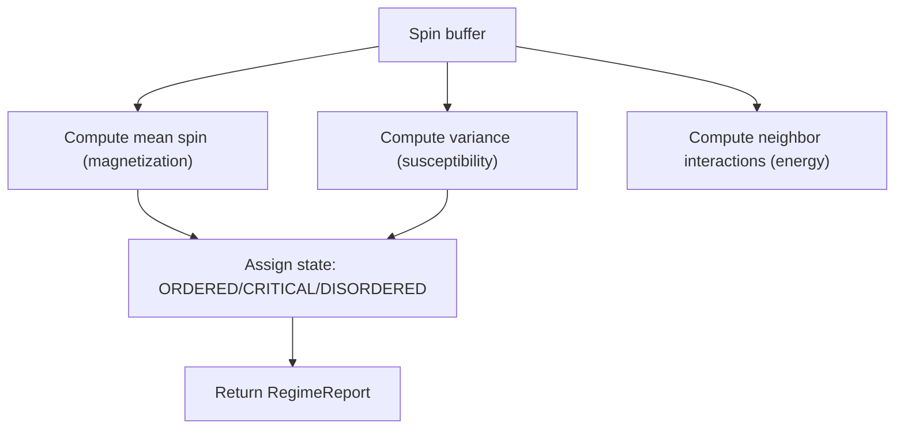

**Diagram sources**
- [regime.py](file://src/router/sensors/regime.py#L29-L54)

**Section sources**
- [regime.py](file://src/router/sensors/regime.py#L16-L54)

#### CorrelationSensor
- Purpose: Placeholder for systemic risk detection via RMT eigenanalysis.
- Inputs: Multi-symbol returns buffers.
- Output: CorrelationReport with max eigenvalue, risk score, and systemic flag.

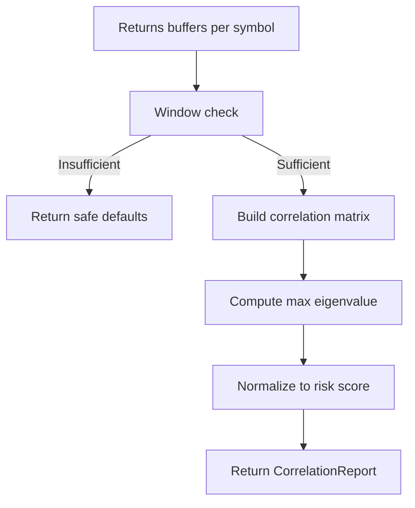

**Diagram sources**
- [correlation.py](file://src/router/sensors/correlation.py#L21-L44)

**Section sources**
- [correlation.py](file://src/router/sensors/correlation.py#L15-L44)

#### NewsSensor
- Purpose: Enforce kill zones around high-impact news events.
- Inputs: Up-to-date calendar of events.
- Output: Macro state (SAFE, PRE_NEWS, KILL_ZONE, POST_NEWS).

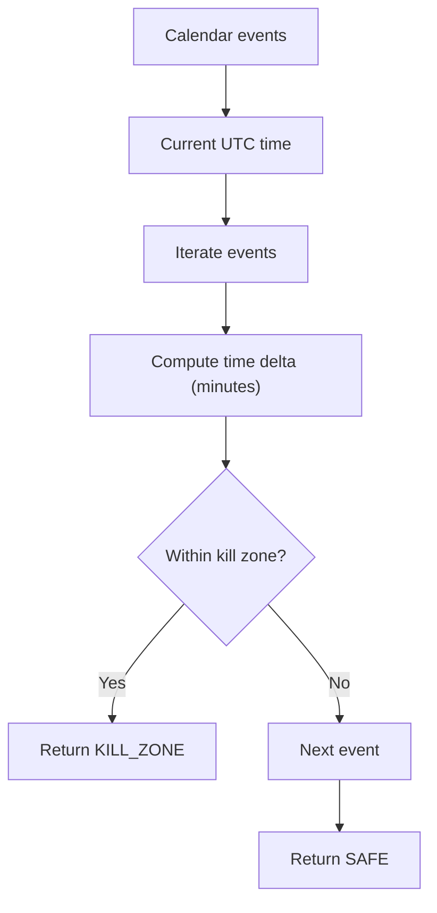

**Diagram sources**
- [news.py](file://src/router/sensors/news.py#L27-L43)

**Section sources**
- [news.py](file://src/router/sensors/news.py#L16-L43)

### Governance and Execution
- Governor calculates risk mandates based on chaos thresholds and systemic risk flags.
- Commander selects and dispatches bots according to regime eligibility and performance ranking.

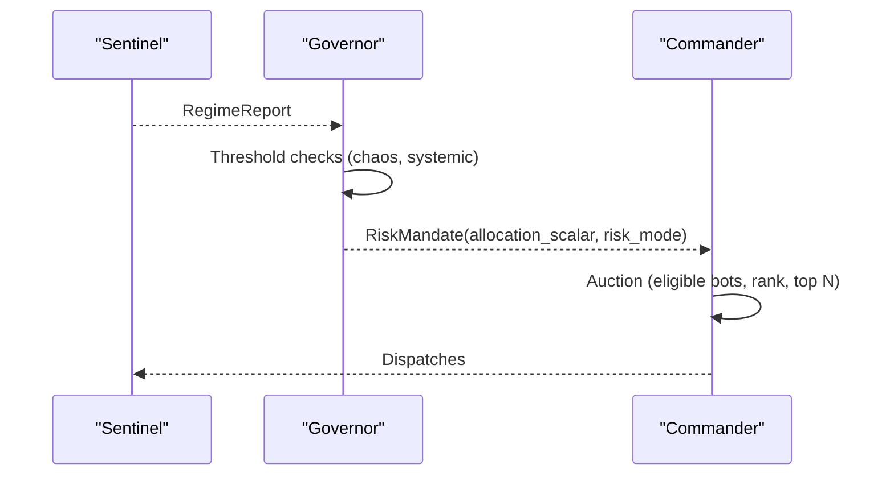

**Diagram sources**
- [governor.py](file://src/router/governor.py#L24-L54)
- [commander.py](file://src/router/commander.py#L19-L38)

**Section sources**
- [governor.py](file://src/router/governor.py#L16-L54)
- [commander.py](file://src/router/commander.py#L11-L55)

## Dependency Analysis
The Sentinel depends on four sensors and composes a unified report consumed by StrategyRouter, which further interacts with Governor and Commander.

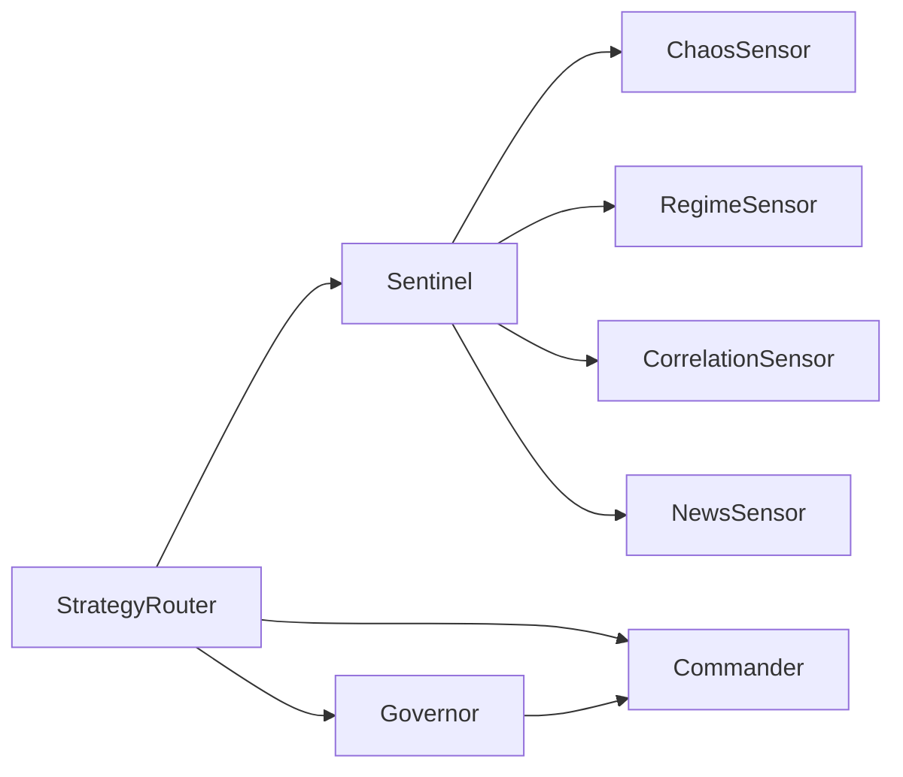

**Diagram sources**
- [sentinel.py](file://src/router/sentinel.py#L10-L13)
- [engine.py](file://src/router/engine.py#L10-L12)

**Section sources**
- [sentinel.py](file://src/router/sentinel.py#L10-L13)
- [engine.py](file://src/router/engine.py#L10-L12)

## Performance Considerations
- Window sizes and buffer management: Ensure efficient sliding windows for price series to minimize memory overhead and computational cost.
- Numeric stability: Add small noise floors when taking logarithms to avoid undefined values.
- Early exits: Short-circuit calculations when insufficient data is available to avoid unnecessary work.
- Logging frequency: Use debug-level logs sparingly during high-frequency processing; prefer sampling or thresholded logging.
- Asynchronous feeds: Consider decoupling sensor updates from the main tick loop if latency becomes a concern.

[No sources needed since this section provides general guidance]

## Troubleshooting Guide
- Missing or stale news events: Verify that the news calendar is being updated and that the kill-zone logic aligns with event timestamps.
- Sensor thresholds: Adjust chaos and regime thresholds based on asset characteristics and market conditions.
- Governance overrides: Confirm that systemic risk flags and chaos scores are correctly propagated to the Governor.
- Dispatch anomalies: Validate bot eligibility rules and performance scoring in the Commander.

**Section sources**
- [news.py](file://src/router/sensors/news.py#L22-L43)
- [governor.py](file://src/router/governor.py#L24-L54)
- [commander.py](file://src/router/commander.py#L19-L49)

## Conclusion
The Sentinel intelligence layer provides a modular, extensible framework for real-time market regime classification. By combining chaos, regime, correlation, and news signals, it produces a unified RegimeReport that drives risk-aware bot dispatch and portfolio-level controls. The documented processing loop, fusion logic, and mathematical relationships enable reliable operation under high-frequency market data while maintaining clarity for maintenance and extension.