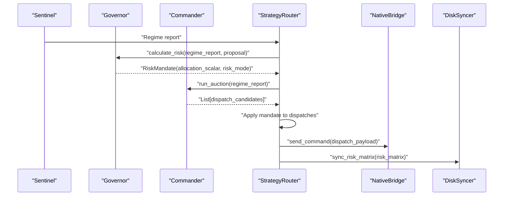
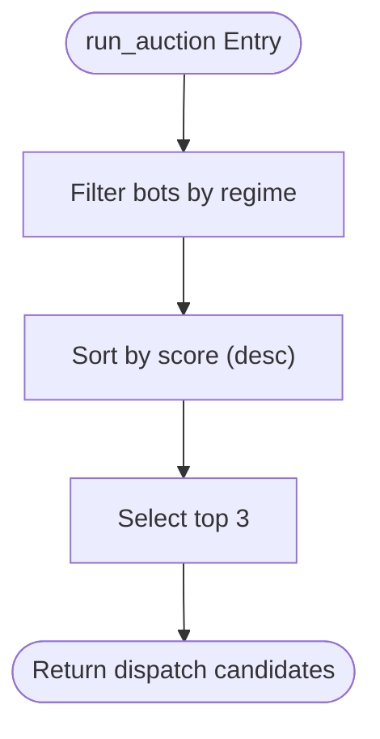
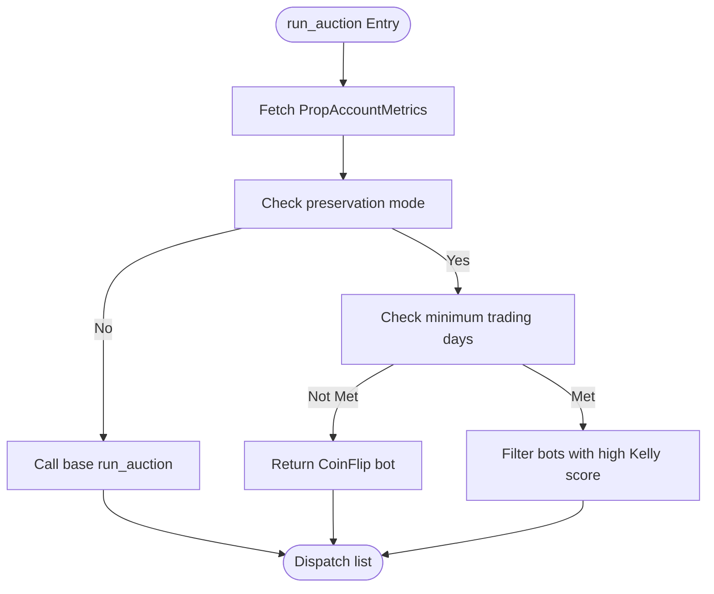
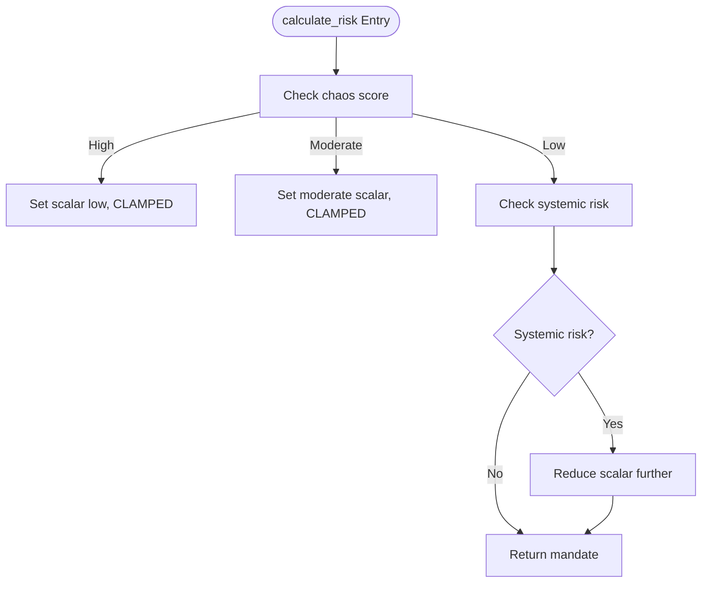
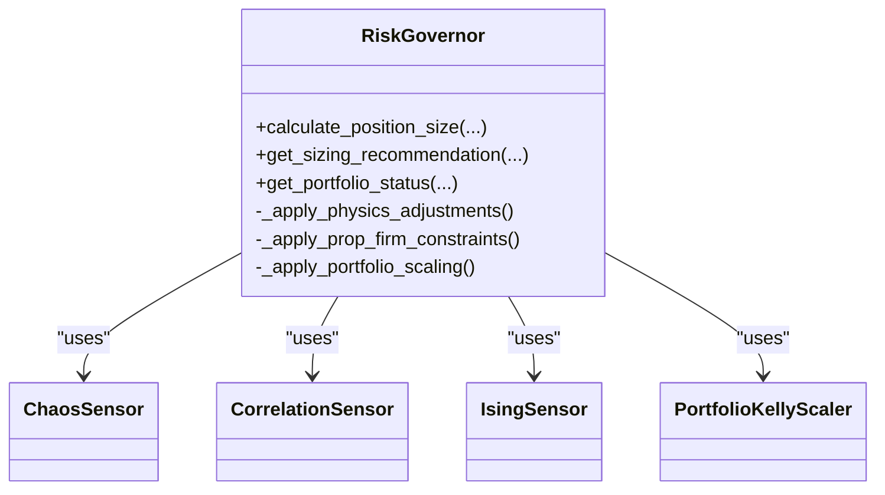
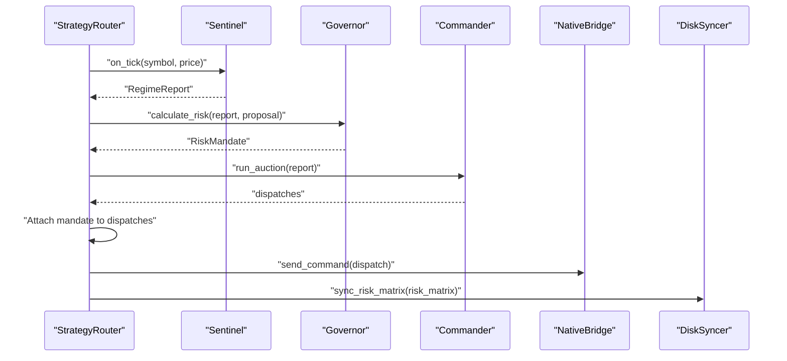
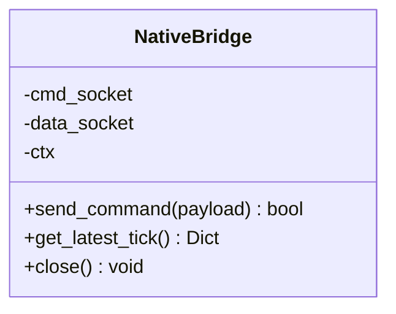
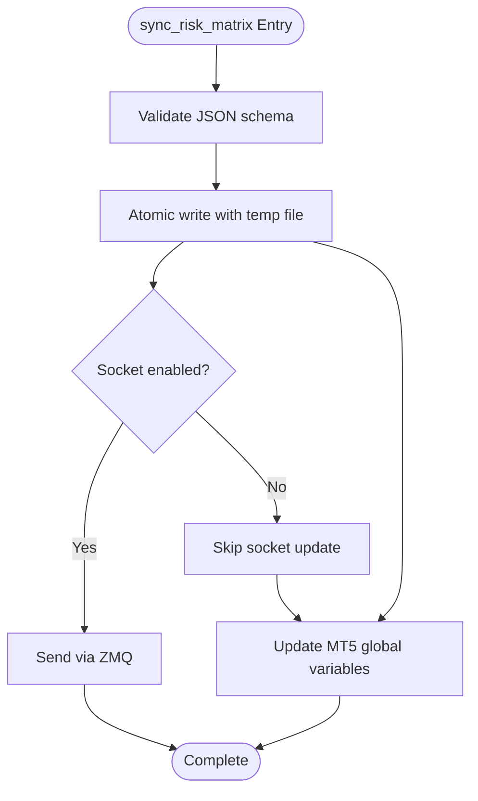
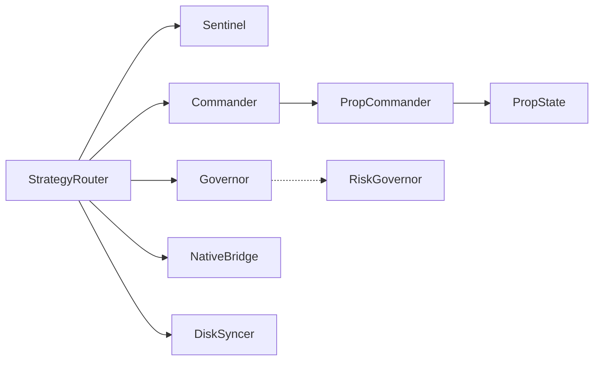

# Commander System

<cite>
**Referenced Files in This Document**
- [src/router/commander.py](file://src/router/commander.py)
- [src/router/prop/commander.py](file://src/router/prop/commander.py)
- [src/router/governor.py](file://src/router/governor.py)
- [src/risk/governor.py](file://src/risk/governor.py)
- [src/router/engine.py](file://src/router/engine.py)
- [src/router/state.py](file://src/router/state.py)
- [src/router/prop/state.py](file://src/router/prop/state.py)
- [src/router/sync.py](file://src/router/sync.py)
- [src/router/interface.py](file://src/router/interface.py)
- [tests/router/test_prop_commander.py](file://tests/router/test_prop_commander.py)
</cite>

## Table of Contents
1. [Introduction](#introduction)
2. [Project Structure](#project-structure)
3. [Core Components](#core-components)
4. [Architecture Overview](#architecture-overview)
5. [Detailed Component Analysis](#detailed-component-analysis)
6. [Dependency Analysis](#dependency-analysis)
7. [Performance Considerations](#performance-considerations)
8. [Troubleshooting Guide](#troubleshooting-guide)
9. [Conclusion](#conclusion)

## Introduction
This document describes the Commander system responsible for strategy auction and bot dispatch coordination. It explains how multiple trading bots are selected and authorized for execution under varying market regimes, how risk mandates are calculated and enforced, and how the system integrates with the Governor for risk validation and with the ZeroMQ bridge for MT5 execution. It also documents the Prop Commander extension that incorporates goal-oriented logic and preservation modes, along with the synchronization layer that bridges Python-side decisions to MQL5 Expert Advisors.

## Project Structure
The Commander system spans several modules:
- Execution layer: Commander and PropCommander orchestrate bot selection and dispatch
- Compliance layer: Governor enforces risk scalars and mode constraints
- Coordination layer: StrategyRouter ties intelligence, compliance, and decision-making together
- State management: RouterState and PropState maintain shared and persistent metrics
- Execution bridge: NativeBridge and DiskSyncer connect to MT5 via ZeroMQ and file synchronization

```mermaid
graph TB
subgraph "Intelligence"
Sentinel["Sentinel<br/>Market State Observation"]
end
subgraph "Compliance"
Gov["Governor<br/>Risk Mandate Calculation"]
RiskGov["RiskGovernor<br/>Enhanced Kelly Orchestrator"]
end
subgraph "Execution"
Cmd["Commander<br/>Strategy Auction"]
PropCmd["PropCommander<br/>Goal-Oriented Logic"]
Router["StrategyRouter<br/>Orchestrator"]
end
subgraph "State"
RState["RouterState<br/>Shared Memory"]
PState["PropState<br/>Persistent Metrics"]
end
subgraph "Bridge"
Bridge["NativeBridge<br/>ZeroMQ Bridge"]
Sync["DiskSyncer<br/>MT5 Risk Matrix Sync"]
end
Sentinel --> Gov
Gov --> Cmd
Cmd --> Router
PropCmd --> Router
Router --> Bridge
Router --> Sync
RState -.-> Router
PState -.-> PropCmd
RiskGov -.-> Gov
```

**Diagram sources**
- [src/router/engine.py](file://src/router/engine.py#L16-L67)
- [src/router/governor.py](file://src/router/governor.py#L16-L61)
- [src/risk/governor.py](file://src/risk/governor.py#L42-L447)
- [src/router/commander.py](file://src/router/commander.py#L11-L56)
- [src/router/prop/commander.py](file://src/router/prop/commander.py#L10-L79)
- [src/router/state.py](file://src/router/state.py#L8-L33)
- [src/router/prop/state.py](file://src/router/prop/state.py#L24-L186)
- [src/router/interface.py](file://src/router/interface.py#L18-L79)
- [src/router/sync.py](file://src/router/sync.py#L26-L450)

**Section sources**
- [src/router/engine.py](file://src/router/engine.py#L16-L67)
- [src/router/commander.py](file://src/router/commander.py#L11-L56)
- [src/router/prop/commander.py](file://src/router/prop/commander.py#L10-L79)
- [src/router/governor.py](file://src/router/governor.py#L16-L61)
- [src/risk/governor.py](file://src/risk/governor.py#L42-L447)
- [src/router/state.py](file://src/router/state.py#L8-L33)
- [src/router/prop/state.py](file://src/router/prop/state.py#L24-L186)
- [src/router/interface.py](file://src/router/interface.py#L18-L79)
- [src/router/sync.py](file://src/router/sync.py#L26-L450)

## Core Components
- Commander: Implements the base strategy auction logic, eligibility filtering by regime, ranking, and top-N selection.
- PropCommander: Extends Commander with goal-oriented preservation mode, minimum trading days enforcement, and a coin-flip bot strategy.
- Governor: Calculates risk mandates (allocation scalar and risk mode) based on market physics and systemic risk signals.
- StrategyRouter: Coordinates the full loop: observe, govern, command, and dispatch; maintains bot registrations and applies mandates to dispatches.
- RouterState and PropState: Shared and persistent state holders for regime, active bots, and prop account metrics.
- NativeBridge and DiskSyncer: Provide ZeroMQ-based command dispatch and atomic file synchronization for MT5 consumption.

**Section sources**
- [src/router/commander.py](file://src/router/commander.py#L11-L56)
- [src/router/prop/commander.py](file://src/router/prop/commander.py#L10-L79)
- [src/router/governor.py](file://src/router/governor.py#L16-L61)
- [src/router/engine.py](file://src/router/engine.py#L16-L67)
- [src/router/state.py](file://src/router/state.py#L8-L33)
- [src/router/prop/state.py](file://src/router/prop/state.py#L24-L186)
- [src/router/interface.py](file://src/router/interface.py#L18-L79)
- [src/router/sync.py](file://src/router/sync.py#L26-L450)

## Architecture Overview
The Commander system follows a three-layer architecture:
- Intelligence: Sentinel observes market conditions and produces a regime report.
- Compliance: Governor computes risk mandates based on chaos, correlation, and systemic signals.
- Execution: Commander selects and dispatches bots, applying the Governor’s mandate to each dispatch.



**Diagram sources**
- [src/router/engine.py](file://src/router/engine.py#L29-L60)
- [src/router/governor.py](file://src/router/governor.py#L24-L54)
- [src/router/commander.py](file://src/router/commander.py#L19-L38)
- [src/router/interface.py](file://src/router/interface.py#L43-L56)
- [src/router/sync.py](file://src/router/sync.py#L306-L381)

## Detailed Component Analysis

### Strategy Auction Mechanism
The Commander performs a simple but effective auction:
- Eligibility: Filters bots eligible for the current regime; in high chaos, no bots are eligible.
- Ranking: Sorts bots by score (descending).
- Selection: Chooses top-N bots for dispatch.



**Diagram sources**
- [src/router/commander.py](file://src/router/commander.py#L19-L38)

**Section sources**
- [src/router/commander.py](file://src/router/commander.py#L19-L38)

### Prop Commander Extension and Preservation Logic
The PropCommander extends the base auction with:
- Preservation mode: Triggered when target profit threshold is met.
- Minimum trading days enforcement: Ensures a minimum number of trading days post-target.
- Coin flip bot: A minimal-risk bot used when target is met but trading days are insufficient.
- A+ setup filtering: In preservation mode, only bots with high Kelly scores are selected.



**Diagram sources**
- [src/router/prop/commander.py](file://src/router/prop/commander.py#L22-L48)
- [src/router/prop/state.py](file://src/router/prop/state.py#L51-L93)

**Section sources**
- [src/router/prop/commander.py](file://src/router/prop/commander.py#L22-L48)
- [src/router/prop/state.py](file://src/router/prop/state.py#L51-L93)
- [tests/router/test_prop_commander.py](file://tests/router/test_prop_commander.py#L28-L182)

### Risk Authorization and Mandate Validation
The Governor calculates a RiskMandate with:
- Allocation scalar: Reduced during high chaos and systemic risk.
- Risk mode: STANDARD, CLAMPED, or HALTED depending on thresholds.
- Notes: Human-readable rationale for the mandate.



**Diagram sources**
- [src/router/governor.py](file://src/router/governor.py#L24-L54)

**Section sources**
- [src/router/governor.py](file://src/router/governor.py#L24-L54)

### Integration with Risk Governor (Enhanced Kelly)
While the Router Governor focuses on swarm-level mandates, the Risk Governor provides position sizing with physics-based adjustments, prop firm constraints, and portfolio scaling. This complements the Commander by ensuring individual bot risk aligns with broader constraints.



**Diagram sources**
- [src/risk/governor.py](file://src/risk/governor.py#L42-L447)

**Section sources**
- [src/risk/governor.py](file://src/risk/governor.py#L105-L224)

### Execution Coordination and Dispatch Workflows
The StrategyRouter orchestrates the full loop:
- Observes market conditions via Sentinel.
- Computes risk mandate via Governor.
- Runs auction via Commander.
- Applies mandate to dispatches (risk mode and scalar).
- Dispatches commands via NativeBridge and synchronizes risk matrix via DiskSyncer.



**Diagram sources**
- [src/router/engine.py](file://src/router/engine.py#L29-L60)
- [src/router/interface.py](file://src/router/interface.py#L43-L56)
- [src/router/sync.py](file://src/router/sync.py#L306-L381)

**Section sources**
- [src/router/engine.py](file://src/router/engine.py#L29-L60)
- [src/router/interface.py](file://src/router/interface.py#L43-L56)
- [src/router/sync.py](file://src/router/sync.py#L306-L381)

### ZeroMQ Bridge for MT5 Execution
The NativeBridge provides:
- Command socket (PUSH) for dispatching JSON commands to MT5.
- Data socket (SUB) for ingesting tick data.
- Simulation mode fallback when ZeroMQ is unavailable.



**Diagram sources**
- [src/router/interface.py](file://src/router/interface.py#L18-L79)

**Section sources**
- [src/router/interface.py](file://src/router/interface.py#L18-L79)

### MT5 Risk Matrix Synchronization
The DiskSyncer ensures atomic, validated updates to risk_matrix.json for MT5 consumption:
- Atomic file writes using temporary files and os.replace.
- File locking for cross-platform compatibility.
- JSON schema validation for symbol entries.
- Optional socket-based updates for V8.
- Fast-path global variable updates for MT5.



**Diagram sources**
- [src/router/sync.py](file://src/router/sync.py#L306-L381)

**Section sources**
- [src/router/sync.py](file://src/router/sync.py#L306-L381)

## Dependency Analysis
Key dependencies and relationships:
- StrategyRouter depends on Sentinel, Governor, and Commander.
- PropCommander inherits from Commander and depends on PropState.
- NativeBridge and DiskSyncer are used by StrategyRouter for execution and synchronization.
- RiskGovernor is orthogonal to Router Governor but shares similar risk themes.



**Diagram sources**
- [src/router/engine.py](file://src/router/engine.py#L21-L24)
- [src/router/commander.py](file://src/router/commander.py#L11-L18)
- [src/router/prop/commander.py](file://src/router/prop/commander.py#L10-L18)
- [src/router/governor.py](file://src/router/governor.py#L16-L24)
- [src/risk/governor.py](file://src/risk/governor.py#L42-L90)

**Section sources**
- [src/router/engine.py](file://src/router/engine.py#L21-L24)
- [src/router/commander.py](file://src/router/commander.py#L11-L18)
- [src/router/prop/commander.py](file://src/router/prop/commander.py#L10-L18)
- [src/router/governor.py](file://src/router/governor.py#L16-L24)
- [src/risk/governor.py](file://src/risk/governor.py#L42-L90)

## Performance Considerations
- Auction complexity: Sorting eligible bots by score is O(E log E) where E is the number of eligible bots; top-N selection is O(N).
- Governor mandate computation: Threshold checks and scalar reductions are O(1).
- RiskGovernor calculations: Physics sensor reads and portfolio scaling involve small constant-time operations; caching reduces repeated work.
- Bridge and sync: ZeroMQ operations are asynchronous; atomic file writes minimize contention and parsing overhead.

[No sources needed since this section provides general guidance]

## Troubleshooting Guide
Common issues and resolutions:
- Missing ZeroMQ: NativeBridge falls back to simulation mode; commands are logged instead of sent.
- File write failures: DiskSyncer retries with exponential backoff; inspect logs for last error and ensure permissions.
- Empty or invalid risk matrix: JSON validation raises errors; confirm structure and types.
- No active bots: Commander returns empty dispatches; verify bot registration and regime eligibility.
- Prop state unavailable: PropState caches metrics; if DB is unreachable, metrics may be stale.

**Section sources**
- [src/router/interface.py](file://src/router/interface.py#L25-L29)
- [src/router/sync.py](file://src/router/sync.py#L362-L381)
- [src/router/sync.py](file://src/router/sync.py#L167-L206)
- [src/router/commander.py](file://src/router/commander.py#L40-L49)
- [src/router/prop/state.py](file://src/router/prop/state.py#L58-L92)

## Conclusion
The Commander system provides a modular, extensible framework for strategy auction and bot dispatch coordination. It separates concerns across intelligence, compliance, and execution layers, integrates risk mandates from the Governor, and bridges to MT5 via ZeroMQ and atomic file synchronization. The Prop Commander extension introduces goal-oriented controls that adapt dispatch behavior based on account metrics, while the Risk Governor ensures position sizing remains aligned with market physics and portfolio constraints.