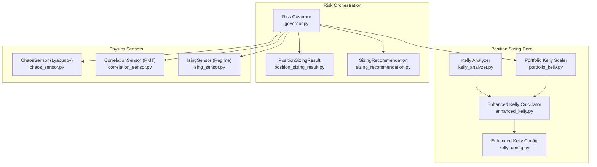
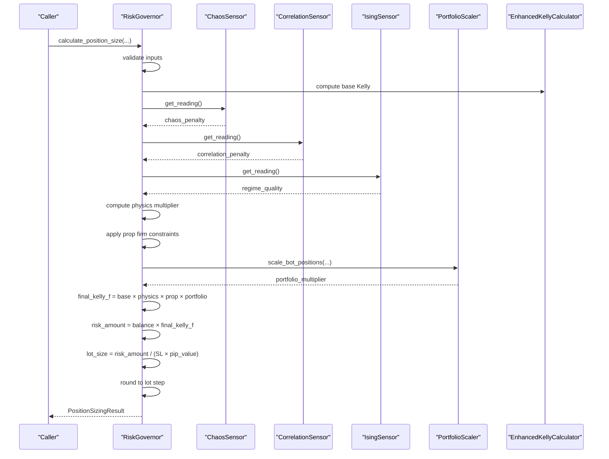
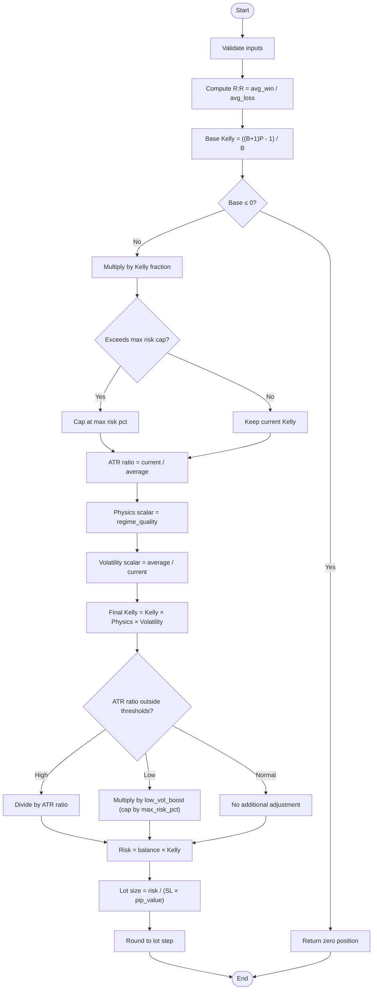
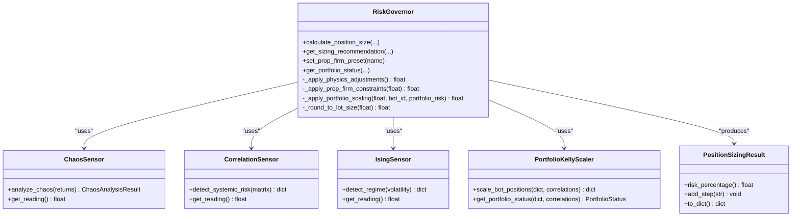
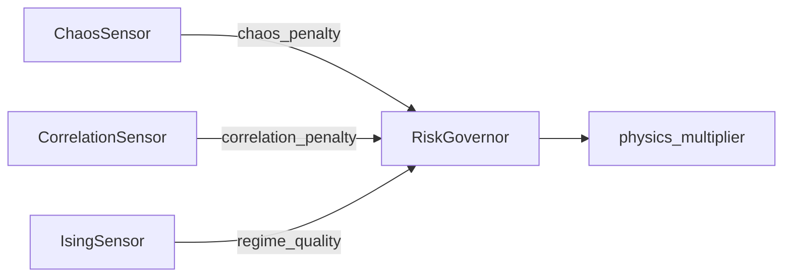
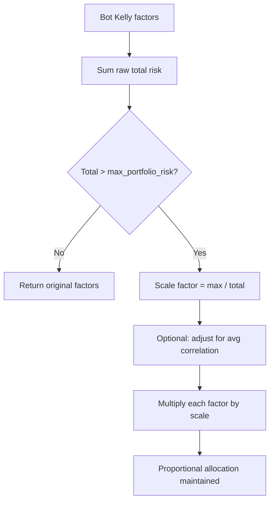
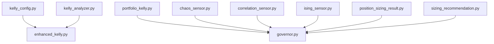

# Enhanced Kelly Position Sizing

<cite>
**Referenced Files in This Document**
- [enhanced_kelly.py](file://src/position_sizing/enhanced_kelly.py)
- [kelly_analyzer.py](file://src/position_sizing/kelly_analyzer.py)
- [portfolio_kelly.py](file://src/position_sizing/portfolio_kelly.py)
- [kelly_config.py](file://src/position_sizing/kelly_config.py)
- [governor.py](file://src/risk/governor.py)
- [position_sizing_result.py](file://src/risk/models/position_sizing_result.py)
- [sizing_recommendation.py](file://src/risk/models/sizing_recommendation.py)
- [chaos_sensor.py](file://src/risk/physics/chaos_sensor.py)
- [correlation_sensor.py](file://src/risk/physics/correlation_sensor.py)
- [ising_sensor.py](file://src/risk/physics/ising_sensor.py)
</cite>

## Table of Contents
1. [Introduction](#introduction)
2. [Project Structure](#project-structure)
3. [Core Components](#core-components)
4. [Architecture Overview](#architecture-overview)
5. [Detailed Component Analysis](#detailed-component-analysis)
6. [Dependency Analysis](#dependency-analysis)
7. [Performance Considerations](#performance-considerations)
8. [Troubleshooting Guide](#troubleshooting-guide)
9. [Conclusion](#conclusion)
10. [Appendices](#appendices)

## Introduction
This document describes the Enhanced Kelly position sizing system that integrates physics-based multipliers and market regime adjustments. It explains the mathematical foundation of the enhanced Kelly criterion, including base Kelly calculations, half-Kelly risk caps, and volatility adjustments. It documents the integration with chaos theory metrics, market regime classification, and portfolio-level risk caps. The guide covers position sizing recommendation algorithms, edge case handling, and performance optimization techniques, and provides examples of calculations under different market conditions.

## Project Structure
The Enhanced Kelly system spans three primary areas:
- Position sizing core: base Kelly calculation, safety layers, and rounding to broker lot sizes
- Risk orchestration: physics sensors, prop firm presets, portfolio scaling, and caching
- Models: typed results and recommendations for auditability and execution

**Diagram sources**
- [enhanced_kelly.py](file://src/position_sizing/enhanced_kelly.py#L128-L418)
- [kelly_analyzer.py](file://src/position_sizing/kelly_analyzer.py#L27-L228)
- [portfolio_kelly.py](file://src/position_sizing/portfolio_kelly.py#L26-L254)
- [kelly_config.py](file://src/position_sizing/kelly_config.py#L11-L116)
- [governor.py](file://src/risk/governor.py#L42-L447)
- [position_sizing_result.py](file://src/risk/models/position_sizing_result.py#L16-L246)
- [sizing_recommendation.py](file://src/risk/models/sizing_recommendation.py#L15-L229)
- [chaos_sensor.py](file://src/risk/physics/chaos_sensor.py#L31-L253)
- [correlation_sensor.py](file://src/risk/physics/correlation_sensor.py#L22-L285)
- [ising_sensor.py](file://src/risk/physics/ising_sensor.py#L105-L246)

**Section sources**
- [enhanced_kelly.py](file://src/position_sizing/enhanced_kelly.py#L1-L418)
- [governor.py](file://src/risk/governor.py#L1-L447)

## Core Components
- Enhanced Kelly Calculator: computes base Kelly, applies half-Kelly, hard risk caps, and volatility adjustments, then rounds to broker lot sizes.
- Risk Governor: orchestrates physics sensors, prop firm constraints, and portfolio scaling into a unified position sizing API with caching and error handling.
- Physics Sensors: ChaosSensor (Lyapunov exponent), CorrelationSensor (Random Matrix Theory), and IsingSensor (regime classification).
- Models: PositionSizingResult and SizingRecommendation provide structured outputs and audit trails.
- Portfolio Kelly Scaler: scales multiple bot positions to prevent portfolio over-leverage.
- Kelly Analyzer: extracts win rate, average win/loss, and Kelly parameters from trade history.

**Section sources**
- [enhanced_kelly.py](file://src/position_sizing/enhanced_kelly.py#L128-L418)
- [governor.py](file://src/risk/governor.py#L42-L447)
- [chaos_sensor.py](file://src/risk/physics/chaos_sensor.py#L31-L253)
- [correlation_sensor.py](file://src/risk/physics/correlation_sensor.py#L22-L285)
- [ising_sensor.py](file://src/risk/physics/ising_sensor.py#L105-L246)
- [position_sizing_result.py](file://src/risk/models/position_sizing_result.py#L16-L246)
- [sizing_recommendation.py](file://src/risk/models/sizing_recommendation.py#L15-L229)
- [portfolio_kelly.py](file://src/position_sizing/portfolio_kelly.py#L26-L254)
- [kelly_analyzer.py](file://src/position_sizing/kelly_analyzer.py#L27-L228)

## Architecture Overview
The system follows a layered approach:
- Input validation and base Kelly computation
- Physics-based adjustments via Chaos, Correlation, and Ising sensors
- Prop firm constraints and portfolio risk scaling
- Final position sizing with rounding and audit trail

**Diagram sources**
- [governor.py](file://src/risk/governor.py#L105-L224)
- [chaos_sensor.py](file://src/risk/physics/chaos_sensor.py#L243-L253)
- [correlation_sensor.py](file://src/risk/physics/correlation_sensor.py#L229-L281)
- [ising_sensor.py](file://src/risk/physics/ising_sensor.py#L140-L195)
- [portfolio_kelly.py](file://src/position_sizing/portfolio_kelly.py#L57-L96)
- [enhanced_kelly.py](file://src/position_sizing/enhanced_kelly.py#L190-L377)

## Detailed Component Analysis

### Enhanced Kelly Calculator
The Enhanced Kelly Calculator implements a three-layer protection system:
- Layer 1: Kelly fraction (default 50% of full Kelly)
- Layer 2: Hard risk cap (default 2% per trade)
- Layer 3: Dynamic volatility adjustment using ATR ratio and regime quality

**Diagram sources**
- [enhanced_kelly.py](file://src/position_sizing/enhanced_kelly.py#L190-L377)

**Section sources**
- [enhanced_kelly.py](file://src/position_sizing/enhanced_kelly.py#L128-L418)

### Risk Governor Orchestrator
The Risk Governor coordinates physics sensors, prop firm constraints, and portfolio scaling. It caches sensor results and provides a unified API for position sizing with detailed audit trails.

Key responsibilities:
- Validate inputs
- Compute base Kelly
- Apply physics penalties from Chaos, Correlation, and Ising sensors
- Enforce prop firm risk caps
- Scale positions across multiple bots
- Round to broker lot sizes
- Produce PositionSizingResult

**Diagram sources**
- [governor.py](file://src/risk/governor.py#L42-L447)
- [chaos_sensor.py](file://src/risk/physics/chaos_sensor.py#L31-L253)
- [correlation_sensor.py](file://src/risk/physics/correlation_sensor.py#L22-L285)
- [ising_sensor.py](file://src/risk/physics/ising_sensor.py#L105-L246)
- [portfolio_kelly.py](file://src/position_sizing/portfolio_kelly.py#L26-L254)
- [position_sizing_result.py](file://src/risk/models/position_sizing_result.py#L16-L246)

**Section sources**
- [governor.py](file://src/risk/governor.py#L42-L447)

### Physics Sensors Integration
- ChaosSensor: computes Lyapunov exponent via phase-space reconstruction and method of analogues; returns chaos level and penalty contribution.
- CorrelationSensor: applies Random Matrix Theory to detect systemic risk; returns max eigenvalue and risk level.
- IsingSensor: simulates Ising model to classify market regimes (CHAOTIC, TRANSITIONAL, ORDERED) and provides regime quality.

**Diagram sources**
- [governor.py](file://src/risk/governor.py#L262-L297)
- [chaos_sensor.py](file://src/risk/physics/chaos_sensor.py#L178-L194)
- [correlation_sensor.py](file://src/risk/physics/correlation_sensor.py#L212-L228)
- [ising_sensor.py](file://src/risk/physics/ising_sensor.py#L201-L209)

**Section sources**
- [chaos_sensor.py](file://src/risk/physics/chaos_sensor.py#L31-L253)
- [correlation_sensor.py](file://src/risk/physics/correlation_sensor.py#L22-L285)
- [ising_sensor.py](file://src/risk/physics/ising_sensor.py#L105-L246)
- [governor.py](file://src/risk/governor.py#L262-L297)

### Portfolio-Level Position Sizing
The Portfolio Kelly Scaler prevents over-leverage by proportionally scaling down individual bot positions when multiple strategies are active. It optionally penalizes correlated positions and provides risk utilization metrics.

**Diagram sources**
- [portfolio_kelly.py](file://src/position_sizing/portfolio_kelly.py#L57-L158)

**Section sources**
- [portfolio_kelly.py](file://src/position_sizing/portfolio_kelly.py#L26-L254)

### Mathematical Foundation of Enhanced Kelly
- Base Kelly: f* = ((B + 1)P - 1) / B, where B = R:R = avg_win / avg_loss, P = win_rate.
- Half-Kelly: f_enhanced = f* × 0.5 (reduces volatility and drawdown).
- Hard risk cap: f_final = min(f_enhanced, max_risk_pct).
- Volatility adjustment: scale by regime_quality × (average_atr/current_atr); additional adjustments for high/low ATR thresholds.
- Position size: lots = (balance × f_final) / (SL × pip_value), rounded to broker lot step.

**Section sources**
- [enhanced_kelly.py](file://src/position_sizing/enhanced_kelly.py#L81-L377)
- [kelly_config.py](file://src/position_sizing/kelly_config.py#L11-L61)

### Position Sizing Recommendation Algorithms
- Raw Kelly extraction from trade history using KellyStatisticsAnalyzer.
- Rolling window analysis to detect edge decay.
- Risk Governor produces SizingRecommendation with full adjustment history and constraint tracking.

**Section sources**
- [kelly_analyzer.py](file://src/position_sizing/kelly_analyzer.py#L27-L228)
- [governor.py](file://src/risk/governor.py#L391-L434)
- [sizing_recommendation.py](file://src/risk/models/sizing_recommendation.py#L15-L229)

### Edge Cases and Error Handling
- Negative expectancy: returns zero position or fallback risk.
- Invalid inputs: raises ValueError with descriptive messages.
- Insufficient trade history: analyzer marks parameters as unreliable.
- Cache invalidation: Risk Governor caches physics results with TTL.

**Section sources**
- [enhanced_kelly.py](file://src/position_sizing/enhanced_kelly.py#L267-L398)
- [kelly_analyzer.py](file://src/position_sizing/kelly_analyzer.py#L104-L160)
- [governor.py](file://src/risk/governor.py#L225-L358)

### Examples of Position Sizing Calculations
- Stable market with low ATR: physics scalar ≈ 1.0, low_vol_boost applied, modest increase in position.
- High volatility regime: ATR ratio > threshold, position reduced by ATR ratio.
- Chaotic market: ChaosSensor penalty contributes to lower physics multiplier.
- Multiple bots: PortfolioScaler reduces total risk exposure proportionally.

[No sources needed since this section provides conceptual examples]

## Dependency Analysis
The system exhibits clear separation of concerns:
- Position sizing core depends on configuration and analyzer utilities.
- Risk Governor depends on physics sensors and portfolio scaler.
- Models encapsulate outputs for execution and monitoring.

**Diagram sources**
- [kelly_config.py](file://src/position_sizing/kelly_config.py#L11-L116)
- [enhanced_kelly.py](file://src/position_sizing/enhanced_kelly.py#L128-L418)
- [kelly_analyzer.py](file://src/position_sizing/kelly_analyzer.py#L27-L228)
- [portfolio_kelly.py](file://src/position_sizing/portfolio_kelly.py#L26-L254)
- [governor.py](file://src/risk/governor.py#L42-L447)
- [chaos_sensor.py](file://src/risk/physics/chaos_sensor.py#L31-L253)
- [correlation_sensor.py](file://src/risk/physics/correlation_sensor.py#L22-L285)
- [ising_sensor.py](file://src/risk/physics/ising_sensor.py#L105-L246)
- [position_sizing_result.py](file://src/risk/models/position_sizing_result.py#L16-L246)
- [sizing_recommendation.py](file://src/risk/models/sizing_recommendation.py#L15-L229)

**Section sources**
- [enhanced_kelly.py](file://src/position_sizing/enhanced_kelly.py#L1-L418)
- [governor.py](file://src/risk/governor.py#L1-L447)

## Performance Considerations
- Caching: Risk Governor caches physics sensor results with TTL to avoid repeated computations.
- LRU caching: CorrelationSensor and IsingSensor use LRU caches for simulation and risk detection.
- Batch processing: PortfolioScaler operates on aggregated bot risk factors to minimize overhead.
- Early exits: Negative expectancy and insufficient history short-circuit expensive calculations.

**Section sources**
- [governor.py](file://src/risk/governor.py#L349-L358)
- [correlation_sensor.py](file://src/risk/physics/correlation_sensor.py#L55-L55)
- [ising_sensor.py](file://src/risk/physics/ising_sensor.py#L113-L113)

## Troubleshooting Guide
Common issues and resolutions:
- Invalid inputs: Ensure win_rate ∈ (0,1], avg_win > 0, avg_loss > 0, stop_loss_pips > 0, average_atr > 0.
- Negative expectancy: System returns zero position; review historical edge metrics.
- Insufficient trade history: Analyzer reports low reliability; collect more data before relying on Kelly parameters.
- Broker lot rounding: If resulting position is below minimum lot, system returns minimum lot (configurable).
- Portfolio over-leverage: Monitor portfolio status; consider reducing bot count or increasing risk caps.

**Section sources**
- [enhanced_kelly.py](file://src/position_sizing/enhanced_kelly.py#L379-L410)
- [kelly_analyzer.py](file://src/position_sizing/kelly_analyzer.py#L104-L160)
- [governor.py](file://src/risk/governor.py#L225-L247)
- [portfolio_kelly.py](file://src/position_sizing/portfolio_kelly.py#L107-L158)

## Conclusion
The Enhanced Kelly Position Sizing system combines rigorous mathematical foundations with real-time market regime awareness and portfolio risk controls. By integrating chaos theory, correlation risk detection, and Ising regime classification, it dynamically adjusts position sizes to preserve capital across varying market conditions. The Risk Governor centralizes these capabilities, ensuring robust, auditable, and scalable position sizing for both single-bot and multi-bot deployments.

## Appendices

### Code Example Paths
- Enhanced Kelly calculation: [enhanced_kelly.py](file://src/position_sizing/enhanced_kelly.py#L190-L377)
- Physics integration (Risk Governor): [governor.py](file://src/risk/governor.py#L262-L297)
- Portfolio-level scaling: [portfolio_kelly.py](file://src/position_sizing/portfolio_kelly.py#L57-L158)
- Trade history analysis: [kelly_analyzer.py](file://src/position_sizing/kelly_analyzer.py#L44-L127)
- Result models: [position_sizing_result.py](file://src/risk/models/position_sizing_result.py#L16-L246), [sizing_recommendation.py](file://src/risk/models/sizing_recommendation.py#L15-L229)