# Governor System

<cite>
**Referenced Files in This Document**
- [src/risk/governor.py](file://src/risk/governor.py)
- [src/risk/models/market_physics.py](file://src/risk/models/market_physics.py)
- [src/risk/physics/chaos_sensor.py](file://src/risk/physics/chaos_sensor.py)
- [src/risk/physics/correlation_sensor.py](file://src/risk/physics/correlation_sensor.py)
- [src/risk/physics/ising_sensor.py](file://src/risk/physics/ising_sensor.py)
- [src/risk/sizing/kelly_engine.py](file://src/risk/sizing/kelly_engine.py)
- [src/router/governor.py](file://src/router/governor.py)
- [tests/integration/test_hybrid_core.py](file://tests/integration/test_hybrid_core.py)
- [tests/router/test_prop_governor.py](file://tests/router/test_prop_governor.py)
- [tests/risk/test_tiered_risk_engine.py](file://tests/risk/test_tiered_risk_engine.py)
- [tests/properties/test_tiered_risk_properties.py](file://tests/properties/test_tiered_risk_properties.py)
</cite>

## Table of Contents
1. [Introduction](#introduction)
2. [Project Structure](#project-structure)
3. [Core Components](#core-components)
4. [Architecture Overview](#architecture-overview)
5. [Detailed Component Analysis](#detailed-component-analysis)
6. [Dependency Analysis](#dependency-analysis)
7. [Performance Considerations](#performance-considerations)
8. [Troubleshooting Guide](#troubleshooting-guide)
9. [Conclusion](#conclusion)
10. [Appendices](#appendices)

## Introduction
This document describes the Governor system responsible for risk calculation and position sizing authorization. It focuses on two complementary Governor implementations:
- The Risk Governor orchestrating Enhanced Kelly position sizing with physics-based adjustments, prop firm constraints, and portfolio scaling.
- The Router Governor enforcing Tier 2 risk rules (swarm-level controls) based on market physics and systemic risk signals.

It explains the RiskMandate class structure, risk calculation algorithms grounded in econophysics (Lyapunov chaos, Ising magnetization/susceptibility, Random Matrix Theory), tier 2 enforcement logic, correlation threshold calculations, and emergency clamping mechanisms. It also provides examples of risk mandate generation under different market conditions, position sizing calculations with physics multipliers, and integration with the broader risk management system.

## Project Structure
The Governor system spans two primary modules:
- Risk Governor: Core position sizing orchestration with physics sensors and portfolio scaling.
- Router Governor: Swarm-level risk mandate generation based on regime reports and systemic risk.

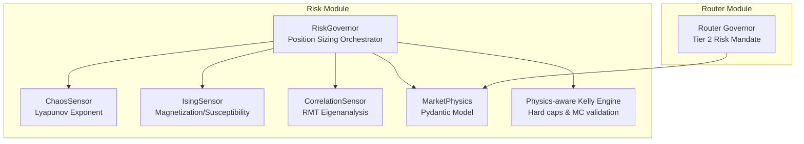

**Diagram sources**
- [src/risk/governor.py](file://src/risk/governor.py#L42-L447)
- [src/risk/models/market_physics.py](file://src/risk/models/market_physics.py#L27-L247)
- [src/risk/physics/chaos_sensor.py](file://src/risk/physics/chaos_sensor.py#L31-L253)
- [src/risk/physics/ising_sensor.py](file://src/risk/physics/ising_sensor.py#L105-L246)
- [src/risk/physics/correlation_sensor.py](file://src/risk/physics/correlation_sensor.py#L22-L285)
- [src/risk/sizing/kelly_engine.py](file://src/risk/sizing/kelly_engine.py#L195-L218)
- [src/router/governor.py](file://src/router/governor.py#L16-L62)

**Section sources**
- [src/risk/governor.py](file://src/risk/governor.py#L1-L104)
- [src/router/governor.py](file://src/router/governor.py#L1-L62)

## Core Components
- RiskGovernor: Orchestrates Enhanced Kelly position sizing, integrating physics sensors, prop firm constraints, and portfolio scaling. It caches physics multipliers and validates inputs to produce a PositionSizingResult with a full audit trail.
- MarketPhysics: Pydantic model encapsulating econophysical indicators (Lyapunov exponent, Ising magnetization/susceptibility, RMT max eigenvalue/noise threshold) with convenience methods for risk level, trend direction, and physics multiplier.
- ChaosSensor: Computes Lyapunov exponent via time-delay embedding and nearest-neighbor tracking to quantify chaos.
- IsingSensor: Simulates market regimes using a 3D Ising model with Metropolis-Hastings sampling to derive magnetization and susceptibility.
- CorrelationSensor: Performs RMT-based eigenanalysis on correlation matrices to detect systemic risk via max eigenvalue vs. Marchenko–Pastur threshold.
- Router Governor: Generates RiskMandate objects for swarm-level controls based on chaos scores and systemic risk flags.

**Section sources**
- [src/risk/governor.py](file://src/risk/governor.py#L42-L447)
- [src/risk/models/market_physics.py](file://src/risk/models/market_physics.py#L27-L247)
- [src/risk/physics/chaos_sensor.py](file://src/risk/physics/chaos_sensor.py#L31-L253)
- [src/risk/physics/ising_sensor.py](file://src/risk/physics/ising_sensor.py#L105-L246)
- [src/risk/physics/correlation_sensor.py](file://src/risk/physics/correlation_sensor.py#L22-L285)
- [src/router/governor.py](file://src/router/governor.py#L16-L62)

## Architecture Overview
The Risk Governor integrates multiple physics sensors and a portfolio scaler to compute a final position size. The Router Governor produces a RiskMandate for swarm-level throttling and emergency clamps.

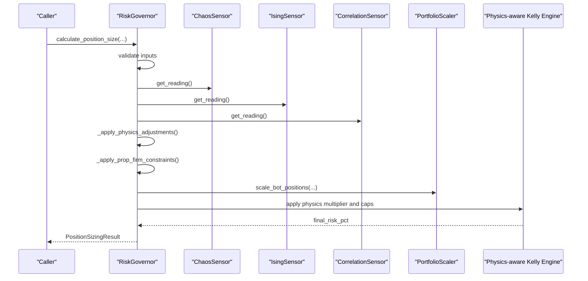

**Diagram sources**
- [src/risk/governor.py](file://src/risk/governor.py#L105-L224)
- [src/risk/physics/chaos_sensor.py](file://src/risk/physics/chaos_sensor.py#L23-L253)
- [src/risk/physics/ising_sensor.py](file://src/risk/physics/ising_sensor.py#L105-L246)
- [src/risk/physics/correlation_sensor.py](file://src/risk/physics/correlation_sensor.py#L22-L285)
- [src/risk/sizing/kelly_engine.py](file://src/risk/sizing/kelly_engine.py#L195-L218)

## Detailed Component Analysis

### RiskMandate Class Structure
The RiskMandate is the output of the Router Governor’s Tier 2 risk calculation. It carries:
- allocation_scalar: A scalar multiplier in [0.0, 1.0] applied to the base risk.
- risk_mode: Operational mode indicating normal operation or risk control actions (e.g., CLAMPED).
- notes: Human-readable rationale for the mandate.

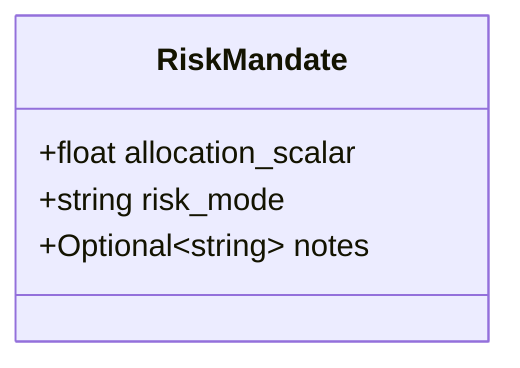

**Diagram sources**
- [src/router/governor.py](file://src/router/governor.py#L9-L15)

**Section sources**
- [src/router/governor.py](file://src/router/governor.py#L9-L15)

### Risk Governor Orchestration
The RiskGovernor performs:
- Input validation
- Base Kelly fraction computation
- Physics-based multiplier derivation from Chaos, Ising, and Correlation sensors
- Prop firm constraint enforcement
- Portfolio scaling to avoid over-concentration
- Final position sizing with rounding to broker lot steps
- Audit trail via PositionSizingResult

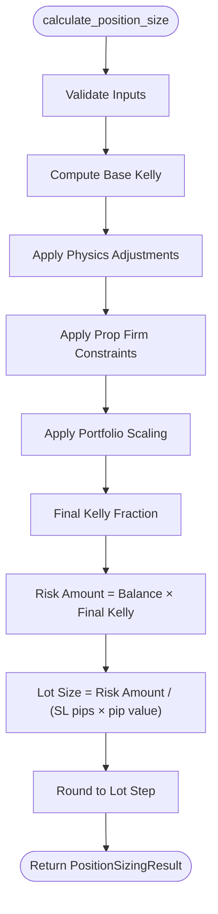

**Diagram sources**
- [src/risk/governor.py](file://src/risk/governor.py#L105-L224)

**Section sources**
- [src/risk/governor.py](file://src/risk/governor.py#L105-L224)

### Market Physics Model and Multipliers
MarketPhysics consolidates econophysical indicators and exposes:
- Risk level classification (LOW, MODERATE, HIGH, EXTREME)
- Trend direction from magnetization
- Signal detection via RMT (max eigenvalue vs. noise threshold)
- A physics multiplier mapped to risk levels

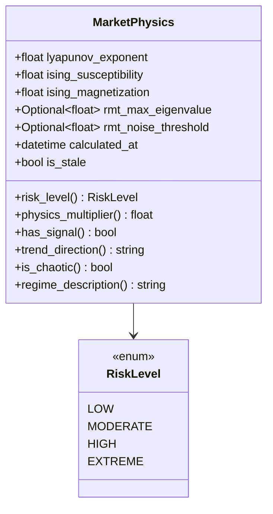

**Diagram sources**
- [src/risk/models/market_physics.py](file://src/risk/models/market_physics.py#L27-L247)

**Section sources**
- [src/risk/models/market_physics.py](file://src/risk/models/market_physics.py#L131-L178)

### Chaos Detection (Lyapunov Exponent)
The ChaosSensor reconstructs phase space using time-delay embedding, finds analogues via nearest neighbors, and computes the Lyapunov exponent to quantify sensitivity to initial conditions. It returns a ChaosAnalysisResult with chaos level.

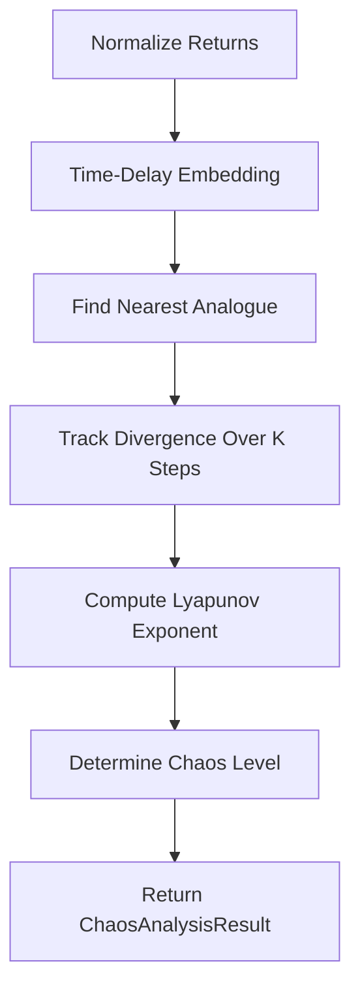

**Diagram sources**
- [src/risk/physics/chaos_sensor.py](file://src/risk/physics/chaos_sensor.py#L67-L241)

**Section sources**
- [src/risk/physics/chaos_sensor.py](file://src/risk/physics/chaos_sensor.py#L31-L253)

### Ising Regime Detection
The IsingSensor simulates a 3D lattice with Metropolis-Hastings updates, computing magnetization and susceptibility. It can operate in two modes:
- With volatility context: map volatility to temperature and simulate a single state.
- Without context: anneal through a temperature range to find critical points.

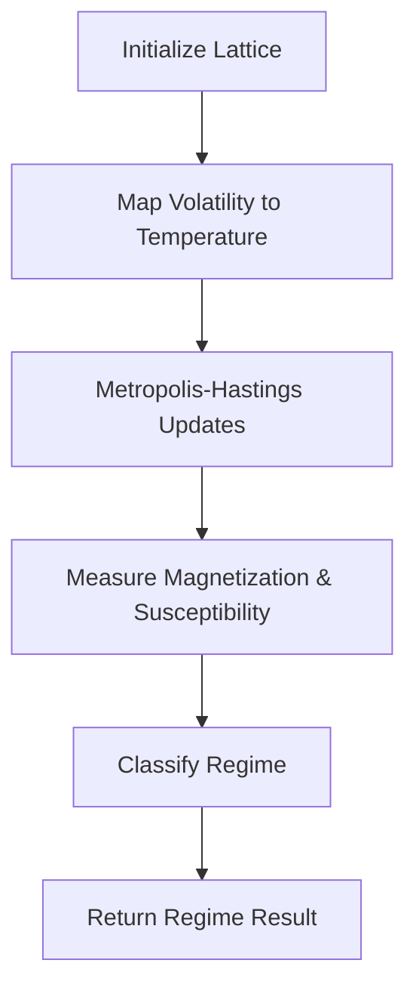

**Diagram sources**
- [src/risk/physics/ising_sensor.py](file://src/risk/physics/ising_sensor.py#L105-L195)

**Section sources**
- [src/risk/physics/ising_sensor.py](file://src/risk/physics/ising_sensor.py#L105-L246)

### Correlation and Systemic Risk (RMT)
The CorrelationSensor:
- Validates input dimensions
- Normalizes returns
- Builds a correlation matrix
- Computes Marchenko–Pastur noise threshold
- Extracts eigenvalues/eigenvectors
- Denoises the correlation matrix by replacing noise eigenvalues
- Classifies risk level based on max eigenvalue

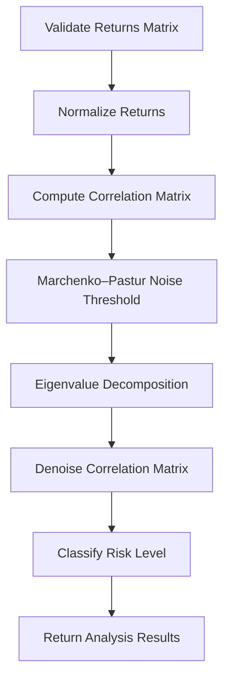

**Diagram sources**
- [src/risk/physics/correlation_sensor.py](file://src/risk/physics/correlation_sensor.py#L229-L281)

**Section sources**
- [src/risk/physics/correlation_sensor.py](file://src/risk/physics/correlation_sensor.py#L22-L285)

### Tier 2 Risk Rules and Emergency Clamping
The Router Governor enforces:
- Physics-based throttling based on chaos score thresholds.
- Systemic risk clamping when a systemic flag is present.
- A maximum portfolio risk hard cap and correlation threshold for swarm cohesion.

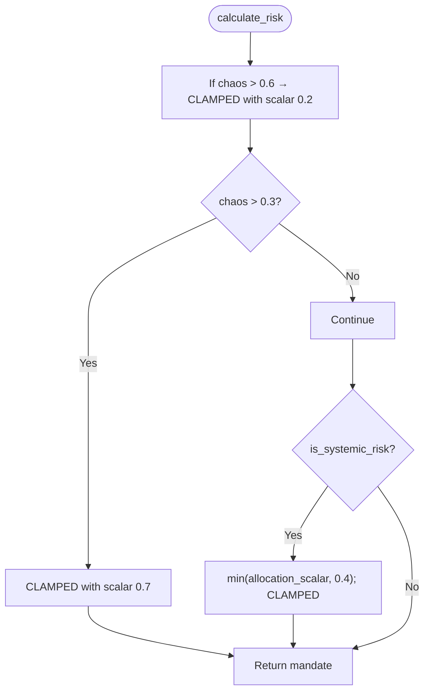

**Diagram sources**
- [src/router/governor.py](file://src/router/governor.py#L24-L54)

**Section sources**
- [src/router/governor.py](file://src/router/governor.py#L16-L62)

### Position Sizing with Physics Multipliers and Hard Caps
The physics multiplier is computed by RiskGovernor and combined with prop firm constraints and portfolio scaling. A hard cap is enforced in the physics-aware Kelly engine, and optional Monte Carlo validation can further constrain risk.

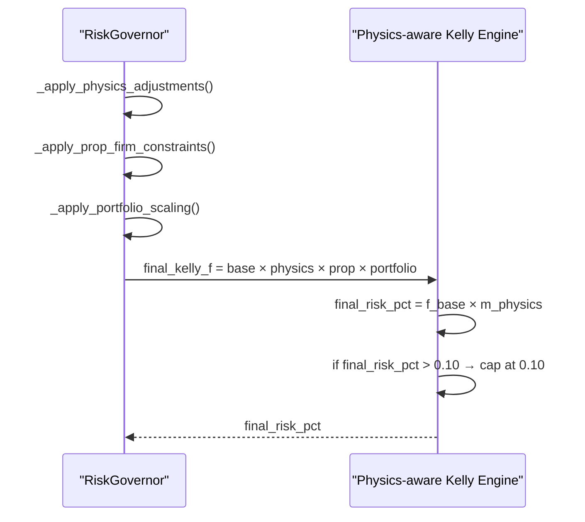

**Diagram sources**
- [src/risk/governor.py](file://src/risk/governor.py#L169-L185)
- [src/risk/sizing/kelly_engine.py](file://src/risk/sizing/kelly_engine.py#L195-L218)

**Section sources**
- [src/risk/governor.py](file://src/risk/governor.py#L262-L297)
- [src/risk/sizing/kelly_engine.py](file://src/risk/sizing/kelly_engine.py#L195-L218)

### Examples of Risk Mandate Generation
- High chaos scenario: mandate allocation_scalar reduced to 0.2 with CLAMPED mode and notes indicating extreme chaos.
- Moderate chaos scenario: mandate allocation_scalar reduced to 0.7 with CLAMPED mode and smoothing notes.
- Systemic risk detected: mandate allocation_scalar clamped to 0.4 and risk_mode set to CLAMPED.

These examples reflect the Router Governor’s Tier 2 enforcement logic.

**Section sources**
- [src/router/governor.py](file://src/router/governor.py#L37-L54)

### Examples of Position Sizing Calculations
- Base Kelly fraction computed from historical win rate and payoff ratio.
- Physics multiplier derived from Chaos, Ising, and Correlation sensors.
- Prop firm multiplier capping at preset limits.
- Portfolio scaling reducing exposure when multiple bots increase simultaneous risk.
- Final position size rounded to broker lot step.

**Section sources**
- [src/risk/governor.py](file://src/risk/governor.py#L105-L224)

### Integration with Broader Risk Management
- Risk mandates are propagated to MQL5 via a disk sync mechanism, ensuring the trading client receives risk_mode and allocation_scalar.
- Tests demonstrate synchronization of risk_matrix with multiplier and risk_mode.

**Section sources**
- [tests/integration/test_hybrid_core.py](file://tests/integration/test_hybrid_core.py#L643-L681)

## Dependency Analysis
The Risk Governor depends on:
- Physics sensors for real-time market state
- Portfolio scaler for inter-bot risk coordination
- MarketPhysics model for regime classification and multipliers
- Kelly engine for final risk cap and optional Monte Carlo validation

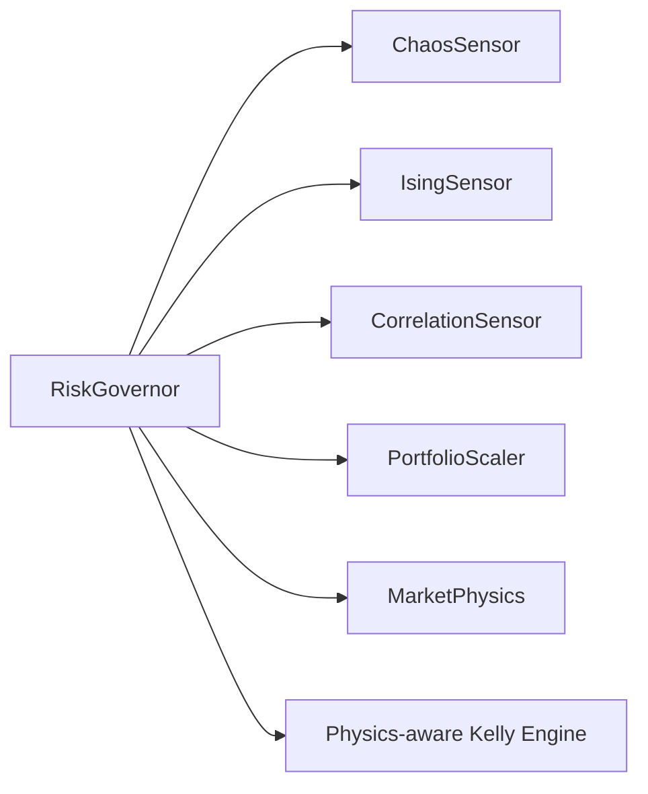

**Diagram sources**
- [src/risk/governor.py](file://src/risk/governor.py#L84-L90)
- [src/risk/models/market_physics.py](file://src/risk/models/market_physics.py#L27-L90)
- [src/risk/sizing/kelly_engine.py](file://src/risk/sizing/kelly_engine.py#L195-L218)

**Section sources**
- [src/risk/governor.py](file://src/risk/governor.py#L84-L90)

## Performance Considerations
- Physics sensor caching: RiskGovernor caches physics multipliers and account data with TTLs to reduce recomputation overhead.
- RMT and Ising simulations: Use LRU caching and bounded simulation steps to maintain responsiveness.
- Input validation and early exits: Prevent unnecessary computation on invalid inputs.
- Broker rounding: Reduces fractional lot sizes to broker-supported increments.

**Section sources**
- [src/risk/governor.py](file://src/risk/governor.py#L349-L358)
- [src/risk/physics/correlation_sensor.py](file://src/risk/physics/correlation_sensor.py#L54-L56)
- [src/risk/physics/ising_sensor.py](file://src/risk/physics/ising_sensor.py#L113-L118)

## Troubleshooting Guide
Common issues and diagnostics:
- Invalid inputs cause immediate errors during validation; ensure account balance, win rate, average win/loss, stop loss, and ATR are positive and within bounds.
- Extremely high chaos or susceptibility may indicate data irregularities; monitor warnings and consider recalculating physics.
- Portfolio scaling reduces position sizes when multiple bots increase simultaneous risk; review portfolio_risk inputs and bot_id mapping.
- Tiered throttling and hard caps: If final risk exceeds 10%, it is capped; confirm physics multiplier and prop firm constraints.
- Monte Carlo validation: If enabled and validator missing, a warning is logged and validation is skipped; provide a validator or adjust thresholds.

**Section sources**
- [src/risk/governor.py](file://src/risk/governor.py#L225-L247)
- [src/risk/sizing/kelly_engine.py](file://src/risk/sizing/kelly_engine.py#L205-L218)

## Conclusion
The Governor system blends econophysical insights with practical risk controls:
- The Risk Governor computes precise position sizes while incorporating market regime signals, prop firm constraints, and portfolio-wide scaling.
- The Router Governor enforces swarm-level controls via emergency clamps and systemic risk detection.
Together, they provide robust, adaptive risk management aligned with market physics and operational constraints.

## Appendices

### Emergency Clamping Scenarios
- Extreme chaos: allocation_scalar reduced to 0.2 with CLAMPED mode.
- Moderate chaos: allocation_scalar reduced to 0.7 with CLAMPED mode.
- Systemic risk: allocation_scalar clamped to 0.4 with CLAMPED mode.

**Section sources**
- [src/router/governor.py](file://src/router/governor.py#L37-L54)

### Correlation-Based Risk Adjustments
- Max eigenvalue vs. noise threshold determines risk level and systemic risk flag.
- Denoised correlation matrix improves signal detection reliability.

**Section sources**
- [src/risk/physics/correlation_sensor.py](file://src/risk/physics/correlation_sensor.py#L229-L281)

### Tiered Risk Properties and Throttling
- Remaining capacity squared throttling reduces risk when losses approach maximum allowable.
- Edge cases validated: zero loss yields full capacity; at maximum loss yields zero capacity.

**Section sources**
- [tests/risk/test_tiered_risk_engine.py](file://tests/risk/test_tiered_risk_engine.py#L220-L241)
- [tests/properties/test_tiered_risk_properties.py](file://tests/properties/test_tiered_risk_properties.py#L128-L146)