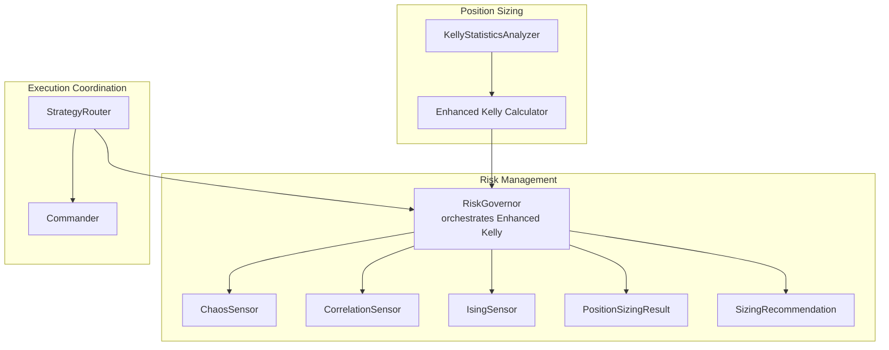
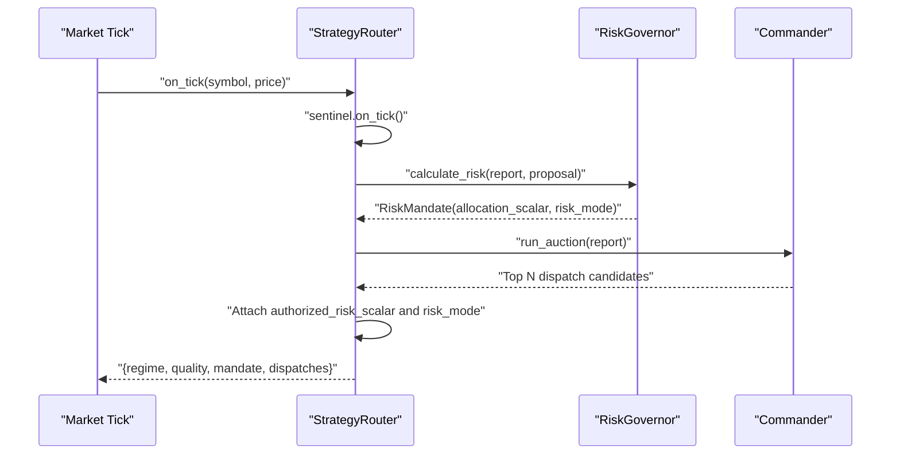
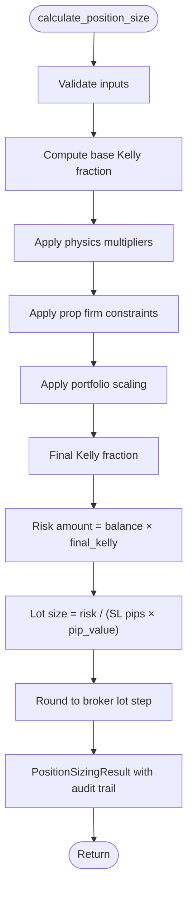
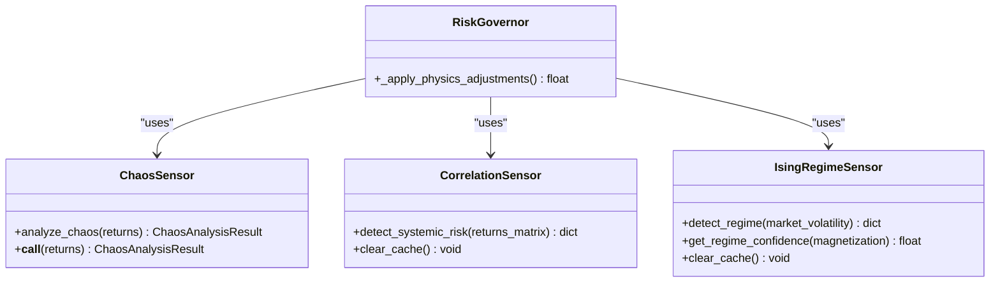
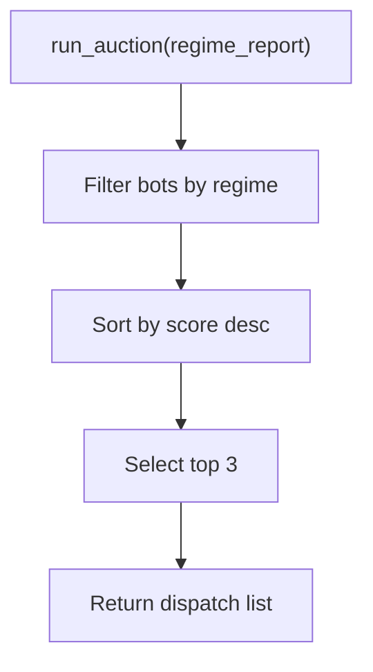
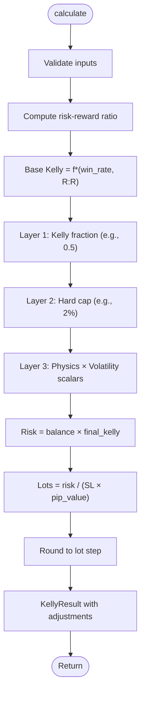
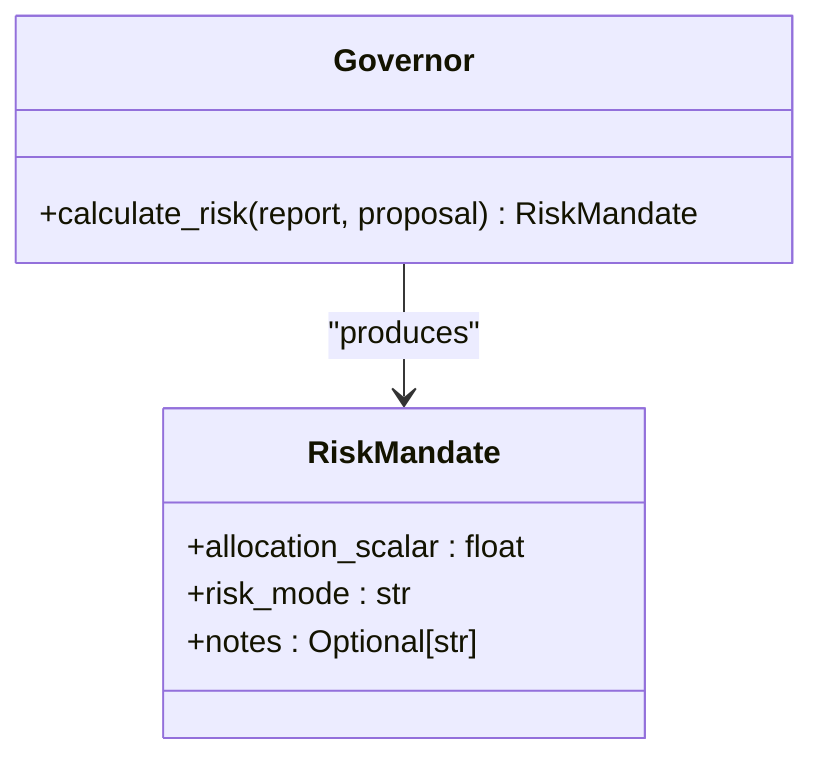
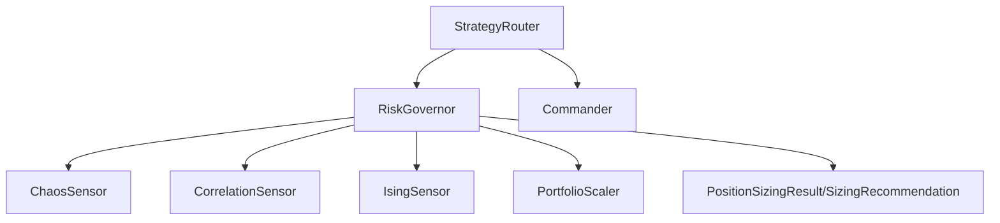

# Risk Authorization

<cite>
**Referenced Files in This Document**
- [governor.py](file://src/risk/governor.py)
- [commander.py](file://src/router/commander.py)
- [engine.py](file://src/router/engine.py)
- [position_sizing_result.py](file://src/risk/models/position_sizing_result.py)
- [sizing_recommendation.py](file://src/risk/models/sizing_recommendation.py)
- [chaos_sensor.py](file://src/risk/physics/chaos_sensor.py)
- [correlation_sensor.py](file://src/risk/physics/correlation_sensor.py)
- [ising_sensor.py](file://src/risk/physics/ising_sensor.py)
- [enhanced_kelly.py](file://src/position_sizing/enhanced_kelly.py)
- [kelly_analyzer.py](file://src/position_sizing/kelly_analyzer.py)
- [task_26_1_implementation_summary.md](file://docs/v8/task_26_1_implementation_summary.md)
- [enhanced_kelly_position_sizing_v1.md](file://docs/trds/enhanced_kelly_position_sizing_v1.md)
- [test_tiered_risk_properties.py](file://tests/properties/test_tiered_risk_properties.py)
- [test_prop_governor.py](file://tests/router/test_prop_governor.py)
- [test_hybrid_core.py](file://tests/integration/test_hybrid_core.py)
</cite>

## Table of Contents
1. [Introduction](#introduction)
2. [Project Structure](#project-structure)
3. [Core Components](#core-components)
4. [Architecture Overview](#architecture-overview)
5. [Detailed Component Analysis](#detailed-component-analysis)
6. [Dependency Analysis](#dependency-analysis)
7. [Performance Considerations](#performance-considerations)
8. [Troubleshooting Guide](#troubleshooting-guide)
9. [Conclusion](#conclusion)
10. [Appendices](#appendices)

## Introduction
This document describes the Risk Authorization system, focusing on the Governor’s role in risk calculation, position sizing determination, and risk mandate generation, alongside the Commander’s strategy auction mechanism for bot dispatch coordination and execution authorization. It also details the enhanced Kelly position sizing integration with physics multipliers and market regime adjustments, risk calculation algorithms, position sizing formulas, risk caps implementation, the risk mandate ticket system, allocation scalar calculations, and real-time risk adjustment mechanisms. Examples of risk authorization workflows, position sizing calculations under different market conditions, and integration with the broader execution system are provided.

## Project Structure
The Risk Authorization system spans several modules:
- Risk Governor orchestrates Enhanced Kelly position sizing with physics sensors, prop firm constraints, and portfolio scaling.
- Commander selects and dispatches bots based on market regime.
- Router engine coordinates Sentinel intelligence, Governor compliance, and Commander execution.
- Risk models define position sizing results and recommendations.
- Physics sensors compute chaos, correlation, and Ising regime signals.
- Position sizing modules implement enhanced Kelly with layered protections and volatility adjustments.
- Tests and documentation validate tiered risk logic, quadratic throttle, and hybrid core integration.

**Diagram sources**
- [governor.py](file://src/risk/governor.py#L42-L447)
- [commander.py](file://src/router/commander.py#L11-L56)
- [engine.py](file://src/router/engine.py#L16-L68)
- [position_sizing_result.py](file://src/risk/models/position_sizing_result.py#L16-L246)
- [sizing_recommendation.py](file://src/risk/models/sizing_recommendation.py#L15-L229)
- [chaos_sensor.py](file://src/risk/physics/chaos_sensor.py#L31-L253)
- [correlation_sensor.py](file://src/risk/physics/correlation_sensor.py#L22-L285)
- [ising_sensor.py](file://src/risk/physics/ising_sensor.py#L105-L246)
- [enhanced_kelly.py](file://src/position_sizing/enhanced_kelly.py#L128-L418)
- [kelly_analyzer.py](file://src/position_sizing/kelly_analyzer.py#L27-L228)

**Section sources**
- [governor.py](file://src/risk/governor.py#L1-L447)
- [commander.py](file://src/router/commander.py#L1-L56)
- [engine.py](file://src/router/engine.py#L1-L68)

## Core Components
- Risk Governor: Central orchestrator for Enhanced Kelly position sizing, integrating physics-based multipliers, prop firm constraints, and portfolio scaling. It validates inputs, computes base Kelly, applies physics penalties, enforces prop firm caps, scales across portfolios, and rounds to broker lot sizes.
- Commander: Executes strategy auction logic to select and dispatch bots based on regime and chaos scores, authorizing risk scalars and modes.
- Router Engine: Coordinates the full loop—Sentinel intelligence, Governor risk mandate, and Commander dispatch—returning regime, quality, mandate, and dispatches.
- Risk Models: PositionSizingResult and SizingRecommendation provide structured outputs, audit trails, and constraint tracking for position sizing decisions.
- Physics Sensors: ChaosSensor (Lyapunov exponent), CorrelationSensor (RMT eigenvalue analysis), and IsingSensor (regime classification) supply market-state signals used by the Governor.
- Enhanced Kelly: Implements layered protections (Half-Kelly, hard caps, volatility adjustments) and integrates physics regime quality and ATR ratios.
- Kelly Statistics Analyzer: Extracts Kelly parameters from trade history for sizing inputs.

**Section sources**
- [governor.py](file://src/risk/governor.py#L42-L447)
- [commander.py](file://src/router/commander.py#L11-L56)
- [engine.py](file://src/router/engine.py#L16-L68)
- [position_sizing_result.py](file://src/risk/models/position_sizing_result.py#L16-L246)
- [sizing_recommendation.py](file://src/risk/models/sizing_recommendation.py#L15-L229)
- [chaos_sensor.py](file://src/risk/physics/chaos_sensor.py#L31-L253)
- [correlation_sensor.py](file://src/risk/physics/correlation_sensor.py#L22-L285)
- [ising_sensor.py](file://src/risk/physics/ising_sensor.py#L105-L246)
- [enhanced_kelly.py](file://src/position_sizing/enhanced_kelly.py#L128-L418)
- [kelly_analyzer.py](file://src/position_sizing/kelly_analyzer.py#L27-L228)

## Architecture Overview
The Risk Authorization system operates as a three-layer loop:
- Intelligence (Sentinel) feeds market regime and quality.
- Compliance (Governor) computes risk mandates with physics-adjusted Kelly and prop firm constraints.
- Execution (Commander) auctions and dispatches bots with authorized risk scalars and modes.

**Diagram sources**
- [engine.py](file://src/router/engine.py#L29-L60)
- [governor.py](file://src/risk/governor.py#L105-L224)
- [commander.py](file://src/router/commander.py#L19-L38)

## Detailed Component Analysis

### Risk Governor: Enhanced Kelly Orchestration
The Risk Governor performs:
- Input validation and base Kelly computation.
- Physics-based multipliers from Chaos, Correlation, and Ising sensors.
- Prop firm constraint enforcement via preset max risk percentages.
- Portfolio scaling to prevent over-concentration.
- Final position sizing with rounding to broker lot steps.
- Comprehensive audit trail via PositionSizingResult and SizingRecommendation.

**Diagram sources**
- [governor.py](file://src/risk/governor.py#L105-L224)
- [position_sizing_result.py](file://src/risk/models/position_sizing_result.py#L146-L204)

**Section sources**
- [governor.py](file://src/risk/governor.py#L105-L224)
- [position_sizing_result.py](file://src/risk/models/position_sizing_result.py#L16-L246)
- [sizing_recommendation.py](file://src/risk/models/sizing_recommendation.py#L15-L229)

### Physics Sensors: Market-State Signals
- ChaosSensor: Computes Lyapunov exponent and chaos level from log-returns using phase-space reconstruction and nearest neighbors.
- CorrelationSensor: Uses Random Matrix Theory to detect systemic risk via eigenvalue analysis and denoising.
- IsingSensor: Simulates market regimes via Ising model with Metropolis-Hastings, classifying regimes by magnetization.

**Diagram sources**
- [chaos_sensor.py](file://src/risk/physics/chaos_sensor.py#L31-L253)
- [correlation_sensor.py](file://src/risk/physics/correlation_sensor.py#L22-L285)
- [ising_sensor.py](file://src/risk/physics/ising_sensor.py#L105-L246)
- [governor.py](file://src/risk/governor.py#L262-L297)

**Section sources**
- [chaos_sensor.py](file://src/risk/physics/chaos_sensor.py#L31-L253)
- [correlation_sensor.py](file://src/risk/physics/correlation_sensor.py#L22-L285)
- [ising_sensor.py](file://src/risk/physics/ising_sensor.py#L105-L246)
- [governor.py](file://src/risk/governor.py#L262-L297)

### Commander: Strategy Auction and Dispatch
The Commander runs an auction to select bots eligible for the current regime, ranks by performance, and returns top candidates. It also authorizes risk scalars and modes from the Governor’s mandate.

**Diagram sources**
- [commander.py](file://src/router/commander.py#L19-L38)

**Section sources**
- [commander.py](file://src/router/commander.py#L11-L56)
- [engine.py](file://src/router/engine.py#L44-L60)

### Enhanced Kelly Position Sizing with Physics and Regime Adjustments
The Enhanced Kelly system applies:
- Half-Kelly safety multiplier by default.
- Hard risk cap (e.g., 2%).
- Physics-aware volatility adjustment combining regime quality and ATR ratios.
- Final rounding to broker lot steps.

**Diagram sources**
- [enhanced_kelly.py](file://src/position_sizing/enhanced_kelly.py#L190-L377)

**Section sources**
- [enhanced_kelly.py](file://src/position_sizing/enhanced_kelly.py#L81-L418)
- [kelly_analyzer.py](file://src/position_sizing/kelly_analyzer.py#L27-L228)
- [enhanced_kelly_position_sizing_v1.md](file://docs/trds/enhanced_kelly_position_sizing_v1.md#L19-L41)

### Risk Mandate Ticket System and Allocation Scalars
The Governor produces a RiskMandate with:
- allocation_scalar: 0.0–1.0, representing the authorized risk fraction after all constraints.
- risk_mode: STANDARD, CLAMPED, or HALTED, reflecting constraint status.
- notes: Audit trail of throttle and clamp reasons.

**Diagram sources**
- [commander.py](file://src/router/commander.py#L9-L22)
- [engine.py](file://src/router/engine.py#L44-L60)

**Section sources**
- [commander.py](file://src/router/commander.py#L9-L22)
- [engine.py](file://src/router/engine.py#L44-L60)
- [test_prop_governor.py](file://tests/router/test_prop_governor.py#L62-L98)

### Tiered Risk Engine and Quadratic Throttle
The system implements three-tier risk logic:
- Growth Tier: Fixed small risk (no throttle).
- Scaling Tier: Kelly Criterion (no throttle).
- Guardian Tier: Kelly plus quadratic throttle based on effective drawdown.

Property tests validate the quadratic throttle formula and tier transitions.

**Section sources**
- [task_26_1_implementation_summary.md](file://docs/v8/task_26_1_implementation_summary.md#L140-L182)
- [test_tiered_risk_properties.py](file://tests/properties/test_tiered_risk_properties.py#L97-L131)
- [test_prop_governor.py](file://tests/router/test_prop_governor.py#L62-L98)

### Real-Time Risk Adjustment Mechanisms
Real-time adjustments include:
- Physics multipliers derived from Chaos, Correlation, and Ising sensors.
- Prop firm presets capping risk fractions.
- Portfolio scaling to maintain total portfolio risk within limits.
- Cache TTLs for performance optimization.

**Section sources**
- [governor.py](file://src/risk/governor.py#L262-L358)

## Dependency Analysis
The Governor depends on physics sensors and portfolio scaling, while the Router composes the Governor and Commander. Position sizing models provide structured outputs for auditability.

**Diagram sources**
- [governor.py](file://src/risk/governor.py#L84-L90)
- [engine.py](file://src/router/engine.py#L21-L24)

**Section sources**
- [governor.py](file://src/risk/governor.py#L84-L90)
- [engine.py](file://src/router/engine.py#L21-L24)

## Performance Considerations
- Physics sensor caching reduces repeated heavy computations.
- Portfolio scaling prevents over-concentration and maintains risk budgets.
- Broker rounding avoids fractional lot violations.
- Configurable cache TTLs balance freshness and performance.

[No sources needed since this section provides general guidance]

## Troubleshooting Guide
Common issues and resolutions:
- Negative expectancy: The calculator returns zero position and logs a warning.
- Input validation errors: Ensure win_rate, avg_win, avg_loss, stop_loss_pips, and average_atr are positive and within valid ranges.
- Risk caps exceeded: The Governor caps final Kelly to prop firm limits; verify preset configuration.
- Quadratic throttle: In Guardian Tier, drawdown beyond effective limit yields zero allocation; confirm tier and daily start balance.

**Section sources**
- [enhanced_kelly.py](file://src/position_sizing/enhanced_kelly.py#L267-L286)
- [governor.py](file://src/risk/governor.py#L234-L246)
- [test_prop_governor.py](file://tests/router/test_prop_governor.py#L76-L88)

## Conclusion
The Risk Authorization system integrates physics-driven market-state analysis with layered risk controls to produce precise, auditable position sizing decisions. The Governor centralizes Enhanced Kelly calculations, applies real-time constraints, and generates risk mandates consumed by the Commander’s auction. The Router coordinates intelligence, compliance, and execution, enabling adaptive dispatch aligned with market regimes and risk caps.

[No sources needed since this section summarizes without analyzing specific files]

## Appendices

### Risk Authorization Workflow Example
- Intelligence: Sentinel reports regime and quality.
- Compliance: Governor computes RiskMandate with allocation_scalar and risk_mode.
- Execution: Commander auctions eligible bots and attaches authorized_risk_scalar and risk_mode.
- Output: Dispatch list with risk authorization for execution.

**Section sources**
- [engine.py](file://src/router/engine.py#L29-L60)
- [commander.py](file://src/router/commander.py#L19-L38)

### Position Sizing Under Different Market Conditions
- Stable regime: Physics multipliers near 1.0; full or near-full Kelly applied.
- Moderate chaos: Reduced physics multiplier; correspondingly smaller position.
- High systemic correlation: Correlation sensor increases penalty; reduced position.
- High volatility (ATR ratio): Volatility adjustment reduces Kelly; position scaled down.
- Low volatility: Conservative boost up to cap; position increased cautiously.

**Section sources**
- [governor.py](file://src/risk/governor.py#L262-L297)
- [enhanced_kelly.py](file://src/position_sizing/enhanced_kelly.py#L301-L331)

### Integration with Broader Execution System
- Governor’s mandate is propagated to bots via risk_matrix synchronization.
- Hybrid core integration ensures MQL5 receives risk_mode and allocation_scalar.

**Section sources**
- [test_hybrid_core.py](file://tests/integration/test_hybrid_core.py#L643-L681)