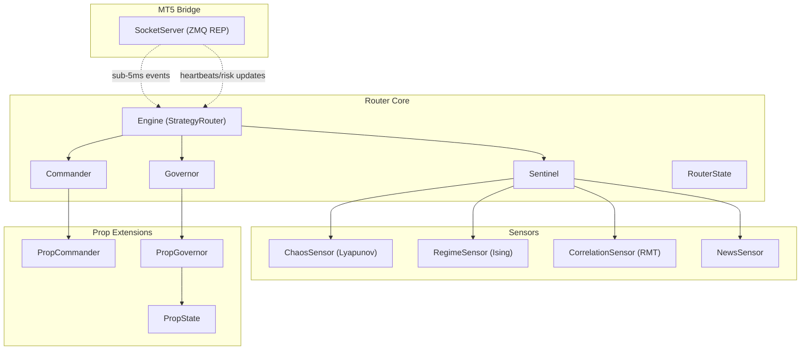
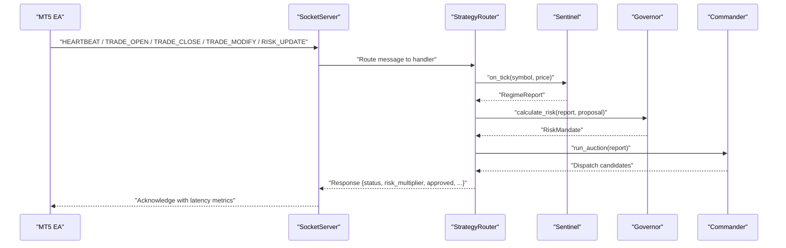
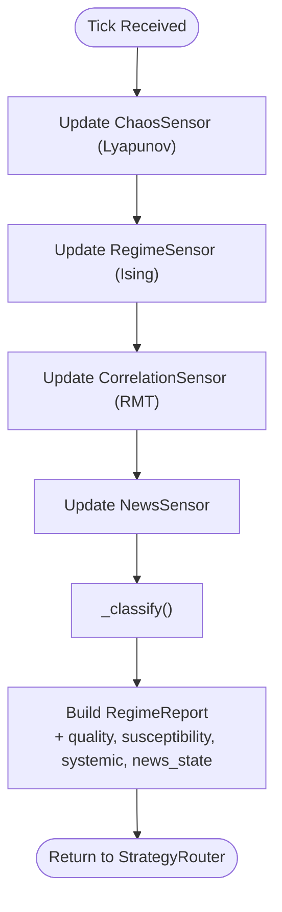
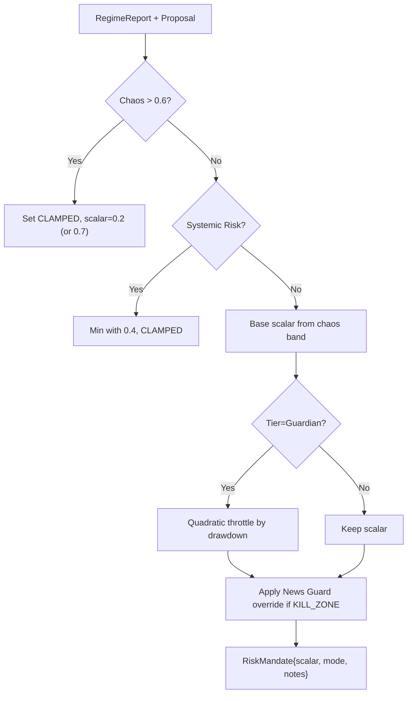
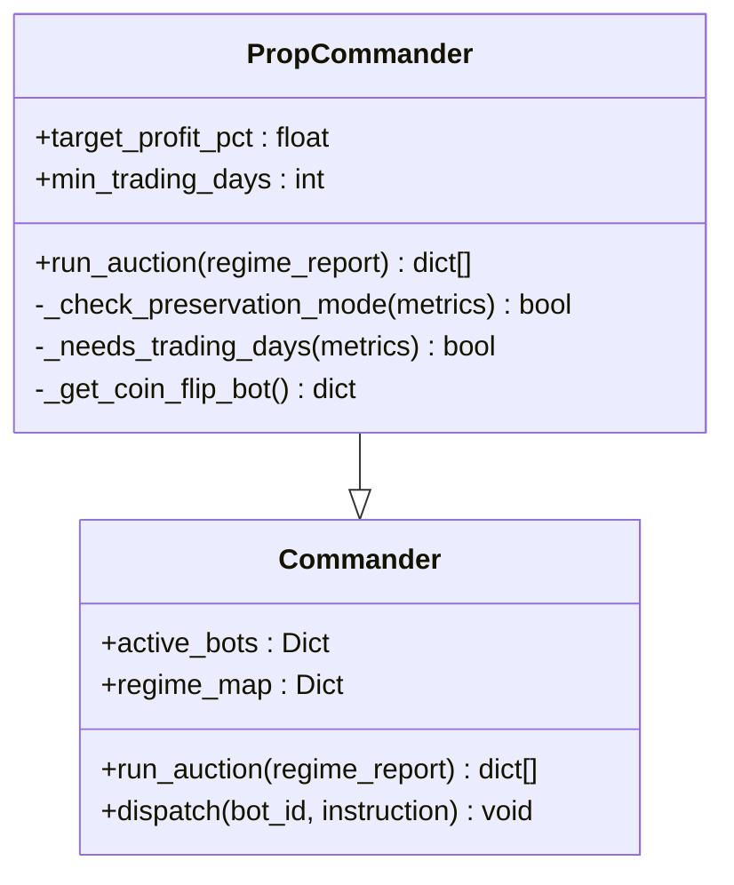
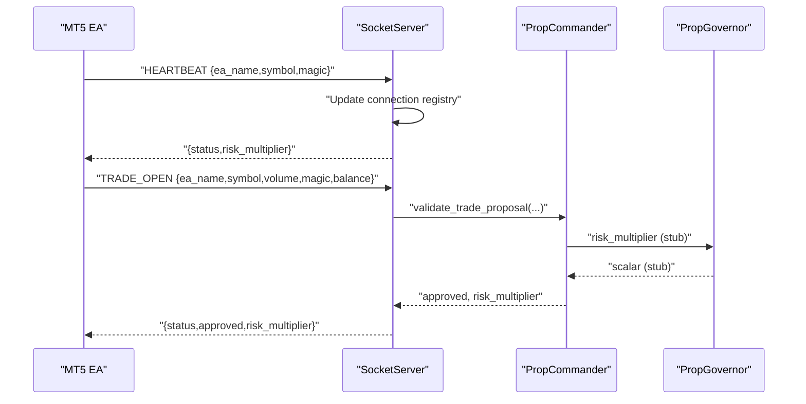
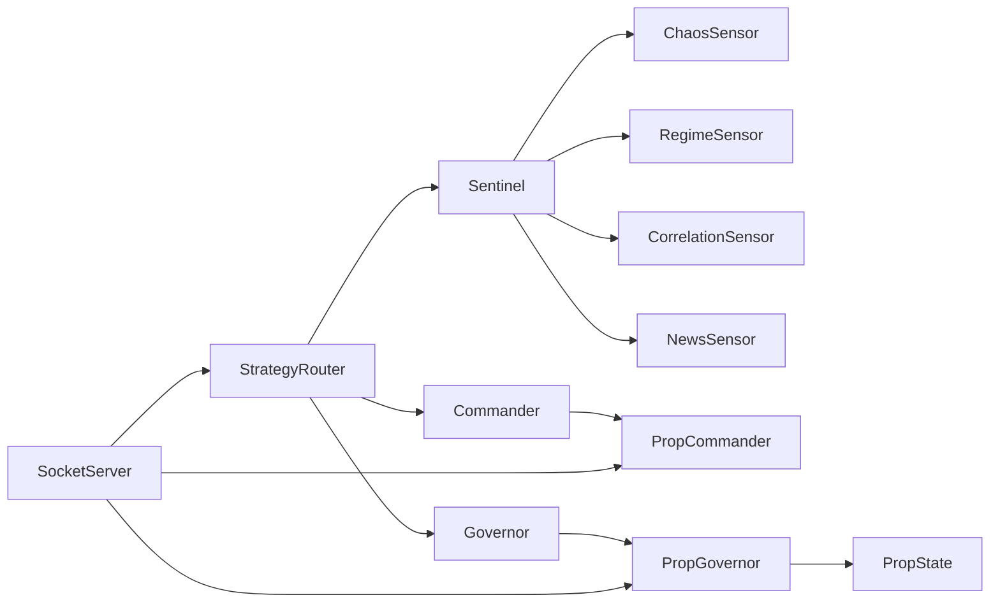

# Strategy Router

<cite>
**Referenced Files in This Document**
- [engine.py](file://src/router/engine.py)
- [sentinel.py](file://src/router/sentinel.py)
- [governor.py](file://src/router/governor.py)
- [commander.py](file://src/router/commander.py)
- [state.py](file://src/router/state.py)
- [socket_server.py](file://src/router/socket_server.py)
- [chaos.py](file://src/router/sensors/chaos.py)
- [regime.py](file://src/router/sensors/regime.py)
- [correlation.py](file://src/router/sensors/correlation.py)
- [news.py](file://src/router/sensors/news.py)
- [prop/commander.py](file://src/router/prop/commander.py)
- [prop/governor.py](file://src/router/prop/governor.py)
- [prop/state.py](file://src/router/prop/state.py)
</cite>

## Table of Contents
1. [Introduction](#introduction)
2. [Project Structure](#project-structure)
3. [Core Components](#core-components)
4. [Architecture Overview](#architecture-overview)
5. [Detailed Component Analysis](#detailed-component-analysis)
6. [Dependency Analysis](#dependency-analysis)
7. [Performance Considerations](#performance-considerations)
8. [Troubleshooting Guide](#troubleshooting-guide)
9. [Conclusion](#conclusion)
10. [Appendices](#appendices)

## Introduction
This document describes the Strategy Router’s high-performance execution floor built around three autonomous layers: Sentinel (intelligence), Governor (compliance/risk), and Commander (execution). It explains the market regime classification system using chaos detection and Lyapunov-based sensors, the risk authorization process, the strategy auction mechanism, and bot dispatch coordination. It also documents the ZeroMQ bridge enabling sub-5ms communication with MetaTrader 5, socket protocols, and latency optimization techniques. Finally, it covers the broker registry system, MT5 adapter integration, and execution coordination patterns for real-time trading.

## Project Structure
The Strategy Router resides under src/router and integrates with sensor modules, prop extensions, and a ZeroMQ socket server for ultra-low-latency MT5 communication.

**Diagram sources**
- [engine.py](file://src/router/engine.py#L16-L68)
- [sentinel.py](file://src/router/sentinel.py#L27-L85)
- [governor.py](file://src/router/governor.py#L16-L62)
- [commander.py](file://src/router/commander.py#L11-L56)
- [state.py](file://src/router/state.py#L8-L34)
- [chaos.py](file://src/router/sensors/chaos.py#L14-L57)
- [regime.py](file://src/router/sensors/regime.py#L16-L55)
- [correlation.py](file://src/router/sensors/correlation.py#L15-L45)
- [news.py](file://src/router/sensors/news.py#L16-L44)
- [prop/commander.py](file://src/router/prop/commander.py#L10-L80)
- [prop/governor.py](file://src/router/prop/governor.py#L12-L249)
- [prop/state.py](file://src/router/prop/state.py#L24-L187)
- [socket_server.py](file://src/router/socket_server.py#L37-L435)

**Section sources**
- [engine.py](file://src/router/engine.py#L1-L68)
- [socket_server.py](file://src/router/socket_server.py#L1-L435)

## Core Components
- StrategyRouter orchestrates the full loop: Sentinel observes, Governor authorizes, Commander dispatches.
- Sentinel aggregates sensor data into a unified RegimeReport.
- Governor computes risk mandates (allocation scalars and modes) based on chaos, systemic risk, and news state.
- Commander selects and dispatches bots per regime; PropCommander adds goal-oriented filters.
- PropGovernor extends risk governance with prop firm rules, tier-aware throttling, and hard stops.
- RouterState maintains shared runtime state.
- SocketServer provides sub-5ms ZMQ event-driven communication with MT5.

**Section sources**
- [engine.py](file://src/router/engine.py#L16-L68)
- [sentinel.py](file://src/router/sentinel.py#L17-L85)
- [governor.py](file://src/router/governor.py#L9-L62)
- [commander.py](file://src/router/commander.py#L11-L56)
- [state.py](file://src/router/state.py#L8-L34)
- [prop/commander.py](file://src/router/prop/commander.py#L10-L80)
- [prop/governor.py](file://src/router/prop/governor.py#L12-L249)
- [socket_server.py](file://src/router/socket_server.py#L37-L435)

## Architecture Overview
The Strategy Router implements a closed-loop trading intelligence system:

**Diagram sources**
- [engine.py](file://src/router/engine.py#L29-L60)
- [sentinel.py](file://src/router/sentinel.py#L40-L63)
- [governor.py](file://src/router/governor.py#L24-L54)
- [commander.py](file://src/router/commander.py#L19-L38)
- [socket_server.py](file://src/router/socket_server.py#L150-L325)

## Detailed Component Analysis

### Sentinel: Market Regime Classification
- Inputs: price ticks, optional price deltas; feeds multiple sensors.
- ChaosSensor computes a Lyapunov proxy score and label (stable/noisy/chaotic).
- RegimeSensor models price changes as spins to derive magnetization, susceptibility, and energy; classifies ORDERED, CRITICAL, DISORDERED.
- CorrelationSensor tracks multi-symbol returns and approximates systemic risk via RMT eigenvalue.
- NewsSensor monitors high-impact events and marks kill zones.
- Sentinel._classify maps sensor outputs to macro regimes (e.g., HIGH_CHAOS, NEWS_EVENT, TREND_STABLE, RANGE_STABLE, BREAKOUT_PRIME, UNCERTAIN).

**Diagram sources**
- [sentinel.py](file://src/router/sentinel.py#L40-L84)
- [chaos.py](file://src/router/sensors/chaos.py#L19-L57)
- [regime.py](file://src/router/sensors/regime.py#L21-L55)
- [correlation.py](file://src/router/sensors/correlation.py#L21-L45)
- [news.py](file://src/router/sensors/news.py#L27-L44)

**Section sources**
- [sentinel.py](file://src/router/sentinel.py#L17-L85)
- [chaos.py](file://src/router/sensors/chaos.py#L9-L57)
- [regime.py](file://src/router/sensors/regime.py#L9-L55)
- [correlation.py](file://src/router/sensors/correlation.py#L9-L45)
- [news.py](file://src/router/sensors/news.py#L10-L44)

### Governor: Risk Authorization and Throttling
- Base Governor:
  - Enforces hard caps on portfolio risk and systemic correlation.
  - Clamps allocation scalar under high chaos and/or systemic risk.
  - Produces RiskMandate with allocation_scalar and risk_mode.
- PropGovernor:
  - Inherits base logic and adds:
    - Tier-aware throttling (growth/scaling/guardian tiers).
    - Quadratic throttle in guardian tier based on distance to ruin.
    - Hard-stop override during news kill zones.
    - Tier transition detection and persistence to DB.

**Diagram sources**
- [governor.py](file://src/router/governor.py#L24-L54)
- [prop/governor.py](file://src/router/prop/governor.py#L37-L67)

**Section sources**
- [governor.py](file://src/router/governor.py#L9-L62)
- [prop/governor.py](file://src/router/prop/governor.py#L12-L249)

### Commander: Strategy Auction and Dispatch Coordination
- Base Commander:
  - Filters bots by regime eligibility.
  - Ranks by performance score and selects top-N candidates.
  - Excludes bots in HIGH_CHAOS.
- PropCommander:
  - Adds goal-oriented logic:
    - Preservation mode after reaching target profit.
    - Minimum trading days enforcement via coin flip bot.
    - High-Kelly-score filtering in preservation mode.

**Diagram sources**
- [commander.py](file://src/router/commander.py#L11-L56)
- [prop/commander.py](file://src/router/prop/commander.py#L10-L80)

**Section sources**
- [commander.py](file://src/router/commander.py#L11-L56)
- [prop/commander.py](file://src/router/prop/commander.py#L22-L80)

### RouterState: Shared Runtime State
- Maintains current regime, active bots, risk mandate, and last tick time.
- Serves as a central in-memory store; future versions integrate Redis.

**Section sources**
- [state.py](file://src/router/state.py#L8-L34)

### ZeroMQ Bridge: Sub-5ms MT5 Communication
- ZMQ REP socket with asyncio event loop.
- Message types: TRADE_OPEN, TRADE_CLOSE, TRADE_MODIFY, HEARTBEAT, RISK_UPDATE.
- Handlers:
  - HEARTBEAT updates connection registry and returns risk_multiplier.
  - TRADE_OPEN validates proposals via PropCommander/PropGovernor integration stubs.
  - TRADE_CLOSE/MODIFY log asynchronously.
  - RISK_UPDATE acknowledges updates.
- Latency tracking and warnings for messages exceeding 5 ms.

**Diagram sources**
- [socket_server.py](file://src/router/socket_server.py#L150-L393)
- [prop/commander.py](file://src/router/prop/commander.py#L344-L393)
- [prop/governor.py](file://src/router/prop/governor.py#L37-L67)

**Section sources**
- [socket_server.py](file://src/router/socket_server.py#L28-L435)

### Broker Registry and MT5 Adapter Integration
- The MT5 adapter and broker registry are part of the broader data/brokers module ecosystem. Strategy Router components coordinate with these registries to resolve broker endpoints and manage adapter lifecycles. Execution coordination patterns include:
  - Heartbeat synchronization to maintain EA liveness.
  - Risk multiplier distribution to align EA exposure with Router mandates.
  - Trade lifecycle events routed through SocketServer handlers.

[No sources needed since this section summarizes integration patterns without analyzing specific files]

## Dependency Analysis
Key dependencies and coupling:
- StrategyRouter depends on Sentinel, Governor, and Commander.
- Sentinel composes ChaosSensor, RegimeSensor, CorrelationSensor, and NewsSensor.
- PropCommander and PropGovernor extend base Commander and Governor respectively.
- SocketServer interacts with PropCommander and PropGovernor for trade validation and risk updates.
- RouterState is a shared dependency across components.

**Diagram sources**
- [engine.py](file://src/router/engine.py#L10-L24)
- [sentinel.py](file://src/router/sentinel.py#L10-L13)
- [commander.py](file://src/router/commander.py#L15-L16)
- [governor.py](file://src/router/governor.py#L20-L22)
- [prop/commander.py](file://src/router/prop/commander.py#L16-L18)
- [prop/governor.py](file://src/router/prop/governor.py#L19-L22)
- [socket_server.py](file://src/router/socket_server.py#L344-L393)

**Section sources**
- [engine.py](file://src/router/engine.py#L10-L24)
- [sentinel.py](file://src/router/sentinel.py#L10-L13)
- [commander.py](file://src/router/commander.py#L15-L16)
- [governor.py](file://src/router/governor.py#L20-L22)
- [prop/commander.py](file://src/router/prop/commander.py#L16-L18)
- [prop/governor.py](file://src/router/prop/governor.py#L19-L22)
- [socket_server.py](file://src/router/socket_server.py#L344-L393)

## Performance Considerations
- Latency optimization:
  - ZMQ REP socket with asyncio reduces syscall overhead.
  - Non-blocking receive with timeouts and minimal parsing.
  - Asynchronous logging avoids blocking request-response cycles.
  - Latency metrics tracked per message; warnings emitted for >5 ms.
- Throughput:
  - Connection pooling for multiple EAs.
  - Event-driven push model replaces polling.
- Risk computation:
  - Lightweight sensor windows (e.g., 300 for chaos, 50 for regime/RMT).
  - Early exits when insufficient data is available.
- Memory:
  - In-memory RouterState for fast access; future Redis integration planned.

[No sources needed since this section provides general guidance]

## Troubleshooting Guide
- High latency warnings:
  - Inspect SocketServer average latency and message count; investigate slow handlers (e.g., trade validation stubs).
- Risk authorization anomalies:
  - Verify Governor thresholds and PropGovernor tier configuration.
  - Confirm news kill zone detection and systemic risk flags.
- Auction behavior:
  - Check regime eligibility and bot scores; ensure HIGH_CHAOS exclusions are applied.
- MT5 connectivity:
  - Validate HEARTBEAT reception and connection registry entries.
  - Confirm trade validation stub returns expected results.

**Section sources**
- [socket_server.py](file://src/router/socket_server.py#L94-L121)
- [governor.py](file://src/router/governor.py#L37-L54)
- [prop/governor.py](file://src/router/prop/governor.py#L54-L67)
- [commander.py](file://src/router/commander.py#L45-L49)

## Conclusion
The Strategy Router delivers a modular, high-performance execution floor integrating intelligence (Sentinel), compliance (Governor), and execution (Commander). Its Lyapunov and Ising-based regime classification, combined with risk mandates and goal-oriented dispatch logic, enables adaptive, safe, and efficient trading. The ZeroMQ bridge ensures sub-5ms responsiveness with MT5, while the prop extensions enforce survival-grade risk controls and tier-aware throttling.

## Appendices

### Operational Procedures
- Tick processing:
  - On each tick, call StrategyRouter.process_tick(symbol, price, account_data).
  - Capture returned dispatches and apply mandate to bot instructions.
- MT5 integration:
  - Send HEARTBEAT periodically to maintain connection and receive risk_multiplier.
  - Submit TRADE_OPEN with proposal details; await approval and risk_multiplier.
  - Log TRADE_CLOSE/MODIFY asynchronously via handlers.
- Risk updates:
  - Subscribe to RISK_UPDATE events to adjust exposure dynamically.

**Section sources**
- [engine.py](file://src/router/engine.py#L29-L60)
- [socket_server.py](file://src/router/socket_server.py#L167-L325)