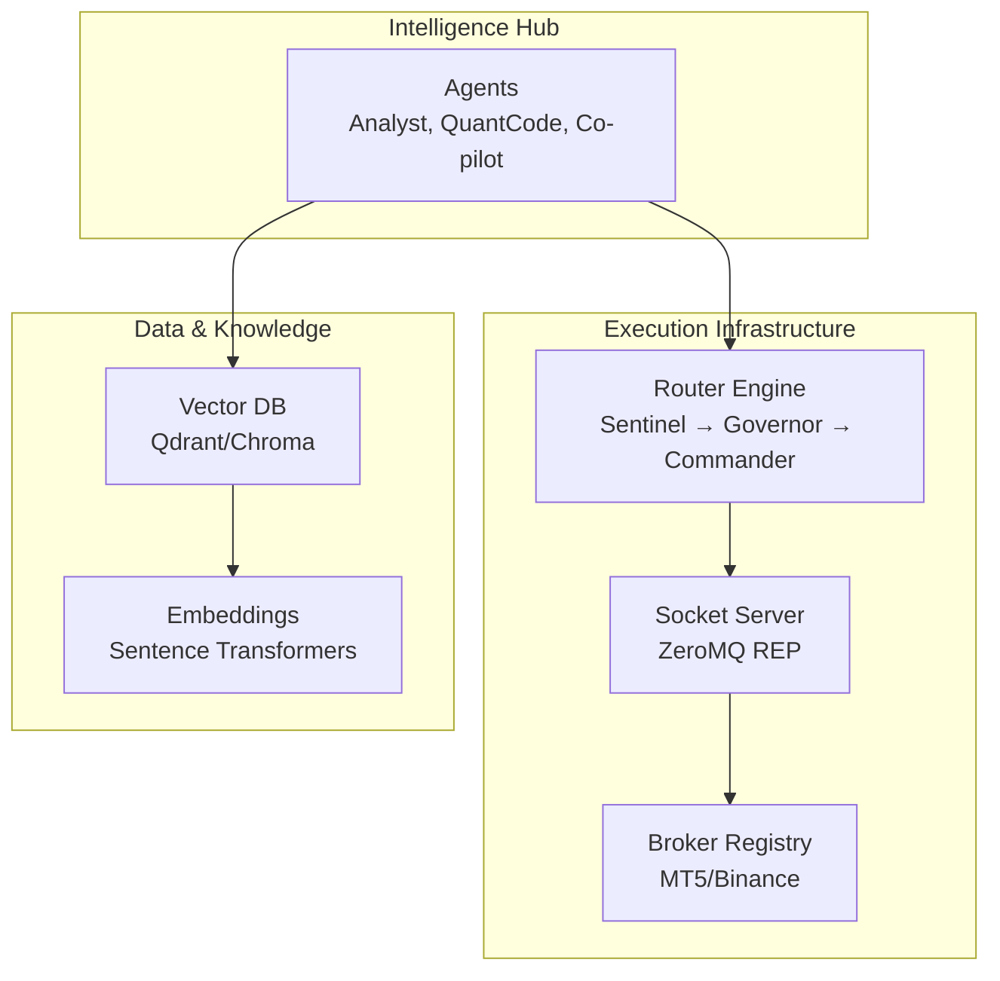
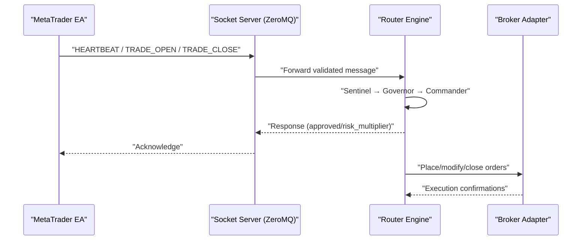
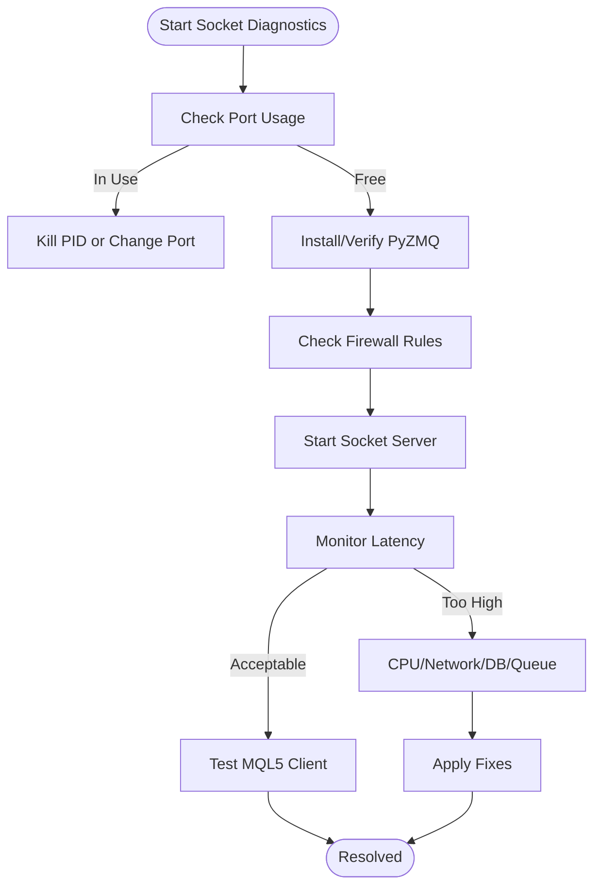
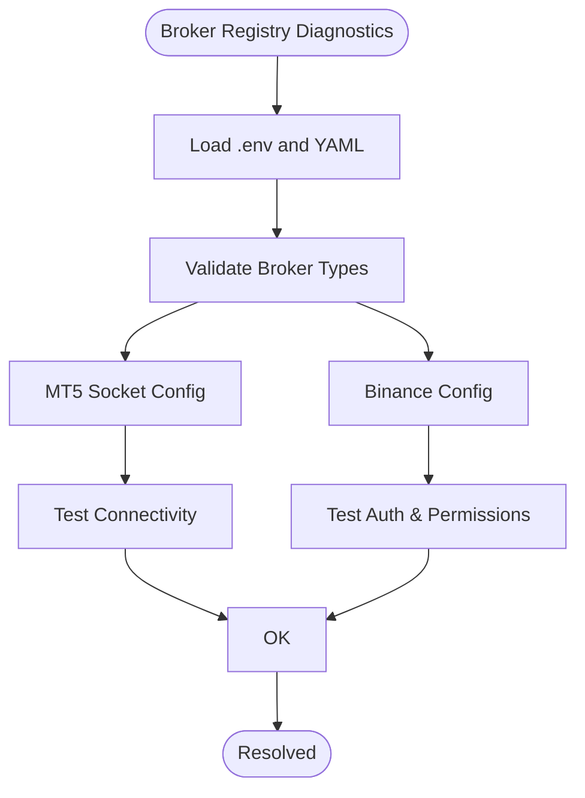
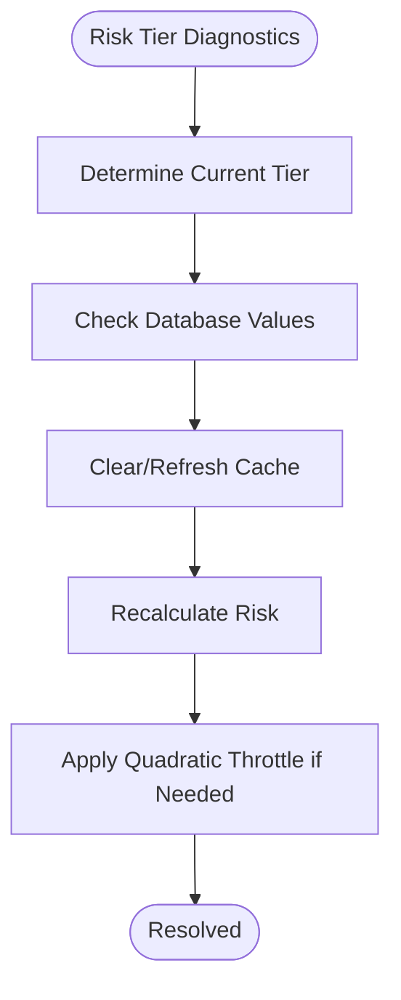
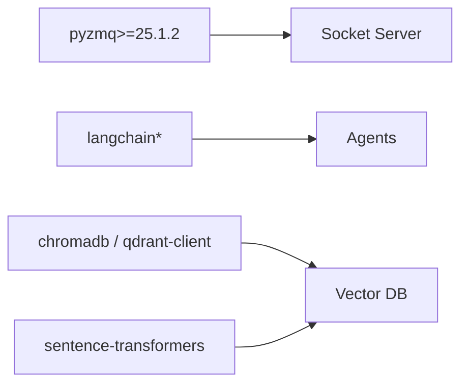

# Troubleshooting and FAQ

<cite>
**Referenced Files in This Document**
- [README.md](file://README.md)
- [troubleshooting.md](file://docs/v8/troubleshooting.md)
- [security_audit_report.md](file://docs/v8/security_audit_report.md)
- [requirements.txt](file://requirements.txt)
- [config/brokers.yaml](file://config/brokers.yaml)
- [.env.example](file://.env.example)
- [docker-compose.yml](file://docker-compose.yml)
- [src/router/socket_server.py](file://src/router/socket_server.py)
- [src/router/engine.py](file://src/router/engine.py)
- [src/router/governor.py](file://src/router/governor.py)
- [src/router/commander.py](file://src/router/commander.py)
- [src/data/brokers/registry.py](file://src/data/brokers/registry.py)
- [src/integrations/crypto/binance_connector.py](file://src/integrations/crypto/binance_connector.py)
- [src/database/models.py](file://src/database/models.py)
- [src/database/migrate_v8.py](file://src/database/migrate_v8.py)
- [stress_test_router.py](file://stress_test_router.py)
</cite>

## Table of Contents
1. [Introduction](#introduction)
2. [Project Structure](#project-structure)
3. [Core Components](#core-components)
4. [Architecture Overview](#architecture-overview)
5. [Detailed Component Analysis](#detailed-component-analysis)
6. [Dependency Analysis](#dependency-analysis)
7. [Performance Considerations](#performance-considerations)
8. [Troubleshooting Guide](#troubleshooting-guide)
9. [Security, Audits, and Compliance](#security-audits-and-compliance)
10. [FAQ](#faq)
11. [Conclusion](#conclusion)

## Introduction
This document provides comprehensive troubleshooting and FAQ guidance for QUANTMIND-X. It focuses on environment setup, API connectivity, performance optimization, debugging techniques for the multi-agent system, risk management components, and execution infrastructure. It also covers diagnostic procedures for ZeroMQ communication, vector database connectivity, and broker adapter issues, along with security considerations, audit procedures, and compliance validation.

## Project Structure
QUANTMIND-X is organized around:
- Multi-agent intelligence hub (Analyst, QuantCode, Co-pilot)
- Strategy Router (Sentinel, Governor, Commander) for real-time risk and execution
- Execution bridge using ZeroMQ for sub-5ms latency
- Vector database and embedding stack for knowledge bases
- Broker adapters for MT5 and Binance
- Configuration via environment variables and YAML

**Diagram sources**
- [README.md](file://README.md#L1-L80)
- [src/router/socket_server.py](file://src/router/socket_server.py#L1-L435)
- [src/router/engine.py](file://src/router/engine.py#L1-L68)
- [src/router/governor.py](file://src/router/governor.py#L1-L62)
- [src/router/commander.py](file://src/router/commander.py#L1-L56)
- [config/brokers.yaml](file://config/brokers.yaml#L1-L116)

**Section sources**
- [README.md](file://README.md#L1-L80)
- [docker-compose.yml](file://docker-compose.yml#L1-L27)

## Core Components
- Socket Server (ZeroMQ): Provides sub-5ms latency between Python intelligence and MetaTrader 5 via persistent REQ/REP sockets.
- Router Engine: Orchestrates Sentinel (market diagnostics), Governor (risk mandates), and Commander (bot dispatch).
- Broker Registry: Centralized configuration and credential substitution for MT5 and Binance adapters.
- Vector Database Stack: ChromaDB and Qdrant for embeddings and semantic search.
- Crypto Adapters: Binance REST/WebSocket connectors with HMAC authentication and rate-limiting considerations.

**Section sources**
- [src/router/socket_server.py](file://src/router/socket_server.py#L1-L435)
- [src/router/engine.py](file://src/router/engine.py#L1-L68)
- [src/router/governor.py](file://src/router/governor.py#L1-L62)
- [src/router/commander.py](file://src/router/commander.py#L1-L56)
- [config/brokers.yaml](file://config/brokers.yaml#L1-L116)
- [requirements.txt](file://requirements.txt#L1-L55)

## Architecture Overview
The system integrates asynchronous event-driven messaging with physics-aware risk governance and multi-broker execution.

**Diagram sources**
- [src/router/socket_server.py](file://src/router/socket_server.py#L150-L325)
- [src/router/engine.py](file://src/router/engine.py#L29-L60)
- [src/router/governor.py](file://src/router/governor.py#L24-L54)
- [src/router/commander.py](file://src/router/commander.py#L19-L38)

## Detailed Component Analysis

### Socket Server (ZeroMQ) Troubleshooting
Common symptoms and resolutions:
- Port already in use: Identify and terminate conflicting process or change port.
- ZMQ library missing: Install PyZMQ and verify version.
- Firewall blocking: Allow inbound TCP port and verify rules.
- Socket server not starting: Validate Python version, asyncio loop, and ZMQ context.
- High latency (>5ms): Investigate CPU load, network latency, synchronous DB calls, and message queue depth.
- MQL5 client failures: Confirm server is listening, validate MQL5 socket implementation, and test with a simple REQ client.

**Diagram sources**
- [docs/v8/troubleshooting.md](file://docs/v8/troubleshooting.md#L24-L253)
- [src/router/socket_server.py](file://src/router/socket_server.py#L66-L121)

**Section sources**
- [docs/v8/troubleshooting.md](file://docs/v8/troubleshooting.md#L24-L253)
- [src/router/socket_server.py](file://src/router/socket_server.py#L1-L435)

### Broker Registry and Adapter Troubleshooting
- Environment variable substitution: Ensure placeholders are resolved and credentials are not hardcoded.
- Broker type configuration: Validate enabled flags and VPS host/port for MT5 socket.
- Binance authentication: Verify key length/format, permissions, and clock synchronization.
- WebSocket stability: Confirm connectivity, firewall rules, and reconnection logic.

**Diagram sources**
- [config/brokers.yaml](file://config/brokers.yaml#L1-L116)
- [src/data/brokers/registry.py](file://src/data/brokers/registry.py#L1-L200)
- [docs/v8/troubleshooting.md](file://docs/v8/troubleshooting.md#L320-L614)

**Section sources**
- [config/brokers.yaml](file://config/brokers.yaml#L1-L116)
- [src/data/brokers/registry.py](file://src/data/brokers/registry.py#L1-L200)
- [docs/v8/troubleshooting.md](file://docs/v8/troubleshooting.md#L320-L614)

### Risk Management Component Troubleshooting
- Tier transitions: Verify thresholds, database updates, and recalculation logic.
- Risk calculations: Ensure correct tier is applied and fixed risk amounts are used in Growth Tier.
- Quadratic throttle: Confirm implementation and expected multipliers under loss conditions.

**Diagram sources**
- [docs/v8/troubleshooting.md](file://docs/v8/troubleshooting.md#L664-L800)
- [src/router/governor.py](file://src/router/governor.py#L24-L54)

**Section sources**
- [docs/v8/troubleshooting.md](file://docs/v8/troubleshooting.md#L664-L800)
- [src/router/governor.py](file://src/router/governor.py#L1-L62)

### Vector Database and Embeddings Troubleshooting
- Qdrant/Chroma connectivity: Confirm service availability, ports, and indexing scripts.
- Embedding model alignment: Ensure model and collection names match across ingestion and retrieval.
- Docker orchestration: Use provided compose file to spin up Qdrant and indexer.

**Section sources**
- [docker-compose.yml](file://docker-compose.yml#L1-L27)
- [requirements.txt](file://requirements.txt#L8-L11)

### Multi-Agent System Debugging
- CLI interactions: Use the provided CLI to chat with agents and verify environment configuration.
- Logs and heartbeats: Monitor latency and throughput via socket server statistics and logs.
- Stress testing: Run the provided stress test to validate router responsiveness.

**Section sources**
- [README.md](file://README.md#L41-L64)
- [stress_test_router.py](file://stress_test_router.py#L1-L200)
- [src/router/socket_server.py](file://src/router/socket_server.py#L405-L419)

## Dependency Analysis
Key runtime dependencies include ZeroMQ for HFT, LangChain/LangGraph for agents, and vector databases for knowledge bases. Ensure versions align with documented requirements.

**Diagram sources**
- [requirements.txt](file://requirements.txt#L1-L55)

**Section sources**
- [requirements.txt](file://requirements.txt#L1-L55)

## Performance Considerations
- Latency targets: Maintain sub-5ms average latency; monitor via socket server statistics and logs.
- Throughput: Scale worker threads, reduce synchronous DB calls, and minimize message queue backlog.
- Network: Place VPS close to broker servers; ensure firewall allows required ports.
- Database: Use async operations and parameterized queries; enforce strict permissions.

[No sources needed since this section provides general guidance]

## Troubleshooting Guide

### Environment Setup
- Ensure environment variables are loaded and placeholders are substituted in YAML.
- Validate broker configurations for enabled/disabled states and VPS host/port.
- Confirm ZeroMQ and vector database services are reachable.

**Section sources**
- [.env.example](file://.env.example#L1-L25)
- [config/brokers.yaml](file://config/brokers.yaml#L1-L116)
- [docker-compose.yml](file://docker-compose.yml#L1-L27)

### API Connectivity Issues
- Binance authentication failures: Check key length/format, permissions, and clock synchronization.
- Rate limiting: Implement client-side rate limiting and prefer WebSocket streams for market data.
- WebSocket stability: Verify connectivity, firewall rules, and automatic reconnection logic.

**Section sources**
- [docs/v8/troubleshooting.md](file://docs/v8/troubleshooting.md#L320-L614)
- [src/integrations/crypto/binance_connector.py](file://src/integrations/crypto/binance_connector.py#L1-L200)

### Performance Optimization Challenges
- Socket latency: Investigate CPU usage, network latency, and synchronous DB calls.
- Router responsiveness: Use stress tests to validate behavior under load.
- Risk computation: Ensure non-blocking logging and efficient regime evaluation.

**Section sources**
- [docs/v8/troubleshooting.md](file://docs/v8/troubleshooting.md#L205-L253)
- [stress_test_router.py](file://stress_test_router.py#L1-L200)
- [src/router/socket_server.py](file://src/router/socket_server.py#L394-L403)

### Debugging Techniques
- Socket Server: Enable debug logging and inspect latency metrics and connection registry.
- Router Engine: Trace the full loop (Sentinel → Governor → Commander) and verify dispatch logic.
- Broker Adapters: Validate authentication, permissions, and message routing.

**Section sources**
- [src/router/socket_server.py](file://src/router/socket_server.py#L422-L435)
- [src/router/engine.py](file://src/router/engine.py#L29-L60)
- [src/router/governor.py](file://src/router/governor.py#L24-L54)
- [src/router/commander.py](file://src/router/commander.py#L19-L38)

### Diagnostic Procedures
- ZeroMQ: Use netstat/lsof to check port usage, telnet for connectivity, and firewall rules for allowances.
- Vector DB: Confirm service health, port mappings, and indexing jobs.
- Broker adapters: Test REST endpoints and WebSocket streams independently.

**Section sources**
- [docs/v8/troubleshooting.md](file://docs/v8/troubleshooting.md#L24-L148)
- [docker-compose.yml](file://docker-compose.yml#L1-L27)

## Security, Audits, and Compliance
- Credential storage: Environment variables and safe YAML parsing; avoid hardcoded secrets.
- Socket server: Binding to localhost by default; consider adding authentication and rate limiting.
- Database access: SQLAlchemy ORM with parameterized queries and input validation.
- Logging: Avoid sensitive data in logs; maintain structured logging with appropriate levels.
- Recommendations: Implement socket authentication, rate limiting, file permission checks, and security event logging.

**Section sources**
- [docs/v8/security_audit_report.md](file://docs/v8/security_audit_report.md#L1-L665)
- [src/database/models.py](file://src/database/models.py#L1-L200)
- [src/database/migrate_v8.py](file://src/database/migrate_v8.py#L1-L120)

## FAQ

### Installation and Setup
- How do I configure environment variables?
  - Use the provided example file and populate values for brokers, vector DB, and LLM APIs.
- How do I start the vector database?
  - Use the provided Docker Compose file to launch Qdrant and the knowledge base indexer.

**Section sources**
- [.env.example](file://.env.example#L1-L25)
- [docker-compose.yml](file://docker-compose.yml#L1-L27)

### Configuration
- How do I enable a broker adapter?
  - Set the broker type, credentials via environment variables, and toggle enabled flags in the broker registry.
- How do I configure MT5 socket bridge?
  - Set VPS host/port and ensure the broker is enabled; bind socket server to localhost by default.

**Section sources**
- [config/brokers.yaml](file://config/brokers.yaml#L1-L116)
- [docs/v8/security_audit_report.md](file://docs/v8/security_audit_report.md#L123-L251)

### Operation
- How do I verify socket server connectivity?
  - Check port usage, firewall rules, and test with a simple REQ client.
- How do I validate Binance authentication?
  - Confirm key length/format, permissions, and clock synchronization; test with a small balance query.

**Section sources**
- [docs/v8/troubleshooting.md](file://docs/v8/troubleshooting.md#L24-L148)
- [docs/v8/troubleshooting.md](file://docs/v8/troubleshooting.md#L320-L480)

### Integration
- How do I integrate with MetaTrader 5?
  - Use the socket client in EAs to connect to the socket server and send heartbeat/trade events.
- How do I integrate with Binance?
  - Configure API keys, testnet if needed, and use the provided connector for REST and WebSocket.

**Section sources**
- [src/router/socket_server.py](file://src/router/socket_server.py#L1-L435)
- [src/integrations/crypto/binance_connector.py](file://src/integrations/crypto/binance_connector.py#L1-L200)

### High-Frequency Trading and Latency
- How do I achieve sub-5ms latency?
  - Minimize CPU load, reduce synchronous DB calls, ensure local network connectivity, and monitor queue depths.
- How do I monitor system performance?
  - Use socket server statistics and logs; run stress tests to validate router responsiveness.

**Section sources**
- [docs/v8/troubleshooting.md](file://docs/v8/troubleshooting.md#L205-L253)
- [stress_test_router.py](file://stress_test_router.py#L1-L200)

### Risk Management
- Why is my risk tier not transitioning?
  - Verify thresholds, database updates, and recalculation logic.
- Why is my position size incorrect in Growth Tier?
  - Ensure fixed risk amount is used and tier is checked before calculation.

**Section sources**
- [docs/v8/troubleshooting.md](file://docs/v8/troubleshooting.md#L664-L771)
- [src/router/governor.py](file://src/router/governor.py#L24-L54)

### Security and Compliance
- Are credentials stored securely?
  - Yes, via environment variables and safe YAML parsing; avoid logging sensitive data.
- What security improvements are recommended?
  - Implement socket authentication, rate limiting, file permission checks, and security event logging.

**Section sources**
- [docs/v8/security_audit_report.md](file://docs/v8/security_audit_report.md#L1-L665)

## Conclusion
This guide consolidates actionable steps to troubleshoot QUANTMIND-X across environment setup, API connectivity, performance optimization, and security. Use the provided diagnostics, apply the recommended fixes, and leverage the built-in logging and statistics to maintain a robust, high-performance trading system.