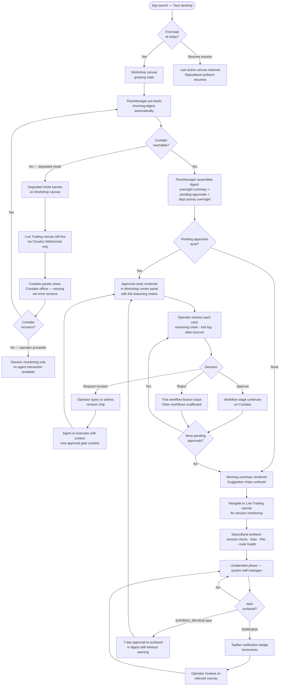
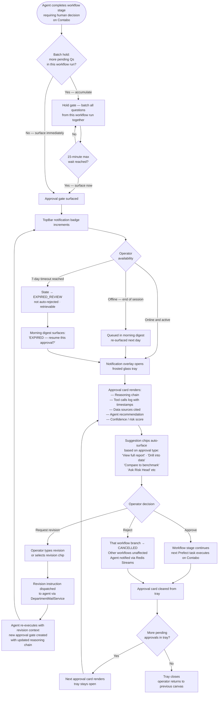
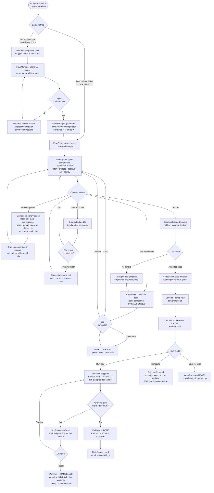
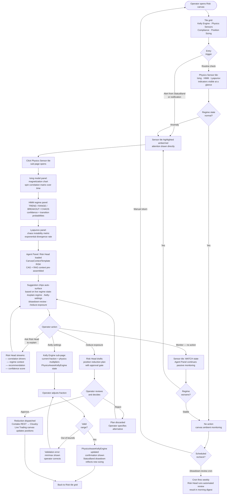

# UX Design Specification — QUANTMINDX

**Author:** Mubarak
**Date:** 2026-03-13

---

## Executive Summary

### Project Vision

QUANTMINDX ITT (Integrated Trading Terminal) is a Tauri desktop application — a **complete rebuild** — designed for one elite solo quant trader operating with the infrastructure of a one-person hedge fund. The defining aesthetic vision: **"VSCode + Bloomberg Terminal had a baby"** — known as the **Frosted Terminal** design language (deep space blue-black, frosted glass panels, scan-line overlay, amber/cyan/red accent system, JetBrains Mono for data, Syne for headings).

This is not a redesign of the existing QuantMind IDE. It is a ground-up rebuild of both the UI and significant portions of the backend. The frontend is built on top of the backend refactor — backend-first sequencing applies.

**Three-node architecture the UI must reflect:**
- **Local machine** — the Tauri UI itself. Thin monitoring/control layer. No trading execution here.
- **Cloudzy** — live trading execution only. ZMQ tick feed, MT5 bridge, Strategy Router, Kill Switches.
- **Contabo** — everything else. FloorManager, all AI departments, Prefect workflows, Redis Streams, HMM training, Alpha Forge, knowledge base, graph memory.

### Target Users

**Primary Persona — Mubarak (sole operator, personal use only):**
- Solo quant trader/developer. Manages 25–50 concurrent algorithmic trading strategies.
- Highly technical: Python, MQL5. Delegates research, development, risk, and strategy management to AI departments.
- Values information density without cognitive overload. Zero tolerance for UI lag during live trading.
- Monitors 3-node infrastructure from a single Tauri desktop. Fullscreen usage expected.
- Morning routine: open app → see what happened overnight → review pending approvals → watch London session open. Target: ≤30 min daily active monitoring.

### Key Design Challenges

1. **Three-node state coherence** — The UI receives two separate data streams: Cloudzy trading data (WebSocket — live P&L, positions, kill switch events) and Contabo agent/workflow state (SSE — department activity, Prefect workflow states, Copilot responses). These must merge seamlessly in the UI. Node health must be visible without alarming on transient blips. If Contabo drops, Cloudzy continues trading — the UI must reflect degraded mode gracefully.

2. **8-canvas navigation with consistent patterns** — Each canvas is a full-screen department workspace. Navigation uses a tile grid (default) → sub-page (on tile click) → breadcrumb back pattern throughout. Cross-canvas navigation occurs via contextual 3-dot menus on entities (EAs, workflows, strategies) — e.g., click EA → "View Code" → Development canvas, "View Performance" → Trading canvas. All canvases share the same global shell (TopBar, StatusBand, ActivityBar, Agent Panel) but have independent canvas-local routing.

3. **Global Copilot as operating layer, not chatbot** — Two distinct Copilot modes: (a) **Workshop canvas** — FloorManager-level, Claude.ai-inspired, full-screen, expansive, cross-platform orchestration. (b) **Agent Panel per canvas** — department-head-specific conversation, streaming thoughts and tool use visible, collapsible right rail. These are different agents. The Workshop Copilot does not appear in the Agent Panel and vice versa. The TopBar provides a persistent one-click shortcut to the Workshop canvas.

4. **Live Trading vs Trading Department distinction** — Live Trading canvas is the CEO dashboard (Mubarak's morning view, passive monitoring of live Cloudzy execution). Trading Department canvas is where agents run paper trading, backtesting, Monte Carlo, Walk-Forward — deeper analytical work. These are different canvases serving different purposes and must not be confused in design or navigation.

5. **HMM in shadow mode** — The HMM regime classifier is in shadow mode for the foreseeable future (overfitting risk). Regime-reactive UI patterns should not depend on HMM output being live and accurate. The Strategy Router runs independently. Regime indicators in the UI should reflect this shadow/provisional status.

6. **Backend-first reality** — The frontend builds on top of the backend refactor. Canvas tile content and sub-page designs are confirmed UX intent, but some sections will be marked *in progress* as implementation follows architecture. Epics and stories will derive from this specification.

### Design Opportunities

1. **StatusBand as ambient kinetic Wall Street ticker** — 28–32px persistent strip. Scrolling ambient data: session indicator, active bot count, daily P&L, node health dots (Cloudzy · Contabo · Local), active workflow count, challenge progress (when active). Inspired by the Wall Street ticker — kinetic, peripheral, never demands attention but rewards a glance. Pure read-only ambient layer.

2. **TopBar as command strip** — Persistent application-level controls above the StatusBand: `[⛔ Kill Switch] [◉ Copilot] [🔔 Notifications] [⚙️ Settings]`. Four verbs always accessible: Stop · Talk · Listen · Configure. The TopBar Kill Switch is the **Trading Kill Switch only** — scoped to Cloudzy MT5 execution. The **Workflow Kill Switch** (Prefect) is not a global control; it lives in the Prefect Kanban board in Workshop canvas, co-located with the running workflow it controls. Notifications open as a frosted glass overlay tray, not a dedicated panel.

3. **Department canvases as manager's desks** — Each canvas is the desk of the department manager (Mubarak reviewing department work). Not dashboards (read-only) — action surfaces. The manager sees ongoing work (tile grid), reviews items (sub-pages), communicates via Agent Panel. Each canvas carries a `CanvasContextTemplate` — when a new Agent Panel chat opens, the department head is pre-loaded with the correct memory scope, workflow namespaces, and skill access for that department. Borrowed from the CRM role-based workspace model.

4. **FlowForge as visual workflow canvas** — N8N-style visual Prefect flow composer in Workshop canvas. Flows assembled from typed component library (`fetch_tick_data`, `run_backtest`, `await_human_approval`, etc.). Visual node graph, Monaco editor for component code, sandboxed test runner. Full-screen mode accessible from Workshop tile.

5. **Workshop as Claude.ai-inspired home** — Expansive, breathing room. Opens to morning digest (first load of day) or "Good morning, Mubarak" with centered Copilot input and quick-action suggestions. Conversation fills the center as it develops. Left panel: New Chat, History, Projects (= workflows), Memory, Skills — mirrors Claude.ai's left sidebar but scoped to QUANTMINDX.

6. **Cross-canvas entity navigation via contextual menus** — Any entity (EA, workflow, strategy, hypothesis) has a 3-dot contextual menu allowing navigation to the relevant canvas and sub-page. This is the primary cross-canvas navigation pattern, keeping the ActivityBar for department switching and entities for work-context switching.

---

## Global UI Anatomy — LOCKED

```
┌──────────────────────────────────────────────────────────────────────┐
│  TOPBAR  [⛔ Kill]  [◉ Copilot]  [🔔 N]              [⚙️ Settings]  │
├──────────────────────────────────────────────────────────────────────┤
│  STATUS BAND  ←── session · bots · P&L · nodes · workflows ──→      │
├───┬──────────────────────────────────────────────┬───────────────────┤
│   │                                              │  AGENT PANEL      │
│ 1 │   CANVAS WORKSPACE                           │  (collapsible)    │
│ 2 │                                              │                   │
│ 3 │   Default: tile grid (preview cards)         │  [Dept Head] [+] [⏱]│
│ 4 │   On click: sub-page (full detail)           │  ─────────────    │
│ 5 │   Navigation: [← Back] breadcrumb            │  conversation     │
│ 6 │                                              │  streaming...     │
│ 7 │                                              │  [tool use]       │
│ 8 │                                              │                   │
│ ─ │                                              │  @ / skills       │
│ ⚙ │                                              │  [Type here...]   │
└───┴──────────────────────────────────────────────┴───────────────────┘
```

- **ActivityBar** (left): 8 canvas icons + Settings at bottom. Icon-only, no labels.
- **Canvas Workspace** (center): Tile grid by default. Canvas-local router (state-based, not URL routing). Tile click → sub-page render. Back button → tile grid.
- **Agent Panel** (right): Collapsible. Shows current department head conversation only. `[+]` = new chat — automatically loads the `CanvasContextTemplate` for the active canvas (department scope, memory namespaces, available skills pre-assembled via CAG+RAG). `[⏱]` = history overlay (past conversations with this dept head). Streaming thoughts, tool calls, and JIT-loaded content visible. Suggestion chips surface context-aware slash commands based on live system state.

---

## 8 Canvas Structure — LOCKED

| # | Canvas | Primary Role | Home for |
|---|---|---|---|
| 1 | **Live Trading** | CEO morning dashboard. Passive monitoring of live Cloudzy execution. Default home canvas. | Mubarak's control of live trading |
| 2 | **Research** | Knowledge base, video ingest, hypothesis pipeline, prop firm research. | Research dept agents + Mubarak |
| 3 | **Development** | EA library (variant browser: vanilla/spiced/mode_b/mode_c per strategy, backtest reports per variant, improvement cycle history, promotion status), Monaco editor, Alpha Forge Workflow 1 trigger (video/source → EA), Alpha Forge Workflow 2 status (enhancement loop), EA deployment pipeline. | Dev dept agents + Mubarak |
| 4 | **Risk** | Kelly Engine settings, physics sensors (shadow mode), prop firm compliance, position sizing, trade validation queue. | Risk dept agents + Mubarak |
| 5 | **Trading** | Paper trading monitoring, backtesting (Monte Carlo, Walk-Forward, PPO), detailed EA performance, strategy lifecycle. | Trading dept agents + Mubarak |
| 6 | **Portfolio** | Live PnL streams, allocation, correlation matrix, rebalancing, performance attribution, account management. | Portfolio dept agents + Mubarak |
| 7 | **Shared Assets** | Cross-departmental resource hub: docs, templates, indicators, skills, flow components, MCP configs. Upload/download/open in Monaco. | All departments + Mubarak |
| 8 | **Workshop** | Copilot's home. Claude.ai-inspired. FloorManager chat, morning digest, suggestion chips, memory, skills, cron. | Mubarak + FloorManager |
| 9 | **FlowForge** | Prefect Kanban (running/pending/cancelled workflows + **Workflow Kill Switch**). FlowForge visual editor (N8N-style node graph). Task orchestration board. FloorManager workflow dispatch. | Mubarak + FloorManager |

**Provisional (backend implementation pending):**
- Exact tile layouts per canvas
- Sub-page designs per section
- Cross-canvas navigation flows in full detail
- Department Mail / Redis Streams UI representation
- FlowForge visual canvas internals
- Sub-agent activity views within department Kanbans

---

## Core User Experience

### Defining Experience

The primary experience model is **PRD-journey fidelity**: every screen, panel, and interaction
must map to one of the defined user journeys in the PRD. The UI succeeds when the Copilot is
accessible, the departments do what they are designed to do, and the user journeys flow as
specified. There is no abstract "happy path" — the journeys ARE the happy paths.

**Islamic compliance shapes the trading model fundamentally**: no overnight positions. All live
trading is session-scoped (Asian / London / New York). The concept of "overnight exposure" does
not exist in this system. Session start and end are the temporal anchors for all trading activity,
risk metrics, and daily P&L resets.

**Primary use case rhythm:**
1. Session opens → scan Live Trading canvas → confirm active bots, live P&L, session clock, no alerts
2. Review pending approvals (Notification overlay / Agent Panel) → act or dismiss
3. Check Workshop Copilot for agent work summaries and queued recommendations
4. Monitor session through StatusBand ambient layer — no active navigation required
5. Session closes → system self-manages until next operator interaction

**The UI's highest compliment:** 20 minutes passing during a live session without Mubarak
needing to touch the keyboard. The system managed itself.

### Platform Strategy

- **Desktop-only:** Tauri 2 app. Fullscreen usage expected. Single screen primary.
- **Input model:** Mouse-primary for navigation, review, and approval flows. Keyboard shortcuts
  reserved for power actions: canvas switching (1–8), trading kill switch trigger, Copilot focus.
- **Degraded mode:** If Contabo drops, Cloudzy continues live trading. The UI must remain
  functional in this state. Live Trading canvas stays live via WebSocket. All Contabo-dependent
  canvases (agent activity, workflow state, Copilot) display graceful degraded-state indicators —
  not error screens. Degraded ≠ broken.
- **Session-scoped time model:** The UI's temporal reference is the current trading session,
  not wall clock time. Islamic compliance (no overnight positions) is structural, not a setting.

### Effortless Interactions

The following must require zero thought or deliberate effort:

1. **Live session clock reading** — StatusBand shows actual live clocks for each session timezone
   (Tokyo/Asian · London/European · New York/NY). Each clock shows real current time in that
   timezone AND whether the session is currently open or closed. Not abstract labels — real clocks.
   Reading session state requires a single glance, zero navigation.

2. **Canvas switching** — Single ActivityBar icon click. Instant. No animation delay perceived.

3. **Copilot access** — One click from anywhere (TopBar shortcut) navigates to Workshop canvas.

4. **Kill switch reach** — The **Trading Kill Switch** is always in TopBar. Never buried.
   Two-step deliberate activation (armed state → confirm modal) prevents accidental trigger.
   The **Workflow Kill Switch** lives in the Prefect Kanban board (Workshop canvas) — it is
   a per-workflow control, not a global button. It cancels running Prefect flows and marks them
   CANCELLED in workflows.db. Activating either does not affect the other. The two kill switches
   are independent by design and by UI location.

5. **Data loading feels liquid** — P&L figures, log streams, agent activity, server data must
   animate in smoothly. No jarring blank-then-populated transitions. Skeleton loaders or graceful
   fades. The data feels like it was already there, just becoming visible.

6. **Alpha Forge pipeline entry** — Research canvas primary workflow: paste YouTube URL →
   pipeline initiates (TRD vanilla + spiced variants generated). Single-field entry point.
   Progress shown step-by-step. The complexity is hidden behind a single input action.

7. **Risk/Router mode legibility** — Current risk mode (fixed/dynamic/conservative) and router
   mode (auction/priority/round-robin) are readable in StatusBand at a glance. No navigation to
   settings required to know the current system mode.

8. **Eye navigation** — Information density must not crowd. Spacious enough that the eye can
   scan a canvas without getting lost. Deliberate breathing room between data clusters.

### Critical Success Moments

**Session open (primary)**
> A trading session starts. Live Trading canvas is open. StatusBand session clocks show active
> session + OPEN status. All active bots are visible with green status. Daily P&L shows session
> start baseline. Node health dots all green. StatusBand risk mode: Dynamic. No alerts. The scan
> takes under 60 seconds. No keyboard required.

**Copilot workflow review**
> A notification indicates a department agent has completed analysis. Mubarak opens the
> notification overlay, sees the agent's reasoning chain and tool use log, reviews the output,
> approves or rejects the recommendation in 3 clicks. Never navigates away from context.

**Alpha Forge pipeline completion**
> YouTube URL pasted in Research canvas. Research agent generates TRD (vanilla + spiced). Dev
> agent generates EA variants. Backtest results return. Approval gate notification appears. Mubarak
> reviews Monte Carlo summary and Kelly risk score. Approves for paper trading. One decision,
> clearly presented in the notification overlay.

**System self-management**
> 20 minutes pass during London session. No intervention required. StatusBand ambient data
> confirms the system is working. No alerts. The app feels like a command room running smoothly.

**Goal tracking check**
> Goal-setting and progress metrics (per PRD functional requirements) are surfaced in a
> dedicated location accessible without navigating away from the current canvas context.

### Experience Principles

1. **Copilot-first:** If the Copilot is accessible and functional, the UI is succeeding. Every
   canvas reaches the Workshop in one action. The Copilot IS the operating layer. Each canvas
   pre-loads a `CanvasContextTemplate` — the agent is always department-aware without manual
   setup. Every capability is a slash command skill surfaced as a context-aware suggestion chip.

2. **Journey fidelity:** Every screen maps to a PRD user journey. No orphaned UI surfaces.
   Design decisions are grounded in journeys, not aesthetics alone.

3. **Liquid data:** Loading and state transitions feel smooth and intentional. The UI
   communicates confidence through fluid rendering. Dense + liquid = professional.

4. **Robust + hacky:** The aesthetic is Frosted Terminal — not polished corporate software, but
   a precision instrument for a single expert operator. References: Arch Linux terminal
   precision meets Bloomberg Terminal information density. Depth and surface texture
   (neuromorphism-adjacent) without softness. Purposeful, precise, powerful.

5. **Spacious density:** Maximum information per canvas, with deliberate breathing room between
   clusters. Eyes navigate without effort. Dense ≠ crowded. Open ≠ empty.

6. **Session-scoped time:** The system's concept of time is the trading session. Live clocks in
   the StatusBand are the temporal anchors. Islamic compliance (no overnight exposure) is
   expressed through the UI's fundamental time model — not a setting, a structural reality.

7. **Ambient awareness + navigation:** StatusBand is the system's pulse AND a navigation layer.
   Every StatusBand segment is clickable — session clocks → Live Trading canvas, active bots →
   Portfolio canvas (bot performance + Trading Journal), risk mode → Risk canvas, router mode →
   Risk canvas, node health dot → node status overlay. Readable at a glance without interaction; navigable on click. The ticker
   tells the story and is the shortcut.

---

## Desired Emotional Response

### Primary Emotional Goals

**1. Thematic immersion — the ITT is yours**
The ITT adapts to the operator's state and time of day. Active session = energized, vibrant.
Evening review = reflective, dark, calm. Multiple preset themes available with time-based
auto-switching. The system feels personal — built for one person, configured by that person.
Inspired by Hyprland ricing culture: the precision of a custom Linux environment where every
detail is intentional. Not a SaaS product used by thousands. A personal instrument.

**2. Calm mastery — alive, not sterile**
The feeling of a perfectly configured Hyprland setup: purposeful, aesthetic, and completely in
your command. Not corporate calm — alive, textured, anime-adjacent in its precision. When you
open the ITT and everything is nominal, you feel: "this is my system. It's working. I am ready."
Settle in. This is your command room.

**3. Informed authority — decisions feel clear**
When agents surface work for approval, the reasoning is fully visible. Rich media rendering
(diagrams, tables, charts inline — not raw markdown) makes agent output immediately legible.
File references are clickable and navigate to context. You decide from a position of full
information. One decision, clearly presented.

**4. Flow state enablement — smooth enough to disappear**
The UI enables deep focus. Smooth transitions, organized tiles, collapsible panels, liquid data
loading. During an active session, the interface supports the operator's rhythm and enables
stretches of uninterrupted focus. The system manages itself; the operator supervises.

### Emotional Journey Mapping

| Moment | Target Emotion | Design Support |
|--------|---------------|----------------|
| App opens — session active | Recognition + readiness | Session clocks showing active state, node health green, no alerts |
| Active session monitoring | Calm vigilance | StatusBand ambient data, tile grid overview, no clutter |
| Agent surfaces approval | Informed authority | Full reasoning visible, rich rendering, one-click approve/reject |
| Evening review | Reflective comfort | Auto dark mode, calm theme preset, organized tile review |
| Something goes wrong | Alert clarity (not panic) | Specific, actionable alerts — not alarmist. One alert = one thing |
| System self-managed unattended | Satisfaction without effort | Ambient confirmation that the machine did its job |

### Micro-Emotions

**Confidence from organizational clarity**
CRM-style canvas tiles: bounded cards, data in named sections, no overflow visible. The eye
knows where to go. One click = sub-page depth. Nothing is lost — just organized beneath.

**Trust from transparency**
Agent reasoning is streamed and visible in the Agent Panel. Rich rendering means diagrams
render as diagrams, tables render as styled tables. File links are clickable — not opaque
references. The system shows its work.

**Delight from personalization**
Theme switching. Frosted glass + custom wallpaper slot. Time-aware auto-switching. The ITT
can feel like a calm ambient aesthetic with lo-fi playing, or like a Bloomberg terminal at
full intensity. The operator configures the mood of the environment.

**Flow from smoothness**
Liquid data loading. Preview windows that appear and disappear cleanly. Skeleton loaders.
Under 5 seconds response latency as the standard. The system feels responsive because it is.

**Satisfaction from delegation**
The departments worked. The Alpha Forge pipeline ran. The approvals are queued. All that work
surfaces in the notification tray. You review and act. The delegation worked.

### Design Implications

1. **Theming system** — Preset themes (Day Active / Night Review / Calm / Energized) with
   time-based auto-switching. Frosted glass surface with customizable wallpaper slot:
   semi-transparent overlay with blur, wallpaper behind. Each theme is a full color palette +
   blur intensity + accent brightness configuration.

2. **Rich rendering in Agent Panel and Workshop** — Agent output renders inline: diagrams as
   diagrams, tables as styled tables, charts as chart components, code blocks with syntax
   highlighting. File references in agent output are hyperlinks → click → navigate to the
   relevant canvas and entity. Claude.ai-level rendering fidelity, not raw markdown.

3. **File preview window** — On any file click (agent output link, Shared Assets, EA library,
   knowledge base article), a preview overlay opens within the canvas workspace. Non-destructive,
   closeable. Distinct from Monaco editor: Preview = read/inspect mode. Monaco = edit mode.
   The preview does not replace the canvas — it layers over it and can be dismissed.

4. **Smart suggestion chips** — In FlowForge workflow builder and Copilot input areas,
   CAG+RAG-powered suggestion chips appear as clickable buttons (not free-text only). Context
   engineering feeds available workflow components, EA names, strategies, and parameters —
   these surface as button-like suggestions. Inspired by Claude.ai prompt suggestions. Reduces
   manual typing in complex flows.

5. **VSCode-style usability baseline** — Navigation must never feel hard. The ITT handles dense
   data but must remain as approachable-to-navigate as VSCode. Depth is there for those who go
   looking; the surface is always clean and clear.

6. **Latency standard** — UI responsiveness target: <5 seconds for all data fetches during
   normal operation. Anything above 5 seconds requires a visible loading state. This is the
   threshold between "fluid" and "frustrating."

### Emotional Design Principles

1. **Personal, not generic** — The ITT must feel built for one person. Theming, wallpaper,
   customization options are not aesthetic extras — they are what separates a tool you own from
   a SaaS product you rent.

2. **Legibility at density** — The system handles enormous information density. Emotional clarity
   is achieved through organization (tiles, cards, sub-pages), not through hiding data. Rich
   rendering ensures complex agent output is immediately comprehensible.

3. **Alert precision** — Alerts mean exactly one thing and suggest exactly one action. Vague or
   frequent alerts erode trust and create anxiety. Every alert must earn its appearance.

4. **Context-aware ambience** — The ITT adapts to time and operator state. Auto dark mode at
   night. Theme presets for different work modes. The environment reinforces the workflow
   context without demanding manual reconfiguration.

5. **Delegation satisfaction** — Successful delegation must be visible and emotionally satisfying.
   When the system managed itself, when the agents did their work, when the pipeline ran
   unattended — this registers as a positive signal. The approval gate is not a burden; it is
   the confirmation that the machine worked.

---

## UX Pattern Analysis & Inspiration

### Inspiring Products Analysis

**Claude.ai — Workshop canvas model + suggestion chip pattern**
What it does well: Centered Copilot input with expanding conversation, left sidebar (New Chat,
History, Projects, Memory, Skills), rich media rendering inline (tables, diagrams, code blocks,
charts), and — critically — structured suggestion chips when an agent is guiding a decision or
building a workflow. Click-to-select options instead of free-text only. This pattern is directly
adopted across all agent interactions in the ITT: workflow building, navigation assistance,
answering structured questions, and making recommendations. Wherever an agent needs to guide
the operator through choices, it presents clickable options, not a blank prompt.

**VSCode — usability baseline and editor integration**
What it does well: Activity Bar for primary navigation (icon-only, no labels needed), canvas-
local routing without URL changes, Monaco editor as the code surface, approachable-to-navigate
despite deep functionality. The ITT's ActivityBar, canvas-local state machine, and Monaco
integration are direct VSCode pattern adoptions. The benchmark: if VSCode navigation feels
easy, the ITT must match that standard.

**Hyprland — aesthetic and personalization model**
What it does well: Ricing culture — a tool that is yours, deeply customizable, visually
distinctive. Frosted glass surfaces, blur effects, rounded corners, smooth transitions. Anime-
tech feel that is precise and alive. Multi-theme support. The Frosted Terminal design language
is a Hyprland-adjacent interpretation for a trading terminal. Multi-theme support from the
old QuantMind IDE continues and expands with Hyprland-level customization philosophy.

**N8N — FlowForge visualization reference only**
What it does well: Visual node graph for workflow composition, typed component library, drag-
to-connect flow building. **Adoption scope is visual only.** FlowForge's execution layer is
Python/JSON code (Prefect flows). N8N provides the visual language for how flows are displayed
and composed — not the execution engine. Code lives underneath; the visualization makes it
navigable and editable without touching raw JSON.

**Notion — data organization model**
What it does well: Dense information feels light when structured into clear, named sections.
Flexible blocks with defined scope. Applied to the canvas tile model: each tile is a bounded
data block with a clear purpose. Click → detail. Not overwhelming at the surface level.

**Bloomberg Terminal — density reference (optional theme, not default)**
Available as a theme preset (green-on-black grid). Useful as a reference for maximum density
done correctly. Not the default — eyes fatigue quickly on pure Bloomberg aesthetics.

### Transferable UX Patterns

**Navigation Patterns:**
- VSCode Activity Bar → ITT ActivityBar (icon-only, 8 canvases + settings, instant switching)
- Canvas-local state machine → tile grid ↔ sub-page, no URL routing, breadcrumb back
- Claude.ai left sidebar → Workshop canvas left panel (New Chat, History, Projects, Memory, Skills)
- StatusBand as navigable ticker → click any segment = shortcut to relevant canvas

**Interaction Patterns:**
- Claude.ai suggestion chips → CAG+RAG-powered suggestion buttons in FlowForge, Copilot inputs,
  agent Q&A flows, workflow building, and recommendation surfaces throughout all canvases
- N8N visual node graph → FlowForge visualization layer (Python/JSON executes; nodes display)
- VSCode file links → clickable file references in agent output navigate to canvas + entity
- Notion block model → bounded tile cards, named sections, click = sub-page depth
- File preview overlay → click reference → non-destructive preview in canvas workspace

**Visual Patterns:**
- Hyprland frosted glass + blur → Frosted Terminal (wallpaper slot + semi-transparent overlay)
- Multi-theme ricing → preset themes (Day Active, Night Review, Calm, Bloomberg) + auto time-switch
- Claude.ai rich rendering → inline diagrams, styled tables, rendered charts in Agent Panel output
- Bloomberg density reference → high data-per-pixel tiles with breathing room between clusters

### Anti-Patterns to Avoid

| Anti-pattern | Source | Why to avoid |
|---|---|---|
| MetaTrader UI model | MT4/MT5 | Too old, cluttered, no information hierarchy |
| QuantConnect dashboard | QuantConnect | Too compact, cramped, data without space |
| TradingView aesthetic | TradingView | Too corporate and polished — lacks the "this is mine" feeling |
| Pure Bloomberg default | Bloomberg Terminal | Eye fatigue on green-on-black grid as the only mode |
| Navigation traps | Old QuantMind IDE | GitHub EA Library and Paper Trading had no clear back path — eliminated |
| Duplicate navigation elements | Old QuantMind IDE | Double labels, redundant controls — each surface must have one purpose |
| 24/7 trading framing | Generic trading UIs | No overnight positions. Session-scoped time model. UI must not imply always-on exposure |

### Design Inspiration Strategy

**Adopt directly:**
- VSCode Activity Bar + canvas-local routing
- Claude.ai Workshop model (left sidebar, centered input, suggestion chips, rich rendering)
- N8N visual language for FlowForge nodes (visualization only, not execution engine)
- Hyprland ricing philosophy: multi-theme, wallpaper slot, frosted glass

**Adapt for QUANTMINDX:**
- Notion data blocks → trading-specific tile cards (financial data, not generic content blocks)
- Bloomberg density → applied selectively per canvas, not as default for all surfaces
- Claude.ai session model → scoped per department head, not one global session

**Avoid entirely:**
- MetaTrader/TradingView visual language (too old or too corporate)
- Any always-on or overnight-exposure framing in session/time displays
- Navigation patterns that trap users without a clear back path

### Additional Feature Confirmed: Trading Journal

The Trading Journal is a confirmed feature (carried from old QuantMind IDE). It lives in the
**Portfolio canvas** as a dedicated tile/sub-page. When the "active bots" segment of the
StatusBand is clicked, it navigates to the Portfolio canvas — bot performance history and the
Trading Journal surface together there.

**Trading Journal scope (Portfolio canvas):**
- Per-bot trade log (entry, exit, P&L, session, duration)
- Session performance summaries
- Win/loss streaks, drawdown history
- Notes/annotation field per trade entry

---

## Design System Foundation

### Design System Choice

**Custom Frosted Terminal Design System — CSS Custom Properties + Tailwind CSS**

A fully bespoke design system built on CSS custom properties (design tokens) with Tailwind CSS
for layout and utility primitives. No off-the-shelf component library. The Frosted Terminal
aesthetic is the default, not an override. Builds on the theming foundation already present
in the previous QuantMind IDE — extended and elevated, not replaced.

### Rationale for Selection

1. **The Frosted Terminal aesthetic is too specific for any existing library** — frosted glass,
   scan-line overlay, backdrop-filter blur, and the amber/cyan/red accent system cannot be
   achieved by theming Material UI or Skeleton UI without fighting the library's defaults.

2. **Multi-theme (Hyprland-style ricing) requires CSS custom properties as first-class** —
   theme switching is a `:root` variable swap. Each theme is a token set. Hyprland community
   palette names (Tokyo Night, Kanagawa, Catppuccin Mocha) are the direct references for
   preset themes — not invented from scratch.

3. **Existing components already follow this pattern** — the rebuild extends the bespoke
   component pattern from the previous IDE, not migrating to a foreign component model.

4. **Design tokens give AI agents unambiguous vocabulary** — `--color-accent-amber` is
   clear. Generic library class overrides are not. All canvas builds reference tokens.

5. **Svelte 5 + Tauri performance** — no heavy library overhead. Tailwind purged at build.
   Custom CSS for all effects. Minimal runtime cost.

### Typography System — Finance + Tech

Fonts selected to evoke precision, data authority, and technical mastery — finance and
trading context, not generic web UI.

| Role | Font | Why |
|---|---|---|
| **Data / Numbers** | JetBrains Mono | Monospace precision. Every digit equal width. Standard in financial data terminals and developer tools. |
| **Headings / Canvas titles** | Syne 700–800 | Geometric, bold, futuristic without being decorative. Distinctive at large sizes. |
| **UI Body / Labels** | Space Grotesk | Modern geometric sans. Finance-adjacent feel. Clean at small sizes. IBM Plex Sans as fallback. |
| **Secondary data** | IBM Plex Mono | IBM's financial/enterprise monospace. For secondary data streams where JetBrains Mono is too heavy. |
| **Ambient / Status** | Fragment Mono or Geist Mono | Lightweight monospace for StatusBand ticker and ambient data streams. |

All number display defaults to JetBrains Mono. Prose and descriptions use Space Grotesk.
Canvas titles and section headers use Syne. The system never uses fonts associated with
consumer/generic web (Roboto, Open Sans, Lato).

### Design Token Structure

```css
/* Core Palette — Frosted Terminal default */
--color-bg-base:        #080d14;
--color-bg-surface:     rgba(8, 13, 20, 0.6);
--color-bg-elevated:    rgba(16, 24, 36, 0.8);
--color-border-subtle:  rgba(255, 255, 255, 0.06);

/* Accent System */
--color-accent-amber:   #f0a500;   /* live / active / running */
--color-accent-cyan:    #00d4ff;   /* AI / Copilot / agent */
--color-accent-red:     #ff3b3b;   /* kill / danger / alert */
--color-accent-green:   #00c896;   /* profit / success */
--color-text-primary:   #e8edf5;
--color-text-muted:     #5a6a80;

/* Typography */
--font-data:      'JetBrains Mono', monospace;
--font-heading:   'Syne', sans-serif;
--font-body:      'Space Grotesk', 'IBM Plex Sans', sans-serif;
--font-ambient:   'Fragment Mono', 'Geist Mono', monospace;

/* Glass Effects */
--blur-glass:           blur(12px);
--blur-heavy:           blur(20px);
--scanline-opacity:     0.03;

/* Wallpaper */
--wallpaper-url:              url('/wallpapers/default.jpg');
--wallpaper-overlay-opacity:  0.7;

/* Theme ID */
--theme-id: 'frosted-terminal';
```

### Theme Presets — Hyprland Community References

| Theme | Hyprland Reference | Character |
|---|---|---|
| **Frosted Terminal** | Custom / default | Deep space blue-black, amber/cyan/red accents. Full Frosted Terminal. The home base. |
| **Tokyo Night** | Tokyo Night rice | Deep blue-purple, muted neons. Night session review. Calm, focused. |
| **Kanagawa** | Kanagawa.nvim inspired | Muted Japanese palette, grey-blues, gold accents. Lo-fi/calm mode. Pairs with ambient wallpapers. |
| **Catppuccin Mocha** | Most popular Hyprland rice | Deep purple-brown, pastel accents. Softer than Frosted Terminal. Evening comfort mode. |
| **Bloomberg** | Classic terminal | Green-on-black grid. Maximum density. Optional for preference. |

Auto time-based switching: post-market-close hours → Tokyo Night activates. Manual override
always available. Active theme persists across sessions.

### Wallpaper System — Hyprland Community Packs

Wallpapers sourced from Hyprland/Linux ricing community repositories. Wallpaper packages:
- Anime/aesthetic landscapes (Kanagawa theme pairing)
- Abstract dark/space (Frosted Terminal default pairing)
- Minimal dark geometric (Tokyo Night / Catppuccin pairing)
- Finance/city at night (Bloomberg theme pairing)

**Implementation:** Wallpaper renders behind frosted glass surfaces. `--wallpaper-overlay-opacity`
controls bleed-through. At 0.7 opacity, wallpaper is subtle but visible. At 0.9, nearly
invisible — pure Frosted Terminal. Operator configures per theme. Wallpaper files bundled
with the Tauri app or loaded from a local directory.

### Implementation Approach

- **Svelte 5** component architecture. All components consume CSS custom properties.
- **Tailwind CSS** for spacing, layout, flex/grid utilities. Config maps design tokens.
- **Custom CSS** for `backdrop-filter`, scan-line `::before`, glow `box-shadow`, animations.
- **No external component library** as a dependency.
- **Design tokens = single source of truth** for all AI agent canvas implementation work.

---

## Core User Interaction — Defining Experience

### Defining Experience

**"Direct your AI trading operation. Review its work. Make the call."**

QUANTMINDX ITT's defining experience is the **instruct → delegate → supervise → approve**
loop. Every canvas, every Agent Panel conversation, every StatusBand element, and every
notification exists to serve this loop — grounded in the 79 FRs and 52 user journeys defined
in the PRD. The AI departments do the work. Mubarak provides direction and approves outcomes.

**Generative UI as the interaction layer:**
The Copilot does not render static screens. It generates context-aware responses using the
Canvas Context System. When Mubarak opens a new chat on the Risk canvas, the Copilot
automatically loads `CanvasContextTemplate(canvas="RISK")` — assembling the relevant memory
scope, department mailbox, workflow namespaces, and shared asset identifiers via CAG + RAG.
The Copilot already knows where it is and what is relevant. No manual context-setting required.

**Slash commands as interaction primitives:**
Every Copilot capability is a `/skill-command` surfaced as a suggestion chip or typed directly.
The agent surfaces the most relevant commands based on live system state:
`/morning-digest` → overnight summary + pending approvals.
`/forge-strategy` → triggers Alpha Forge pipeline.
`/sdd-spec` → structures a task spec for development.
`/drawdown-review` → weekly drawdown analysis workflow.
Skills are `.md` files in `/shared_assets/skills/` — discoverable, extensible, access-scoped.

### User Mental Model

Mubarak operates as a **fund manager with an AI department team**. The mental model: "I run
an operation." Specific implications:

- **Delegation works** — instruction → execution without hand-holding at every step
- **Work is visible** — reasoning, tool calls, data used. Transparency = trust.
- **One clear decision point** — complete result surfaced for a single meaningful approval,
  not a series of micro-confirmations
- **System surfaces issues proactively** — agents flag risks without him going looking
- **Copilot already knows the context** — CanvasContextTemplate means the agent is pre-loaded
  with the right scope per canvas. He never needs to explain which department he's in.

**Mental model failure modes to prevent:**
- Ambiguity between live trading and paper trading (never mix these visually)
- Unclear agent status (is the agent thinking, waiting, done, or stuck?)
- Approval gates without full context (never ask for a decision without reasoning chain)
- Generic Copilot responses that ignore canvas context (solved by CanvasContextTemplate)

### Success Criteria

The core experience succeeds when:

1. **Instruction → result in one interaction chain** — directive routes correctly, executes,
   surfaces a complete result for review. Grounded in PRD user journeys FR10–FR22.
2. **Approval in under 60 seconds** — full context rendered (reasoning chain, tool log, data),
   decision clear, one click
3. **Copilot first token ≤ 5 seconds** — architectural performance target
4. **20 minutes of unattended session** — system manages itself during active trading.
   All system components and frameworks are independent — each operates on its own even
   under partial node degradation. No single approval or rejection cascades to a global halt.
5. **Morning scan in under 30 minutes** — `/morning-digest` → review → confirm → done.
   Grounded in PRD user journey UJ-001.
6. **Agent reasoning always visible** — no black-box decisions. Every approval gate includes
   reasoning chain, tool use log, and data sources. Grounded in FR59–FR65 (audit + notifications).

### Novel vs. Established Patterns

**Established patterns adopted:**
- VSCode Activity Bar navigation
- Claude.ai conversation model + slash commands + suggestion chips
- Notification tray for approval gates
- Tile grid → sub-page → back (Amazon/CRM navigation)
- SSE streaming for live agent output

**Novel patterns introduced:**
- **Canvas Context Templates (generative UI)** — the Copilot's context changes with the canvas.
  Opening a new chat on Risk loads a different template than opening one on Research. The
  Copilot is always department-aware without manual setup.
- **Dual Copilot model** — Workshop (FloorManager-level) vs. Agent Panel (dept-head-level).
  Two scopes, visually distinct. TopBar Copilot → Workshop. Agent Panel header → dept head.
- **StatusBand as navigable ambient layer** — ambient + navigation shortcut simultaneously.
- **CAG+RAG suggestion chips** — context-aware slash command suggestions as clickable buttons.
  Live system state drives what appears.

**Teaching novel patterns:**
- Canvas Templates: invisible to the user — the Copilot just knows where it is.
- Dual Copilot: TopBar = Workshop (always). Agent Panel = dept head (always labelled).
- StatusBand navigation: hover tooltip on each segment shows destination canvas.
- Suggestion chips: appear naturally below input — self-evident on first use.

### Experience Mechanics

**Initiation — three entry points:**
1. Mubarak opens Workshop → morning digest pre-loaded via `/morning-digest` skill
2. Mubarak opens Agent Panel on any canvas → `CanvasContextTemplate` loads for that dept head
3. Notification badge on TopBar bell → system has surfaced an approval gate or agent finding

**Interaction:**
- Types directive OR selects a CAG+RAG-powered suggestion chip (context-aware slash command)
- CanvasContextTemplate already loaded — agent has full dept context, memory scope, skill access
- FloorManager classifies and routes (Workshop) or dept head handles directly (Agent Panel)
- Agent Panel streams: thought process → tool calls with JIT content loading → results.
  First token ≤ 5 seconds.

**Feedback:**
- Agent Panel: live streaming — visible thought process, tool call labels, data fetched
- StatusBand: active workflow count increments; node health reflects activity
- Notification badge increments when approval gate is reached
- Tile cards in relevant canvas update as agents complete work

**Completion:**
- Notification opens → result rendered with rich media (tables, diagrams, risk scores, charts)
- Reasoning chain visible — agent's case is readable, not a black box
- Decision: Approve / Reject / Request revision (one click)
- That specific workflow branch responds to the decision. All other workflows, system
  components, and node processes continue independently — no global workflow halt.
  The ITT's component independence means a rejection affects only the relevant pipeline stage.

---

## Visual Design Foundation

### Color System

**Core Palette — Frosted Terminal (Default Theme)**

| Token | Value | Semantic Role |
|---|---|---|
| `--color-bg-base` | `#080d14` | Root background — deep space blue-black |
| `--color-bg-surface` | `rgba(8,13,20,0.6)` | Frosted glass panel surface |
| `--color-bg-elevated` | `rgba(16,24,36,0.8)` | Elevated card / modal surface |
| `--color-border-subtle` | `rgba(255,255,255,0.06)` | Panel borders — barely visible |
| `--color-accent-amber` | `#f0a500` | Live / active / running — session states, active bots |
| `--color-accent-cyan` | `#00d4ff` | AI / Copilot / agent — all agentic surfaces |
| `--color-accent-red` | `#ff3b3b` | Kill / danger / alert — kill switches, hard stops |
| `--color-accent-green` | `#00c896` | Profit / success — P&L positive, workflow complete |
| `--color-text-primary` | `#e8edf5` | Primary readable text |
| `--color-text-muted` | `#5a6a80` | Secondary labels, ambient data |

**Semantic Color Mapping**

| Intent | Token | Usage |
|---|---|---|
| Primary action | `--color-accent-cyan` | Copilot input borders, active department heads |
| Destructive action | `--color-accent-red` | Trading kill switch, workflow kill switch, hard stop confirmations |
| Live / active state | `--color-accent-amber` | Active bots, running sessions, live market state |
| Positive outcome | `--color-accent-green` | Profitable P&L, workflow success, approved gate |
| Warning / review | `#f5c842` | Caution states, review-pending, partial node degradation |
| Muted / inactive | `--color-text-muted` | Inactive bots, completed workflows, collapsed nodes |
| Surface container | `--color-bg-surface` | All frosted glass tiles, panels, and card surfaces |

**Accessibility Contrast Ratios**

Primary text `#e8edf5` on `#080d14` background: ~16:1 (exceeds WCAG AAA).
Muted text `#5a6a80` on `#080d14`: ~4.5:1 (meets WCAG AA for normal text).
Amber accent `#f0a500` on `#080d14`: ~7.8:1 (meets WCAG AAA for large text).
Cyan accent `#00d4ff` on `#080d14`: ~8.2:1 (exceeds WCAG AA for all sizes).
Red accent `#ff3b3b` on `#080d14`: ~5.1:1 (meets WCAG AA for normal text).
All interactive states (hover, focus, active) must maintain minimum 4.5:1 contrast.
Frosted glass surfaces reduce effective contrast — all text renders over a dark overlay,
not directly on the wallpaper.

### Typography System

Seven type roles covering all surfaces from canvas titles to ambient ticker data.

| Role | Font | Weight | Size | Usage |
|---|---|---|---|---|
| **Canvas title** | Syne | 800 | 28–32px | Top of canvas, section identity |
| **Section header** | Syne | 700 | 20–24px | Sub-page headers, tile labels |
| **UI label / nav** | Space Grotesk | 500 | 13–14px | Menu items, button text, nav labels |
| **Body / description** | Space Grotesk | 400 | 14–16px | Agent output prose, descriptions, approval gate context |
| **Data / numbers** | JetBrains Mono | 400–500 | 12–16px | All financial figures, P&L, risk scores, timestamps |
| **Secondary data** | IBM Plex Mono | 400 | 12–13px | Secondary data streams, audit log, minor metrics |
| **Ambient / ticker** | Fragment Mono | 400 | 11–12px | StatusBand ticker, ambient overlays |

**Type scale:**
- `--text-xs`: 11px / 1.4 line-height (ambient, ticker)
- `--text-sm`: 12px / 1.5 (data, secondary)
- `--text-base`: 14px / 1.6 (body, labels)
- `--text-md`: 16px / 1.5 (prominent body)
- `--text-lg`: 20px / 1.3 (section headers)
- `--text-xl`: 28px / 1.2 (canvas titles)
- `--text-2xl`: 36px+ / 1.1 (hero numbers — P&L, balance, critical metrics)

All financial figures (P&L, positions, balance, risk scores) default to `JetBrains Mono`
throughout the entire ITT. Numbers are never rendered in a variable-width face.

### Spacing & Layout Foundation

**4px base unit.** The entire layout grid is derived from 4px increments.

| Scale | Value | Usage |
|---|---|---|
| `--space-1` | 4px | Tight inline gap, chip padding |
| `--space-2` | 8px | Icon margin, tight label gap |
| `--space-3` | 12px | Component internal padding |
| `--space-4` | 16px | Standard card padding, form field gap |
| `--space-5` | 20px | Tile internal padding |
| `--space-6` | 24px | Section gap, header clearance |
| `--space-8` | 32px | Large section divider |
| `--space-10` | 40px | Canvas section spacing |
| `--space-12` | 48px | Major layout zone gap |

**Global Shell Dimensions — Fixed, Non-negotiable**

| Shell Element | Dimension | Notes |
|---|---|---|
| TopBar | 40px height | Fixed. Trading kill switch (Cloudzy scope only), Copilot shortcut, Notifications, Settings |
| StatusBand | 30px height | Fixed. Navigable ambient ticker — all segments clickable |
| ActivityBar | 48px width | Fixed. 8 canvas icons + Settings. Icon-only, no labels |
| Agent Panel | 320px default width | Collapsible. Right rail of each canvas. |
| Content area | Remaining space | Full bleed. Canvas-local tile grid occupies this zone. |

**Tile Grid Layout**

```css
.canvas-tile-grid {
  display: grid;
  grid-template-columns: repeat(auto-fill, minmax(280px, 1fr));
  gap: var(--space-4);     /* 16px */
  padding: var(--space-5); /* 20px */
}
```

Tiles maintain minimum 280px width, scale to fill available space. Large tiles span 2 columns
(`grid-column: span 2`). Feature tiles (charts, FlowForge canvas, agent reasoning viewer)
span 3 columns or use a full-width variant.

**Frosted Glass Construction**

```css
.glass-surface {
  background: var(--color-bg-surface);
  backdrop-filter: var(--blur-glass);           /* blur(12px) */
  -webkit-backdrop-filter: var(--blur-glass);
  border: 1px solid var(--color-border-subtle);
  border-radius: 8px;
  position: relative;
}

.glass-surface::before {
  content: '';
  position: absolute;
  inset: 0;
  background: repeating-linear-gradient(
    0deg,
    transparent,
    transparent 2px,
    rgba(255,255,255,var(--scanline-opacity)) 2px,
    rgba(255,255,255,var(--scanline-opacity)) 3px
  );
  pointer-events: none;
  border-radius: inherit;
}
```

Wallpaper renders at the root layer. All panels and tiles are frosted glass above it.
The scan-line overlay (`--scanline-opacity: 0.03`) is applied at the tile level — visible at
close range, imperceptible at distance. Wallpaper bleed is controlled via
`--wallpaper-overlay-opacity`.

### Accessibility Considerations

**Contrast and legibility:**
All text meets WCAG AA minimum (4.5:1). Primary surfaces exceed AAA. Frosted glass opacity
settings ensure text is never rendered directly over unblurred wallpaper — `backdrop-filter`
must always be applied before text renders. Canvas transitions at ≤200ms prevent motion issues.

**Keyboard navigation:**
All interactive elements (tiles, suggestion chips, approval gates, nav icons) are reachable
via Tab. Focus states use `--color-accent-cyan` outline. No mouse-only interactions.

**Two independent kill switch surfaces — different locations, different scopes:**

QUANTMINDX ITT has two kill switch systems per architecture.md (Section 5.5). They are
completely separate in scope, mechanism, and UI location. They are never combined.

1. **Trading Kill Switch** — **TopBar only.** Persistent amber glow when a trading session
   is live. Activating it immediately stops all MT5 execution on Cloudzy
   (`ProgressiveKillSwitch`). Two-step confirmation: click → confirm modal with amber warning
   border → confirm. Color state: `--color-accent-amber` (live) → `--color-accent-red`
   (stopped). Scope: Cloudzy trading execution only. All Prefect workflows on Contabo, all AI
   departments, and all FloorManager orchestration continue running. The workflow kill switch
   is unaffected.

2. **Workflow Kill Switch** — **Prefect Kanban board, Workshop canvas.** Not a global button.
   Co-located with the running Prefect workflow it controls — a cancel action within the
   workflow's own card/row on the Kanban. Activating it cancels the target Prefect flow run
   and marks it `CANCELLED` in workflows.db. Two-step confirmation: click → confirm modal with
   red border → confirm. Color: `--color-accent-red` (destructive). Scope: that specific
   Prefect workflow only. Live trading on Cloudzy continues. Other concurrent Prefect workflows
   continue. The trading kill switch is unaffected. If cancelled by mistake, a Copilot slash
   command (`/resume-workflow`) re-triggers from the last completed step.

These controls never share a surface. Their independence must be architecturally visible in
the UI: one global (TopBar), one contextual (Kanban row). Neither causes a global
application halt. Each operates within its own execution scope.

**Alert fatigue prevention:**
StatusBand degraded-mode indicators use muted color with a single subtle pulse — not an
aggressive red flash — for transient node drops. Hard alerts (kill switch triggered, circuit
breaker activated) use full `--color-accent-red` with an audio cue. Every alert surfaces one
unambiguous action. No generic or vague alert text.

---

## Design Direction Decision

### Directions Explored

Six directions across three visual axes. All Frosted Terminal tokens, typography, and shell
dimensions locked throughout. Variations: glass intensity (CSS `backdrop-filter` + opacity),
StatusBand item density, and tile grid minimum width and gap.

| # | Name | Glass | StatusBand | Tiles |
|---|---|---|---|---|
| 1 | Deep Terminal | Heavy — opacity 0.78, blur 18px | Dense — 8 items | Compact — 220px, 10px gap |
| 2 | Breathing Space | Heavy | Minimal — 4 items | Spacious — 280px, 18px gap |
| 3 | Ghost Panel | Near-transparent — opacity 0.10, blur 6px | Dense | Compact |
| 4 | Open Air | Near-transparent | Minimal | Spacious |
| 5 | Balanced Terminal | Heavy | Dense | Spacious |
| 6 | Frosted Ghost | Medium — opacity 0.38, blur 11px | Dense | Spacious |

Interactive HTML showcase: `_bmad-output/planning-artifacts/ux-design-directions.html`
Reference during implementation to verify glass/density rendering targets. Includes Live
Trading and Workshop canvas previews for each direction.

### Chosen Direction: Theme-Linked Multi-Modal Display

**Decision: not a single fixed direction — a theme-linked display system.**

The four preferred directions become named display presets within the theme system.
Switching a theme automatically adjusts glass intensity, StatusBand density, and tile density
simultaneously — no separate "density setting." These are CSS custom property values
(`--glass-opacity`, `--glass-blur`, `--sb-density`, `--tile-min-width`, `--tile-gap`)
inside each theme's token set.

**Operator preference order:**

| Priority | Direction | Theme Preset | Character |
|---|---|---|---|
| 1 — Default | Balanced Terminal | Frosted Terminal | Heavy glass, dense band, spacious tiles. The home base. |
| 2 | Ghost Panel | Kanagawa | Near-transparent, dense band, compact tiles. Lo-fi, ambient. |
| 3 | Open Air | Tokyo Night | Near-transparent, minimal band, spacious tiles. Calm night review. |
| 4 | Breathing Space | Catppuccin Mocha | Heavy glass, minimal band, spacious tiles. Soft evening mode. |
| — | Deep Terminal | Bloomberg | Heavy glass, maximum dense band, compact tiles. Optional maximum density. |

### Design Rationale

The multi-modal approach serves the use case better than a single direction because the
operator's context changes across the day: active session monitoring demands dense awareness
(Balanced Terminal); evening post-session review is best served by a lighter, airier surface
(Open Air or Ghost Panel); deep analytical work benefits from calm ambience (Ghost Panel /
Kanagawa). The display adapts to context automatically through the theme switch — which also
fires the time-based auto-switch already defined in the theme system.

### Implementation

- Each theme's CSS token set includes the glass/density variables alongside color tokens
- Theme switch is a single `:root` variable swap — glass, density, and color update atomically
- `StatusBand` reads `--sb-density` to show/hide secondary items (3rd session clock, node
  detail, workflow count, drawdown) — no component logic change needed
- Tile grids read `--tile-min-width` and `--tile-gap` directly from CSS — no JS required

### Visual Refinements Confirmed

- **Lucide icons** (`lucide-svelte`) throughout the entire UI — ActivityBar, TopBar controls,
  Workshop sidebar, all navigation surfaces. No emoji anywhere. The HTML demo used text
  labels (LT/RS/DV etc.) as placeholder stand-ins for the real Lucide icon set.
- **Accent saturation at rest** — `box-shadow` glow effects removed from status indicators
  and control buttons unless at hard alert state (kill switch activated, circuit breaker
  triggered). Accent colors are present but not luminous at rest.

### Canvas Structure Amendment — Confirmed

The 9-canvas structure supersedes the original 8-canvas lock:

| # | Canvas | Primary Role |
|---|---|---|
| 1 | Live Trading | CEO morning dashboard. Cloudzy live execution monitoring. |
| 2 | Research | Knowledge base, video ingest, hypothesis pipeline. |
| 3 | Development | EA library (variant/report browser), Monaco editor, Alpha Forge Workflow 1 + 2. |
| 4 | Risk | Kelly Engine, physics sensors, compliance, position sizing. |
| 5 | Trading | Paper trading, backtesting, Monte Carlo, Walk-Forward. |
| 6 | Portfolio | Live P&L, allocation, correlation, Trading Journal. |
| 7 | Shared Assets | Cross-dept resource hub: docs, indicators, skills, flow components. |
| 8 | Workshop | Copilot home. FloorManager chat, morning digest, skills, memory, cron. |
| 9 | FlowForge | Prefect Kanban + Workflow Kill Switch. Visual flow editor. Task orchestration. |

**Workshop vs FlowForge distinction:**
Workshop = conversational surface (the Copilot talks to you here).
FlowForge = operational surface (you watch and control what is running here).
The Workflow Kill Switch lives in FlowForge (Prefect Kanban row), not Workshop.

### Design Artifacts Index

| Artifact | Path | Purpose |
|---|---|---|
| HTML Direction Showcase | `_bmad-output/planning-artifacts/ux-design-directions.html` | Interactive 6-direction explorer. Live Trading + Workshop toggleable. Reference during implementation for glass/density targets. |
| UX Specification | `_bmad-output/planning-artifacts/ux-design-specification.md` | This document. Full UX design spec steps 1–10+. |
| Architecture | `_bmad-output/planning-artifacts/architecture.md` | System architecture. Canonical reference for node responsibilities, kill switch specs, agent streaming. |

---

## User Journey Flows

All flows grounded in architecture.md. All include error and recovery branches.
Workflow states per architecture.md §5.1: `PENDING → RUNNING → PENDING_REVIEW → DONE | CANCELLED | EXPIRED_REVIEW`
Department task priorities: `HIGH | MEDIUM | LOW` (atomic checkout via Redis SETNX).

### Flow 1 — The Morning Operator (Journey 1)

Entry: Tauri app launch → Workshop canvas (first load of day).
Target: ≤30 minutes from open to session monitoring active.



### Flow 2 — The Crisis Recovery (Journey 4)

Entry: Abnormal market event or threshold breach detected on Cloudzy.
Covers: Trading Kill Switch + Workflow Kill Switch independently.

```mermaid
flowchart TD
    A([Abnormal market event\nor threshold breach on Cloudzy]) --> B{Trigger source}
    B -->|BotCircuitBreaker:\n3 consecutive losses| C[Specific bot quarantined\nautomatically on Cloudzy]
    B -->|SmartKillSwitch:\nabnormal pattern detected| D[Pattern-based halt\naffected bots stopped]
    B -->|Drawdown limit hit| E[ProgressiveKillSwitch\ntier escalation begins]
    C --> F[WebSocket push to UI:\nkill_switch_event]
    D --> F
    E --> F
    F --> G[TopBar Kill Switch indicator:\namber pulse animation]
    G --> H[StatusBand alert segment activates]
    H --> I[Notification badge: CRITICAL]
    I --> J{Operator\nonline?}
    J -->|Yes — active| K[Operator sees alert immediately]
    J -->|No — away| L[Alert persists in notification tray\nawait operator return]
    K --> M[Review Live Trading canvas:\npositions · bot states · P&L impact]
    L --> M
    M --> N{Full trading halt\nrequired?}
    N -->|Circuit breaker handled it\npartial halt sufficient| O[Review quarantined bot\non Portfolio or Trading canvas]
    N -->|Full stop needed| P[Operator clicks TopBar\nKill Switch → arms to KILL mode]
    P --> Q[Confirm modal:\namber border\n'Stop all MT5 execution on Cloudzy?']
    Q -->|Cancel| R[Kill switch disarmed\ntrading continues]
    Q -->|Confirm| S[ProgressiveKillSwitch executes\nall MT5 execution halted]
    S --> T[TopBar indicator: RED — STOPPED]
    T --> U[Live Trading canvas:\nall positions show halted state]
    U --> V{Prefect workflows\nneed pausing?}
    V -->|No — Contabo independent| W[Contabo workflows continue\nFlowForge Kanban: normal state]
    V -->|Yes — operator chooses| X[Navigate to FlowForge canvas\nCanvas 9]
    X --> Y[Prefect Kanban:\nidentify RUNNING workflows to cancel]
    Y --> Z[Click Workflow Kill Switch\non target workflow card]
    Z --> AA[Confirm modal: red border\n'Cancel this workflow run?']
    AA -->|Cancel| AB[Workflow continues running]
    AA -->|Confirm| AC[Prefect flow → CANCELLED\nworkflows.db updated]
    AC --> AD{Resume\nnow or later?}
    AD -->|Resume now| AE[/resume-workflow in Copilot\nre-triggers from last completed step]
    AD -->|Later| AF[Workflow stays CANCELLED\nretrievable any time]
    O --> AG[Risk canvas: assess drawdown + Kelly impact]
    W --> AG
    U --> AG
    AG --> AH{Drawdown limit\nbreached?}
    AH -->|Yes| AI[Risk Head notified\nKelly fraction reduced\nPhysicsAwareKellyEngine updated]
    AH -->|No| AJ[Monitor — await safe conditions\nto resume trading]
    AI --> AJ
    R --> AJ
```

### Flow 3 — Transparent Reasoning / Approval Gate (Journey 51)

Entry: Agent completes a workflow stage requiring human decision.
Pattern used across all canvases wherever approval gates exist.
Claude.ai-style suggestion chips surface contextual options throughout.



### Flow 4 — Custom Workflow via FlowForge (Journey 14)

Entry: Operator wants to build a custom Prefect workflow.
Two entry paths: natural language via Workshop Copilot, or direct visual editor on Canvas 9.
Monaco editor stubs are placeholders — full implementation in dev phase.



### Flow 5 — The Physics Lens (Journey 17)

Entry: Operator opens Risk canvas, either routine or alert-triggered.
Covers: Ising model, HMM regime, Lyapunov exponent, Kelly adjustment, exposure reduction.



### UI Surface Design — Prefect Kanban (Canvas 9: FlowForge)

The Prefect Kanban is the primary surface of Canvas 9. It shows all Prefect workflow runs
across all departments, with inline controls per card.

**Column structure:**

| Column | State | Card actions |
|---|---|---|
| PENDING | Workflow queued, not yet running | Cancel · Edit |
| RUNNING | Actively executing on Contabo | **Workflow Kill Switch** · View logs |
| PENDING_REVIEW | Waiting for human approval | Open approval gate · View reasoning |
| DONE | Completed successfully | View result · Archive |
| CANCELLED | Stopped by operator or rejection | /resume-workflow · View log |
| EXPIRED_REVIEW | 7-day approval timeout reached | Resume approval · Archive |

**Card anatomy (RUNNING state):**
```
┌─────────────────────────────────────────────────┐
│  [HIGH]  alpha-forge-XAUUSD-momentum-v4          │
│  Research Dept · triggered by /forge-strategy    │
│  ──────────────────────────────────────────────  │
│  Step 3/7: run_backtest_monte_carlo              │
│  ████████░░░░░░░ 52%    Running 14m 22s          │
│  Next: await_human_approval                      │
│  ──────────────────────────────────────────────  │
│  [View logs]              [■ Stop workflow]       │
└─────────────────────────────────────────────────┘
```
The `[■ Stop workflow]` button is the **Workflow Kill Switch** — scoped to this card only.
Clicking it opens a two-step confirm modal (red border). All other cards are unaffected.

**Workflow Kill Switch confirm modal:**
```
┌────────────────────────────────────────┐
│  Stop workflow?                         │
│  alpha-forge-XAUUSD-momentum-v4        │
│                                         │
│  This will cancel the Prefect flow run  │
│  and mark it CANCELLED in workflows.db. │
│  You can resume from the last completed │
│  step at any time.                      │
│                                         │
│  [Cancel]              [Stop workflow]  │
└────────────────────────────────────────┘
```

### UI Surface Design — Department Kanban (per-canvas sub-page)

Each canvas (except Live Trading and Workshop) has a Department Kanban sub-page accessible
from a tile or a "Department activity" header link. It shows the department's live task queue
as managed by the Department Head and Planning Sub-Agent.

**Column structure:**

| Column | Meaning |
|---|---|
| TODO | Tasks queued, not yet assigned to a sub-agent |
| IN_PROGRESS | Sub-agent actively working |
| BLOCKED | Waiting for data, approval, or another task |
| DONE | Completed this session |

**Card anatomy:**
```
┌────────────────────────────────────────┐
│  [MED]  Backtest GBPUSD_HFT v2        │
│  backtester sub-agent                  │
│  Monte Carlo: 500 runs                 │
│  ──────────────────────────────────── │
│  Started 08:44 · Est. 12 min remain   │
└────────────────────────────────────────┘
```
Priority badge: HIGH (amber) | MED (neutral) | LOW (muted).
BLOCKED cards show blocking reason inline: "Waiting: XAUUSD backtest result".
Real-time updates via SSE stream from Contabo.

### UI Surface Design — FloorManager Routing View (Workshop canvas, sub-page)

Accessible from Workshop via a "Routing activity" tile or link. Shows FloorManager's
classification and dispatch log in real time.

**Three panels:**

1. **Incoming log** — stream of tasks received by FloorManager with classification result:
   ```
   08:31:14  classify_task("forge strategy for XAUUSD") → DEVELOPMENT [HIGH]
   08:31:15  dispatch → Development dept queue
   08:29:02  classify_task("weekly drawdown review") → RISK [MEDIUM]
   08:29:02  dispatch → Risk dept queue
   ```

2. **Department load bars** — live utilisation per department (how many tasks in queue):
   ```
   Research    ████░░░░  3 tasks
   Development ██████░░  5 tasks  ← active
   Trading     ██░░░░░░  2 tasks
   Risk        █░░░░░░░  1 task
   Portfolio   ░░░░░░░░  0 tasks
   ```

3. **Failed / dead-letter queue** — tasks that exceeded retry limits or encountered
   unhandled errors. Operator can re-dispatch or discard. Shown with red indicator.

### Journey Patterns

Extracted across all five flows — these patterns must be consistent throughout the ITT:

**Navigation patterns:**
- Canvas switch → immediate, no loading state (≤200ms target)
- Tile click → sub-page render, breadcrumb back always available
- Notification click → opens tray overlay, never navigates away unless operator chooses
- 3-dot contextual menu on any entity → cross-canvas navigation shortcuts

**Approval gate pattern (universal):**
- Batch-surfaced (accumulate within workflow run, max 15-min hold)
- Full reasoning chain always rendered before decision buttons
- Three decisions always: Approve · Reject · Request Revision
- Revision → agent re-executes, new gate created — never a manual edit by operator
- 7-day timeout → EXPIRED_REVIEW (not auto-rejected, retrievable)

**Suggestion chip pattern (CAG+RAG-powered):**
- Chips surface based on live system state via CanvasContextTemplate
- Chips are skill commands (`/morning-digest`, `/kelly-settings`, `/reduce-exposure`)
- Selecting a chip is equivalent to typing the command — no modal, no navigation
- Chips update dynamically as context changes (regime shift → new chips appear)

**Error state pattern:**
- Transient node drops: muted amber, no alarm — "Contabo: retrying" not "ERROR"
- Hard failures: red indicator + single action surfaced + audio cue
- Workflow failures: highlighted card in Kanban, error detail inline, no global alert
- Validation errors (Monaco, Kelly input): inline at the point of input, not modal

**Kill switch pattern (two types, never conflated):**
- Trading Kill Switch: TopBar, global, affects Cloudzy execution only
- Workflow Kill Switch: Kanban card, scoped to one workflow, affects Contabo Prefect only
- Both: two-step confirm with distinct visual treatment (amber vs red)
- Both: activating one has zero effect on the other

### Flow Optimization Principles

1. **Morning routine ≤30 min** — /morning-digest pre-loads; all approvals batch-surfaced
   in one pass; no hunting for pending items across canvases
2. **Approval in ≤60 seconds** — full context on the card, one click per decision,
   chips reduce typing to zero for common actions
3. **Crisis reach in ≤3 clicks** — TopBar Kill Switch always visible, always armed
   within one click, confirm in the second click
4. **Agent context zero-setup** — CanvasContextTemplate loads dept scope on new chat;
   operator never explains which department or canvas they are on
5. **No dead ends** — every cancelled workflow has /resume-workflow; every rejected
   approval can be revised; every EXPIRED_REVIEW is retrievable
6. **Physics lens is proactive** — regime alerts surface in StatusBand before operator
   checks Risk canvas; the system tells you, not the other way around

---

## Component Strategy

### Design System Foundation

QUANTMINDX ITT uses a **fully bespoke design system** — no external component library for
visual styling. The color palette, typography, and glass tokens from Step 8 remain unchanged.

**shadcn-svelte as behavioral foundation:** Complex interactive components (Dialog, Dropdown,
Tooltip, Popover, Combobox, ContextMenu) use `shadcn-svelte` as the **headless behavior
layer** only — providing ARIA attributes, focus traps, keyboard navigation, and screen reader
support. All visual styling is completely overridden with QUANTMINDX glass tokens. This
separation means battle-tested accessibility behavior + fully custom aesthetics.

**Hyprland-style glass aesthetic (updated from Step 8 visual foundation):**

Informed by end_4's Hyprland rice reference: wallpaper is the canvas — panels float over it.
The previous demo used background opacity too high (opaque dark slabs). The correct approach:

```css
/* Two-tier glass system */

/* Tier 1 — Shell surfaces (ActivityBar, TopBar, overlays, panel frames) */
.glass-shell {
  background: rgba(8, 13, 20, 0.08);          /* near-zero fill — wallpaper dominates */
  backdrop-filter: blur(24px) saturate(160%);
  border: 1px solid rgba(255, 255, 255, 0.07);
  border-radius: 12px;
}

/* Tier 2 — Content surfaces (tiles, kanbans, editor panels, cards) */
.glass-content {
  background: rgba(8, 13, 20, 0.35);          /* enough for data readability */
  backdrop-filter: blur(16px) saturate(150%);
  border: 1px solid rgba(255, 255, 255, 0.08);
  border-radius: 8px;
}

/* Gradient border accent (characteristic Hyprland pattern, QUANTMINDX palette) */
.glass-accent-border {
  border: 1px solid transparent;
  background-clip: padding-box;
  position: relative;
}
.glass-accent-border::before {
  content: '';
  position: absolute;
  inset: -1px;
  border-radius: inherit;
  background: linear-gradient(135deg, var(--accent-cyan), var(--accent-amber));
  z-index: -1;
  opacity: 0.4;
}
```

Colors stay exactly as defined in Step 8 (`--accent-amber: #d4920e`, `--accent-cyan: #00aacc`,
`--accent-red: #c42a2a`, `--accent-green: #00a878`). The aesthetic shift is in **fill opacity
and blur intensity** — not hue. Mubarak will fine-tune the exact opacity values during
implementation.

---

### Design System Components (from CSS tokens + Tailwind)

Available without custom components:
- Typography scale (JetBrains Mono · Syne · Space Grotesk · Fragment Mono)
- Color tokens (all accent + bg + surface + border tokens from Step 8)
- Glass utilities (`.glass-shell` / `.glass-content` defined above)
- Spacing, flex/grid, transitions, animations (Tailwind utilities)
- Scan-line overlay (`::after` pseudo-element, defined globally)

**Gap:** Every interactive compound component — cards, Kanbans, panels, navigation, kill
switches, streaming chat — must be custom-built. All 18 components below are net-new.

---

### Custom Components

#### Phase 1 — Core Shell

##### 1. GlassTile

**Purpose:** Foundational canvas tile. Every canvas is a grid of GlassTiles — the primary
information and navigation unit of the ITT.

**Anatomy:** `.glass-content` container (Tier 2 glass). Header: title (Space Grotesk) +
optional dept badge. Body: primary metric (JetBrains Mono, large) + optional sparkline +
secondary metrics. Footer: last-updated timestamp + optional status chip. Hover: reveals
3-dot contextual menu for cross-canvas navigation.

**States:**
- `default` — Tier 2 glass, subtle border
- `hover` — `.glass-accent-border` activates (cyan→amber gradient border), footer revealed
- `active` — brief scale(0.98) flash before sub-page transition
- `loading` — scan-line shimmer skeleton fill
- `error` — `--accent-red` border tint, error message in body
- `offline` — grey overlay, "Node offline" label, reduced opacity

**Variants:** `sm` 240px · `md` 320px (standard) · `lg` 480px (metric + chart) ·
`xl` full-width hero tile

**Accessibility:** `role="button"`, `aria-label="{canvas} — {title}: {value}"`,
`tabindex="0"`, Enter/Space activate, `aria-expanded` on 3-dot menu.

---

##### 2. StatusBand

**Purpose:** Persistent 32px ambient kinetic ticker strip. Always at bottom of shell.
Read-only. Wall Street ticker inspiration — rewards a glance, never demands attention.

**Anatomy:** `.glass-shell` (Tier 1 glass, near-transparent). Full-width. Auto-scrolling
segments: Session pill · Bot count · Daily P&L · NodeHealthIndicator · Workflow count ·
Challenge progress (when active). Scan-line `::after` overlay on top.

**States:**
- `dense` — 32px, full segment set (`--sb-density: dense`)
- `minimal` — 24px, P&L + Node health only (`--sb-density: minimal`)
- `degraded` — node offline dots visible, rest of scroll continues

**Accessibility:** `role="status"`, `aria-live="polite"`. No tab stop (ambient only).

---

##### 3. ActivityBar

**Purpose:** Left-side 9-canvas vertical navigation rail.

**Anatomy:** `.glass-shell` (Tier 1). 56px collapsed / 200px expanded. 9 canvas items:
Lucide icon + label (visible expanded). Active item: `--accent-cyan` left-border (2px).
Hover tooltip in collapsed mode. Bottom: user profile section.

**States per item:** `inactive` (60% opacity) · `active` (100% + cyan left-border) ·
`hover` (80% + tooltip) · `disabled` (40%, not-allowed cursor)

**Accessibility:** `role="navigation"`, `aria-label="Canvas navigation"`. Per item:
`role="menuitem"`, `aria-current="page"` when active.

---

##### 4. TopBar

**Purpose:** Persistent 48px command strip. Four global verbs: Stop · Talk · Listen · Configure.

**Anatomy:** `.glass-shell` (Tier 1). Left: wordmark + current canvas name. Right:
`[TradingKillSwitch] [WorkshopButton] [NotificationBell] [SettingsButton]`.
Scan-line micro-overlay.

**States:** `default` · `kill-switch-armed` (rest of bar dims, Kill pulses red) ·
`notifications-open` (bell active, frosted overlay tray appears)

**Accessibility:** `role="banner"`. All icon buttons have `aria-label`.

---

##### 5. NodeHealthIndicator

**Purpose:** Three-dot display — Cloudzy · Contabo · Local node status.
Lives in StatusBand and optionally expanded in TopBar.

**Anatomy:** Three 8px dots, 4px gap. Hover: reveals labels + latency tooltip.

**States per dot:** `online` (--accent-cyan) · `degraded` (--accent-amber) ·
`offline` (--accent-red) · `connecting` (pulsing cyan/grey)

**Accessibility:** `role="status"`, `aria-label="Cloudzy: {state}, Contabo: {state},
Local: {state}"`. Updates on every state change.

---

##### 6. TradingKillSwitch

**Purpose:** Two-stage arm-and-confirm emergency stop. TopBar only. Scoped to Cloudzy MT5
execution — does NOT stop Prefect workflows.

**Anatomy:** Lucide `OctagonAlert` + "Kill" label. Armed: expands inline →
`[✓ Confirm] [✕ Cancel]`. Post-fire: greyed, "KILLED" + Lucide `CheckCircle`.

**States:** `ready` (red border) · `armed` (red fill, pulsing, 2s auto-reset) ·
`firing` (spinner) · `fired` (grey, disabled)

**Interaction:** Click → armed. Escape → cancel. Confirm → calls
`ProgressiveKillSwitch` on Cloudzy.

**Accessibility:** `aria-label` updates through all states. `aria-pressed` for armed.

---

##### 7. AgentPanel

**Purpose:** Collapsible 320px right rail. Department-head agent for current canvas.
Workshop Copilot is a completely separate agent — does not appear here.

**Anatomy:** `.glass-shell` (Tier 1) panel. Header: agent name + dept badge.
Message stream: scrollable bubbles + tool-call indicators. Streaming: animated typing
cursor + auto-scroll. SuggestionChipBar pinned at bottom. Text input + send button.

**States:** `collapsed` · `expanded` · `streaming` (live SSE, typing cursor) ·
`idle` · `offline` (Contabo unreachable — shows node offline message)

**Accessibility:** `role="complementary"`, `aria-label="Department agent panel"`.
Messages: `aria-live="assertive"`. `aria-expanded` on toggle button.

---

##### 8. MorningDigestCard

**Purpose:** Daily morning briefing. Appears on Live Trading canvas on first open of
the session. Summarizes overnight activity, pending approvals, node status.

**Anatomy:** `.glass-content` (Tier 2). Date + session header (JetBrains Mono). Sections:
overnight summary · pending approvals chip (amber, clickable) · node health summary ·
critical alerts list (if any) · market session indicator.

**States:** `loading` (shimmer) · `clean` (no approvals, calm) ·
`has-approvals` (amber chip prominent) · `has-critical` (red alert section)

**Accessibility:** `role="region"`, `aria-label="Morning digest for {date}"`.
Approval chip: `role="button"`, `aria-label="Review {N} pending approvals"`.

---

#### Phase 2 — Workflow Operation Components

##### 9. PrefectKanbanCard

**Purpose:** Workflow state card for FlowForge canvas (Canvas 9), 6-column Kanban.
**Workflow Kill Switch lives here on RUNNING cards only** — not in TopBar.

**Anatomy:** `.glass-content` (Tier 2). Workflow name (Syne bold) · FlowStateChip ·
duration/timestamp · 1-line run summary. RUNNING only: Lucide `Square` + "Stop"
(WorkflowKillSwitch). PENDING_REVIEW: `[Review]` chip. EXPIRED_REVIEW: Lucide
`AlertTriangle` + "Approval expired — retrieve?".

**States:** `pending` (grey) · `running` (`.glass-accent-border` active, cyan pulse) ·
`pending-review` (amber border) · `done` (green muted) · `cancelled` (grey, strikethrough) ·
`expired-review` (orange + warning icon)

**Variants:** `kanban-compact` · `detail-expanded` (overlay with logs + dep graph link)

**Accessibility:** `role="article"`. WorkflowKillSwitch: `aria-label="Stop workflow {name}"`.

---

##### 10. DepartmentKanbanCard

**Purpose:** Task card in per-canvas Department Kanban sub-pages. 4-column Kanban
(TODO · IN_PROGRESS · BLOCKED · DONE). Real-time SSE state updates.

**Anatomy:** `.glass-content` (Tier 2). Task title · dept badge · priority chip
(HIGH=red / MEDIUM=amber / LOW=grey) · state badge + assignee agent name ·
Lucide `GripVertical` drag handle.

**States:** `todo` · `in-progress` (amber left-border, pulse) ·
`blocked` (red border + Lucide `AlertOctagon`) · `done` (green muted)

**Accessibility:** `role="article"`. Drag handle: `role="button"`. `aria-grabbed` during drag.

---

##### 11. ApprovalGateBadge

**Purpose:** Non-blocking batch approval pill. Max 15-min hold before surfacing.
7-day timeout → EXPIRED_REVIEW state.

**Anatomy:** Lucide `CheckSquare` + count number. Tooltip: oldest pending description +
"and {N−1} more".

**States:** `empty` (hidden) · `has-items` (amber) · `has-critical` (red, pulsing) ·
`reviewing` (spinner)

**Accessibility:** `aria-live="polite"`, `aria-label="{N} workflow approvals pending"`,
`role="button"`.

---

##### 12. FlowStateChip

**Purpose:** Inline compact state indicator for workflow states. Used inside
PrefectKanbanCard and wherever workflow state appears inline.

**Anatomy:** 8px dot + state label (Fragment Mono, 11px caps). Colors:
PENDING=grey · RUNNING=cyan · PENDING_REVIEW=amber · DONE=green ·
CANCELLED=grey-muted · EXPIRED_REVIEW=orange

**Accessibility:** `role="status"`, `aria-label="{state}"`.

---

##### 13. SuggestionChipBar

**Purpose:** 3–5 Copilot-generated action chips. Bottom of AgentPanel and Workshop
input area.

**Anatomy:** Horizontally scrollable chip row. Each chip: contextual Lucide icon +
short label (Space Grotesk 12px). `.glass-shell` treatment on chip backgrounds.

**States:** `loading` (3 shimmer ghost chips) · `loaded` · `empty` (bar hidden)

**Accessibility:** `role="listbox"`, `aria-label="Suggested actions"`. Per chip:
`role="option"`.

---

#### Phase 3 — Research & Development Components

##### 14. PhysicsSensorTile

**Purpose:** Specialized tile for Physics Lens canvas. Three data display modes.

**Anatomy:** `.glass-content` (Tier 2). Metric name · primary value (JetBrains Mono XL) ·
visualization area (sparkline / bar / histogram) · Lucide `AlertTriangle` amber overlay
on anomaly detection.

**States:** `normal` (cyan accent) · `anomaly` (amber + warning icon) ·
`critical-anomaly` (red border + pulsing)

**Variants:** `scalar` · `time-series` · `distribution`

**Accessibility:** `role="img"`, `aria-label="{metric}: {value} — {state}"`.
`aria-describedby` summary for chart data.

---

##### 15. FlowForgeNodeGraph

**Purpose:** Visual Prefect workflow dependency graph viewer. FlowForge canvas (Canvas 9).
View-first; edit capability in Phase 3+.

**Anatomy:** SVG/canvas with zoom+pan. Node boxes: task name + state color + duration.
Directed edges (dependency arrows). Minimap (collapsed default). Selected node: detail
tooltip overlay using shadcn-svelte Tooltip for accessible positioning.

**States:** `idle` (static, terminal state colors) · `running` (active node pulses cyan)

**Accessibility:** Tab between nodes, Enter to inspect. `aria-label` per node. Screen
reader graph summary.

---

##### 16. MonacoEditorStub

**Purpose:** Monaco editor frame for Development canvas. Python + MQL5 language support.

**Anatomy:** Language selector pill (top-right, Space Grotesk) · file breadcrumb
(top-left) · Monaco fill area (theme: `--bg-base` dark, Tier 2 glass on container) ·
action bar (Save · Run · Diff) · status bar (cursor position, lang mode, encoding).

**States:** `editing` · `saving` (spinner) · `running` (progress indicator) ·
`error` (red status bar + Monaco error underlines)

---

##### 17. StrategyPerfCard

**Purpose:** Strategy performance summary tile for Trading Department canvas.

**Anatomy:** `.glass-content` (Tier 2). Strategy name + EA identifier · Sharpe ratio
(JetBrains Mono, prominent) · drawdown · win rate % · active positions count ·
last signal timestamp.

**States:** `normal` · `underperforming` (amber tint on Sharpe/drawdown) ·
`drawdown-alert` (red border, drawdown highlighted red)

---

##### 18. BreadcrumbNav

**Purpose:** Sub-page navigation trail. Applied universally across all canvases for the
tile grid → sub-page navigation pattern.

**Anatomy:** `{Canvas Name}` + Lucide `ChevronRight` + `{Sub-page}`. Last crumb: bold,
non-clickable. Preceding crumbs: clickable links. Hidden at canvas home (root level).

**States:** `root-level` (hidden) · `level-1` · `level-2`

**Accessibility:** `role="navigation"`, `aria-label="Breadcrumb"`. `aria-current="page"`
on last item.

---

### Component Implementation Strategy

**Svelte 5 Runes:** All components use `$state`, `$derived`, `$effect`. No legacy reactive
stores for new builds.

**shadcn-svelte (behavior layer only):** Used for Dialog, Dropdown, Tooltip, Popover,
ContextMenu, Select — providing ARIA, focus traps, keyboard navigation. All visual styles
completely overridden with QUANTMINDX tokens. Install: `npx shadcn-svelte@latest init`.

**Design Token Contract:** All components consume CSS custom properties from `:root`.
No hardcoded colors, blur values, or spacing. Theme switching is CSS-only — components
respond without re-rendering.

**Glass Tier Assignment:**
- Shell surfaces (ActivityBar, TopBar, AgentPanel frame, overlay panels): `.glass-shell` (Tier 1)
- Content surfaces (GlassTile, Kanban cards, MorningDigestCard, sensor tiles): `.glass-content` (Tier 2)
- Active/focused surfaces: `.glass-accent-border` applied on top of Tier 1 or Tier 2

**Lucide Icons:** All iconography via `lucide-svelte`. No emoji anywhere in the UI.

**Streaming Pattern:** AgentPanel uses Svelte 5 `$state` array appended per SSE chunk.
Targeted DOM updates — no full re-render on stream.

**SSE Reactivity:** PrefectKanbanCard and DepartmentKanbanCard subscribe to SSE channels.
State driven by `$state` — no polling.

**Accessibility Contract:** All interactive components: WCAG AA minimum (3:1 contrast on
focus ring vs `--bg-base`). All state changes that are not visually obvious must update
`aria-label` or `aria-live` regions.

---

### Implementation Roadmap

#### Phase 1 — Core Shell *(Morning Operator + Crisis Recovery critical path)*

1. TopBar
2. ActivityBar
3. StatusBand
4. NodeHealthIndicator *(dependency for StatusBand)*
5. GlassTile *(entire canvas grid system depends on this)*
6. TradingKillSwitch *(Crisis Recovery critical path)*
7. AgentPanel
8. MorningDigestCard

**Milestone:** Shell renders. Live Trading canvas tiles visible. TradingKillSwitch
operational on Cloudzy. AgentPanel streams department agent responses.

---

#### Phase 2 — Workflow Operations *(Transparent Reasoning + FlowForge critical path)*

9. FlowStateChip *(dependency for PrefectKanbanCard)*
10. PrefectKanbanCard with WorkflowKillSwitch
11. DepartmentKanbanCard
12. ApprovalGateBadge
13. SuggestionChipBar *(AgentPanel + Workshop)*

**Milestone:** FlowForge canvas operational. Department Kanbans live. Approval gate
surfaced in UI. WorkflowKillSwitch functional on Contabo Prefect.

---

#### Phase 3 — Research & Development *(Physics Lens + Development workflows)*

14. PhysicsSensorTile
15. FlowForgeNodeGraph
16. MonacoEditorStub
17. StrategyPerfCard
18. BreadcrumbNav *(applied across all canvases once sub-page routing is built)*

**Milestone:** All primary canvas surfaces have core components. Research + Development
canvases functional. Full sub-page navigation operational across all 9 canvases.

---

## UX Consistency Patterns

### Action Hierarchy

QUANTMINDX ITT is a command surface, not a CRUD application. Actions are rare,
consequential, and highly contextual. Three tiers:

**Tier 1 — Critical destructive actions** (TradingKillSwitch, WorkflowKillSwitch)
- Visual: `--accent-red` border + Lucide icon + label. Two-stage arm-and-confirm required.
- Behavior: First click → armed state (visual change, 2s auto-cancel countdown).
  Second click → shadcn Dialog confirm. Escape cancels at any stage.
- Never used for reversible actions.

**Tier 2 — Primary contextual actions** (Review approval, Submit to agent, Start workflow)
- Visual: `--accent-cyan` fill, Space Grotesk medium weight.
- Behavior: Single click → immediate action or opens detail overlay.

**Tier 3 — Secondary / ghost actions** (Cancel, Dismiss, Back, 3-dot menus)
- Visual: transparent background, subtle border, muted text.

**Chip actions** (SuggestionChipBar, quick filters)
- Visual: `.glass-shell` pill + Lucide icon + short label.
- Behavior: Single click → sends as agent message or applies filter.

---

### Feedback Patterns

**Real-time streaming** (AgentPanel, Workshop Copilot)
- Incremental text append to `$state` message array. Animated `|` cursor at stream end.
- Auto-scroll to bottom during stream; pauses if user scrolls up; resumes on new message.
- Tool call: inline row "Using: web_search…" + pulsing dot → collapses to `✓` on completion.

**Non-blocking notification** (ApprovalGateBadge, StatusBand)
- Count chip — ambient, no modal interruption, no audio. Never auto-dismisses.
- Stays visible until operator resolves. Max 15-min batch hold before chip appears.

**State transition feedback** (Kanban SSE update)
- Card briefly highlights with accent border (~400ms) on state change, settles to new
  state color. No toast. The card IS the feedback — its state badge is the source of truth.

**Success:** `--accent-green` + Lucide `CheckCircle`. Permanent on completed items.

**Error / offline:** `--accent-red` tint + Lucide `AlertOctagon`. Always shows recovery
context — never bare error without next steps ("Contabo offline — trading continues on Cloudzy").

**Warning / degraded:** `--accent-amber` + Lucide `AlertTriangle`. Threshold approaches,
HMM shadow mode indicators, EXPIRED_REVIEW approvals.

**Loading skeleton:** Scan-line shimmer fill matching component shape. Never blank canvas —
shimmer until first data arrives. Shell (TopBar, StatusBand, ActivityBar) loads immediately;
only tile content area shimmers.

---

### Data Display Patterns

QUANTMINDX displays live backend data, not user-entered records.

**Metric display:** JetBrains Mono 20–32px (varies by tile variant). Value + unit label
("2.41 SR", "−3.2%", "247 bots"). Neutral color by default. Semantic coloring only on
threshold breach (green on positive P&L, red on drawdown exceeding limit).

**State badge:** Fragment Mono 11px uppercase. Colored 8px dot + label. Never color alone —
label is always present for accessibility.

**Timestamp:** Under 1 hour → relative ("3 min ago"). Over 1 hour → absolute UTC ("14:32 UTC").
Always UTC. Never local time for trading data.

**Sparkline / inline chart:** Fills tile body area, 40–60px height. `--accent-cyan` on
positive trend, `--accent-red` on negative. No axes or labels — ambient context only.
Full chart available on sub-page.

---

### Navigation Patterns

**Canvas switching (ActivityBar):** Click Lucide icon → canvas activates immediately.
Active canvas: `--accent-cyan` 2px left-border. No loading state for already-loaded canvases.

**Sub-page navigation (tile click):** Click GlassTile → canvas-local route to sub-page.
BreadcrumbNav appears. Back: click any ancestor in BreadcrumbNav. No modal —
sub-page replaces tile grid for the full canvas area.

**Cross-canvas navigation (3-dot contextual menu):** Hover GlassTile → Lucide
`MoreHorizontal` icon appears. Options: "View in [Canvas Name]" per relevant canvas.
Activates target canvas + navigates directly to the entity's sub-page. The entity
(EA, strategy, workflow) is the link — navigation follows the thing, not memory.

**Overlay navigation:** `.glass-shell` panel slides from TopBar or right edge. Does not
replace the canvas behind it. Close: Escape, click outside, or Lucide `X`. shadcn-svelte
Dialog/Sheet handles focus trapping and keyboard navigation.

---

### Modal and Overlay Patterns

**Confirmation dialog** (kill switches, irreversible cancellation):
- shadcn-svelte Dialog, `.glass-content` background, centered.
- Plain-language consequence statement + Confirm (red) + Cancel (ghost).
- Escape = cancel. Enter = cancel. Confirm requires explicit mouse click —
  intentional friction for destructive actions.

**Notification tray** (TopBar bell):
- `.glass-shell` 320px panel drops from TopBar right edge.
- Last 50 events, chronological. No infinite scroll. Link to full log on sub-page.

**Contextual menu** (3-dot on tiles and cards):
- shadcn-svelte DropdownMenu. `.glass-content` background. 200px max width.
- Lucide icon + label per item. Destructive items at bottom, red tint.

---

### Empty and Loading States

**Canvas loading:** All tiles in scan-line shimmer skeleton. Shell loads immediately —
StatusBand node health dot communicates which node is connecting. No loading text needed.

**Empty Kanban column:** Centered Lucide icon + muted label ("No workflows running",
"No tasks in progress"). No call-to-action. QUANTMINDX is a monitoring interface —
the operator does not create workflows or tasks from the UI; the backend does.

**Degraded mode (node offline):**
- Cloudzy offline: TradingKillSwitch greyed. Live Trading tiles show last-known data
  with `[stale]` label. StatusBand Cloudzy dot = red.
- Contabo offline: AgentPanel shows "Agent offline — Contabo unreachable". Kanbans show
  last-known states. StatusBand Contabo dot = red.
- Both offline: "Degraded Mode" banner below TopBar. Nothing disappears — all last-known
  data remains visible. QUANTMINDX never shows a blank screen.

---

### Real-Time Update Patterns

*Unique to QUANTMINDX — not covered by standard pattern libraries.*

**SSE card state machine:** Svelte 5 `$state` on card component. SSE event arrives →
`$state` updates → Svelte targeted re-render (changed nodes only). Brief `--accent-cyan`
border flash (400ms) on any state change. No toast notification — the card IS the notification.

**P&L ticker update:** StatusBand P&L value updates in place. Brief color flash on change:
green flash on positive move, red flash on negative move. 100ms CSS transition.

**Agent streaming:** `$state` message array. Each SSE chunk appends to last message text.
Typing cursor (`|`, 600ms blink) at stream end. Auto-scroll to bottom during stream.

---

### Destructive Action Patterns

**Two-stage arm-and-confirm (TradingKillSwitch):**
1. First click → armed state (2s auto-cancel countdown visible in button)
2. Explicit confirm mouse click — Enter key does NOT confirm (intentional friction)
3. Escape at any stage → full cancel
4. Post-fire: button disabled for entire session. App restart required to re-arm.
   If trading is killed, it stays killed until operator explicitly restarts the session.

**Workflow cancel (WorkflowKillSwitch on PrefectKanbanCard):**
- Single shadcn Dialog naming the specific workflow + consequence statement.
- "Cancel" = graceful Prefect stop, not abrupt termination.

---

### Desktop-Only Considerations

QUANTMINDX ITT is exclusively a Tauri desktop application. No mobile targets.
No responsive breakpoints required. All patterns designed for:

- Fullscreen 1920×1080 or ultrawide (2560×1440) primary usage
- High-DPI display support via Tauri WebView CSS pixel density
- Mouse + keyboard primary input — no touch events, no pinch-zoom
- Wallpaper always present as the background canvas (Hyprland glass aesthetics apply)

---

## Responsive Design & Accessibility

### Platform Scope

**Desktop-only (current phase).** QUANTMINDX ITT is a Tauri desktop application. No mobile
or tablet targets exist in this design specification. A future mobile application is planned
but will be a **completely separate product** — different architecture, different UX,
different component system. It does not inherit this specification. Mobile design is
explicitly out of scope here and will be addressed in its own dedicated workflow.

---

### Responsive Strategy

No traditional responsive breakpoints. QUANTMINDX ITT is designed for fullscreen desktop
operation on a single primary hardware profile.

**Primary target device: Dell Precision 5550**
- Display: 15.6" at 1920×1080 (primary) or 4K UHD (3840×2160 HiDPI)
- The design must render correctly and feel fluid at both resolutions.

**Tile grid reflow (the only adaptive layout mechanism):**

CSS Grid `repeat(auto-fill, minmax(var(--tile-min-width), 1fr))` handles all canvas tile
grids. As canvas area width changes (e.g., AgentPanel expands/collapses), tiles reflow
automatically. No media query required — the CSS variable system drives this.

| Context | `--tile-min-width` | `--tile-gap` |
|---|---|---|
| Dense (Balanced Terminal) | 280px | 12px |
| Standard (Ghost Panel) | 320px | 16px |
| Spacious (Open Air) | 360px | 20px |
| Breathing (Breathing Space) | 400px | 24px |

**Shell dimensions are fixed regardless of viewport:**

| Surface | Fixed size |
|---|---|
| TopBar | 48px height |
| StatusBand (dense) | 32px height |
| StatusBand (minimal) | 24px height |
| ActivityBar (collapsed) | 56px width |
| ActivityBar (expanded) | 200px width |
| AgentPanel | 320px width (when open) |

**Minimum viable window width:** ~1200px (ActivityBar + content + AgentPanel).

**HiDPI support:** All CSS uses `rem` and CSS custom properties — no hardcoded `px` in
component logic (exception: 1px border widths and 8px dot indicators). Lucide SVGs scale
at any pixel density. Tauri WebView respects system DPI scaling automatically.

---

### Wallpaper & Live Wallpaper Support

The Hyprland glass aesthetic requires a wallpaper to be the background canvas at all times.
QUANTMINDX ITT must support both static and live (animated/video) wallpapers:

- **Static wallpaper:** Set via Tauri configuration or OS-level wallpaper. The Tauri window
  background is transparent (`tauri.conf.json`: `"transparent": true`). The OS wallpaper
  shows through the transparent window root.

- **Live wallpaper (video/animated):** Also supported. The glass blur and near-zero opacity
  on `.glass-shell` surfaces must remain legible over moving backgrounds. The `backdrop-filter:
  blur(24px)` smooths motion behind shell surfaces. Content surfaces (`.glass-content`,
  0.35 opacity) provide enough fill to keep data readable even on animated backgrounds.

- **Music player integration:** The ambient music player (see Addendum — Component 19 below)
  is persistent and wallpaper-adjacent in aesthetic intent — both are ambient environmental
  layers that the operator controls to set the session atmosphere.

---

### Feel Reference: Claude.ai Responsiveness

The interaction model should feel like Claude.ai in terms of **responsiveness and fluidity**
— not in visual design. Specific attributes to match:

- Input is never blocked while the agent is streaming — the user can type a new message
  during an ongoing stream.
- Transitions between states feel instant (< 100ms) for shell navigation (canvas switching,
  sub-page navigation).
- Streaming responses feel smooth — no jank, no large DOM re-renders during append.
- The interface never feels "loading" once initial data is hydrated. All subsequent updates
  are surgical (SSE patch to `$state`, targeted re-render).

This is a **performance constraint as much as a UX one** — Tauri Svelte 5 rune-based
reactivity makes targeted updates achievable without Virtual DOM overhead.

---

### Accessibility Strategy

**Target compliance: WCAG 2.1 Level AA**

Tauri on Linux uses WebKitGTK — standard web accessibility APIs (ARIA, focus management,
keyboard navigation) apply. System screen reader: Orca (Linux).

**Color contrast:**
- All `--text-primary` on `--bg-base (#080d14)`: must meet 4.5:1 ratio minimum.
- Accent colors (`--accent-amber`, `--accent-cyan`) on dark backgrounds: verify with
  contrast tooling during implementation. `--accent-red (#c42a2a)` may need a lighter
  text variant for labels on dark backgrounds.
- State indicators (FlowStateChip, NodeHealthIndicator dots): color must never be the
  only differentiator — text label always accompanies colored dot.

**Color blindness:** Amber + cyan + red + green are distinguishable under deuteranopia
(most common). All state indicators include text labels. No pattern relies on hue alone.

**Keyboard navigation:**
- ActivityBar: full Tab + Enter/Space. Arrow keys for canvas item traversal.
- GlassTile grid: Tab between tiles, Enter/Space activates.
- TradingKillSwitch: Tab to focus → Enter arms → Tab to Confirm button → mouse click
  confirms. Enter does NOT confirm destructive action (intentional friction).
- AgentPanel: Tab to input, Enter to send.
- All shadcn-svelte components (Dialog, DropdownMenu, Tooltip, Sheet) handle focus
  trapping and keyboard navigation natively — do not override.

**Screen reader (Orca):**
- `aria-live="assertive"` on AgentPanel stream — incremental chunks announced.
- `aria-live="polite"` on StatusBand, ApprovalGateBadge — ambient updates, non-disruptive.
- TradingKillSwitch `aria-label` updates reactively through states:
  "Emergency stop trading — click to arm" →
  "Kill switch armed — click Confirm to stop trading" →
  "Trading stopped"

**Focus indicators:** `outline: 2px solid var(--accent-cyan)`, `outline-offset: 2px`.
Minimum 3:1 contrast ratio vs `--bg-base`. Never `outline: none` without replacement.

**Skip link:** Single hidden skip link — "Skip to canvas content" — visible on focus,
jumps past ActivityBar and TopBar to the canvas tile grid.

**Reduced motion:**
```css
@media (prefers-reduced-motion: reduce) {
  .shimmer-animation,
  .pulse-animation,
  .typing-cursor,
  .scan-line-animation { animation: none; }
  .flash-transition { transition: none; }
}
```
All UI component animations (shimmer, streaming cursor, SSE flash, P&L tick flash,
scan-line overlay) respect this media query.

---

### Testing Strategy

**Automated accessibility:**
- `axe-core` integrated into the development build (browser extension + CI hook).
- Runs against all rendered canvas states. Fails on any WCAG AA violation.
- Note: MT5 strategy testing uses Docker + MT5 on Contabo — not browser-based Playwright.
  Accessibility testing is isolated to the UI layer only.

**Manual keyboard:**
- Full keyboard-only walkthrough of Morning Operator journey.
- Full keyboard-only walkthrough of Crisis Recovery journey (TradingKillSwitch
  arm-and-confirm must be completable with keyboard up to the confirm step).
- WorkflowKillSwitch keyboard path on PrefectKanbanCard.

**Screen reader (Orca on Linux):**
- AgentPanel streaming: verify chunks announced without flooding.
- StatusBand `aria-live="polite"`: verify not over-announcing.
- ApprovalGateBadge count changes announced.
- TradingKillSwitch state transitions announced correctly.

**Monitor sizes:**
- 1920×1080 (primary — Dell Precision 5550 standard).
- 4K UHD (HiDPI — Dell Precision 5550 4K config).
- Tile grid reflow when AgentPanel opens/closes.

---

### Implementation Guidelines

**CSS units:** `rem` for all spacing and typography. `px` only for 1px borders and fixed
dot sizes. CSS Grid with `minmax(var(--tile-min-width), 1fr)` for all tile grids.

**ARIA:** Semantic HTML as base. ARIA only where HTML semantics are insufficient.
`role`, `aria-label`, `aria-expanded`, `aria-current`, `aria-live` applied per component
specs in Step 11. All dynamic `aria-label` values driven by Svelte `$derived`.

**Focus management:** AgentPanel open → focus to input. Dialog/Sheet open → focus trapped
inside (shadcn-svelte). Dialog/Sheet close → focus returns to trigger element.

**shadcn-svelte:** Do not override accessibility behaviors of Dialog, DropdownMenu,
Tooltip, Sheet. These ship with correct ARIA and focus trapping — style only, don't
fight the behavior layer.

---

### Addendum — Component 19: AmbientMusicPlayer

*(Identified as missing during Step 13 review — added to component registry)*

**Purpose:** Persistent ambient music player. Operator plays lo-fi, jazz, or other session
music without leaving the ITT. Aesthetic layer alongside the wallpaper — sets session
atmosphere.

**Anatomy:** Compact persistent widget. Two positions considered:
- **StatusBand integration** (preferred): music info scrolls in the StatusBand alongside
  P&L and node health. Play/pause + skip controls visible on hover over the StatusBand
  music segment. Minimal footprint.
- **Floating mini-player** (alternative): `.glass-shell` Tier 1 pill, pinned to a
  configurable corner. Lucide `Music` icon + track name + play/pause + skip controls.

**Content:** Track name · Artist · Album art (16px thumbnail optional) · Play/pause ·
Previous · Next · Volume (on hover expand).

**States:** `stopped` (icon only) · `playing` (track info visible, subtle pulse on icon) ·
`paused` (track info static) · `loading` (shimmer on track name).

**Variants:** StatusBand-embedded (preferred) vs floating mini-player (operator preference).

**Accessibility:** Lucide icons for all controls. `aria-label` on each button
("Play", "Pause", "Next track", "Previous track"). `aria-live="polite"` on track name
(announces track change).

**Phase:** Phase 2 (supporting — not on the Morning Operator or Crisis Recovery critical path).

*Full component specification to be added to Step 11 Component Strategy during
implementation planning.*

