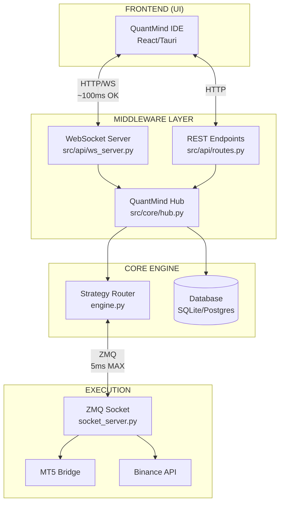
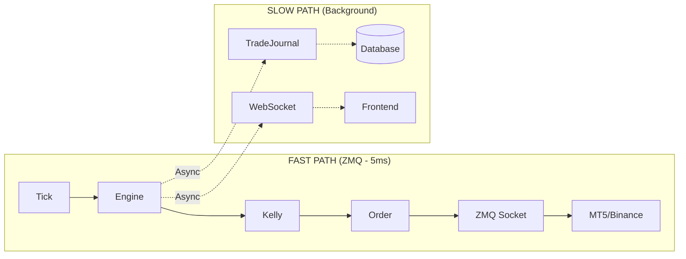
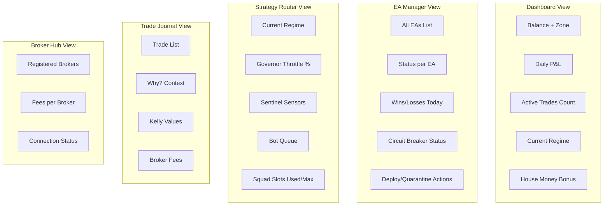
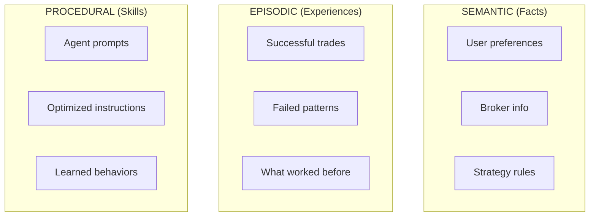
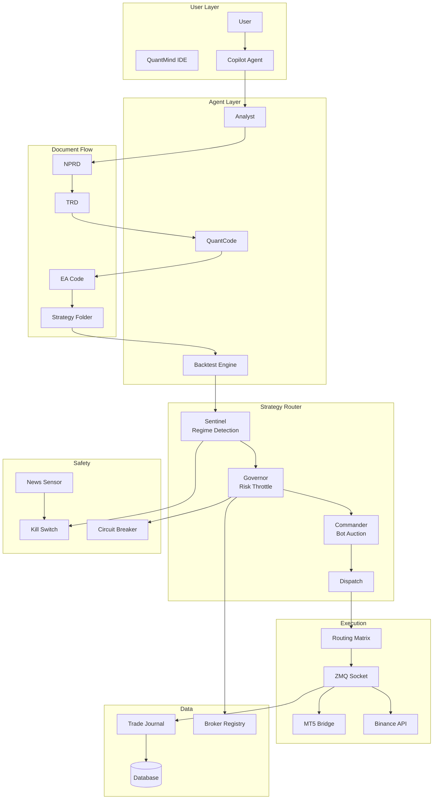
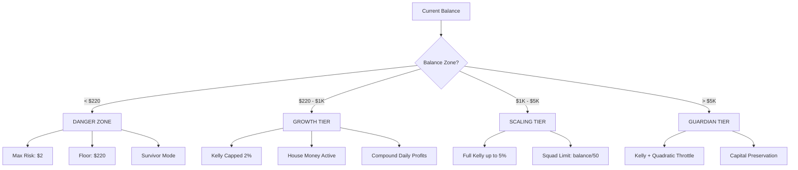
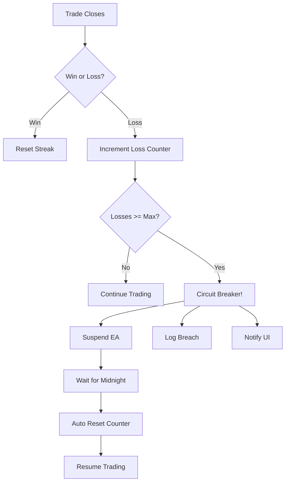
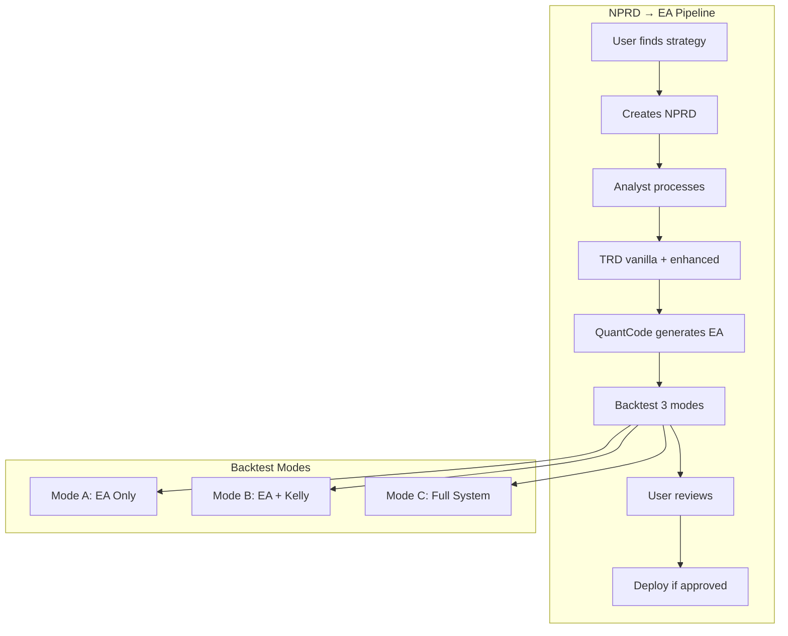

# QuantMindX Comprehensive System Context - EXPANDED VERSION
> **For Coding Agent Reference** - Created February 7, 2026
> Contains ALL flows, decisions, EXAMPLE SCENARIOS, user quotes, and TEST CRITERIA
> **Source:** Discussions from `algorithmic-trading-stack-upgrade.pdf` upload through February 7, 2026

---

## CRITICAL INSTRUCTIONS FOR CODING AGENT

Before implementing ANY feature:
1. **Read the relevant example scenario** - These are real use cases
2. **Note the user quotes** - These are hard requirements (marked with 📢)
3. **Follow the test criteria** - Tests verify the END GOAL of user stories
4. **Reference the PDF context** - The algorithmic-trading-stack-upgrade.pdf is the foundation

---

# ⚠️ INCOMPLETE WORK FROM FEBRUARY 6, 2026 - IMPLEMENT FIRST

> **CRITICAL:** The following items were identified as incomplete during the Feb 6 session and MUST be addressed before adding new features.

## What Was Completed (Phase 1 + 2 + 2.5) ✅

| Item | File | Status |
|------|------|--------|
| executor.py stub | `src/agents/executor.py` | ✅ Created |
| ExecutorState | `src/agents/state.py` | ✅ Added |
| npm peer dependency | `quantmind-ide-desktop/package.json` | ✅ Fixed |
| start_all.sh | `scripts/start_all.sh` | ✅ Created |
| BotManifest | `src/router/bot_manifest.py` | ✅ Implemented (tags, registry, lifecycle) |
| Kill Switch | `src/router/kill_switch.py` | ✅ Implemented (basic + smart) |
| Trade Logger | `src/router/trade_logger.py` | ✅ Enhanced with log_dispatch_context |
| Routing Matrix | `src/router/routing_matrix.py` | ✅ Implemented (Two-Front War) |
| Commander→BotManifest | `src/router/commander.py` | ✅ @primal filter, 50-bot limit |
| SmartKillSwitch→Sentinel | `src/router/kill_switch.py` | ✅ Regime-aware exits |
| engine.py→Phase 2 | `src/router/engine.py` | ✅ Lazy loading of components |

---

## THE CRITICAL GAP ⚠️

📢 **User said (Feb 6):** "We have a lot of features that work. I just need to enhance them a bit, then connect all of them together."

**Problem:** Strategy Router uses a "Simple Governor" NOT the full `PropGovernor` or `RiskGovernor`.

| What Exists | What's Connected to engine.py |
|-------------|-------------------------------|
| `RiskGovernor` with physics sensors | ❌ NOT used |
| `PropGovernor` with tiered risk | ❌ NOT used |
| Kelly formula in `EnhancedKellyCalculator` | ✅ Used by BaseBot |
| Governor's `allocation_scalar` | ⚠️ Added but never applied |

**REQUIRED FIX:**
```python
# engine.py - THIS NEEDS TO BE IMPLEMENTED
from src.risk.governor import RiskGovernor
from src.router.prop.governor import PropGovernor

class StrategyRouter:
    def __init__(self, account_config: dict = None):
        account_type = (account_config or {}).get('type', 'normal')
        
        if account_type == 'prop_firm':
            account_id = account_config.get('account_id')
            self.governor = PropGovernor(account_id)
        else:
            prop_preset = account_config.get('prop_firm_preset')
            self.governor = RiskGovernor(prop_firm_preset=prop_preset)
```

---

## INCOMPLETE ITEMS - MUST IMPLEMENT

### 1. ❌ Kelly/PropGovernor NOT Wired to engine.py
**File:** `src/router/engine.py`
**Status:** Governor selection logic exists but not integrated
**What to do:** 
- Modify engine.py to use PropGovernor or RiskGovernor based on account type
- Ensure Governor's allocation_scalar is applied to position sizing

### 2. ❌ House Money Effect NOT Implemented
**File:** `src/router/prop/governor.py` (or UniversalGovernor)
**Status:** Concept defined, code not written
**What to do:**
```python
# Track daily profit and adjust risk allowance
class HouseMoneyTracker:
    def get_bonus_risk(self, daily_profit: float) -> float:
        """50% of daily profit can be risked more aggressively"""
        if daily_profit > 0:
            return daily_profit * 0.5
        return 0.0
```

### 3. ❌ Backtesting Modes A/B/C NOT Built
**Files:** `src/backtesting/` (needs new structure)
**Status:** Concept defined, not implemented
**What to do:**
- Mode A: EA only (fixed lot, no risk management)
- Mode B: EA + Kelly (dynamic sizing)
- Mode C: EA + Full System (Kelly + Governor + Router)
- All three should run for each EA during backtest

### 4. ❌ Phase 3 Agent System NOT Started
**Files:** `agents/` folder structure
**Status:** Architecture defined, not created
**What to do:**
- [ ] 3.1 Create agent config files (agent.md, rules.md)
- [ ] 3.2 Define skills index per agent
- [ ] 3.3 Set up ChromaDB namespaces for knowledge bases
- [ ] 3.4 Configure MCP servers (context7, pageindex)

### 5. ❌ NEW Database Tables NOT Created
**File:** `src/database/models.py`
**Status:** Schema defined in docs, not in code
**Tables to add:**
- `trade_journal` - Full "Why?" context for each trade
- `strategy_folders` - Link NPRD → TRD → EA
- `broker_registry` - Fee structures per broker
- `bot_circuit_breaker` - Max losses per EA per day
- `house_money_state` - Daily profit tracking

### 6. ❌ Dynamic Pip Value NOT Implemented
**File:** `src/position_sizing/` (Kelly calculator)
**Status:** Hardcoded $10/pip currently
**What to do:**
```python
# Get from MT5, NEVER hardcode
def get_dynamic_pip_value(symbol: str) -> float:
    symbol_info = mt5.symbol_info(symbol)
    return symbol_info.trade_tick_value * 10  # For 5-digit
```

### 7. ❌ Broker Registry NOT Implemented
**File:** `src/broker/registry.py` (new file needed)
**Status:** Schema defined, implementation missing
**What to do:**
- Create BrokerProfile dataclass
- Create BrokerRegistry to store/retrieve profiles
- Wire to Kelly calculator for fee-aware sizing

### 8. ❌ Bot Circuit Breaker NOT Implemented
**File:** `src/router/circuit_breaker.py` (new file needed)
**Status:** Concept defined, not implemented
**What to do:**
- Track losses per bot per day
- Max 3-5 losses then suspend
- Reset at midnight (or configurable time)

---

## IMPLEMENTATION PRIORITY (FROM FEB 6)

📢 **User said:** "UI last. Complete all backend features before rebuilding UI."

| Priority | Item | Reason |
|----------|------|--------|
| 1 | Kelly→engine.py wiring | Core functionality broken |
| 2 | House Money Effect | Changes risk calculations |
| 3 | Database tables | Required for trade journal |
| 4 | Broker Registry | Required for fee-aware sizing |
| 5 | Bot Circuit Breaker | Prevents EA over-trading |
| 6 | Backtesting Modes A/B/C | Needed for EA validation |
| 7 | Agent System (Phase 3) | Automation layer |
| 8 | UI | Last - after all features work |

---

# PART 1: USER CONTEXT AND FOUNDATION

## 1.1 User Context

| Attribute | Value |
|-----------|-------|
| Location | Uganda |
| Starting Capital | $400 |
| Trading Style | Scalping, Day Trading |
| Primary Asset | Forex (MT5) |
| Secondary Asset | Crypto (Binance Spot only) |
| Preferred Brokers | RoboForex Prime, Exness Raw |
| Platform | **Windows** (for MT5 Python API compatibility) |

📢 **User said:** "I'm in Uganda currently, my capital is currently $400."

📢 **User said:** "I have a messy codebase... my issue is I have a lot of features that work. I just need to enhance them a bit, then connect all of them together."

📢 **User said:** "We are basically changing to Windows. It's as simple as that."

---

## 1.2 PDF Context: The Foundation (`algorithmic-trading-stack-upgrade.pdf`)

The PDF uploaded on February 6, 2026 established these core concepts:

### 1.2.1 The Two-Front War
- Managing multiple small accounts simultaneously
- Need for "Passport System" to tag and route bots
- "Black Box" logging for trade context

### 1.2.2 Broker Economics (From PDF)
**The user discussed with Gemini:**
- RoboForex Prime: $4/lot commission, tight spreads
- Exness Raw: Higher commission but more reliable
- Commission matters MORE for small accounts

**Example from PDF:**
```
Trade: 0.04 lots EURUSD
RoboForex: $0.16 commission
Exness Raw: $0.28 commission
Difference: $0.12 per trade = 6% of $2 risk!
```

📢 **User said:** "Different brokers have different fees and whatnot, different account types. So that is going to go so much into context."

### 1.2.3 Survivor Risk (From PDF)
The PDF established Survivor Risk for small accounts:
- **Absolute Floor:** $220 (never trade below this)
- **Max Risk in Danger Zone:** $2 per trade
- **Floor Check:** `if balance < 220: STOP_TRADING`

### 1.2.4 Capital-Based Squad Limit (From PDF)
The PDF established:
```python
# Maximum active positions = balance / $50
# $400 balance = 8 slots maximum
# $200 balance = 4 slots maximum
```

📢 **User said (about PDF):** "We can look at the patterns and analyze."

---

# PART 2: SYSTEM ARCHITECTURE

## 2.1 High-Level Architecture

```
┌─────────────────────────────────────────────────────────────────────┐
│                          USER LAYER                                 │
│  Copilot (Personal Assistant) ←→ UI (QuantMind IDE)                │
│  - Full system access (same as user)                               │
│  - Can delegate to other agents                                    │
│  - Has most skills and MCP access                                  │
└─────────────────────────────────────────────────────────────────────┘
                                    │
                                    ▼
┌─────────────────────────────────────────────────────────────────────┐
│                          AGENT LAYER                                │
│  ┌──────────────┐    ┌──────────────┐    ┌──────────────┐          │
│  │   Analyst    │───▶│  QuantCode   │───▶│   Backtest   │          │
│  │  (NPRD→TRD)  │    │  (TRD→EA)    │    │  (3 modes)   │          │
│  └──────────────┘    └──────────────┘    └──────────────┘          │
│         │                   │                   │                   │
│         └───────────────────┴───────────────────┘                   │
│                             │                                       │
│                    Creates strategy_folder                          │
│                    (NPRD → TRD → EA linked)                        │
└─────────────────────────────────────────────────────────────────────┘
                                    │
                                    ▼
┌─────────────────────────────────────────────────────────────────────┐
│                     STRATEGY ROUTER (Sentient Loop)                 │
│  ┌──────────┐    ┌──────────┐    ┌──────────┐    ┌──────────┐      │
│  │ Sentinel │───▶│ Governor │───▶│Commander │───▶│ Dispatch │      │
│  │ (Regime) │    │ (Throttle)│   │ (Auction)│    │  (Send)  │      │
│  └──────────┘    └──────────┘    └──────────┘    └──────────┘      │
│                                                                     │
│  📢 "Strategy Router is meant to be a matchmaker, not dictate"     │
└─────────────────────────────────────────────────────────────────────┘
                                    │
                                    ▼
┌─────────────────────────────────────────────────────────────────────┐
│                          EXECUTION LAYER                            │
│  ┌──────────────────┐    ┌──────────────────┐    ┌────────────┐    │
│  │ MT5 Bridge       │    │ Binance API      │    │ Kill Switch│    │
│  │ (Forex)          │    │ (Crypto Spot)    │    │ (Emergency)│    │
│  └──────────────────┘    └──────────────────┘    └────────────┘    │
│                                                                     │
│  📢 "Control the bleeding, don't abruptly get out"                 │
└─────────────────────────────────────────────────────────────────────┘
```

---

## 2.2 The Strategy Router - DETAILED

### 2.2.1 Sentinel (`src/router/sentinel.py`)

**Purpose:** Market regime detection using sensors.

**Regimes:**
| Regime | Chaos Score | Description | Bots Allowed |
|--------|-------------|-------------|--------------|
| TREND_UP | < 0.6 | Strong uptrend | Trend-followers |
| TREND_DOWN | < 0.6 | Strong downtrend | Trend-followers |
| RANGE | < 0.5 | Sideways | Mean-reversion |
| HIGH_CHAOS | > 0.8 | Unpredictable | NONE |
| NEWS_EVENT | N/A | Kill zone | NONE |

**EXAMPLE SCENARIO: Regime Detection**
```
Time: 09:00 London Open
Market: EURUSD
Sentinel sensors report:
  - TrendSensor: strength=0.7, direction=UP
  - ChaosSensor: lyapunov=0.4 (stable)
  - VolatilitySensor: ATR=15 pips
  - NewsSensor: SAFE

Sentinel classifies: TREND_UP
Result: Commander will favor trend-following EAs
```

**TEST CRITERIA:**
```python
def test_regime_detection():
    # Given: Market shows strong trend indicators
    # When: Sentinel analyzes
    # Then: Regime is TREND_UP and commander receives correct regime
    
    # END GOAL: Correct EAs receive ticks for the conditions
```

### 2.2.2 Governor (`src/router/governor.py`)

**Purpose:** Risk throttling based on chaos, balance zone, and house money.

**Balance Zones (UNIVERSAL - applies to ALL accounts):**
| Zone | Balance Range | Max Risk/Trade | Special Rules |
|------|---------------|----------------|---------------|
| DANGER | < $220 | $2 absolute | Survivor mode, floor check |
| GROWTH | $220 - $1,000 | Kelly capped 2% | House money effect active |
| SCALING | $1,000 - $5,000 | Kelly up to 5% | Full Kelly |
| GUARDIAN | > $5,000 | Quadratic throttle | Capital preservation |

📢 **User said:** "The risk zones are universal for all my accounts. Regardless of the account, if the balance is X, we use the tier for that balance."

📢 **User said:** "The Governor dynamically adjusts risk based on the balance zone, house money, and other factors, overriding raw Kelly calculations when necessary for account survival."

**EXAMPLE SCENARIO: House Money Effect**
```
Morning:
  - Balance: $420
  - Zone: GROWTH
  - Base risk: $8.40 (2% of $420)

After profitable trade:
  - Balance: $430
  - Daily profit: $10
  - House money bonus: $10 * 50% = $5
  - Available risk: $8.40 + $5 = $13.40

📢 "Profits increase the allowable risk for subsequent trades within the same day"
```

**EXAMPLE SCENARIO: Survivor Mode**
```
Balance: $225
Zone: DANGER (< $220 threshold)
Floor: $220

Available risk = min(balance - floor, $2)
            = min($225 - $220, $2)
            = min($5, $2)
            = $2

📢 "Absolute floor balance is $220, maximum risk per trade is $2 in Danger Zone"
```

**TEST CRITERIA:**
```python
def test_survivor_mode():
    # Given: Balance is $225 (in DANGER zone)
    # When: Governor calculates risk
    # Then: Maximum risk is $2, not Kelly-calculated amount
    
    # END GOAL: Account never drops below $220

def test_house_money_effect():
    # Given: Started day at $400, now at $420 (profit $20)
    # When: Governor calculates next trade risk
    # Then: Risk includes 50% of daily profit as bonus
    
    # END GOAL: Profits are partially reinvested within same day
```

### 2.2.3 Commander (`src/router/commander.py`)

**Purpose:** Bot auction with squad limit.

**Squad Limit Calculation:**
```python
max_active_bots = balance // 50

# Examples:
# $400 balance → 8 bots max
# $200 balance → 4 bots max
# $1000 balance → 20 bots max
```

📢 **User said:** "We have a capital-based squad limit to prevent over-trading on small accounts."

**EXAMPLE SCENARIO: Squad Limit in Action**
```
State:
  - Balance: $400
  - Max slots: 8
  - Currently active: 7 EAs
  - Regime: TREND_UP

New tick arrives. 3 EAs want to trade:
  - ORB_Scalper (slot 8) → APPROVED (1 slot remaining)
  - Momentum_Bot → QUEUED (no slots)
  - Breakout_EA → QUEUED (no slots)

Commander places Momentum_Bot and Breakout_EA in standby queue.
When a trade closes, next queued bot gets the slot.
```

**TEST CRITERIA:**
```python
def test_squad_limit():
    # Given: $400 balance (8 slots max), 8 active positions
    # When: New EA wants to trade
    # Then: EA is placed in standby queue, not executed
    
    # END GOAL: Never exceed balance/50 active positions
```

### 2.2.4 Strategy Router as Matchmaker

📢 **User said:** "The Strategy Router is meant to be a matchmaker, not dictate trades. The EA owns its conditions."

📢 **User said:** "The Strategy Router's primary function is NOT to dictate WHEN an EA trades, but to MATCH EAs to appropriate instruments/pairs based on their registered conditions."

**EA owns preferred_conditions in BotManifest:**
```python
preferred_conditions = {
    "sessions": ["LONDON", "NEW_YORK"],
    "time_windows": [
        {"start": "08:00", "end": "11:00", "timezone": "Europe/London"},
        {"start": "14:00", "end": "17:00", "timezone": "America/New_York"}
    ],
    "min_volatility": 0.5,
    "allowed_regimes": ["TREND_UP", "TREND_DOWN"],
    "instruments": ["GBPUSD", "EURUSD"],
    "compatible_instruments": ["USDJPY", "EURJPY"]  # Can trade if conditions match
}
```

**EXAMPLE SCENARIO: Router as Matchmaker**
```
EA: GBP_Scalper
Preferred conditions: London session, high volatility, GBP pairs

Current market:
  - Time: 09:30 UTC (London session)
  - GBPUSD volatility: Low (0.3)
  - USDJPY volatility: High (0.9)

Router checks:
  1. GBP_Scalper wants high volatility ✓
  2. GBPUSD is quiet ✗
  3. BUT USDJPY has similar volatility patterns
  4. GBP_Scalper's logic (breakout) works on JPY pairs

Decision: Router OFFERS tick for USDJPY to GBP_Scalper
GBP_Scalper makes final entry decision based on its internal logic.

📢 "If USDJPY has high volatility, there is a good point for the Strategy Router to reroute the EA towards USDJPY"
```

**TEST CRITERIA:**
```python
def test_router_matchmaking():
    # Given: EA prefers GBPUSD but requires high volatility
    # When: GBPUSD is quiet but USDJPY is volatile
    # Then: Router offers USDJPY tick to EA
    
    # END GOAL: EA trades under conditions it was designed for

def test_ea_owns_decision():
    # Given: Router offers tick to EA
    # When: EA's internal logic rejects the setup
    # Then: No trade is placed (EA controls final decision)
    
    # END GOAL: Router doesn't force trades, EA decides
```

---

# PART 3: POSITION SIZING - KELLY CRITERION

## 3.1 Kelly with Physics (From PDF)

Location: `src/position_sizing/kelly/`
Physics models: `quant-traderr-lab/` (Lyapunov, Ising, Fisher Transform)

**Kelly Formula:**
```python
f = (p * b - q) / b
# p = win probability
# q = 1 - p
# b = win/loss ratio
```

**BUT Governor caps Kelly based on balance zone:**
```python
def apply_kelly_cap(kelly_raw, balance_zone):
    caps = {
        "DANGER": 0,      # No Kelly, use fixed $2
        "GROWTH": 0.02,   # Max 2%
        "SCALING": 0.05,  # Max 5%
        "GUARDIAN": 0.03  # Reduced for preservation
    }
    return min(kelly_raw, caps[balance_zone])
```

## 3.2 Fee-Aware Position Sizing

📢 **User said:** "When the Kelly is calculating, it has the fees in mind. When we are making the bots, we do have the trading fees in mind."

**EXAMPLE SCENARIO: Fee Impact on $400 Account**
```
Trade setup:
  - Risk budget: $2.00
  - Stop loss: 20 pips
  - Broker: RoboForex Prime
  - Commission: $4/lot

Gross position size:
  - Pip value: $10/lot
  - Lots = $2 / (20 pips × $10) = 0.01 lots

Fee calculation:
  - Commission for 0.01 lots: $0.04
  - Spread cost (0.1 pips): $0.01
  - Total fees: $0.05

Net result:
  - Fee as % of risk: 2.5%
  - Acceptable ✓

With expensive broker (1.5 pip spread):
  - Spread cost: $0.15
  - Total fees: $0.19
  - Fee as % of risk: 9.5%
  - Marginally acceptable, consider cheaper broker
```

## 3.3 Dynamic Pip Value (NOT Hardcoded)

📢 **User said:** "What if there is a miscalculation? What if I'm in a very different market where one pip is not equals to ten dollars? I don't want it to be so fixed."

**CORRECT Implementation:**
```python
import MetaTrader5 as mt5

def get_dynamic_pip_value(symbol: str, lot_size: float = 1.0) -> float:
    """
    Get pip value from MT5 - NEVER hardcode.
    
    For EURUSD: ~$10/pip/lot
    For USDJPY: ~$6.85/pip/lot (varies with rate)
    For GBPNZD: varies based on NZD/USD
    """
    symbol_info = mt5.symbol_info(symbol)
    tick_value = symbol_info.trade_tick_value  # Value per tick in account currency
    tick_size = symbol_info.trade_tick_size    # Minimum price movement
    
    # For 5-digit brokers: 1 pip = 10 ticks
    pips_per_tick = 10 if tick_size < 0.001 else 1
    pip_value = tick_value * pips_per_tick * lot_size
    
    return pip_value
```

**TEST CRITERIA:**
```python
def test_dynamic_pip_value():
    # Given: Trading USDJPY
    # When: Calculating pip value
    # Then: Value is fetched from MT5, not hardcoded $10
    
    # END GOAL: Correct position sizing for ANY instrument
```

---

# PART 4: AGENT SYSTEM

## 4.1 Agent Architecture

📢 **User said:** "Each agent has its own dedicated folder, similar to Claude Code's .claude structure, containing agent.md (system prompt), rules, MCP configs, and skills."

```
/agents/
├── copilot/
│   ├── agent.md          # System prompt
│   ├── rules.md          # Constraints
│   ├── mcp_config.json   # MCP servers (incl. context7)
│   └── skills/
│       ├── index.md      # Skill index (maps to slash commands)
│       ├── register_broker.md
│       ├── import_ea.md
│       ├── analyze_book.md
│       └── ...
├── analyst/
│   ├── agent.md
│   ├── skills/
│   └── mcp_config.json
└── quantcode/
    ├── agent.md
    ├── skills/
    └── mcp_config.json
```

## 4.2 Copilot Agent

📢 **User said:** "Copilot acts as a personal assistant with full system access (same as the user, except for modifying its own system prompt). It can delegate tasks to Analyst and QuantCode agents."

📢 **User said:** "This one has the most skills or agentic skills and the most access to MCP servers."

**Slash Commands = Skills:**
| Command | Skill | Description |
|---------|-------|-------------|
| `/ask` or `/discuss` | SK-01 | General Q&A |
| `/register-broker <name> <type>` | SK-02 | Research and register broker |
| `/import-ea` | SK-03 | Analyze pasted MQL5 code |
| `/analyze-book` | SK-04 | Index trading book with PageIndex |
| `/delegate <agent> <task>` | SK-05 | Send task to Analyst/QuantCode |
| `/status` | SK-06 | System health check |

📢 **User said:** "Each slash command can be represented as a skill."

**EXAMPLE SCENARIO: Broker Registration**
```
User: /register-broker roboforex prime

Copilot actions:
1. Searches web: "RoboForex Prime account specifications 2026"
2. Finds data:
   - Commission: $4/lot
   - Spread: 0.0 pips (raw)
   - Leverage: 1:500
   - MT5: Yes
3. Presents to user: "I found this info for RoboForex Prime. Confirm?"
4. User: "Yes"
5. Copilot inserts into broker_registry table
6. Kelly now uses these fees

📢 "I just need a way so when I register a broker I put in maybe their website or their account type and Copilot can research the broker, fill in the details"
```

**EXAMPLE SCENARIO: Trading Book Analysis**
```
User: "Hey Copilot, analyze this Mark Douglas trading book PDF"

Copilot actions:
1. Indexes book with PageIndex (vectorless, reasoning-based RAG)
2. Creates Table of Contents tree structure
3. No chunking - uses natural document structure

User: "What strategies are in Chapter 5?"

Copilot actions:
1. Queries PageIndex with reasoning
2. Finds relevant sections
3. Explains strategy concepts

User: "Create an NPRD for the Trend Following strategy"

Copilot actions:
1. Generates NPRD document from extracted info
2. Delegates to Analyst Agent: "Process this NPRD"
3. Flow continues: Analyst → TRD → QuantCode → EA

📢 "Copilot can help analyze [books], extract strategies, then pass the information to Analyst agent"
```

📢 **User said (about PageIndex):** "It's the better alternative for our trading book flow... similarity ≠ relevance — what we truly need in retrieval is relevance, and that requires reasoning."

## 4.3 Analyst Agent

📢 **User said:** "Analyst is triggered automatically when a new NPRD file updates the NPRD library."

📢 **User said:** "The analyst can make two versions - vanilla (pure strategy) and the one that has integration with shared assets."

**EXAMPLE SCENARIO: Two TRD Versions**
```
Input: NPRD for "ICT Order Block Strategy" from YouTube

Analyst creates:

VERSION 1: TRD_vanilla.md
- Pure strategy as described in video
- Entry: Order block break
- Exit: Liquidity sweep
- No modifications

VERSION 2: TRD_enhanced.md
- Strategy + shared assets integration
- Uses adaptive_rsi.mq5 from shared_assets for confirmation
- Uses risk_calculator.mq5 for dynamic lot sizing
- Enhanced entry/exit logic from articles

Both versions go to QuantCode → 2 EAs → Backtest both → User compares results

📢 "The vanilla version or the one that has a bit of spice, user can compare"
```

## 4.4 QuantCode Agent

📢 **User said:** "User review occurs ONLY AFTER backtesting reports are generated."

📢 **User said (about backtesting):** "We still use the Kelly enhanced backtest. The Kelly without, the summary explained the backtest flow."

**Three Backtest Modes:**
| Mode | Description | Purpose |
|------|-------------|---------|
| Mode A | EA only (no risk management) | Test pure strategy logic |
| Mode B | EA + Kelly position sizing | Test with dynamic sizing |
| Mode C | EA + Full System (Kelly + Governor + Router) | Test production conditions |

**EXAMPLE SCENARIO: Backtest Comparison**
```
EA: ICT_OrderBlock_v1.mq5
Backtest period: 2023-2024

Results:

Mode A (EA only, fixed 0.1 lot):
  - Win rate: 58%
  - Profit factor: 1.4
  - Max drawdown: 25%

Mode B (EA + Kelly):
  - Win rate: 58% (same)
  - Profit factor: 1.6 (improved due to sizing)
  - Max drawdown: 18% (reduced)

Mode C (EA + Full System):
  - Win rate: 55% (some trades blocked by Governor)
  - Profit factor: 1.8 (best)
  - Max drawdown: 12% (best)

User decision: Promote Mode C version to @primal/deployed
```

## 4.5 All Agents Need SK-00: System Overview

📢 **User said:** "We need them to have a good idea of what each component in the system is and how it works."

📢 **User said:** "The ability for the agents to access how these other tools like the Kelly and the Strategy Router work."

**SK-00 Content (for ALL agents):**
```markdown
# Skill: System Overview

## Components
- **Sentinel**: Market regime detection
- **Governor**: Risk throttling (zones, house money, chaos)
- **Commander**: Bot auction (squad limit, queue)
- **Kelly**: Position sizing with fees
- **Strategy Router**: Matchmaker (EA owns conditions)

## Balance Zones
- DANGER: <$220 (max $2, survivor)
- GROWTH: $220-$1K (house money active)
- SCALING: $1K-$5K (full Kelly)
- GUARDIAN: >$5K (quadratic throttle)

## When to Reference
- Generating risk-aware code
- Answering position sizing questions
- Creating TRDs with Kelly integration
```

## 4.6 Context7 MCP for All Agents

📢 **User said:** "All agents, I need them to have context7 because it's the one that is going to help them have the documentation access to the MCP server towards MetaTrader 5."

```json
// mcp_config.json for ALL agents
{
  "servers": [
    {
      "name": "context7",
      "command": "npx",
      "args": ["-y", "@context7/mcp-server"]
    },
    {
      "name": "pageindex",
      "url": "https://pageindex.ai/mcp"
    }
  ]
}
```

---

# PART 5: DATABASE SCHEMA

## 5.1 Current Tables (in `src/database/models.py`)

| Table | Purpose | Key Fields |
|-------|---------|------------|
| prop_firm_accounts | Account management | risk_mode, daily_loss_limit |
| daily_snapshots | Balance tracking | high_water_mark, is_breached |
| trade_proposals | Bot trade requests | kelly_score, status |
| agent_tasks | Agent queue | agent_type, task_data |
| strategy_performance | Backtest results | kelly_score, sharpe_ratio |
| risk_tier_transitions | Tier change audit | from_tier, to_tier |
| crypto_trades | Crypto trade logs | broker_type, profit |

## 5.2 NEW Tables Needed

### 5.2.1 trade_journal (The "Why?")

📢 **User said:** "Trade logs will include detailed context ('The Why?'): regime, chaos score, governor throttle, balance zone, Kelly recommendation, actual risk, house money adjustment, broker spread, and commission."

```python
class TradeJournal(Base):
    __tablename__ = 'trade_journal'
    
    id = Column(Integer, primary_key=True)
    trade_id = Column(String)  # MT5 ticket or Binance order ID
    bot_id = Column(String)
    symbol = Column(String)
    direction = Column(String)  # BUY/SELL
    
    # THE "WHY?" CONTEXT
    regime = Column(String)          # TREND_UP, RANGE, etc.
    chaos_score = Column(Float)      # From ChaosSensor
    governor_throttle = Column(Float) # Applied throttle %
    balance_zone = Column(String)    # DANGER/GROWTH/SCALING/GUARDIAN
    
    # Kelly details
    kelly_raw = Column(Float)        # Raw Kelly output
    kelly_capped = Column(Float)     # After Governor cap
    house_money_bonus = Column(Float) # Extra risk from daily profit
    actual_risk_usd = Column(Float)  # Final risk used
    
    # Broker fees
    broker_id = Column(String)
    broker_spread = Column(Float)
    broker_commission = Column(Float)
    
    # Execution
    entry_price = Column(Float)
    exit_price = Column(Float)
    profit = Column(Float)
    
    timestamp = Column(DateTime)
```

### 5.2.2 strategy_folders

```python
class StrategyFolder(Base):
    __tablename__ = 'strategy_folders'
    
    id = Column(Integer, primary_key=True)
    name = Column(String)  # "ICT_OrderBlock"
    
    # Linked files
    nprd_path = Column(String)
    trd_vanilla_path = Column(String)
    trd_enhanced_path = Column(String)
    ea_vanilla_path = Column(String)
    ea_enhanced_path = Column(String)
    
    # From TRD
    preferred_conditions = Column(JSON)
    
    # Lifecycle
    status = Column(String)  # draft/backtested/approved/deployed
    
    created_at = Column(DateTime)
```

### 5.2.3 broker_registry

```python
class BrokerProfile(Base):
    __tablename__ = 'broker_registry'
    
    id = Column(Integer, primary_key=True)
    name = Column(String)       # "RoboForex"
    account_type = Column(String) # "Prime"
    broker_type = Column(String)  # "forex" or "crypto"
    
    # Forex fees
    commission_per_lot = Column(Float)  # $4.00
    typical_spread_pips = Column(Float) # 0.1
    
    # Crypto fees
    maker_fee_pct = Column(Float)   # 0.10%
    taker_fee_pct = Column(Float)   # 0.10%
    
    # Capabilities
    supports_mt5 = Column(Boolean)
    supports_hft = Column(Boolean)
    execution_type = Column(String) # MARKET/INSTANT
    
    created_at = Column(DateTime)
```

### 5.2.4 bot_circuit_breaker

📢 **User said:** "If an EA is having a bad day, I don't want it to over-trade. Max 3-5 losses per day."

📢 **User said:** "For scalping, I don't think five losses is ideal. It's ideal, actually seems perfect."

```python
class BotCircuitBreaker(Base):
    __tablename__ = 'bot_circuit_breaker'
    
    id = Column(Integer, primary_key=True)
    bot_id = Column(String)
    strategy_type = Column(String)  # scalper/day_trader/swing
    
    # Configurable limits
    max_daily_losses = Column(Integer)  # 5 for scalper, 3 for day
    current_losses_today = Column(Integer, default=0)
    is_breached = Column(Boolean, default=False)
    
    last_reset = Column(DateTime)  # Midnight reset
```

📢 **User said:** "Some of the fields you may need to be able to change via UI. QuantMind Copilot can handle all that."

**Default Limits by Strategy Type:**
| Strategy | Max Daily Losses |
|----------|------------------|
| Scalper (HFT) | 5 |
| Day Trader | 3 |
| Swing | 2 |

---

# PART 6: TRADING FLOWS - DETAILED WITH EXAMPLE SCENARIOS

## 6.1 NPRD → EA Flow

**EXAMPLE SCENARIO: Complete Flow**
```
=== DAY 1: Strategy Discovery ===

User finds YouTube video: "ICT Order Block Strategy Explained"
User creates NPRD using Claude/Gemini with transcript:

NPRD.md:
  - Source: YouTube (url)
  - Strategy: Order Block trading
  - Entry: Break of order block with displacement
  - Exit: Fill or liquidity sweep
  - Best conditions: London open, high volatility
  - Pairs: GBPUSD, EURUSD
  - Timeframe: 15m

NPRD added to library/nprd_outputs/ICT_OrderBlock/

=== AUTOMATIC: Analyst Agent Triggered ===

Analyst reads NPRD
Analyst queries shared_assets:
  - Found: order_block_detector.mq5 (reusable)
  - Found: displacement_measure.mq5 (reusable)

Analyst creates TWO TRDs:

TRD_vanilla.md:
  - Pure strategy from video
  - No shared assets
  - preferred_conditions: {sessions: [LONDON], ...}

TRD_enhanced.md:
  - Integrates order_block_detector.mq5
  - Adds confirmation from shared displacement logic
  - Enhanced exit with ATR-based targets

Analyst creates strategy_folder entry in database:
  name: "ICT_OrderBlock"
  nprd_path: "library/nprd/.../NPRD.md"
  trd_vanilla_path: "library/trd/.../TRD_vanilla.md"
  trd_enhanced_path: "library/trd/.../TRD_enhanced.md"
  status: "trd_ready"

=== AUTOMATIC: QuantCode Agent Triggered ===

QuantCode reads strategy_folder
QuantCode generates TWO EAs:

EA_ICT_OrderBlock_vanilla.mq5:
  - Pure implementation
  - BotManifest:
    preferred_conditions: {
      sessions: [LONDON],
      time_windows: [{start: "07:00", end: "11:00", tz: "UTC"}],
      instruments: [GBPUSD, EURUSD],
      min_volatility: 0.6
    }

EA_ICT_OrderBlock_enhanced.mq5:
  - Uses shared assets
  - Same BotManifest

QuantCode runs 6 backtests (2 EAs × 3 modes):
  1. Vanilla - Mode A (EA only)
  2. Vanilla - Mode B (EA + Kelly)
  3. Vanilla - Mode C (EA + Full System)
  4. Enhanced - Mode A
  5. Enhanced - Mode B
  6. Enhanced - Mode C

Updates strategy_folder:
  status: "backtested"
  ea_vanilla_path: "library/ea/.../EA_vanilla.mq5"
  ea_enhanced_path: "library/ea/.../EA_enhanced.mq5"

=== USER REVIEW ===

User sees backtest comparison:

|           | Vanilla A | Vanilla B | Vanilla C | Enhanced A | Enhanced B | Enhanced C |
|-----------|-----------|-----------|-----------|------------|------------|------------|
| Win Rate  | 55%       | 55%       | 52%       | 62%        | 62%        | 58%        |
| PF        | 1.3       | 1.5       | 1.6       | 1.6        | 1.9        | 2.1        |
| Max DD    | 28%       | 20%       | 15%       | 22%        | 15%        | 10%        |

User decision: Promote "Enhanced Mode C" to @primal (deployed)
User tags EA: @primal

Bot is now active in Strategy Router registry.
```

**TEST CRITERIA:**
```python
def test_nprd_to_ea_flow():
    # Given: New NPRD added to library
    # When: Flow completes
    # Then: 
    #   - strategy_folder created with all paths
    #   - 2 TRDs generated (vanilla + enhanced)
    #   - 2 EAs generated with BotManifest
    #   - 6 backtest results available
    #   - status = "backtested"
    
    # END GOAL: User can compare results and promote winning EA
```

## 6.2 Live Trading Flow

**EXAMPLE SCENARIO: Complete Live Trade**
```
=== MARKET STATE ===
Time: 09:30 London (high activity)
Account balance: $420 (GROWTH zone)
Daily P&L: +$15 (profitable morning)
Active positions: 5 (of 8 slots available)

=== TICK ARRIVES: GBPUSD ===

Step 1: Sentinel Analysis
  - TrendSensor: strength=0.75, direction=UP → TREND signals
  - ChaosSensor: lyapunov=0.45 → Stable
  - VolatilitySensor: ATR=18 pips → High
  - NewsSensor: SAFE (no news for 2 hours)
  
  Result: regime = TREND_UP, chaos = 0.45

Step 2: Governor Throttle
  - Balance: $420 → GROWTH zone
  - House money: +$15 → bonus = $7.50
  - Base risk: $8.40 (2% of $420)
  - Available risk: $8.40 + $7.50 = $15.90
  - Chaos throttle: 0.45 → 90% of available
  - Throttled risk: $15.90 × 0.9 = $14.31
  
  Result: max_risk = $14.31

Step 3: Commander Auction
  - Current active: 5 positions
  - Max slots: 8 (balance $420 / $50)
  - Available slots: 3
  
  EAs wanting to trade:
    - ICT_OrderBlock (TREND_UP regime ✓, LONDON session ✓)
    - Momentum_Scalper (TREND_UP regime ✓)
    - Range_Trader (needs RANGE regime ✗) → REJECTED
  
  Auction result:
    - ICT_OrderBlock: Wins slot (highest backtest score)
    - Momentum_Scalper: Gets slot (2nd priority)
    - Range_Trader: Not matched to conditions

Step 4: EA Decision
  ICT_OrderBlock receives tick for GBPUSD:
    - Checks internal logic: Order block formed ✓
    - Displacement confirmed ✓
    - Entry signal: BUY
    
  Momentum_Scalper receives tick:
    - Checks momentum: Not enough → PASS (no trade)

Step 5: Kelly + Fees Calculation
  For ICT_OrderBlock BUY:
    - Stop loss: 25 pips
    - Broker: RoboForex Prime
    - Pip value (from MT5): $10/lot for GBPUSD
    
    Position = $14.31 / (25 pips × $10) = 0.057 lots
    Round to broker minimum: 0.05 lots
    
    Fees check:
      - Commission: $4 × 0.05 = $0.20
      - Spread (0.1 pip): $0.05
      - Total fees: $0.25
      - Fee % of risk: 0.25 / 14.31 = 1.7% ✓ acceptable

Step 6: Execution
  MT5 Bridge sends order:
    OrderSend(GBPUSD, BUY, 0.05, ASK, SL=25pips, TP=50pips)
  
  Trade opened: Ticket #12345

Step 7: Trade Journal Entry
  INSERT INTO trade_journal:
    trade_id: "12345"
    bot_id: "ICT_OrderBlock"
    symbol: "GBPUSD"
    direction: "BUY"
    regime: "TREND_UP"
    chaos_score: 0.45
    governor_throttle: 0.9
    balance_zone: "GROWTH"
    kelly_raw: 0.025
    kelly_capped: 0.02
    house_money_bonus: 7.50
    actual_risk_usd: 14.31
    broker_spread: 0.1
    broker_commission: 0.20
    entry_price: 1.25432
    
📢 "Trade logs include the full 'Why?' context"
```

**TEST CRITERIA:**
```python
def test_live_trading_flow():
    # Given: Market in TREND_UP, user in GROWTH zone with house money
    # When: Compatible EA receives tick
    # Then:
    #   - Governor includes house money in risk calculation
    #   - Commander respects squad limit
    #   - Kelly uses dynamic pip value
    #   - Broker fees are subtracted
    #   - Trade journal logs full context
    
    # END GOAL: Trade is risk-managed and fully documented

def test_incompatible_ea_rejected():
    # Given: Market is TREND_UP
    # When: EA configured for RANGE regime tries to trade
    # Then: EA is rejected (conditions don't match)
    
    # END GOAL: Only appropriate EAs trade in each regime
```

## 6.3 EA Import Flow

📢 **User said:** "I want the ability to be able to import [EAs]. Will the agents be able to analyze or understand that this is an EA code block?"

**EXAMPLE SCENARIO: Import Existing EA**
```
User pastes MQL5 code:

```mql5
//+------------------------------------------------------------------+
//| Expert Advisor: Moving Average Cross                              |
//+------------------------------------------------------------------+
input int FastMA = 10;
input int SlowMA = 50;
input double LotSize = 0.1;

void OnTick() {
    double fastMA = iMA(_Symbol, PERIOD_H1, FastMA, 0, MODE_SMA, PRICE_CLOSE, 0);
    double slowMA = iMA(_Symbol, PERIOD_H1, SlowMA, 0, MODE_SMA, PRICE_CLOSE, 0);
    
    if (fastMA > slowMA && !HasPosition()) {
        OrderSend(_Symbol, OP_BUY, LotSize, Ask, 3, 0, 0);
    }
}
```

User: /import-ea

Copilot actions:
1. Detects MQL5 syntax (OnTick, OrderSend patterns)
2. Parses structure:
   - Inputs: FastMA=10, SlowMA=50, LotSize=0.1
   - Entry: Fast MA crosses above Slow MA
   - Exit: Not defined (no SL/TP)
   - Risk: Fixed lot size (not dynamic)

3. Generates analysis:
   "This is a Moving Average Crossover EA.
   
   Issues found:
   - Fixed lot size (should use Kelly)
   - No stop loss defined
   - No take profit
   - Works on H1 only
   
   Recommendations:
   - Add dynamic position sizing
   - Add SL/TP logic
   - Consider multi-timeframe confirmation"

4. User: "Create a TRD from this"

5. Copilot generates TRD:
   - Entry rules: Fast MA (10) crosses above Slow MA (50)
   - Exit rules: TO BE DEFINED
   - Recommended: Add ATR-based SL/TP
   - preferred_conditions: Any session, trending markets

6. User: "Add it to the library"

7. Copilot creates NPRD entry:
   - Source: Imported EA
   - Strategy: MA Crossover
   - Delegates to Analyst for enhancement
```

**TEST CRITERIA:**
```python
def test_ea_import():
    # Given: User pastes MQL5 code
    # When: Copilot analyzes
    # Then:
    #   - Detects MQL5 language
    #   - Extracts inputs, entry, exit logic
    #   - Identifies missing components (SL/TP, sizing)
    #   - Generates analysis document
    
    # END GOAL: EA can be reverse-engineered into TRD for enhancement
```

---

# PART 7: KILL SWITCH AND RISK CONTROL

## 7.1 Kill Switch Exit Strategies

📢 **User said:** "If we are to kill, we don't abruptly get out of the market. We control the bleeding."

📢 **User said:** "We lose but we don't lose that much because at times we can be in positions that are actually losing."

**Exit Strategies:**
| Strategy | When | Action |
|----------|------|--------|
| IMMEDIATE | NEWS_EVENT, near limit | Close all NOW |
| BREAKEVEN | Small loss (-2%) | Move SL to breakeven, wait |
| SMART_LOSS | Moderate loss (-5%) | Minimize damage, scale out |
| TRAILING | In profit | Let profits run with trail |
| SCALE_OUT | Uncertain profit | Close 50%, trail rest |
| TIME_DECAY_EXIT | Losing > 30 min | Thesis broken, exit |
| VOLATILITY_PAUSE | High chaos | Stop NEW entries only |

**EXAMPLE SCENARIO: Control the Bleeding**
```
Situation:
  - 3 open positions
  - News event in 10 minutes (NFP)
  - Position 1: +$8 profit
  - Position 2: -$3 loss
  - Position 3: -$1 loss

SmartKillSwitch determines strategy for each:

Position 1 (+$8):
  - Strategy: TRAILING
  - Action: Place trailing stop at +$5
  - Rationale: Lock in most profit, let it run if possible

Position 2 (-$3, within -5% tolerance):
  - Strategy: SMART_LOSS
  - Action: Tighten stop to -$4, give small chance to recover
  - Rationale: Minimize loss without panic exit

Position 3 (-$1, very small loss):
  - Strategy: BREAKEVEN
  - Action: Move SL to breakeven, wait
  - Rationale: May recover before news

Result at news time:
  - Position 1: Trailed out at +$6
  - Position 2: Hit tight stop at -$4
  - Position 3: Recovered to +$2 before stop

Net: +$6 - $4 + $2 = +$4 (controlled exit vs potential -$10 chaotic exit)
```

**TEST CRITERIA:**
```python
def test_control_the_bleeding():
    # Given: Multiple positions, news approaching
    # When: SmartKillSwitch activates
    # Then:
    #   - Profitable positions get trailing stops
    #   - Small losses get breakeven attempt
    #   - Moderate losses get tight stops
    #   - No chaotic market-order-everything approach
    
    # END GOAL: Maximize recovery, minimize damage
```

## 7.2 Volatility Pause

📢 **User said:** "How do you pause a trade?"

**Answer:** You don't pause open trades. You pause the SYSTEM from opening new trades.

**EXAMPLE SCENARIO: Volatility Pause**
```
State:
  - 4 positions open
  - Sudden volatility spike (chaos = 0.95)
  - Each position has its own SL/TP

Volatility Pause activates:
  - System stops sending new ticks to EAs
  - No NEW trades can open
  - Existing 4 positions continue with their SL/TP

During pause:
  - Position 1 hits SL → Normal close (loss recorded)
  - Position 2 hits TP → Normal close (profit recorded)
  - Position 3 continues (still open)
  - Position 4 continues (still open)

Volatility calms (chaos drops to 0.5):
  - Pause lifts
  - EA can now receive new ticks
  - Trading resumes with remaining positions

📢 "The pause just stops new entries. Existing positions play out normally."
```

---

# PART 8: NEWS SYSTEM

## 7.1 Configurable Kill Zones

📢 **User said:** "News timing should be configurable (not hardcoded 15 min)."

```python
class NewsSensor:
    def __init__(self):
        # CONFIGURABLE via UI or Copilot
        self.kill_zone_minutes_pre = 15  # Default 15 min before
        self.kill_zone_minutes_post = 15 # Default 15 min after
        
    def check_state(self, event: NewsEvent) -> str:
        if event.impact != "HIGH":
            return "SAFE"
            
        time_diff = (event.time - now).total_seconds() / 60
        
        if -self.kill_zone_minutes_post <= time_diff <= self.kill_zone_minutes_pre:
            return "KILL_ZONE"
            
        return "SAFE"
```

**EXAMPLE SCENARIO: News Handling**
```
Timeline:
  08:00 - Trading normally
  08:22 - NewsSensor detects NFP at 08:30 (HIGH impact)
  08:15 - Kill zone starts (15 min before)
  
  Actions:
    - Sentinel classifies: NEWS_EVENT
    - Commander: No new trades authorized
    - SmartKillSwitch: Determines exit strategy for open positions
    
  08:30 - NFP released
  08:45 - Kill zone ends (15 min after)
  
  Actions:
    - Sentinel reclassifies based on new candles
    - Trading resumes
```

---

# PART 9: CRYPTO TRADING

## 9.1 Spot Only

📢 **User said:** "I'm only using spot. I'm not using futures."

📢 **User said:** "Crypto, we focus on Binance spot."

**Key Differences from Forex:**
| Aspect | Forex | Crypto |
|--------|-------|--------|
| Position Unit | Lots | Quantity |
| Stop Loss | Pips | Price distance ($) |
| Fees | Spread + Commission | Maker/Taker % |
| Sessions | London/NY/Asian | 24/7 |
| Execution | MT5 API | Binance REST/WebSocket |

**EXAMPLE SCENARIO: Crypto Position Sizing**
```
Setup:
  - Pair: BTCUSD
  - Price: $45,000
  - Risk budget: $2
  - Stop distance: $500
  - Binance fee: 0.10% maker

Position calculation:
  quantity = risk / stop_distance
          = $2 / $500
          = 0.004 BTC

Fee calculation:
  entry_fee = 0.004 × $45,000 × 0.10% = $0.18
  exit_fee = 0.004 × $45,000 × 0.10% = $0.18
  total_fees = $0.36
  fee_as_pct_of_risk = $0.36 / $2 = 18% (high!)

Decision: Trade size too small for crypto fees. Skip or increase risk budget.
```

## 9.2 Exchange Delay Mitigation

📢 **User said:** "We need to look at how we can mitigate the exchange delays."

**Solutions:**
1. **WebSocket for data** (don't poll REST)
2. **Pre-calculate position sizes** (ready when signal arrives)
3. **Timeout + retry logic** (max 3 retries, 5s timeout)
4. **Multi-exchange fallback** (Binance → Bybit → KuCoin)

---

# PART 10: IMPLEMENTATION DECISIONS - COMPLETE LIST

📢 = User quote (requirement)

| Decision | Details | User Quote |
|----------|---------|------------|
| **Windows** | Switch to Windows for MT5 | "We are basically changing to Windows" |
| **PageIndex** | Replace RAG with reasoning-based | "It's the better alternative for our trading book flow" |
| **Dynamic Pip Value** | Get from MT5, never hardcode | "I don't want it to be so fixed" |
| **Two TRD Versions** | Vanilla + Enhanced | "The analyst can make two versions" |
| **Three Backtest Modes** | A (EA only), B (Kelly), C (Full) | "We still use the Kelly enhanced backtest" |
| **Squad Limit** | balance / $50 | "Capital-based squad limit to prevent over-trading" |
| **Circuit Breaker** | 3-5 max losses/day | "If an EA is having a bad day, I don't want it to over-trade" |
| **House Money Effect** | Daily profit increases risk | "Profits increase allowable risk for subsequent trades" |
| **Control Bleeding** | Smart exit strategies | "We don't abruptly get out...we control the bleeding" |
| **EA Owns Conditions** | Router is matchmaker | "Strategy Router is meant to be a matchmaker, not dictate" |
| **Crypto Spot Only** | No futures | "I'm only using spot" |
| **Fee-Aware Sizing** | Kelly accounts for fees | "Kelly has the fees in mind" |
| **Context7 MCP** | All agents need MT5 docs | "All agents need context7" |
| **Skills = Commands** | Each skill = slash command | "Each slash command can be represented as a skill" |
| **Bot Ranking** | Daily re-rank by performance | "Re-ranking system ranking best to worst" |
| **Configurable News** | Not hardcoded 15 min | "News should be configurable" |

---

# PART 11: TEST CRITERIA SUMMARY

Tests should verify the **END GOAL of user stories**, not just language syntax.

## 11.1 Risk Management Tests
```python
def test_survivor_mode_protects_floor():
    """END GOAL: Account never drops below $220"""
    
def test_house_money_increases_risk():
    """END GOAL: Daily profits allow larger afternoon trades"""
    
def test_squad_limit_prevents_overtrading():
    """END GOAL: Max positions = balance / $50"""
```

## 11.2 Agent Flow Tests
```python
def test_nprd_creates_two_trds():
    """END GOAL: User can compare vanilla vs enhanced strategy"""
    
def test_ea_has_bot_manifest():
    """END GOAL: Router knows EA's preferred conditions"""
    
def test_backtest_runs_three_modes():
    """END GOAL: User sees EA-only, Kelly, and Full System results"""
```

## 11.3 Trading Flow Tests
```python
def test_router_matches_ea_to_conditions():
    """END GOAL: Only appropriate EAs trade in each regime"""
    
def test_kelly_uses_dynamic_pip_value():
    """END GOAL: Position size is correct for ANY instrument"""
    
def test_trade_journal_logs_context():
    """END GOAL: Full 'Why?' data available for review"""
```

## 11.4 Kill Switch Tests
```python
def test_smart_exit_controls_bleeding():
    """END GOAL: Minimize damage, not panic close everything"""
    
def test_volatility_pause_blocks_new_only():
    """END GOAL: Open positions still work, new ones blocked"""
```

---

# PART 12: FILES REFERENCE

## Core Source Files
| File | Purpose |
|------|---------|
| `src/router/engine.py` | StrategyRouter main |
| `src/router/sentinel.py` | Regime detection |
| `src/router/governor.py` | Risk throttling |
| `src/router/commander.py` | Bot auction |
| `src/router/kill_switch.py` | Emergency stop |
| `src/router/bot_manifest.py` | EA registration |
| `src/router/sensors/news.py` | News kill zones |
| `src/position_sizing/kelly/` | Kelly calculator |
| `src/database/models.py` | Database schema |
| `src/agents/` | Agent implementations |

## Key Documentation
| File | Purpose |
|------|---------|
| `docs/PROP_FIRMS_AND_ROUTER.md` | Prop firm logic |
| `docs/ECONOPHYSICS_INTEGRATION.md` | Physics models |
| `quant-traderr-lab/` | Lyapunov, Ising implementations |

## Archived (in `_archive/`)
- `qwen_coder_repo/` - Cloned repo
- `wiki/` - Old scraped articles
- `TASK_GROUP_*.md` - Old session summaries
- `backend_implementation_plan_v7/v8/v9.md` - Old plans

---

# PART 13: MIDDLEWARE LAYER (Backend ↔ Frontend Connection)

> **CRITICAL FOR UI CONNECTION:** This section defines what the coding agent must build so the frontend can connect with minimal debugging.

## 13.1 Architecture Overview



## 13.2 Speed Architecture - Two Paths

📢 **User said:** "The system is meant to work within five milliseconds."



| Path | Protocol | Target Latency | Purpose |
|------|----------|----------------|---------|
| **Trading Path** | ZMQ | ≤5ms | Tick → Order execution |
| **UI Path** | WebSocket/REST | ≤200ms | Dashboard updates |
| **Logging Path** | Async writes | Background | Trade journal |

**Key Insight:** Trading path stays ZMQ (already fast). UI uses separate WebSocket. Database writes are async/background.

## 13.3 Central Hub (NEW FILE NEEDED)

📢 **User said:** "Can we centralize a lot of this?"

**File:** `src/core/hub.py`

```python
# src/core/hub.py
from typing import Callable, Dict, List, Any
from dataclasses import dataclass
import asyncio

@dataclass
class SystemState:
    """Current system state - single source of truth"""
    accounts: Dict[str, Any]
    active_bots: List[str]
    current_regime: str
    governor_throttle: float
    balance_zone: str  # DANGER/GROWTH/SCALING/GUARDIAN
    house_money_bonus: float
    daily_pnl: float

class QuantMindHub:
    """Central nervous system - everything connects through here"""
    
    def __init__(self, db_session, event_bus):
        self.db = db_session
        self.events = event_bus
        self._state = SystemState(...)
    
    # === STATE QUERIES (for UI and agents) ===
    def get_system_state(self) -> dict:
        """Full system snapshot for dashboard"""
        ...
    
    def get_account_state(self, account_id: str) -> dict:
        """Single account details"""
        ...
    
    def get_active_bots(self) -> List[dict]:
        """All active EAs with status"""
        ...
    
    def get_current_regime(self) -> str:
        """Current market regime from Sentinel"""
        ...
    
    def get_trade_journal(self, limit: int = 50) -> List[dict]:
        """Recent trades with 'Why?' context"""
        ...
    
    # === COMMANDS (from UI and agents) ===
    def deploy_bot(self, bot_id: str) -> bool:
        """Promote EA to @primal/deployed"""
        ...
    
    def quarantine_bot(self, bot_id: str, reason: str) -> bool:
        """Move EA to @quarantine"""
        ...
    
    def register_broker(self, profile: dict) -> bool:
        """Add broker to registry"""
        ...
    
    def trigger_kill_switch(self, mode: str = "SMART") -> bool:
        """Emergency action"""
        ...
    
    # === EVENTS (pushed to listeners) ===
    def subscribe(self, event_type: str, callback: Callable):
        """Subscribe to system events"""
        self.events.subscribe(event_type, callback)
    
    def emit(self, event_type: str, data: dict):
        """Emit event to all listeners"""
        self.events.emit(event_type, data)
```

## 13.4 WebSocket Server for UI (NEW FILE NEEDED)

**File:** `src/api/ws_server.py`

```python
# src/api/ws_server.py
from fastapi import FastAPI, WebSocket, WebSocketDisconnect
from typing import List
import json

app = FastAPI()

class UIConnectionManager:
    """Manages WebSocket connections to UI clients"""
    
    def __init__(self):
        self.active_connections: List[WebSocket] = []
    
    async def connect(self, websocket: WebSocket):
        await websocket.accept()
        self.active_connections.append(websocket)
    
    async def disconnect(self, websocket: WebSocket):
        self.active_connections.remove(websocket)
    
    async def broadcast(self, event: dict):
        """Push event to all connected UI clients"""
        for connection in self.active_connections:
            await connection.send_json(event)

manager = UIConnectionManager()

@app.websocket("/ws/ui")
async def websocket_endpoint(websocket: WebSocket):
    await manager.connect(websocket)
    try:
        while True:
            # Receive commands from UI
            data = await websocket.receive_text()
            command = json.loads(data)
            # Process command through Hub
            result = hub.process_command(command)
            await websocket.send_json(result)
    except WebSocketDisconnect:
        await manager.disconnect(websocket)

# Events pushed TO UI (called from Engine/Hub)
async def push_trade_update(trade: dict):
    await manager.broadcast({"type": "TRADE_UPDATE", "data": trade})

async def push_regime_change(regime: str):
    await manager.broadcast({"type": "REGIME_CHANGE", "data": regime})

async def push_kill_switch(status: dict):
    await manager.broadcast({"type": "KILL_SWITCH", "data": status})
```

## 13.5 REST Endpoints (Optional - for Static Queries)

**File:** `src/api/routes.py`

```python
# src/api/routes.py
from fastapi import APIRouter
from typing import List

router = APIRouter(prefix="/api")

# === STATE QUERIES ===

@router.get("/state")
def get_system_state():
    """Full system snapshot for initial dashboard load"""
    return hub.get_system_state()

@router.get("/accounts")
def get_accounts():
    """List all accounts with balances and zones"""
    return hub.get_accounts()

@router.get("/accounts/{account_id}")
def get_account(account_id: str):
    """Single account details"""
    return hub.get_account_state(account_id)

@router.get("/bots")
def get_bots():
    """List all registered EAs with status"""
    return hub.get_active_bots()

@router.get("/regime")
def get_regime():
    """Current market regime"""
    return {"regime": hub.get_current_regime()}

@router.get("/journal")
def get_journal(limit: int = 50):
    """Trade journal entries"""
    return hub.get_trade_journal(limit)

# === COMMANDS ===

@router.post("/bots/{bot_id}/deploy")
def deploy_bot(bot_id: str):
    """Promote EA to deployed status"""
    return {"success": hub.deploy_bot(bot_id)}

@router.post("/bots/{bot_id}/quarantine")
def quarantine_bot(bot_id: str, reason: str):
    """Quarantine misbehaving EA"""
    return {"success": hub.quarantine_bot(bot_id, reason)}

@router.post("/brokers")
def register_broker(profile: dict):
    """Add broker to registry"""
    return {"success": hub.register_broker(profile)}

@router.post("/kill-switch")
def trigger_kill_switch(mode: str = "SMART"):
    """Emergency action"""
    return {"success": hub.trigger_kill_switch(mode)}
```

## 13.6 UI Data Contracts

What data does each UI view need?



| View | Endpoint | WebSocket Events |
|------|----------|------------------|
| Dashboard | `GET /api/state` | `TRADE_UPDATE`, `REGIME_CHANGE` |
| EA Manager | `GET /api/bots` | `BOT_STATUS_CHANGE`, `CIRCUIT_BREAKER` |
| Strategy Router | `GET /api/regime` | `REGIME_CHANGE`, `GOVERNOR_THROTTLE` |
| Trade Journal | `GET /api/journal` | `TRADE_UPDATE` |
| Broker Hub | `GET /api/brokers` | `BROKER_STATUS` |

---

# PART 14: LANGCHAIN/LANGGRAPH/LANGMEM DOCUMENTATION REFERENCES

> **CRITICAL:** Use Context7 MCP to access these documentation links when implementing agent features. 90% of LangGraph/LangChain/LangMem issues come from not reading the actual documentation.

## 14.1 Using Context7 MCP

📢 **User said:** "I need you to tell the coding agent to use context7 to get the LangChain, LangGraph, LangMem documentation."

**Before implementing ANY agent feature:**

```python
# In your coding session, use context7 to get docs:
# context7:resolve-library-id("langchain")
# context7:resolve-library-id("langgraph") 
# context7:resolve-library-id("langmem")
# Then get-library-docs for each
```

## 14.2 LangChain Documentation Links

**Reference file:** `refernces-Langchain/langchain_reference.md`

| Topic | URL | What to Look For |
|-------|-----|------------------|
| Tools | https://docs.langchain.com/oss/python/langchain/tools | @tool decorator, schemas |
| Agents | https://docs.langchain.com/oss/python/langchain/agents | create_agent, ReAct |
| Multi-Agent | https://docs.langchain.com/oss/python/langchain/multi-agent/index | Subagents, handoffs |
| Skills Pattern | https://docs.langchain.com/oss/python/langchain/multi-agent/skills | load_skill tool |
| RAG | https://docs.langchain.com/oss/python/langchain/rag | Indexing, retrieval |
| Studio | https://docs.langchain.com/oss/python/langchain/studio | langgraph dev |

## 14.3 LangGraph Documentation Links

**Reference file:** `refernces-Langchain/langgraph_reference.md`

| Topic | URL | What to Look For |
|-------|-----|------------------|
| Overview | https://docs.langchain.com/oss/python/langgraph/overview | Core benefits |
| Graph API | https://docs.langchain.com/oss/python/langgraph/graph-api | StateGraph, nodes, edges |
| Application Structure | https://docs.langchain.com/oss/python/langgraph/application-structure | langgraph.json |
| Workflows & Agents | https://docs.langchain.com/oss/python/langgraph/workflows-agents | Patterns |
| Memory | https://docs.langchain.com/oss/python/langgraph/add-memory | Short/long-term |
| Streaming | https://docs.langchain.com/oss/python/langgraph/streaming | Real-time |

### LangGraph State Pattern
```python
from typing import Annotated
from typing_extensions import TypedDict
from langgraph.graph.message import add_messages

class AgentState(TypedDict):
    messages: Annotated[list, add_messages]  # Auto-accumulates
    
# Graph construction
from langgraph.graph import StateGraph, START, END

builder = StateGraph(AgentState)
builder.add_node("node_name", node_function)
builder.add_edge(START, "node_name")
builder.add_edge("node_name", END)
graph = builder.compile()
```

### LangGraph Project Structure
```
my-app/
├── my_agent/
│   ├── utils/
│   │   ├── tools.py      # Tool definitions
│   │   ├── nodes.py      # Node functions
│   │   └── state.py      # State definition
│   └── agent.py          # Graph construction
├── .env
├── pyproject.toml
└── langgraph.json
```

## 14.4 LangMem Documentation Links

**Reference file:** `refernces-Langchain/langmem_reference.md`

| Topic | URL | What to Look For |
|-------|-----|------------------|
| Overview | https://langchain-ai.github.io/langmem/ | Core API |
| Memory Types | Semantic, Episodic, Procedural | When to use each |
| Memory Tools | create_manage_memory_tool | Agent-driven memory |
| ReflectionExecutor | Delayed processing | Background updates |

### Memory Types for QuantMindX



### Memory Namespace Pattern
```python
# Personal memories per user
namespace=("memories", "user-123")

# Shared knowledge base
namespace=("knowledge", "trading-strategies")

# Agent-specific
namespace=("agents", "copilot", "memories")
```

## 14.5 MCP Server Configuration

```json
{
  "servers": [
    {
      "name": "context7",
      "command": "npx",
      "args": ["-y", "@context7/mcp-server"]
    },
    {
      "name": "pageindex",
      "url": "https://mcp.pageindex.dev"
    }
  ]
}
```

## 14.6 Common LangGraph Pitfalls

| Issue | Solution |
|-------|----------|
| State mutations | Always return new dicts, don't mutate |
| Message format | Use proper role/content structure |
| Graph not compiled | Call `.compile()` after building |
| Async vs sync | Use `ainvoke` for async, `invoke` for sync |
| Memory not persisting | Use PostgresStore, not InMemoryStore |

---

# PART 15: COMPLETE SYSTEM MERMAID DIAGRAMS

## 15.1 Full System Flow



## 15.2 Balance Zone Flow



## 15.3 House Money Effect Flow


## 15.4 Circuit Breaker Flow



## 15.5 Agent Workflow Flow



---

# PART 16: IMPLEMENTATION DECISIONS - COMPLETE LIST

> All decisions with user quotes (📢) in one place for reference.

| # | Decision | 📢 User Quote | Status |
|---|----------|---------------|--------|
| 1 | Windows for MT5 | "We are basically changing to Windows" | ✅ Confirmed |
| 2 | PageIndex for RAG | "Similarity ≠ relevance, we need reasoning" | ✅ Confirmed |
| 3 | Dynamic values | "What if one pip is not equals to ten dollars?" | ❌ TODO |
| 4 | TRD versions | "Vanilla or the one that has a bit of spice" | ❌ TODO |
| 5 | Backtest modes | "Kelly, Kelly without, the summary explained" | ❌ TODO |
| 6 | Fee-aware sizing | "When Kelly is calculating, it has the fees in mind" | ❌ TODO |
| 7 | Universal risk zones | "Risk zones are universal for all my accounts" | ❌ TODO |
| 8 | House money | "Profits increase the allowable risk" | ❌ TODO |
| 9 | Router as matchmaker | "Strategy Router is meant to be a matchmaker" | ✅ Confirmed |
| 10 | EA owns conditions | "EA owns its conditions" | ✅ Confirmed |
| 11 | Control bleeding | "Control the bleeding, don't abruptly get out" | ✅ Confirmed |
| 12 | News kill zones | "Configurable news avoidance windows" | ✅ Confirmed |
| 13 | Circuit breaker | "Max 3-5 losses per day per EA" | ❌ TODO |
| 14 | Crypto spot only | "Spot only, no futures" | ✅ Confirmed |
| 15 | Context7 for all | "All agents need context7 for MT5 docs" | ✅ Confirmed |
| 16 | Skills = commands | "Each slash command can be represented as a skill" | ✅ Confirmed |
| 17 | UI last | "Complete all backend features before UI" | ✅ Confirmed |
| 18 | Centralize | "Can we centralize a lot of this?" | ❌ TODO (Hub) |
| 19 | Speed 5ms | "System is meant to work within five milliseconds" | ✅ ZMQ in place |

---

# PART 17: EA/BOT DESIGN ARCHITECTURE

> **CRITICAL:** This section defines how EAs are designed, registered, and interact with the Strategy Router.

## 17.1 Two-Layer Design

Every EA in QuantMindX follows a two-layer design:

```
┌─────────────────────────────────────────────────────────────────────────────┐
│                      EA/BOT DESIGN: TWO LAYERS                              │
├─────────────────────────────────────────────────────────────────────────────┤
│                                                                             │
│   LAYER 1: BotManifest (Registration)                                       │
│   ══════════════════════════════════                                        │
│   ┌───────────────────────────────────────────────────────────────────┐    │
│   │  bot_id: "ICT_OrderBlock_v1"                                       │    │
│   │  strategy_type: "STRUCTURAL"  (SCALPER | STRUCTURAL | SWING)       │    │
│   │  preferred_conditions:                                              │    │
│   │    ├── sessions: ["LONDON", "NEW_YORK"]                            │    │
│   │    ├── instruments: ["EURUSD", "GBPUSD"]                           │    │
│   │    └── compatible_instruments: ["USDJPY"]  # Fallback options      │    │
│   │  prop_firm_safe: true/false                                         │    │
│   │  frequency: "HFT" | "LOW"                                           │    │
│   └───────────────────────────────────────────────────────────────────┘    │
│                                    │                                        │
│                                    ▼                                        │
│              Strategy Router READS this to OFFER ticks                      │
│                                                                             │
├─────────────────────────────────────────────────────────────────────────────┤
│                                                                             │
│   LAYER 2: BaseBot (Execution Logic)                                        │
│   ══════════════════════════════════                                        │
│                                                                             │
│   ┌─────────────────────────┐     ┌─────────────────────────┐              │
│   │      VANILLA EA         │     │      SPICED EA          │              │
│   │  (Pure NPRD Strategy)   │     │  (+ Shared Assets)      │              │
│   ├─────────────────────────┤     ├─────────────────────────┤              │
│   │  get_signal(data)       │     │  get_signal(data)       │              │
│   │  calculate_entry_size() │     │  calculate_entry_size() │              │
│   │                         │     │  + adaptive_rsi.mq5     │              │
│   │                         │     │  + risk_calculator.mq5  │              │
│   └─────────────────────────┘     └─────────────────────────┘              │
│            │                                │                               │
│            │                                │                               │
│            ▼                                ▼                               │
│   ┌─────────────────────────────────────────────────────────────────┐      │
│   │                    TAGGING SYSTEM                                │      │
│   │   Both Vanilla and Spiced EAs (any .mq5 file) can be tagged:    │      │
│   │                                                                  │      │
│   │   @pending ──► @approved ──► @primal/deployed                   │      │
│   │                                    │                             │      │
│   │                              @suspended (circuit breaker)        │      │
│   │                              @quarantine (anomaly detected)      │      │
│   │                              @archived (decommissioned)          │      │
│   └─────────────────────────────────────────────────────────────────┘      │
│                                                                             │
└─────────────────────────────────────────────────────────────────────────────┘
```

## 17.2 Key Principles

📢 **User said:** "The Strategy Router is meant to be a matchmaker, not dictate trades. The EA owns its conditions."

| Layer | Who Controls | What It Does |
|-------|--------------|--------------|
| **BotManifest** | Strategy Router reads | Conditions for OFFERING ticks |
| **BaseBot logic** | EA controls 100% | Final decision to trade or not |

**Important:** Strategy Router CANNOT see or modify the EA's internal `get_signal()` logic.

## 17.3 BotManifest Fields (Refined)

```python
@dataclass
class BotManifest:
    bot_id: str                          # Unique identifier
    strategy_type: str                   # SCALPER | STRUCTURAL | SWING
    frequency: str                       # HFT (>20/day) | LOW (<5/day)
    preferred_broker_type: str           # RAW_ECN | STANDARD
    prop_firm_safe: bool                 # Safe for prop firm rules?
    
    # Preferred Conditions (Router uses for matching)
    preferred_conditions: dict = {
        "sessions": ["LONDON", "NEW_YORK"],
        "instruments": ["EURUSD", "GBPUSD"],
        "compatible_instruments": ["USDJPY"],  # Fallback
        "time_windows": [
            {"start": "08:00", "end": "11:00", "timezone": "Europe/London"}
        ],
        "allowed_regimes": ["TREND_UP", "TREND_DOWN", "BREAKOUT"]
    }
    
    # Lifecycle
    tags: List[str] = ["@pending"]       # Current state tags
    version: str = "vanilla"             # "vanilla" or "spiced"
```

**Note:** `max_daily_losses` is GLOBAL (configured in system settings), NOT per-EA.

## 17.4 Vanilla vs Spiced EAs

| Version | Description | Source |
|---------|-------------|--------|
| **Vanilla** | Pure strategy as described in NPRD | QuantCode generates from TRD |
| **Spiced** | Strategy + shared assets integration | QuantCode + shared library components |

Both versions:
- Are valid .mq5 files
- Can receive tagging (@pending, @primal, etc.)
- Register with BotManifest
- Go through the same backtest process

📢 **User said:** "The vanilla version or the one that has a bit of spice, user can compare."

## 17.5 Tagging Lifecycle

```
┌─────────────────────────────────────────────────────────────────────────────┐
│                         EA TAGGING LIFECYCLE                                 │
├─────────────────────────────────────────────────────────────────────────────┤
│                                                                             │
│   QuantCode generates EA                                                    │
│            │                                                                │
│            ▼                                                                │
│   ┌─────────────┐                                                          │
│   │  @pending   │  ───────────────────────────────────────┐                │
│   └─────────────┘                                         │                │
│            │                                              │                │
│            │ Backtest passes (Mode A, B, C)               │                │
│            ▼                                              │                │
│   ┌─────────────┐                                         │                │
│   │  @approved  │  ◄────────────────────────────┐         │                │
│   └─────────────┘                               │         │                │
│            │                                    │         │                │
│            │ User deploys                       │         │                │
│            ▼                                    │         │                │
│   ┌──────────────────┐                          │         │                │
│   │ @primal/deployed │  ────────┬───────────────┘         │                │
│   └──────────────────┘          │                         │                │
│            │                    │                         │                │
│    ┌───────┴───────┐            │                         │                │
│    │               │            │                         │                │
│    ▼               ▼            ▼                         │                │
│ ┌────────────┐ ┌─────────────┐ ┌───────────┐              │                │
│ │ @suspended │ │ @quarantine │ │ @archived │              │                │
│ │ (losses)   │ │ (anomaly)   │ │ (retired) │              │                │
│ └────────────┘ └─────────────┘ └───────────┘              │                │
│      │               │                                    │                │
│      │ Midnight      │ User reviews                       │                │
│      │ reset         │ and fixes                          │                │
│      └───────────────┴────────────────────────────────────┘                │
│                                                                             │
└─────────────────────────────────────────────────────────────────────────────┘
```

## 17.6 How Strategy Router and EA Interact

```
┌─────────────────────────────────────────────────────────────────────────────┐
│                    TICK FLOW: ROUTER → EA → EXECUTION                       │
├─────────────────────────────────────────────────────────────────────────────┤
│                                                                             │
│  STEP 1: Tick Arrives                                                       │
│  ═══════════════════                                                        │
│  Market sends new price data for GBPUSD                                     │
│                                                                             │
│  STEP 2: Sentinel Classifies Regime                                         │
│  ═══════════════════════════════════                                        │
│  ┌────────────────────────────┐                                            │
│  │ Regime: TREND_UP           │                                            │
│  │ Chaos: 0.4 (stable)        │                                            │
│  │ News: SAFE                 │                                            │
│  └────────────────────────────┘                                            │
│                                                                             │
│  STEP 3: Commander Checks BotManifests                                      │
│  ══════════════════════════════════════                                     │
│  For each registered EA:                                                    │
│    - Does session match?                                                    │
│    - Does instrument match?                                                 │
│    - Is regime allowed?                                                     │
│                                                                             │
│  ┌─────────────────────────┐     ┌─────────────────────────┐               │
│  │ GBP_Scalper             │     │ ICT_OrderBlock          │               │
│  │ sessions: [LONDON] ✓    │     │ sessions: [NY] ✗        │               │
│  │ instruments: [GBPUSD] ✓ │     │ instruments: [EURUSD] ✗ │               │
│  │ ► OFFER TICK            │     │ ► SKIP                  │               │
│  └─────────────────────────┘     └─────────────────────────┘               │
│                                                                             │
│  STEP 4: EA Makes Decision (Router doesn't touch this)                      │
│  ══════════════════════════════════════════════════════                     │
│  ┌────────────────────────────────────────────────────┐                    │
│  │  GBP_Scalper.get_signal(tick_data)                 │                    │
│  │  ├── Internal logic runs (Router CAN'T see this)  │                    │
│  │  ├── Returns: 0.7 (medium-strong buy)             │                    │
│  │  └── Decision: YES, I want to trade               │                    │
│  └────────────────────────────────────────────────────┘                    │
│                                                                             │
│  STEP 5: Position Sizing (Kelly + Governor)                                 │
│  ═══════════════════════════════════════════                                │
│  ┌────────────────────────────────────────────────────┐                    │
│  │  Governor checks: Balance zone = GROWTH ($420)     │                    │
│  │  House Money bonus: +$5                            │                    │
│  │  Kelly calculates: 0.02 lots                       │                    │
│  │  Governor approves: Within 2% cap ✓                │                    │
│  └────────────────────────────────────────────────────┘                    │
│                                                                             │
│  STEP 6: Execution                                                          │
│  ═════════════════                                                          │
│  Routing Matrix → ZMQ Dispatch → MT5/Binance                               │
│                                                                             │
└─────────────────────────────────────────────────────────────────────────────┘
```

---

# PART 18: DEVELOPMENT ENVIRONMENT

```
┌─────────────────────────────────────────────────────────────────────────────┐
│                      DEVELOPMENT ENVIRONMENT NOTE                           │
├─────────────────────────────────────────────────────────────────────────────┤
│                                                                             │
│  CURRENT DEVELOPMENT:  Linux (Ubuntu)                                       │
│  TARGET DEPLOYMENT:    Windows                                              │
│                                                                             │
│  Reason: MT5 Python API requires Windows for native execution               │
│                                                                             │
├─────────────────────────────────────────────────────────────────────────────┤
│                                                                             │
│  CROSS-PLATFORM STATUS:                                                     │
│  ┌─────────────────────────────────────────────────────────────────────┐   │
│  │ Component              │ Linux │ Windows │ Notes                    │   │
│  ├────────────────────────┼───────┼─────────┼──────────────────────────│   │
│  │ ZMQ Socket             │   ✓   │    ✓    │ Works on both            │   │
│  │ SQLite/Postgres        │   ✓   │    ✓    │ Works on both            │   │
│  │ LangGraph/LangChain    │   ✓   │    ✓    │ Works on both            │   │
│  │ FastAPI Server         │   ✓   │    ✓    │ Works on both            │   │
│  │ MT5 Python API         │   ✗   │    ✓    │ Windows ONLY             │   │
│  │ Binance API            │   ✓   │    ✓    │ Works on both            │   │
│  └─────────────────────────────────────────────────────────────────────┘   │
│                                                                             │
│  CODING AGENT INSTRUCTIONS:                                                 │
│  - Write platform-agnostic Python code                                      │
│  - MT5 bridge module will be Windows-specific                               │
│  - Use pathlib for cross-platform paths                                     │
│  - Test on Linux, deploy on Windows                                         │
│                                                                             │
└─────────────────────────────────────────────────────────────────────────────┘
```

---

# PART 19: AGENT FLOW SUMMARY

```
┌─────────────────────────────────────────────────────────────────────────────┐
│                           AGENT SYSTEM FLOW                                  │
├─────────────────────────────────────────────────────────────────────────────┤
│                                                                             │
│   ┌─────────────────────────────────────────────────────────────────┐      │
│   │                      COPILOT AGENT                               │      │
│   │  • Full system access (same as user)                             │      │
│   │  • Most skills and MCP access                                    │      │
│   │  • Can delegate to other agents                                  │      │
│   │                                                                  │      │
│   │  Skills: /register-broker, /import-ea, /analyze-book,           │      │
│   │          /delegate, /status                                      │      │
│   └─────────────────────────────────────────────────────────────────┘      │
│                              │                                              │
│              ┌───────────────┴───────────────┐                             │
│              ▼                               ▼                              │
│   ┌─────────────────────────┐     ┌─────────────────────────┐              │
│   │     ANALYST AGENT       │     │    QUANTCODE AGENT      │              │
│   │  • NPRD → TRD           │     │  • TRD → MQL5 EA        │              │
│   │  • Creates 2 versions   │     │  • Runs backtests       │              │
│   │    (vanilla + spiced)   │     │  • Optimizes params     │              │
│   │  • Research strategies  │     │  • Generates reports    │              │
│   └─────────────────────────┘     └─────────────────────────┘              │
│              │                               │                              │
│              ▼                               ▼                              │
│   ┌─────────────────────────────────────────────────────────────────┐      │
│   │                      STRATEGY FOLDER                             │      │
│   │  Contains: NPRD, TRD (vanilla), TRD (spiced), EA files          │      │
│   │  Status: draft → backtested → approved → deployed               │      │
│   └─────────────────────────────────────────────────────────────────┘      │
│                                                                             │
└─────────────────────────────────────────────────────────────────────────────┘
```

---

# PART 20: MT5 ↔ QUANTMIND CONNECTION ARCHITECTURE

> **CRITICAL:** This section explains how MT5 EAs communicate with the Python backend.

## 20.1 Connection Overview

```
┌─────────────────────────────────────────────────────────────────────────────┐
│                     MT5 ↔ QUANTMIND CONNECTION                              │
├─────────────────────────────────────────────────────────────────────────────┤
│                                                                             │
│   ┌─────────────────────────────────────────────────────────────────┐      │
│   │                    MT5 TERMINAL (Windows)                        │      │
│   │                                                                  │      │
│   │   EA.mq5 (Generated by QuantCode)                               │      │
│   │      │                                                          │      │
│   │      ▼                                                          │      │
│   │   #include <QuantMind/Utils/Sockets.mqh>                        │      │
│   │   CQuantMindSocket socket;                                      │      │
│   │      │                                                          │      │
│   │      │  Methods:                                                │      │
│   │      │  • SendTradeOpen(ea_name, symbol, volume, magic)         │      │
│   │      │  • SendTradeClose(ea_name, symbol, ticket, profit)       │      │
│   │      │  • SendHeartbeat(ea_name, symbol, magic) → gets risk     │      │
│   │      │  • SendRiskUpdate(ea_name, multiplier)                   │      │
│   │      │                                                          │      │
│   │      ▼                                                          │      │
│   │   HTTP POST to localhost:5555 (or VPS IP:5555)                  │      │
│   │   JSON: {"type":"trade_open", "ea_name":"...", ...}             │      │
│   └──────────────────────────────┬──────────────────────────────────┘      │
│                                  │                                          │
│                                  │ HTTP/JSON over TCP                       │
│                                  │ Target: Sub-5ms latency                  │
│                                  │                                          │
│   ┌──────────────────────────────▼──────────────────────────────────┐      │
│   │               PYTHON BACKEND (Linux/Windows)                     │      │
│   │                                                                  │      │
│   │   src/router/socket_server.py (SocketServer class)              │      │
│   │      │                                                          │      │
│   │      │  Binds to: tcp://*:5555                                  │      │
│   │      │  Protocol: ZMQ REP (request-reply)                       │      │
│   │      │                                                          │      │
│   │      │  Handles:                                                │      │
│   │      │  • trade_open → validate_trade_proposal()                │      │
│   │      │                 ├── Check Governor throttle              │      │
│   │      │                 ├── Check Circuit Breaker               │      │
│   │      │                 └── Return risk_multiplier               │      │
│   │      │  • trade_close → log_trade_event()                       │      │
│   │      │                 ├── Update House Money                   │      │
│   │      │                 └── Log to TradeJournal                  │      │
│   │      │  • heartbeat → get_risk_multiplier()                     │      │
│   │      │               └── Returns current throttle               │      │
│   │      │                                                          │      │
│   │      ▼                                                          │      │
│   │   Strategy Router (engine.py)                                   │      │
│   │      ├── Sentinel (regime detection)                            │      │
│   │      ├── Governor (risk throttle)  ← Returns risk_multiplier   │      │
│   │      └── Commander (bot auction)                                │      │
│   │                                                                  │      │
│   └─────────────────────────────────────────────────────────────────┘      │
│                                                                             │
└─────────────────────────────────────────────────────────────────────────────┘
```

## 20.2 Message Types

### Message Type 1: TRADE_OPEN

**EA → Python:**
```json
{
  "type": "trade_open",
  "ea_name": "ICT_OrderBlock_v1",
  "symbol": "EURUSD",
  "volume": 0.05,
  "magic": 12345,
  "timestamp": 1707321600
}
```

**Python → EA:**
```json
{
  "status": "approved",           // or "rejected"
  "risk_multiplier": 0.85,        // Governor's current throttle
  "adjusted_volume": 0.0425,      // (optional) suggested size
  "reason": "GROWTH tier, regime stable"
}
```

**What Happens:**
1. EA calculates its desired position size
2. EA sends `trade_open` to Python
3. Python checks:
   - Balance zone (DANGER/GROWTH/SCALING/GUARDIAN)
   - Governor throttle
   - Circuit breaker (max losses not exceeded)
   - Kill switch status
4. Python returns `risk_multiplier`
5. EA adjusts size: `final_lots = volume * risk_multiplier`
6. EA places trade on MT5

### Message Type 2: TRADE_CLOSE

**EA → Python:**
```json
{
  "type": "trade_close",
  "ea_name": "ICT_OrderBlock_v1",
  "symbol": "EURUSD",
  "ticket": 123456,
  "profit": 15.50,
  "timestamp": 1707321700
}
```

**Python → EA:**
```json
{
  "status": "logged",
  "house_money_bonus": 7.75,      // 50% of profit added to risk cap
  "new_balance_zone": "GROWTH"
}
```

**What Happens:**
1. Trade closes on MT5
2. EA reports profit/loss to Python
3. Python:
   - Logs to TradeJournal with "Why?" context
   - Updates House Money Effect (+ 50% of profit)
   - Updates Circuit Breaker counter (reset if win)
   - Updates daily P&L tracking

### Message Type 3: HEARTBEAT

**EA → Python (every 30-60 seconds):**
```json
{
  "type": "heartbeat",
  "ea_name": "ICT_OrderBlock_v1",
  "symbol": "EURUSD",
  "magic": 12345,
  "timestamp": 1707321800
}
```

**Python → EA:**
```json
{
  "risk_multiplier": 0.0,         // 0.0 = KILL SWITCH ACTIVE
  "reason": "News event in 5 minutes"
}
```

**What Happens:**
- EA checks if it should stop trading
- If `risk_multiplier == 0.0`, EA blocks new trades
- Kill switch can be triggered by:
  - News sensor (high-impact news)
  - Volatility spike
  - Manual user trigger

## 20.3 File Locations

| Component | File Path | Purpose |
|-----------|-----------|---------|
| **MQL5 Socket Client** | `src/mql5/Include/QuantMind/Utils/Sockets.mqh` | `CQuantMindSocket` class for EAs |
| **Python Socket Server** | `src/router/socket_server.py` | Receives messages from EAs |
| **MT5 Adapter (Python→MT5)** | `src/data/brokers/mt5_socket_adapter.py` | For Python to send commands to MT5 |

## 20.4 Deployment Scenarios

```
┌─────────────────────────────────────────────────────────────────────────────┐
│                      DEPLOYMENT OPTIONS                                      │
├─────────────────────────────────────────────────────────────────────────────┤
│                                                                             │
│  OPTION A: All on Windows (Recommended for simplicity)                      │
│  ──────────────────────────────────────────────────────────                 │
│  ┌─────────────────────────────────────────────────────────────┐           │
│  │                    WINDOWS MACHINE                           │           │
│  │                                                              │           │
│  │   MT5 Terminal ←──────→ Python Backend (socket_server.py)   │           │
│  │       ↓                           ↓                          │           │
│  │   EA runs here          Strategy Router, Kelly, Agents       │           │
│  │                                                              │           │
│  │   Connection: localhost:5555 (internal loopback)             │           │
│  │   Latency: < 1ms                                             │           │
│  └─────────────────────────────────────────────────────────────┘           │
│                                                                             │
│  OPTION B: Split Setup (VPS for MT5, Server for Python)                    │
│  ────────────────────────────────────────────────────────                   │
│  ┌─────────────────┐          ┌──────────────────────┐                     │
│  │  WINDOWS VPS    │          │   LINUX SERVER       │                     │
│  │  (Broker nearby)│  ◄─────► │   (More power)       │                     │
│  │                 │  ZMQ/TCP │                      │                     │
│  │  MT5 Terminal   │  Port    │  Python Backend      │                     │
│  │  + EA           │  5555    │  Strategy Router     │                     │
│  │                 │          │  Agents              │                     │
│  └─────────────────┘          └──────────────────────┘                     │
│                                                                             │
│  Connection: VPS_IP:5555 (over internet)                                    │
│  Latency: ~5-50ms (depends on network)                                      │
│                                                                             │
│  OPTION C: Current Dev Setup                                                │
│  ────────────────────────────                                               │
│  ┌─────────────────┐          ┌──────────────────────┐                     │
│  │  WINDOWS (MT5)  │          │   LINUX (Dev)        │                     │
│  │                 │  ◄─────► │                      │                     │
│  │  MT5 Terminal   │  Testing │  Python Backend      │                     │
│  │  + Test EA      │  Only    │  Development         │                     │
│  └─────────────────┘          └──────────────────────┘                     │
│                                                                             │
└─────────────────────────────────────────────────────────────────────────────┘
```

## 20.5 Implementation Status

| Component | Status | What's Complete | What's Incomplete |
|-----------|--------|-----------------|-------------------|
| **MQL5 Socket Client** | ✅ Complete | `CQuantMindSocket` class exists, all methods | None |
| **Python Socket Server** | ⚠️ Partial | Server skeleton, message routing | Governor integration, Circuit Breaker check |
| **Message Handlers** | ⚠️ Partial | Basic responses | Real Kelly calculation, House Money update |
| **Error Handling** | ⚠️ Partial | Basic error codes | Retry logic, connection pooling |

## 20.6 Latency Optimization

**Target: Sub-5ms round-trip**

| Stage | Target Latency |
|-------|----------------|
| EA → Socket serialize JSON | < 0.5ms |
| Network transmission (localhost) | < 0.5ms |
| Python receive + deserialize | < 0.5ms |
| Governor lookup (cached) | < 1ms |
| Python serialize response | < 0.5ms |
| Network return | < 0.5ms |
| EA deserialize | < 0.5ms |
| **Total** | **< 4ms** |

**Optimization Techniques:**
- Keep Governor state in memory (no DB queries on critical path)
- JSON responses pre-cached for common scenarios
- Connection pooling (persistent sockets)
- Async logging (TradeJournal writes don't block)

---

# PART 21: CODEBASE STRUCTURE REFERENCE

> **FOR CODING AGENT:** This is your map of the QuantMindX codebase.

## 21.1 Top-Level Directory Structure

```
/home/mubarkahimself/Desktop/QUANTMINDX/
├── src/                           # Main Python backend
│   ├── agents/                    # LangGraph agent system
│   ├── api/                       # REST/WebSocket API (NEW - to be created)
│   ├── backtesting/               # Backtest engine
│   ├── core/                      # Core utilities (NEW - Hub goes here)
│   ├── data/                      # Data providers and brokers
│   ├── database/                  # SQLAlchemy models
│   ├── integrations/              # External service integrations
│   ├── library/                   # BaseBot and shared components
│   ├── mql5/                      # MQL5 EA templates and includes
│   ├── nprd/                      # NPRD processing
│   ├── position_sizing/           # Kelly Criterion and risk sizing
│   ├── queues/                    # Task queues
│   ├── risk/                      # Risk management (PropGovernor, etc.)
│   └── router/                    # Strategy Router (engine.py, etc.)
├── docs/                          # All documentation
│   └── COMPREHENSIVE_SYSTEM_CONTEXT_EXPANDED.md  # THIS FILE
├── refernces-Langchain/           # LangChain/LangGraph/LangMem docs
├── quantmind-ide-desktop/         # Frontend (Tauri/React)
└── scripts/                       # Utility scripts

```

## 21.2 Key Directories Explained

### 21.2.1 `src/agents/` (39 items)

```
src/agents/
├── core/
│   ├── base_agent.py             # BaseAgent class (LangGraph wrapper)
│   └── database.py               # Agent database helpers
├── skills/
│   ├── base.py                   # AgentSkill base class
│   ├── trading_skills/           # Trading-specific skills
│   ├── system_skills/            # System management skills
│   └── data_skills/              # Data analysis skills
├── copilot.py                    # Copilot agent (full system access)
├── analyst.py                    # Analyst agent (NPRD → TRD)
├── quantcode.py                  # QuantCode agent (TRD → EA)
├── executor.py                   # Executor agent
├── router.py                     # Agent router
└── state.py                      # Shared agent state
```

**Purpose:** All autonomous agents using LangGraph ReAct pattern.

### 21.2.2 `src/router/` (22 items)

```
src/router/
├── engine.py                     # StrategyRouter main class
├── sentinel.py                   # Regime detection
├── governor.py                   # Base Governor (risk throttle)
├── commander.py                  # Bot auction system
├── kill_switch.py                # Emergency stop logic
├── bot_manifest.py               # EA registration
├── routing_matrix.py             # Symbol/broker routing
├── trade_logger.py               # Trade context logging
├── socket_server.py              # ZMQ socket for MT5 communication
└── sensors/
    ├── chaos_sensor.py           # Lyapunov exponent
    ├── trend_sensor.py           # Regime classification
    ├── news.py                   # News kill zones
    └── volatility_sensor.py      # ATR tracking
```

**Purpose:** The core Strategy Router - matchmaker between EAs and market conditions.

### 21.2.3 `src/risk/` (22 items)

```
src/risk/
├── integrations/
│   └── mt5_client.py             # MT5 API client
├── prop/
│   ├── governor.py               # PropGovernor (prop firm risk)
│   ├── risk_governor.py          # RiskGovernor (normal accounts)
│   └── kelly_filter.py           # Kelly-based filtering
└── tiered_risk.py                # Balance zone logic (DANGER/GROWTH/etc.)
```

**Purpose:** Risk management, prop firm rules, Kelly Criterion integration.

**⚠️ CRITICAL:** This needs to be wired to `engine.py` (Priority 1 incomplete work).

### 21.2.4 `src/position_sizing/` (7 items)

```
src/position_sizing/
├── enhanced_kelly.py             # EnhancedKellyCalculator (physics injection)
├── kelly_analyzer.py             # Kelly analysis tools
├── kelly_config.py               # Configuration
├── portfolio_kelly.py            # Multi-asset Kelly
├── edge_cases.py                 # Small account handling
└── logging_config.py             # Kelly logging
```

**Purpose:** Kelly Criterion calculations with fee awareness and physics (regime quality).

### 21.2.5 `src/database/` (8 items)

```
src/database/
├── models.py                     # SQLAlchemy models
├── connection.py                 # Database connection
└── migrations/                   # Alembic migrations (if used)
```

**Current Tables:**
- `prop_firm_accounts`
- `daily_snapshots`
- `trade_proposals`
- `agent_tasks`
- `strategy_performance`
- `risk_tier_transitions`
- `crypto_trades`

**NEW Tables Needed (Priority 2):**
- `trade_journal` (trade context with "Why?")
- `broker_registry` (broker fees and capabilities)
- `strategy_folders` (NPRD/TRD/EA storage)
- `bot_circuit_breaker` (loss tracking per EA)
- `house_money_state` (daily profit tracking)

### 21.2.6 `src/mql5/` (12 items)

```
src/mql5/
├── Experts/                      # Generated EA files go here
│   └── QuantMind/
├── Include/                      # MQL5 library files
│   └── QuantMind/
│       ├── Core/
│       │   ├── Constants.mqh     # System constants
│       │   └── BaseAgent.mqh     # Base EA structure
│       ├── Risk/
│       │   └── KellyCalculator.mqh  # Kelly in MQL5
│       ├── Utils/
│       │   └── Sockets.mqh       # CQuantMindSocket class
│       └── Signals/              # Signal processing
```

**Purpose:** MQL5 code that runs on MT5 terminal.

### 21.2.7 `src/backtesting/` (2 items)

```
src/backtesting/
├── mt5_engine.py                 # Backtest engine
└── mode_runner.py                # (NEW - to be created for Mode A/B/C)
```

**Purpose:** Run backtests in 3 modes (EA-only, EA+Kelly, Full System).

## 21.3 Key Files for Coding Agent

| Priority | File Path | What to Do |
|----------|-----------|------------|
| **1** | `src/router/engine.py` | Wire PropGovernor/RiskGovernor to `__init__` |
| **2** | `src/router/socket_server.py` | Connect `validate_trade_proposal()` to real Governor |
| **3** | `src/database/models.py` | Add 5 new table schemas |
| **4** | `src/position_sizing/enhanced_kelly.py` | Add dynamic pip value retrieval |
| **5** | `src/backtesting/mode_runner.py` | Create 3 backtest modes |
| **6** | `src/core/hub.py` | Create Central Hub (NEW FILE) |
| **7** | `src/api/ws_server.py` | Create WebSocket server (NEW FILE) |
| **8** | `src/api/routes.py` | Create REST endpoints (NEW FILE) |

## 21.4 External Dependencies

```
refernces-Langchain/
├── langchain_reference.md        # LangChain docs URLs
├── langgraph_reference.md        # LangGraph patterns and structure
└── langmem_reference.md          # LangMem memory types
```

**Usage:** Coding agent should use `context7` MCP to access these documentation links.

## 21.5 Configuration Files

| File | Purpose |
|------|---------|
| `.env` | Environment variables (API keys, DB connection) |
| `requirements.txt` | Python dependencies |
| `pyproject.toml` | Project metadata |
| `langgraph.json` | LangGraph app structure (if using) |

## 21.6 Entry Points

| Script | Purpose |
|--------|---------|
| `src/router/socket_server.py` | Start ZMQ socket server for MT5 |
| `scripts/start_all.sh` | Start all services |
| `src/agents/cli.py` | Agent CLI interface |

---

# PART 22: FINAL CHECKLIST FOR CODING AGENT

```
┌─────────────────────────────────────────────────────────────────────────────┐
│                    BEFORE YOU START CODING                                   │
├─────────────────────────────────────────────────────────────────────────────┤
│                                                                             │
│  [ ] Read PART 2: INCOMPLETE WORK FROM FEBRUARY 6, 2026                     │
│  [ ] Understand the 8 critical gaps that need fixing                        │
│  [ ] Review the implementation priority order                               │
│  [ ] Read the user's context (Uganda, $400, Windows target)                 │
│  [ ] Understand the Two-Front War strategy (PDF context)                    │
│  [ ] Review the EA/Bot design (two-layer: Manifest + BaseBot)               │
│  [ ] Understand MT5 ↔ QuantMind socket communication                        │
│  [ ] Use context7 to access LangChain/LangGraph/LangMem docs                │
│  [ ] Ask questions if anything is unclear                                   │
│                                                                             │
│  THEN START WITH:                                                           │
│  ═══════════════                                                            │
│  Priority 1, Task 1: Wire PropGovernor to engine.py                         │
│  File: src/router/engine.py                                                 │
│  Goal: StrategyRouter uses correct Governor based on account type           │
│                                                                             │
└─────────────────────────────────────────────────────────────────────────────┘
```

---

# PART 23: BACKTESTING, DATA MANAGEMENT & AGENT SKILLS

> **Context:** Backend-first implementation covering backtesting workflows, database architecture, agent tools, and file management.  
> **Updated:** February 7, 2026 (18:55)

---

## 23.1 BACKTESTING ARCHITECTURE

### Current State: What Exists

**File:** `src/backtesting/mt5_engine.py` (991 lines)  
**Status:** ✅ PRODUCTION-READY

The existing `PythonStrategyTester` class provides:
- MQL5 function overloading (`iTime`, `iClose`, `iHigh`, `iLow`, `iOpen`, `iVolume`)
- MetaTrader5 Python package integration via `mt5.copy_rates_from_pos()`
- Bar-by-bar strategy simulation
- Performance metrics (Sharpe ratio, max drawdown, return %, trade count)
- Trade history and equity curve tracking

**Example Usage (Current System):**
```python
from src.backtesting.mt5_engine import PythonStrategyTester, MQL5Timeframe

tester = PythonStrategyTester(initial_cash=10000.0, commission=0.001)

# Strategy code as Python string
strategy_code = '''
def on_bar(tester):
    if tester.current_bar == 0:
        tester.buy("EURUSD", 0.01)
    elif tester.current_bar == 99:
        tester.close_all_positions()
'''

# Run backtest
result = tester.run(
    strategy_code=strategy_code,
    data=historical_data_df,
    symbol="EURUSD",
    timeframe=MQL5Timeframe.PERIOD_H1
)

print(f"Sharpe: {result.sharpe}, Return: {result.return_pct}%")
```

---

### 23.1.1 Backtest Variant Matrix

📢 **User Clarification (Feb 7):**  
> "The vanilla is the base, then the spiced one is the one with reusable components from the QuantMind system. Then we test the vanilla with Kelly and Router, then the spiced with Kelly and Router. That's how we make four."

```
┌─────────────────────────────────────────────────────────────────────────────┐
│                  BACKTEST VARIANTS (4 TOTAL)                                 │
├─────────────────────────────────────────────────────────────────────────────┤
│                                                                             │
│  VARIANT 1: Vanilla (Baseline Performance)                                  │
│  ══════════════════════════════════════                                     │
│  • EA generated purely from NPRD output                                     │
│  • NO SharedAssets (no optimized indicators/risk modules)                   │
│  • NO Kelly position sizing (fixed lot size)                                │
│  • NO Strategy Router                                                       │
│                                                                             │
│  Files Used:                                                                │
│  • strategy_library/[name]/EA_vanilla.mq5                                   │
│  • strategy_library/[name]/TRD_vanilla.md                                   │
│                                                                             │
│  Purpose: Establish raw strategy performance baseline                       │
│                                                                             │
├─────────────────────────────────────────────────────────────────────────────┤
│                                                                             │
│  VARIANT 2: Spiced (Enhanced with SharedAssets)                             │
│  ═══════════════════════════════════════════                                │
│  • Vanilla EA + reusable components from SharedAssets                       │
│  • Uses optimized indicators, risk modules, utilities                       │
│  • NO Kelly position sizing (fixed lot size)                                │
│  • NO Strategy Router                                                       │
│                                                                             │
│  Files Used:                                                                │
│  • strategy_library/[name]/EA_spiced.mq5                                    │
│  • strategy_library/[name]/TRD_spiced.md                                    │
│  • src/mql5/Include/QuantMind/SharedAssets/ (included libs)                 │
│                                                                             │
│  Purpose: Measure impact of QuantMind's optimized components                │
│                                                                             │
├─────────────────────────────────────────────────────────────────────────────┤
│                                                                             │
│  VARIANT 3: Vanilla + Kelly + Router (Full System on Baseline)              │
│  ═══════════════════════════════════════════════════════════════           │
│  • Vanilla EA (no SharedAssets)                                             │
│  • WITH Kelly position sizing (dynamic lots based on edge)                  │
│  • WITH Strategy Router (simulated auction + regime filtering)              │
│                                                                             │
│  Additional Components:                                                     │
│  • src/position_sizing/enhanced_kelly.py                                    │
│  • src/router/engine.py (StrategyRouter)                                    │
│  • src/router/sentinel.py (regime detection)                                │
│  • strategy_library/[name]/manifest.json (BotManifest)                      │
│                                                                             │
│  Purpose: Test full system performance on raw strategy                      │
│                                                                             │
├─────────────────────────────────────────────────────────────────────────────┤
│                                                                             │
│  VARIANT 4: Spiced + Kelly + Router (PRODUCTION READY)                      │
│  ═══════════════════════════════════════════════════════════               │
│  • Spiced EA (with SharedAssets)                                            │
│  • WITH Kelly position sizing                                               │
│  • WITH Strategy Router                                                     │
│                                                                             │
│  Purpose: Final production-ready performance projection                     │
│                                                                             │
│  Results Saved To:                                                          │
│  • strategy_library/[name]/backtests/vanilla_baseline.json                  │
│  • strategy_library/[name]/backtests/spiced_baseline.json                   │
│  • strategy_library/[name]/backtests/vanilla_full_system.json               │
│  • strategy_library/[name]/backtests/spiced_full_system.json    ← FINAL     │
│                                                                             │
└─────────────────────────────────────────────────────────────────────────────┘
```

---

### 23.1.2 Multi-Symbol Backtesting (Router Simulation)

**THE CHALLENGE:**  
Strategy Router runs auctions across **multiple symbols** simultaneously. Single-symbol backtests cannot properly simulate this behavior.

**SOLUTION: Multi-Symbol Backtest Mode**

When backtesting Variant 3 or 4 (with Router):

```python
# src/backtesting/mode_runner.py

def run_full_system_backtest(
    strategy_folder_id: int,
    use_spiced: bool = False,
    start_date: str = "2023-01-01",
    end_date: str = "2024-12-31"
):
    """
    Run backtest with Kelly + Router simulation.
    
    This requires MULTI-SYMBOL data because Router makes decisions
    across multiple instruments simultaneously.
    """
    
    # 1. Load EA and BotManifest
    folder = get_strategy_folder(strategy_folder_id)
    ea_file = "EA_spiced.mq5" if use_spiced else "EA_vanilla.mq5"
    manifest = load_manifest(folder / "manifest.json")
    
    # 2. Get preferred symbols from manifest
    preferred_symbols = manifest['preferred_instruments']
    # Example: ["EURUSD", "GBPUSD", "USDJPY"]
    
    # 3. Load data for ALL preferred symbols
    multi_data = {}
    for symbol in preferred_symbols:
        multi_data[symbol] = get_historical_data(
            symbol=symbol,
            timeframe="H1",
            start_date=start_date,
            end_date=end_date
        )
    
    # 4. Initialize Router components
    router = StrategyRouter()
    sentinel = Sentinel()
    kelly = EnhancedKellyCalculator()
    
    # 5. Register EA with Router
    router.register_bot(
        bot_id=manifest['bot_id'],
        manifest=manifest,
        ea_instance=load_ea(folder / ea_file)
    )
    
    # 6. Run tick-by-tick simulation
    backtest_trades = []
    equity_curve = [10000.0]  # Initial cash
    
    # Merge all timestamps from all symbols
    all_timestamps = sorted(set().union(*[
        set(df.index) for df in multi_data.values()
    ]))
    
    for timestamp in all_timestamps:
        # Check each symbol for ticks at this timestamp
        for symbol in preferred_symbols:
            if timestamp not in multi_data[symbol].index:
                continue
                
            tick = multi_data[symbol].loc[timestamp]
            
            # Simulate Router workflow:
            
            # A. Sentinel analyzes regime
            regime = sentinel.analyze(symbol, timestamp)
            
            # B. EA generates signal
            signal = ea.get_signal(symbol, tick, multi_data[symbol])
            
            if signal:
                # C. Router validates trade
                validated = router.validate_trade(
                    bot_id=manifest['bot_id'],
                    signal=signal,
                    regime=regime
                )
                
                if validated:
                    # D. Kelly calculates position size
                    position_size = kelly.calculate(
                        signal=signal,
                        regime_quality=regime.quality,
                        win_rate=manifest['backtest_stats']['win_rate'],
                        avg_profit=manifest['backtest_stats']['avg_profit']
                    )
                    
                    # E. Execute trade in backtest
                    trade = execute_backtest_trade(
                        symbol=symbol,
                        direction=signal['direction'],
                        size=position_size,
                        entry_price=tick['close']
                    )
                    
                    backtest_trades.append({
                        'timestamp': timestamp,
                        'symbol': symbol,
                        'direction': signal['direction'],
                        'size': position_size,
                        **trade,
                        # Context for TradeJournal
                        'regime_quality': regime.quality,
                        'router_approved': True,
                        'kelly_edge': kelly.last_edge
                    })
                    
                    # Update equity
                    equity_curve.append(equity_curve[-1] + trade['profit'])
    
    # 7. Calculate final metrics
    return MT5BacktestResult(
        sharpe=calculate_sharpe(equity_curve),
        return_pct=calculate_return(equity_curve),
        drawdown=calculate_drawdown(equity_curve),
        trades=len(backtest_trades),
        log="Full system backtest with Router + Kelly",
        equity_curve=equity_curve,
        trade_history=backtest_trades
    )
```

**Example Scenario:**

```
Timestamp: 2023-05-15 10:00:00

Router receives 3 signals simultaneously:
• EURUSD: BUY signal from ICT_OrderBlock_v1 (regime quality: 0.85)
• GBPUSD: SELL signal from BreakoutScalper_v2 (regime quality: 0.65)
• USDJPY: BUY signal from SessionMomentum_v1 (regime quality: 0.40)

Router runs auction:
1. Filters by regime quality (minimum 0.60) → USDJPY rejected
2. Checks prop firm rules → Both pass
3. Kelly sizing:
   - EURUSD: 0.05 lots (high quality regime)
   - GBPUSD: 0.02 lots (medium quality regime)
4. Approves both trades

TradeJournal records:
• Why EURUSD approved: "High regime quality (0.85), London session, ICT FVG setup"
• Why GBPUSD approved: "Medium regime quality (0.65), volatility breakout confirmed"
• Why USDJPY rejected: "Low regime quality (0.40), failed Sentinel threshold"
```

---

## 23.2 DATA MANAGEMENT

### 23.2.1 Hybrid Data Source Strategy

📢 **User Decision (Feb 7):** "Let's use hybrid approach for data"

**Priority Order:**
1. **MT5 Terminal** (if available) - Free, high-quality tick data
2. **API Fallback** (if MT5 not connected) - AlphaVantage, Polygon, yfinance
3. **Cached Parquet Files** (always check first) - Fast local reads

```python
# src/data/data_manager.py

class DataManager:
    """
    Centralized data management for backtesting and analysis.
    
    Hybrid approach:
    1. Check cache (Parquet files)
    2. If not cached, try MT5
    3. If MT5 unavailable, use API
    4. Always cache results
    """
    
    def __init__(
        self,
        cache_dir: str = "data/historical",
        mt5_adapter=None,
        api_keys: dict = None
    ):
        self.cache_dir = Path(cache_dir)
        self.cache_dir.mkdir(parents=True, exist_ok=True)
        self.mt5 = mt5_adapter
        self.api_keys = api_keys or {}
    
    def get_historical_data(
        self,
        symbol: str,
        timeframe: str = "H1",
        start_date: str = "2023-01-01",
        end_date: str = "2024-12-31"
    ) -> pd.DataFrame:
        """
        Get historical OHLCV data with caching.
        
        Returns:
            DataFrame with columns: time, open, high, low, close, tick_volume
        """
        
        # 1. Check cache first
        cache_file = self._get_cache_path(symbol, timeframe, start_date, end_date)
        if cache_file.exists():
            logger.info(f"Loading {symbol} {timeframe} from cache")
            return pd.read_parquet(cache_file)
        
        # 2. Try MT5
        if self.mt5 and self.mt5.is_connected():
            logger.info(f"Fetching {symbol} {timeframe} from MT5")
            data = self._fetch_from_mt5(symbol, timeframe, start_date, end_date)
            if data is not None:
                self._save_to_cache(data, cache_file)
                return data
        
        # 3. Fallback to API
        logger.info(f"Fetching {symbol} {timeframe} from API (MT5 unavailable)")
        data = self._fetch_from_api(symbol, timeframe, start_date, end_date)
        if data is not None:
            self._save_to_cache(data, cache_file)
            return data
        
        raise DataNotFoundError(f"Could not fetch data for {symbol} {timeframe}")
    
    def _fetch_from_mt5(self, symbol, timeframe, start_date, end_date):
        """Fetch from MT5 using mt5.copy_rates_range()"""
        try:
            # Convert timeframe string to MT5 constant
            mt5_timeframe = self._string_to_mt5_timeframe(timeframe)
            
            # Convert dates to datetime
            start_dt = pd.to_datetime(start_date)
            end_dt = pd.to_datetime(end_date)
            
            # Fetch from MT5
            rates = mt5.copy_rates_range(
                symbol,
                mt5_timeframe,
                start_dt,
                end_dt
            )
            
            if rates is None or len(rates) == 0:
                return None
            
            # Convert to DataFrame
            df = pd.DataFrame(rates)
            df['time'] = pd.to_datetime(df['time'], unit='s', utc=True)
            return df
            
        except Exception as e:
            logger.error(f"MT5 fetch error: {e}")
            return None
    
    def _fetch_from_api(self, symbol, timeframe, start_date, end_date):
        """Fetch from yfinance or other APIs"""
        # Implementation for API providers
        # Example: yfinance for forex, AlphaVantage for stocks
        pass
    
    def _get_cache_path(self, symbol, timeframe, start_date, end_date):
        """Generate cache file path"""
        filename = f"{symbol}_{timeframe}_{start_date}_{end_date}.parquet"
        return self.cache_dir / filename
    
    def _save_to_cache(self, data: pd.DataFrame, cache_file: Path):
        """Save DataFrame to Parquet"""
        data.to_parquet(cache_file, compression='snappy')
        logger.info(f"Cached data to {cache_file}")
```

**Example Usage:**
```python
# In backtest workflow
data_manager = DataManager(mt5_adapter=mt5_socket_adapter)

# First call: Fetches from MT5, caches to Parquet
eurusd_data = data_manager.get_historical_data("EURUSD", "H1", "2023-01-01", "2024-12-31")

# Second call (same parameters): Loads from cache (instant)
eurusd_data_cached = data_manager.get_historical_data("EURUSD", "H1", "2023-01-01", "2024-12-31")
```

---

### 23.2.2 Manual Data Upload

Users can upload CSV files via UI:

```python
# src/api/routes.py

@app.post("/api/data/upload")
async def upload_historical_data(
    file: UploadFile,
    symbol: str,
    timeframe: str
):
    """
    Upload custom historical data CSV.
    
    Expected CSV format:
    time,open,high,low,close,volume
    2023-01-01 00:00:00,1.0500,1.0520,1.0490,1.0510,1000
    ...
    """
    
    # Parse CSV
    df = pd.read_csv(file.file)
    df['time'] = pd.to_datetime(df['time'], utc=True)
    
    # Validate columns
    required = ['time', 'open', 'high', 'low', 'close']
    if not all(col in df.columns for col in required):
        raise ValueError(f"Missing required columns: {required}")
    
    # Save to cache
    cache_file = f"data/historical/{symbol}_{timeframe}_custom.parquet"
    df.to_parquet(cache_file)
    
    return {"status": "success", "rows": len(df), "cache_file": cache_file}
```

---

## 23.3 WALK-FORWARD TESTING

**Purpose:** Prevent overfitting by testing parameter stability across time windows

```python
# src/backtesting/walk_forward.py

def run_walk_forward_test(
    strategy_folder_id: int,
    use_spiced: bool = False,
    train_window_months: int = 6,
    test_window_months: int = 1,
    start_date: str = "2023-01-01",
    end_date: str = "2024-12-31"
):
    """
    Walk-Forward Testing:
    
    • Split data into rolling windows
    • Train on 6 months, test on next 1 month
    • Re-optimize parameters for each window
    • Check consistency across all windows
    
    Example:
    Window 1: Train Jan-Jun 2023, Test Jul 2023
    Window 2: Train Feb-Jul 2023, Test Aug 2023
    Window 3: Train Mar-Aug 2023, Test Sep 2023
    ...
    
    Pass Criteria:
    • 80%+ of windows show positive returns
    • Sharpe ratio doesn't vary more than ±30%
    • Max drawdown consistent across windows
    """
    
    windows = []
    current_date = pd.to_datetime(start_date)
    end = pd.to_datetime(end_date)
    
    while current_date < end:
        train_start = current_date
        train_end = current_date + pd.DateOffset(months=train_window_months)
        test_start = train_end
        test_end = test_start + pd.DateOffset(months=test_window_months)
        
        if test_end > end:
            break
        
        # Run backtest on this window
        window_result = {
            'train_period': f"{train_start.date()} to {train_end.date()}",
            'test_period': f"{test_start.date()} to {test_end.date()}",
            'train_sharpe': None,
            'test_sharpe': None,
            'test_return': None,
            'test_drawdown': None
        }
        
        # Optimize on training data (optional)
        # For now, use same parameters
        
        # Test on out-of-sample data
        test_result = run_full_system_backtest(
            strategy_folder_id=strategy_folder_id,
            use_spiced=use_spiced,
            start_date=str(test_start.date()),
            end_date=str(test_end.date())
        )
        
        window_result['test_sharpe'] = test_result.sharpe
        window_result['test_return'] = test_result.return_pct
        window_result['test_drawdown'] = test_result.drawdown
        
        windows.append(window_result)
        
        # Slide window forward by 1 month
        current_date += pd.DateOffset(months=1)
    
    # Analyze consistency
    sharpes = [w['test_sharpe'] for w in windows if w['test_sharpe'] is not None]
    positive_windows = sum(1 for w in windows if w['test_return'] > 0)
    
    report = {
        'total_windows': len(windows),
        'positive_windows': positive_windows,
        'positive_rate': positive_windows / len(windows) if windows else 0,
        'avg_sharpe': np.mean(sharpes) if sharpes else 0,
        'sharpe_std': np.std(sharpes) if sharpes else 0,
        'windows': windows,
        'passed': positive_windows / len(windows) >= 0.8 if windows else False
    }
    
    return report
```

**Example Output:**
```json
{
  "total_windows": 18,
  "positive_windows": 16,
  "positive_rate": 0.889,
  "avg_sharpe": 1.68,
  "sharpe_std": 0.42,
  "passed": true,
  "windows": [
    {
      "train_period": "2023-01-01 to 2023-06-30",
      "test_period": "2023-07-01 to 2023-07-31",
      "test_sharpe": 1.85,
      "test_return": 4.2,
      "test_drawdown": 2.1
    },
    ...
  ]
}
```

---

## 23.4 MONTE CARLO SIMULATION

**Purpose:** Prevent overfitting by testing strategy robustness against randomness

```python
# src/backtesting/monte_carlo.py

def run_monte_carlo_simulation(
    backtest_result: MT5BacktestResult,
    num_simulations: int = 1000,
    min_sharpe_threshold: float = 1.0
):
    """
    Monte Carlo Simulation:
    
    • Take original backtest trade sequence
    • Generate 1000 randomized variations
    • Check if strategy still performs well
    
    Methods:
    1. Trade Shuffling: Randomly reorder trades
    2. Win/Loss Randomization: Keep same distribution, randomize sequence
    3. Entry Time Jitter: Randomize entry times by ±2 hours
    
    Pass Criteria:
    • 95%+ of simulations meet minimum Sharpe threshold
    • Median Sharpe within 20% of original
    • Worst-case drawdown acceptable
    """
    
    original_trades = backtest_result.trade_history
    results = []
    
    for i in range(num_simulations):
        # Method 1: Shuffle trades
        shuffled_trades = original_trades.copy()
        np.random.shuffle(shuffled_trades)
        
        # Recalculate equity curve
        equity_curve = [backtest_result.initial_cash]
        for trade in shuffled_trades:
            equity_curve.append(equity_curve[-1] + trade['profit'])
        
        # Calculate metrics
        sharpe = calculate_sharpe(equity_curve)
        return_pct = calculate_return(equity_curve)
        drawdown = calculate_drawdown(equity_curve)
        
        results.append({
            'run': i + 1,
            'sharpe': sharpe,
            'return_pct': return_pct,
            'drawdown': drawdown
        })
    
    # Analyze distribution
    sharpes = [r['sharpe'] for r in results]
    passed_simulations = sum(1 for s in sharpes if s >= min_sharpe_threshold)
    
    return {
        'num_simulations': num_simulations,
        'original_sharpe': backtest_result.sharpe,
        'median_sharpe': np.median(sharpes),
        'mean_sharpe': np.mean(sharpes),
        'sharpe_std': np.std(sharpes),
        'worst_sharpe': np.min(sharpes),
        'best_sharpe': np.max(sharpes),
        'passed_simulations': passed_simulations,
        'pass_rate': passed_simulations / num_simulations,
        'worst_drawdown': max(r['drawdown'] for r in results),
        'distribution': sharpes,  # For histogram
        'passed': passed_simulations / num_simulations >= 0.95
    }
```

**Example Output:**
```json
{
  "num_simulations": 1000,
  "original_sharpe": 1.85,
  "median_sharpe": 1.68,
  "mean_sharpe": 1.71,
  "sharpe_std": 0.38,
  "worst_sharpe": 0.42,
  "best_sharpe": 2.91,
  "passed_simulations": 946,
  "pass_rate": 0.946,
  "worst_drawdown": 22.5,
  "passed": false,
  "message": "Failed: Only 94.6% passed (need 95%+)"
}
```

---

## 23.5 THREE-REPORT BACKTEST SYSTEM

**Complete Workflow:**

```python
# src/backtesting/full_backtest_pipeline.py

def run_complete_backtest(strategy_folder_id: int, variant: str):
    """
    Run all 3 tests:
    1. Historical Backtest (4 variants)
    2. Walk-Forward Test
    3. Monte Carlo Simulation
    
    Args:
        variant: "vanilla", "spiced", "vanilla_full", "spiced_full"
    """
    
    use_spiced = "spiced" in variant
    use_full_system = "full" in variant
    
    # REPORT 1: Historical Backtest
    logger.info("Running Historical Backtest...")
    if use_full_system:
        hist_result = run_full_system_backtest(
            strategy_folder_id, use_spiced
        )
    else:
        hist_result = run_simple_backtest(
            strategy_folder_id, use_spiced
        )
    
    # REPORT 2: Walk-Forward Test
    logger.info("Running Walk-Forward Test...")
    wf_result = run_walk_forward_test(
        strategy_folder_id, use_spiced
    )
    
    # REPORT 3: Monte Carlo Simulation
    logger.info("Running Monte Carlo Simulation...")
    mc_result = run_monte_carlo_simulation(hist_result)
    
    # Combine all reports
    full_report = {
        'strategy_folder_id': strategy_folder_id,
        'variant': variant,
        'timestamp': datetime.now().isoformat(),
        'historical_backtest': hist_result.to_dict(),
        'walk_forward_test': wf_result,
        'monte_carlo_simulation': mc_result,
        'overall_passed': all([
            hist_result.sharpe > 1.0,
            wf_result['passed'],
            mc_result['passed']
        ])
    }
    
    # Save to database and filesystem
    save_backtest_results(full_report)
    
    return full_report
```

**Saved Files:**
```
strategy_library/ICT_OrderBlock_v1/backtests/
├── vanilla_baseline.json           # Variant 1
├── spiced_baseline.json            # Variant 2
├── vanilla_full_system.json        # Variant 3
└── spiced_full_system.json         # Variant 4 (PRODUCTION)
    ├── historical_backtest
    │   ├── sharpe: 1.85
    │   ├── return_pct: 42.5
    │   ├── trades: 342
    │   └── equity_curve: [...]
    ├── walk_forward_test
    │   ├── passed: true
    │   ├── positive_rate: 0.889
    │   └── windows: [...]
    └── monte_carlo_simulation
        ├── passed: true
        ├── pass_rate: 0.946
        └── distribution: [...]
```

---

## 23.6 DATABASE ARCHITECTURE

📢 **User Decision (Feb 7):** "Let's use the hybrid workflow"

**Hybrid Design: SQLite + DuckDB**

```
┌─────────────────────────────────────────────────────────────────────────────┐
│                  DATABASE HYBRID ARCHITECTURE                                │
├─────────────────────────────────────────────────────────────────────────────┤
│                                                                             │
│  RULE FOR CODING AGENT:                                                     │
│  ══════════════════════                                                     │
│  IF touches trading (MT5, Governor, Router)      → Use SQLite               │
│  IF runs analytics (backtest queries, charts)    → Use DuckDB               │
│                                                                             │
├─────────────────────────────────────────────────────────────────────────────┤
│                                                                             │
│  SQLITE (Transactional Database)                                            │
│  ════════════════════════════════                                           │
│  File: quantmind.db                                                         │
│  Purpose: ACID compliance, trading operations                               │
│                                                                             │
│  Tables:                                                                    │
│  • prop_firm_accounts                                                       │
│  • bot_registry                                                             │
│  • strategy_folders (metadata only)                                         │
│  • broker_registry                                                          │
│  • shared_assets                                                            │
│  • house_money_state                                                        │
│  • bot_circuit_breaker                                                      │
│  • nprd_library (metadata + paths)                                          │
│                                                                             │
│  Setup: Already exists in src/database/models.py                            │
│  No additional setup needed - just add new tables                           │
│                                                                             │
├─────────────────────────────────────────────────────────────────────────────┤
│                                                                             │
│  DUCKDB (Analytics Database)                                                │
│  ════════════════════════════                                               │
│  File: analytics.duckdb                                                     │
│  Purpose: Fast analytics queries, backtest result analysis                  │
│                                                                             │
│  Tables:                                                                    │
│  • backtest_results (heavy queries/aggregations)                            │
│  • trade_journal (querying "Why?" context)                                  │
│                                                                             │
│  Setup:                                                                     │
│  ```python                                                                  │
│  # src/database/duckdb_connection.py                                        │
│  import duckdb                                                              │
│                                                                             │
│  class DuckDBConnection:                                                    │
│      def __init__(self, db_path="data/analytics.duckdb"):                   │
│          self.conn = duckdb.connect(db_path)                                │
│                                                                             │
│      def query_backtest_results(self, strategy_name):                       │
│          return self.conn.execute('''                                       │
│              SELECT variant, sharpe, return_pct, drawdown                   │
│              FROM backtest_results                                          │
│              WHERE strategy_name = ?                                        │
│              ORDER BY timestamp DESC                                        │
│          ''', [strategy_name]).df()                                         │
│                                                                             │
│      def query_parquet_directly(self, symbol, timeframe):                   │
│          # DuckDB can query Parquet files without loading into memory       │
│          return self.conn.execute(f'''                                      │
│              SELECT * FROM '{DATA_DIR}/{symbol}_{timeframe}.parquet'        │
│              WHERE time > '2023-01-01'                                      │
│          ''').df()                                                          │
│  ```                                                                        │
│                                                                             │
│  Bonus: Direct Parquet Querying                                             │
│  DuckDB can run SQL on Parquet files without loading them:                  │
│  ```sql                                                                     │
│  SELECT AVG(close), MAX(high), MIN(low)                                     │
│  FROM 'data/historical/EURUSD_H1.parquet'                                   │
│  WHERE time BETWEEN '2023-06-01' AND '2023-12-31'                           │
│  ```                                                                        │
│                                                                             │
└─────────────────────────────────────────────────────────────────────────────┘
```

**New Tables to Add:**

1. **backtest_results** (DuckDB):
```sql
CREATE TABLE backtest_results (
    id INTEGER PRIMARY KEY,
    strategy_folder_id INTEGER,
    strategy_name VARCHAR,
    variant VARCHAR,  -- "vanilla", "spiced", "vanilla_full", "spiced_full"
    timestamp TIMESTAMP,
    sharpe DOUBLE,
    return_pct DOUBLE,
    drawdown DOUBLE,
    total_trades INTEGER,
    equity_curve BLOB,  -- JSON array
    trade_history BLOB,  -- JSON array
    walk_forward_passed BOOLEAN,
    monte_carlo_passed BOOLEAN,
    overall_passed BOOLEAN
);
```

2. **trade_journal** (DuckDB):
```sql
CREATE TABLE trade_journal (
    id INTEGER PRIMARY KEY,
    timestamp TIMESTAMP,
    symbol VARCHAR,
    bot_id VARCHAR,
    direction VARCHAR,
    lots DOUBLE,
    profit DOUBLE,
    regime_quality DOUBLE,
    router_approved BOOLEAN,
    kelly_edge DOUBLE,
    why_approved TEXT,  -- "High regime quality (0.85), London session, ICT FVG setup"
    why_rejected TEXT
);
```

3. **shared_assets** (SQLite):
```sql
CREATE TABLE shared_assets (
    id INTEGER PRIMARY KEY,
    asset_type VARCHAR,  -- "indicator", "risk_module", "strategy", "util"
    name VARCHAR,
    filepath VARCHAR,
    version VARCHAR,
    checksum VARCHAR,
    created_at TIMESTAMP,
    updated_at TIMESTAMP
);
```

4. **strategy_folders** (SQLite):
```sql
CREATE TABLE strategy_folders (
    id INTEGER PRIMARY KEY AUTOINCREMENT,
    name VARCHAR UNIQUE NOT NULL,
    filesystem_path VARCHAR NOT NULL,
    status VARCHAR,  -- "@pending", "@approved", "@primal", "@suspended"
    nprd_checksum VARCHAR,
    trd_vanilla_checksum VARCHAR,
    trd_spiced_checksum VARCHAR,
    created_at TIMESTAMP DEFAULT CURRENT_TIMESTAMP,
    updated_at TIMESTAMP DEFAULT CURRENT_TIMESTAMP
);
```

---

## 23.7 SHARED ASSETS LIBRARY

📢 **User Clarification (Feb 7):**  
> "SharedAssets can be written by QuantMind Copilot (highest hierarchy), QuantCode Agent (with approval), and User (manual edit)"

### 23.7.1 Directory Structure

```
src/mql5/Include/QuantMind/SharedAssets/
├── Indicators/
│   ├── MT5_Defaults/              # Imported from MT5 Installation
│   │   ├── RSI.mqh
│   │   ├── MACD.mqh
│   │   ├── Bollinger.mqh
│   │   ├── ATR.mqh
│   │   ├── Stochastic.mqh
│   │   ├── MA.mqh                 # Moving Average
│   │   └── ADX.mqh                # Average Directional Index
│   ├── Custom/                    # User/Copilot Developed
│   │   ├── AdaptiveRSI.mqh
│   │   ├── SessionDetector.mqh    # London/NY session filter
│   │   └── FVG_Detector.mqh       # Fair Value Gap detector
│   └── External/                  # Imported from web
│       ├── TradingView_VWAP.mqh
│       └── MQL5CodeBase_Zigzag.mqh
├── Risk/
│   ├── KellyCalculator.mqh
│   ├── PositionSizer.mqh
│   └── DrawdownLimiter.mqh
├── Strategies/                     # Template strategies from MT5
│   ├── MovingAverageCrossover.mqh
│   ├── BreakoutStrategy.mqh
│   └── TrendFollowing.mqh
└── Utils/
    ├── TimeHelpers.mqh
    ├── MathHelpers.mqh
    └── OrderHelpers.mqh
```

### 23.7.2 Access Control

| Component | Read | Write |
|-----------|------|-------|
| QuantMind Copilot | ✅ | ✅ (Highest hierarchy) |
| QuantCode Agent | ✅ | ✅ (With user approval) |
| Analyst Agent | ✅ | ❌ |
| User | ✅ | ✅ |
| Compiled EAs | ✅ (via #include) | ❌ |

### 23.7.3 Importing MT5 Defaults

**Option A: Scan MT5 Installation** (RECOMMENDED)

```python
# src/agents/skills/import_mt5_indicators.py

@tool
def import_mt5_defaults(self):
    """
    Scan MT5 installation and import default indicators.
    
    Windows MT5 Path: C:/Program Files/MetaTrader 5/MQL5/Indicators/
    
    Imports:
    • RSI, MACD, Bollinger Bands, ATR, Stochastic
    • Moving Averages (SMA, EMA)
    • ADX, CCI, Momentum
    """
    
    mt5_indicators_path = Path("C:/Program Files/MetaTrader 5/MQL5/Indicators")
    target_dir = Path("src/mql5/Include/QuantMind/SharedAssets/Indicators/MT5_Defaults")
    
    default_indicators = [
        "RSI.mq5",
        "MACD.mq5",
        "Bands.mq5",  # Bollinger Bands
        "ATR.mq5",
        "Stochastic.mq5",
        "MA.mq5",
        "ADX.mq5"
    ]
    
    imported = []
    for indicator in default_indicators:
        source = mt5_indicators_path / indicator
        if source.exists():
            # Convert .mq5 to .mqh (header file for inclusion)
            dest = target_dir / indicator.replace(".mq5", ".mqh")
            adapt_to_header_format(source, dest)
            imported.append(indicator)
    
    # Update database
    for indicator in imported:
        db.execute('''
            INSERT INTO shared_assets (asset_type, name, filepath, version)
            VALUES (?, ?, ?, ?)
        ''', ["indicator", indicator, str(dest), "MT5_default"])
    
    return f"Imported {len(imported)} MT5 default indicators"
```

### 23.7.4 Custom Indicator Development with Copilot

**User Scenario:**
```
User: "I want to develop a Fair Value Gap indicator based on ICT's 2022 model"

User tags MT5 articles about FVG in chat

Copilot reads articles, analyzes concept

User: "The indicator should mark price imbalances where price gaps 
      leaving unfilled orders. Mark with rectangles on chart."

Copilot generates FVG_Detector.mqh iteratively

User tests in Strategy Tester, provides feedback

Copilot refines code

Final version saved to src/mql5/Include/QuantMind/SharedAssets/Indicators/Custom/
```

---

## 23.8 CENTRALIZED STRATEGY FOLDER STRUCTURE

**Single Source of Truth:** `/strategy_library/`

```
strategy_library/
├── ICT_OrderBlock_Scalper_v1/
│   ├── NPRD.md                        # User's original idea
│   ├── TRD_vanilla.md                 # Analyst's vanilla spec
│   ├── TRD_spiced.md                  # Analyst's spiced spec
│   ├── EA_vanilla.mq5                 # QuantCode's vanilla EA
│   ├── EA_spiced.mq5                  # QuantCode's spiced EA
│   ├── EA_vanilla.ex5                 # Compiled (for MT5)
│   ├── EA_spiced.ex5                  # Compiled (for MT5)
│   ├── manifest.json                  # BotManifest (INTERFACE FOR ALL COMPONENTS)
│   ├── metadata.json                  # Tags, version, status
│   └── backtests/
│       ├── vanilla_baseline.json        # Variant 1 results
│       ├── spiced_baseline.json         # Variant 2 results
│       ├── vanilla_full_system.json     # Variant 3 results
│       ├── spiced_full_system.json      # Variant 4 results (PRODUCTION)
│       ├── walk_forward_report.json
│       └── monte_carlo_report.json
│
└── BreakoutScalper_v2/
    └── ... (same structure)
```

### 23.8.1 manifest.json (Universal Interface)

**All components connect via this standard JSON interface:**

```json
{
  "bot_id": "ICT_OB_v1",
  "version": "1.0.0",
  "strategy_name": "ICT OrderBlock Scalper",
  "strategy_type": "SCALPER",
  "frequency": "HFT",
  "preferred_sessions": ["LONDON", "NEW_YORK"],
  "preferred_instruments": ["EURUSD", "GBPUSD", "USDJPY"],
  "prop_firm_safe": true,
  "magic_number": 100001,
  "backtest_stats": {
    "win_rate": 0.62,
    "avg_profit": 25.50,
    "sharpe_ratio": 1.85,
    "max_drawdown": 12.5
  },
  "tags": ["@primal", "#ICT", "#FVG", "#orderblock"]
}
```

### 23.8.2 How Components Access This Structure

**Strategy Router:**
```python
# On startup: Scan all strategy folders
for folder in Path("strategy_library").iterdir():
    manifest = json.load(open(folder / "manifest.json"))
    router.register_bot(
        bot_id=manifest['bot_id'],
        manifest=manifest,
        ea_path=folder / "EA_spiced.ex5"  # Production version
    )
```

**Kelly Calculator:**
```python
# When calculating position size, read from manifest
manifest = load_manifest(strategy_folder_id)
kelly_size = kelly.calculate(
    win_rate=manifest['backtest_stats']['win_rate'],
    avg_profit=manifest['backtest_stats']['avg_profit']
)
```

**Copilot Agent:**
```python
@tool
def list_strategies(self):
    """List all strategies in library"""
    strategies = db.execute('''
        SELECT id, name, status FROM strategy_folders
        ORDER BY created_at DESC
    ''').fetchall()
    return strategies

@tool
def deploy_strategy(self, strategy_id: int):
    """Deploy strategy to @primal status"""
    db.execute('''
        UPDATE strategy_folders
        SET status = '@primal'
        WHERE id = ?
    ''', [strategy_id])
```

---

## 23.9 KNOWLEDGE BASE & FILE TAGGING

### 23.9.1 Knowledge Base Structure

```
data/knowledge_base/
├── books/                          # User-uploaded PDFs
│   ├── ICT_2022_model.pdf
│   ├── Wyckoff_method.pdf
│   └── Smart_Money_Concepts.pdf
├── mt5_articles/                   # Synced from MQL5.com
│   ├── expert_advisors_best_practices.md
│   ├── order_flow_analysis.md
│   └── custom_indicators_guide.md
└── research_papers/                # Academic papers
    └── kelly_criterion_analysis.pdf
```

### 23.9.2 File Tagging in Chat

**Agent Skill Implementation:**

```python
# src/agents/skills/file_tagging.py

@tool
def tag_file_in_chat(self, filepath: str, context: str = ""):
    """
    Tag a file from knowledge base in chat context.
    
    This makes the file content available to agent for current conversation.
    
    Args:
        filepath: Path to file in knowledge_base
        context: Optional context why this file is relevant
    
    Example:
        User: "Develop FVG indicator based on ICT's work"
        Agent calls: tag_file_in_chat("books/ICT_2022_model.pdf", 
                                      "Fair Value Gap concept")
        
        Agent now has access to PDF content for this task
    """
    
    full_path = Path("data/knowledge_base") / filepath
    
    if not full_path.exists():
        return f"Error: File not found at {filepath}"
    
    # Load file content
    if filepath.endswith(".pdf"):
        content = extract_pdf_text(full_path)
    elif filepath.endswith(".md"):
        content = full_path.read_text()
    else:
        return "Error: Unsupported file type"
    
    # Chunk and embed for semantic search
    chunks = chunk_text(content, chunk_size=1000)
    
    # Store in LangMem with namespace
    namespace = f"tagged_files/{filepath}"
    for i, chunk in enumerate(chunks):
        store_in_langmem(
            namespace=namespace,
            key=f"chunk_{i}",
            content=chunk,
            metadata={"source": filepath, "context": context}
        )
    
    return f"✅ Tagged {filepath} - {len(chunks)} chunks loaded into context"
```

### 23.9.3 MT5 Articles Sync

**Copilot Skill:**

```python
@tool
def sync_mt5_articles(self, category: str = "expert_advisors"):
    """
    Sync articles from MQL5.com to knowledge base.
    
    Categories:
    • expert_advisors
    • indicators
    • trading_strategies
    • market_analysis
    """
    
    # Scrape MQL5.com articles (BeautifulSoup)
    articles = scrape_mql5_articles(category)
    
    synced = []
    for article in articles:
        # Convert HTML to Markdown
        markdown = html_to_markdown(article['content'])
        
        # Save to knowledge base
        filepath = Path(f"data/knowledge_base/mt5_articles/{article['title']}.md")
        filepath.write_text(markdown)
        
        # Chunk and embed
        chunks = chunk_text(markdown)
        for i, chunk in enumerate(chunks):
            store_in_langmem(
                namespace=f"mt5_articles/{article['title']}",
                key=f"chunk_{i}",
                content=chunk
            )
        
        synced.append(article['title'])
    
    return f"✅ Synced {len(synced)} articles from {category}"
```

---

## 23.10 AGENT SKILLS & TOOLS

📢 **User Requirement (Feb 7):** "Agents need slash commands + ability to tag files + ability to make artifacts"

### 23.10.1 Backtesting Tools for Agents

**Pattern:** Use `@tool` decorator to expose functions to agents

```python
# src/agents/skills/backtesting.py

class BacktestingSkill(AgentSkill):
    """Provides backtesting capabilities to QuantCode and Copilot"""
    
    @tool
    def run_backtest(
        self,
        strategy_folder_id: int,
        variant: str = "spiced_full"
    ) -> str:
        """
        Run complete backtest (Historical + Walk-Forward + Monte Carlo).
        
        Args:
            strategy_folder_id: ID from strategy_folders table
            variant: "vanilla", "spiced", "vanilla_full", "spiced_full"
        
        Returns:
            JSON summary of results
        """
        
        result = run_complete_backtest(strategy_folder_id, variant)
        
        return json.dumps({
            'overall_passed': result['overall_passed'],
            'historical_sharpe': result['historical_backtest']['sharpe'],
            'walk_forward_passed': result['walk_forward_test']['passed'],
            'monte_carlo_passed': result['monte_carlo_simulation']['passed'],
            'report_file': f"strategy_library/{strategy_folder_id}/backtests/{variant}.json"
        }, indent=2)
    
    @tool
    def get_backtest_results(self, strategy_folder_id: int) -> str:
        """
        Get all backtest results for a strategy.
        
        Returns summary of all 4 variants.
        """
        
        duckdb_conn = DuckDBConnection()
        results = duckdb_conn.query_backtest_results(strategy_folder_id)
        
        summary = []
        for _, row in results.iterrows():
            summary.append(f"• {row['variant']}: Sharpe {row['sharpe']:.2f}, "
                         f"Return {row['return_pct']:.1f}%, Drawdown {row['drawdown']:.1f}%")
        
        return "\n".join(summary)
    
    @tool
    def analyze_trade_journal(
        self,
        bot_id: str,
        start_date: str,
        end_date: str
    ) -> str:
        """
        Analyze why trades were approved/rejected.
        
        Returns insights from trade_journal table.
        """
        
        duckdb_conn = DuckDBConnection()
        trades = duckdb_conn.conn.execute('''
            SELECT 
                COUNT(*) as total_trades,
                SUM(CASE WHEN router_approved THEN 1 ELSE 0 END) as approved,
                AVG(regime_quality) as avg_regime_quality,
                SUM(profit) as total_profit
            FROM trade_journal
            WHERE bot_id = ?
              AND timestamp BETWEEN ? AND ?
        ''', [bot_id, start_date, end_date]).fetchone()
        
        return f"Total: {trades[0]}, Approved: {trades[1]}, " \
               f"Avg Regime: {trades[2]:.2f}, Profit: ${trades[3]:.2f}"
```

**QuantCode Agent Integration:**
```python
# src/agents/quant_code_agent.py

class QuantCodeAgent(BaseAgent):
    def __init__(self):
        super().__init__(name="QuantCode")
        
        # Add backtesting skill
        self.skills.append(BacktestingSkill())
        
        # Add file tagging skill
        self.skills.append(FileTaggingSkill())
        
        # Add artifact generation skill
        self.skills.append(ArtifactGenerationSkill())
```

### 23.10.2 Artifact Generation

**Pattern:** Agents create markdown artifacts stored in short memory

```python
# src/agents/skills/artifacts.py

@tool
def create_artifact(
    self,
    artifact_type: str,
    title: str,
    content: str
) -> str:
    """
    Create an artifact (report, document, analysis).
    
    Stored in conversation short memory for user review.
    
    Args:
        artifact_type: "backtest_report", "analysis", "walkthrough", "plan"
        title: Human-readable title
        content: Markdown content
    
    Example:
        create_artifact(
            artifact_type="backtest_report",
            title="ICT_OrderBlock_v1 Backtest Results",
            content='''
            # Backtest Report: ICT OrderBlock Scalper v1
            
            ## Summary
            - **Sharpe Ratio:** 1.85
            - **Return:** 42.5%
            - **Max Drawdown:** 12.5%
            
            ## Verdict
            ✅ PRODUCTION READY
            '''
        )
    """
    
    # Generate unique ID
    artifact_id = f"{artifact_type}_{int(time.time())}"
    
    # Save to artifacts directory (short memory)
    artifact_path = Path(ARTIFACTS_DIR) / f"{artifact_id}.md"
    artifact_path.write_text(content)
    
    # Store metadata
    store_in_langmem(
        namespace="artifacts",
        key=artifact_id,
        content=content,
        metadata={
            "type": artifact_type,
            "title": title,
            "path": str(artifact_path)
        }
    )
    
    return f"✅ Created artifact: {title} ({artifact_path})"
```

**Example Use Case:**
```
User asks QuantCode: "Give me a backtest report for ICT_OrderBlock_v1"

QuantCode:
1. Calls run_backtest(strategy_folder_id=1, variant="spiced_full")
2. Receives results
3. Calls create_artifact() with formatted markdown report
4. User sees artifact in UI
```

### 23.10.3 File Upload & Tagging in Chat

📢 **User Requirement:** "Agents need ability to tag files in chat"

**Implementation (already shown in 23.9.2):**
- User uploads PDF/MD to `data/knowledge_base/`
- Agent calls `tag_file_in_chat("books/ICT_2022_model.pdf")`
- File content chunked and embedded with LangMem
- Agent can now reference content in current conversation

---

## 23.11 API & UI INTEGRATION (Backend-First)

📢 **User Decision (Feb 7):** "We are first going to work with the backend first"

### 23.11.1 API Endpoints

```python
# src/api/routes.py

@app.post("/api/backtest/run")
async def run_backtest_api(
    strategy_folder_id: int,
    variant: str = "spiced_full"
):
    """
    Trigger backtest via API.
    
    Used for manual backtesting in UI.
    """
    
    # Start backtest in background
    task_id = f"backtest_{strategy_folder_id}_{int(time.time())}"
    
    # Run async
    asyncio.create_task(
        run_backtest_background(task_id, strategy_folder_id, variant)
    )
    
    return {
        "status": "started",
        "task_id": task_id,
        "message": "Backtest started. Use WebSocket for progress updates."
    }


@app.get("/api/backtest/results/{strategy_folder_id}")
async def get_backtest_results_api(strategy_folder_id: int):
    """
    Get all backtest results for a strategy.
    """
    
    duckdb_conn = DuckDBConnection()
    results = duckdb_conn.query_backtest_results(strategy_folder_id)
    
    return results.to_dict(orient='records')


@app.post("/api/data/upload")
async def upload_historical_data(
    file: UploadFile,
    symbol: str,
    timeframe: str
):
    """Upload CSV data (already shown in 23.2.2)"""
    pass


@app.get("/api/strategies/list")
async def list_strategies():
    """
    List all strategies in strategy_library.
    """
    
    strategies = db.execute('''
        SELECT id, name, status, created_at
        FROM strategy_folders
        ORDER BY created_at DESC
    ''').fetchall()
    
    return [
        {
            "id": s[0],
            "name": s[1],
            "status": s[2],
            "created_at": s[3]
        }
        for s in strategies
    ]
```

### 23.11.2 WebSocket for Real-Time Updates

```python
# src/api/websocket.py

@app.websocket("/ws/backtest/{task_id}")
async def backtest_progress_websocket(websocket: WebSocket, task_id: str):
    """
    Stream backtest progress to UI.
    
    Messages:
    • {"status": "running", "progress": 25, "message": "Historical backtest..."}
    • {"status": "running", "progress": 50, "message": "Walk-Forward..."}
    • {"status": "complete", "result": {...}}
    """
    
    await websocket.accept()
    
    while True:
        # Check task status
        status = get_backtest_task_status(task_id)
        
        await websocket.send_json(status)
        
        if status['status'] in ['complete', 'error']:
            break
        
        await asyncio.sleep(1)
    
    await websocket.close()
```

### 23.11.3 UI Flow (Deferred, but Backend-Ready)

**Manual Backtest UI Section (Backend endpoints ready):**

```
User Flow:
1. User selects strategy from dropdown (API: /api/strategies/list)
2. User selects variant (vanilla, spiced, vanilla_full, spiced_full)
3. User clicks "Run All Tests" button
4. Frontend calls: POST /api/backtest/run
5. Frontend opens WebSocket: ws://localhost:8000/ws/backtest/{task_id}
6. Progress bar updates in real-time
7. On completion, fetch results: GET /api/backtest/results/{strategy_folder_id}
8. Display equity curve, metrics, histograms (Monte Carlo distribution)
```

**Backend Already Supports:**
- ✅ Running all 4 variants
- ✅ Saving results to DuckDB
- ✅ WebSocket progress updates
- ✅ Returning formatted JSON

**Frontend (UI) Still Needs:**
- ❌ React/Vue components for backtest section
- ❌ Chart rendering (equity curve, histograms)
- ❌ WebSocket connection handling
- ❌ Results visualization

---

## 23.12 IMPLEMENTATION CHECKLIST FOR CODING AGENT

📢 **For Coding Agent:** Complete these tasks in order

### Phase 1: Data Management
- [ ] Create `src/data/data_manager.py`
- [ ] Implement hybrid data fetching (MT5 → API → Cache)
- [ ] Set up Parquet caching in `data/historical/`
- [ ] Add CSV upload API endpoint

### Phase 2: Database Setup
- [ ] Create `src/database/duckdb_connection.py`
- [ ] Add DuckDB tables: `backtest_results`, `trade_journal`
- [ ] Add SQLite tables: `strategy_folders`, `shared_assets`
- [ ] Test direct Parquet querying in DuckDB

### Phase 3: Backtesting Infrastructure
- [ ] Create `src/backtesting/mode_runner.py`
- [ ] Implement `run_full_system_backtest()` with multi-symbol support
- [ ] Create `src/backtesting/walk_forward.py`
- [ ] Create `src/backtesting/monte_carlo.py`
- [ ] Create `src/backtesting/full_backtest_pipeline.py`
- [ ] Test all 4 variants on sample strategy

### Phase 4: Strategy Folder Automation
- [ ] Implement folder creation when Analyst processes NPRD
- [ ] Generate `manifest.json` automatically
- [ ] Update `strategy_folders` table on each operation
- [ ] Create `backtests/` subdirectory structure

### Phase 5: SharedAssets
- [ ] Create directory structure: `src/mql5/Include/QuantMind/SharedAssets/`
- [ ] Implement MT5 indicator import skill
- [ ] Add access control logic (Copilot > QuantCode > User)
- [ ] Update `shared_assets` table

### Phase 6: Agent Skills
- [ ] Create `src/agents/skills/backtesting.py`
- [ ] Add `@tool` decorators for `run_backtest`, `get_backtest_results`, `analyze_trade_journal`
- [ ] Create `src/agents/skills/file_tagging.py`
- [ ] Create `src/agents/skills/artifacts.py`
- [ ] Integrate skills into QuantCode and Copilot agents

### Phase 7: Knowledge Base
- [ ] Create `data/knowledge_base/` structure
- [ ] Implement PDF upload endpoint
- [ ] Implement `tag_file_in_chat` tool
- [ ] Implement `sync_mt5_articles` tool (BeautifulSoup scraping)

### Phase 8: API & WebSocket
- [ ] Add API endpoints:
  - [ ] `POST /api/backtest/run`
  - [ ] `GET /api/backtest/results/{id}`
  - [ ] `POST /api/data/upload`
  - [ ] `GET /api/strategies/list`
- [ ] Implement WebSocket for backtest progress
- [ ] Test with Postman or curl

### Phase 9: End-to-End Testing
- [ ] Create sample NPRD → TRD → EA workflow
- [ ] Run all 4 backtest variants
- [ ] Verify results saved to DuckDB
- [ ] Test agent tools via LangGraph
- [ ] Test file tagging and artifact generation

### Phase 10: Documentation (UI Integration Later)
- [ ] Document API endpoints in OpenAPI spec
- [ ] Create example requests for each endpoint
- [ ] Document WebSocket message format
- [ ] UI implementation deferred to future phase

---

## 23.13 EXAMPLE SCENARIOS (FOR CODING AGENT)

### Scenario 1: User Creates New Strategy

```
Step 1: User writes NPRD
─────────────────────────
User creates: nprd_drafts/ICT_OrderBlock_idea.md

Step 2: Analyst Processes NPRD
───────────────────────────────
Analyst Agent:
• Reads NPRD
• Creates strategy_library/ICT_OrderBlock_Scalper_v1/
• Moves NPRD.md into folder
• Generates TRD_vanilla.md, TRD_spiced.md
• Inserts into strategy_folders table:
  INSERT INTO strategy_folders (name, filesystem_path, status)
  VALUES ('ICT_OrderBlock_Scalper_v1', '/strategy_library/ICT_OrderBlock_Scalper_v1/', '@pending')

Step 3: QuantCode Generates EAs
────────────────────────────────
QuantCode Agent:
• Reads TRD_vanilla.md → generates EA_vanilla.mq5
• Reads TRD_spiced.md → generates EA_spiced.mq5
• #include "SharedAssets/Indicators/Custom/FVG_Detector.mqh" in spiced version
• Compiles both → EA_vanilla.ex5, EA_spiced.ex5
• Creates manifest.json

Step 4: User Runs Backtest
───────────────────────────
User via UI (or Agent via tool):
POST /api/backtest/run
{
  "strategy_folder_id": 1,
  "variant": "spiced_full"
}

Backend runs:
1. Historical backtest (multi-symbol with Router + Kelly)
2. Walk-Forward test (18 windows)
3. Monte Carlo simulation (1000 runs)

Saves results to:
• strategy_library/ICT_OrderBlock_v1/backtests/spiced_full_system.json
• DuckDB: backtest_results table
• DuckDB: trade_journal table

Step 5: Agent Creates Report Artifact
──────────────────────────────────────
QuantCode calls create_artifact():

Artifact content (Markdown):
"""
# Backtest Report: ICT OrderBlock Scalper v1 (Spiced + Full System)

## Historical Backtest
- **Sharpe Ratio:** 1.85
- **Return:** 42.5%
- **Max Drawdown:** 12.5%
- **Total Trades:** 342

## Walk-Forward Test
- **Positive Windows:** 16/18 (88.9%)
- **Avg Sharpe:** 1.68 ± 0.42
- ✅ **PASSED**

## Monte Carlo Simulation
- **Pass Rate:** 94.6% (946/1000)
- **Median Sharpe:** 1.68
- **Worst Drawdown:** 22.5%
- ⚠️ **FAILED** (need 95%+)

## Verdict
⚠️ **NEEDS OPTIMIZATION** - Monte Carlo pass rate below threshold.
Consider:
• Tighten entry criteria
• Reduce position size
• Add regime filter threshold
"""

User sees artifact in UI
```

### Scenario 2: User Develops Custom Indicator with Copilot

```
User: "I want to develop a Fair Value Gap indicator"

Step 1: User Tags Knowledge Base Files
───────────────────────────────────────
User uploads ICT_2022_model.pdf to data/knowledge_base/books/

User: "@copilot tag ICT_2022_model.pdf for FVG indicator development"

Copilot calls: tag_file_in_chat("books/ICT_2022_model.pdf", "Fair Value Gap concept")
✅ PDF chunked and loaded into LangMem

Step 2: Copilot Analyzes Concept
─────────────────────────────────
Copilot reads PDF chunks from LangMem
Understands: FVG = 3-candle pattern with unfilled gap

Step 3: Iterative Development
──────────────────────────────
User: "Mark gaps with rectangles on chart"

Copilot generates FVG_Detector.mqh:
"""
// Fair Value Gap Detector
#property indicator_chart_window

void DetectFVG() {
    // 3-candle pattern logic
    if (high[2] < low[0]) {
        // Bullish FVG
        DrawRectangle(time[2], high[2], time[0], low[0], clrGreen);
    }
}
"""

Saves to: src/mql5/Include/QuantMind/SharedAssets/Indicators/Custom/FVG_Detector.mqh

Updates shared_assets table:
INSERT INTO shared_assets (asset_type, name, filepath, version)
VALUES ('indicator', 'FVG_Detector', '...', '1.0.0')

Step 4: User Tests
──────────────────
User compiles EA with #include "FVG_Detector.mqh"
Tests in MT5 Strategy Tester
Provides feedback: "Make rectangles transparent"

Copilot iterates, updates file

Step 5: Production Use
──────────────────────
QuantCode Agent generates new Spiced EAs using FVG_Detector.mqh
Indicator now part of QuantMind's SharedAssets library
```

---

*End of Comprehensive System Context - EXPANDED VERSION*  
*Created: February 7, 2026*  
*Updated: February 7, 2026 (19:10) - **PART 23 COMPLETE***  
*Lines: ~4600+*  
*For use by coding agents implementing QuantMindX*

**Document Status:** ✅ **PART 23 COMPLETE** - Ready for Backend Implementation
