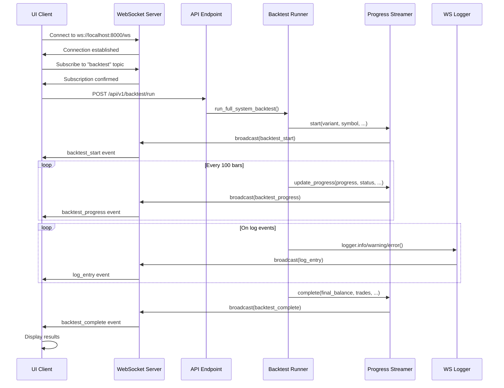

# WebSocket Streaming Architecture

This document describes the real-time WebSocket streaming architecture for backtest progress updates and log entries in QuantMindX.

## Overview

The WebSocket streaming system provides real-time updates during backtest execution, enabling the UI to display progress, logs, and results without polling. The architecture supports multiple concurrent backtests with isolated event streams.

## Architecture Components

### 1. Connection Manager (`src/api/websocket_endpoints.py`)

The `ConnectionManager` class handles WebSocket connections and topic-based message broadcasting:

```python
class ConnectionManager:
    def __init__(self):
        self.active_connections: Set[WebSocket] = set()
        self.subscriptions: Dict[str, Set[WebSocket]] = {}
    
    async def connect(self, websocket: WebSocket)
    def disconnect(self, websocket: WebSocket)
    async def subscribe(self, websocket: WebSocket, topic: str)
    async def broadcast(self, message: Dict[str, Any], topic: Optional[str] = None)
```

**Features:**
- Topic-based subscription model (e.g., "backtest", "trading", "logs")
- Automatic cleanup of disconnected clients
- Broadcast to all connections or topic subscribers only

### 2. WebSocket Log Handler (`src/api/ws_logger.py`)

The `WebSocketLogHandler` extends Python's `logging.Handler` to broadcast log records via WebSocket:

```python
class WebSocketLogHandler(logging.Handler):
    def __init__(self, topic: str = "backtest", backtest_id: Optional[str] = None)
    def emit(self, record: logging.LogRecord)
    def _format_record(self, record: logging.LogRecord) -> Dict[str, Any]
```

**Features:**
- Seamless integration with Python's logging system
- Automatic JSON formatting of log records
- Async-safe broadcasting using `asyncio.create_task()`

### 3. Backtest Progress Streamer (`src/api/ws_logger.py`)

The `BacktestProgressStreamer` handles backtest lifecycle events:

```python
class BacktestProgressStreamer:
    async def start(self, variant, symbol, timeframe, start_date, end_date)
    async def update_progress(self, progress, status, bars_processed, ...)
    async def complete(self, final_balance, total_trades, win_rate, ...)
    async def error(self, error_message, error_details)
```

**Features:**
- Structured event types for different lifecycle stages
- Automatic duration calculation
- Support for additional results metadata

### 4. Sentinel-Enhanced Tester (`src/backtesting/mode_runner.py`)

The `SentinelEnhancedTester` integrates WebSocket streaming into the backtest engine:

```python
class SentinelEnhancedTester(PythonStrategyTester):
    def __init__(self, mode, enable_ws_streaming=True, backtest_id=None):
        if enable_ws_streaming:
            self._ws_logger, self._progress_streamer = setup_backtest_logging(backtest_id)
    
    def _log(self, message: str):
        super()._log(message)
        if self._ws_logger:
            self._ws_logger.info(message)
```

**Features:**
- WebSocket streaming enabled by default
- Consistent streaming across all backtest modes (Vanilla, Spiced, etc.)
- Backtest ID correlation with REST API sessions

## Message Types

### backtest_start

Broadcast when a backtest begins:

```json
{
  "type": "backtest_start",
  "data": {
    "backtest_id": "uuid-string",
    "variant": "spiced",
    "symbol": "EURUSD",
    "timeframe": "H1",
    "start_date": "2023-01-01",
    "end_date": "2023-12-31",
    "timestamp": "2024-01-15T10:30:00.000Z"
  }
}
```

### backtest_progress

Broadcast during backtest execution (typically every 100 bars):

```json
{
  "type": "backtest_progress",
  "data": {
    "backtest_id": "uuid-string",
    "progress": 50.0,
    "status": "Processing bar 5000/10000",
    "bars_processed": 5000,
    "total_bars": 10000,
    "current_date": "2023-06-15",
    "trades_count": 25,
    "current_pnl": 500.00,
    "timestamp": "2024-01-15T10:30:30.000Z"
  }
}
```

### log_entry

Broadcast for each log message:

```json
{
  "type": "log_entry",
  "data": {
    "backtest_id": "uuid-string",
    "timestamp": "2024-01-15T10:30:31.000Z",
    "level": "INFO",
    "message": "Trade executed: BUY 0.1 lots EURUSD",
    "module": "mode_runner",
    "function": "execute_trade",
    "line": 245,
    "logger_name": "backtest.uuid-string"
  }
}
```

### backtest_complete

Broadcast when backtest finishes successfully:

```json
{
  "type": "backtest_complete",
  "data": {
    "backtest_id": "uuid-string",
    "final_balance": 12500.00,
    "total_trades": 45,
    "win_rate": 62.5,
    "sharpe_ratio": 1.85,
    "drawdown": 8.5,
    "return_pct": 25.0,
    "duration_seconds": 45.3,
    "timestamp": "2024-01-15T10:31:00.000Z",
    "results": {}
  }
}
```

### backtest_error

Broadcast when backtest encounters an error:

```json
{
  "type": "backtest_error",
  "data": {
    "backtest_id": "uuid-string",
    "error": "Strategy execution failed",
    "error_details": "ZeroDivisionError: division by zero at line 45",
    "timestamp": "2024-01-15T10:30:45.000Z"
  }
}
```

## Sequence Diagram



## Connection Flow

1. **Client Connection**: UI connects to `ws://localhost:8000/ws`
2. **Subscription**: Client sends `{"action": "subscribe", "topic": "backtest"}`
3. **Confirmation**: Server responds with `{"type": "subscription_confirmed", "topic": "backtest"}`
4. **Backtest Initiation**: Client POSTs to `/api/v1/backtest/run`
5. **Event Streaming**: Server broadcasts events to subscribed clients
6. **Completion**: Final results sent via `backtest_complete` event

## Error Handling

### Connection Failures

- Client automatically attempts reconnection
- Missed events during disconnection are not replayed
- UI should handle missing events gracefully

### Backtest Errors

- Errors are broadcast via `backtest_error` event
- Connection remains active after error
- Client can initiate new backtest

### Broadcasting Failures

- Failed broadcasts are logged but don't crash the backtest
- Disconnected clients are automatically cleaned up
- No message queuing or retry mechanism

## Performance Considerations

### Message Frequency

- Progress updates: Every 100 bars (configurable)
- Log entries: As generated by strategy execution
- Typical rate: 10-50 messages/second during active backtest

### Optimization Strategies

1. **Log Batching**: Group logs and send every 100ms (optional)
2. **Progress Throttling**: Minimum 500ms between updates (optional)
3. **Topic Filtering**: Only subscribe to needed topics

### Memory Management

- Connection manager tracks active connections
- Automatic cleanup on disconnect
- No message history retention

## Configuration

### Enable/Disable WebSocket Streaming

```python
# In API endpoint
result = run_full_system_backtest(
    mode='vanilla',
    data=data,
    enable_ws_streaming=True  # Default: True
)
```

### Custom Backtest ID

```python
result = run_full_system_backtest(
    mode='spiced',
    data=data,
    backtest_id='my-custom-id'  # For correlation with REST session
)
```

## Testing

### Integration Tests

Located in `tests/api/test_backtest_websocket.py`:
- WebSocket connection and subscription
- Event broadcasting and structure
- Multiple concurrent backtests
- Performance benchmarks

### E2E Tests

Located in `tests/e2e/test_backtest_websocket_e2e.py`:
- Full backtest flow with WebSocket
- Event sequence validation
- Data integrity checks

### Unit Tests

Located in `tests/api/test_ws_logger.py`:
- WebSocketLogHandler formatting
- BacktestProgressStreamer event generation
- setup_backtest_logging initialization

## Security Considerations

- No authentication on WebSocket endpoint (development mode)
- All subscribed clients receive all messages for topic
- Consider adding authentication for production deployment

## Future Enhancements

1. **Message Queuing**: Store messages for replay on reconnection
2. **Authentication**: JWT-based WebSocket authentication
3. **Rate Limiting**: Per-client message rate limits
4. **Compression**: WebSocket compression for large messages
5. **Binary Protocol**: Protocol Buffers for efficient encoding
