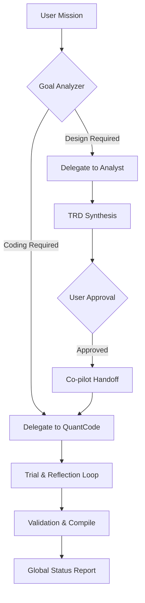

# 🌌 QuantMind Co-pilot: The Master Orchestrator (TRD V1)

## 🎯 Objective
The **QuantMind Co-pilot** is the highest-level intelligence in the QuantMind-X ecosystem. It acts as the "Project Manager," orchestrating the workflow between the **Analyst Agent** (Architect) and the **QuantCode Agent** (Engineer), while providing a seamless co-pilot experience in the VS Code-inspired UI.

---

## 🏗️ Hierarchical Architecture

### L0: QuantMind Co-pilot (The Orchestrator)
- **Functions**: Task Handoff, Workflow Supervision, Progress Monitoring.
- **Access**: Global Task Queue, Knowledge Base, Sub-Agent Lifecycle.

### L1: Specialized Agents (The Workers)
- **Analyst Agent**: Specializes in Strategy Design & TRD Synthesis.
- **QuantCode Agent**: Specializes in MQL5/Python Coding & Trial Reflection.

---

## 🛠️ Core Capabilities

### 1. Unified Project Ingestion
Instead of the user talking to individual agents, the Co-pilot accepts high-level mission statements:
- *User: "Build me a Mean Reversion system for EURUSD inspired by the RSI transcript I just recorded."*
- **Co-pilot Response**: Orchestrates the Analyst to mine the transcript, then triggers QuantCode once the TRD is approved.

### 2. Intelligent Handoff (The Queuing System)
The Co-pilot manages the **Task Queue**:
- It "pushes" work items for the specialized agents.
- It "polls" for completion or errors.
- It resolves conflicts between architectural design (Analyst) and implementation feasibility (QuantCode).

### 3. IDE Context Awareness
Designed to live in a "VS Code-style" sidebar:
- It suggests files to open.
- It provides summaries of recent agent background work.
- It manages the "Sentient Loop" status (showing Sentinel/Governor stats).

---

## 📈 Node Graph: The Orchestration Loop

---

## 🚦 Internal Queuing Logic
The Co-pilot will utilize the `TaskQueueSkill` to:
1.  **Stage 1**: Create a `DESIGN_TASK` for the Analyst.
2.  **Stage 2**: Wait for `DESIGN_COMPLETE` status + TRD file path.
3.  **Stage 3**: Create an `ENGINEERING_TASK` for QuantCode with the TRD as payload.
4.  **Stage 4**: Monitor `CODING_COMPLETE` and initiate `ROUTER_REGISTER`.

---

## ✅ Success Criteria
- Global mission completion (Transcript -> TRD -> MT5 Code -> Router Registration) without manual user intervention between stages.
- Ability to provide a "Project Health" summary across all active agents.
- Unified interface for all sub-agent capabilities.
