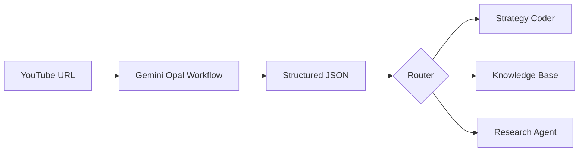

# NPRD to Gemini Opal Migration - Technical Requirements Document

**Version:** 1.0  
**Date:** 2026-01-27  
**Status:** Draft for Gemini Implementation

---

## Executive Summary

This document specifies how to migrate the **NPRD (Neutral Processing & Reality Documentation)** video indexer from a local Python workflow to a **Google Gemini Opal workflow**. 

**Why migrate?**
- Gemini has **native YouTube access** - no need to download videos
- Gemini 1.5 Pro has **state-of-the-art multimodal understanding**
- Leverage existing Google AI subscription
- Eliminates local storage and processing overhead

---

## Current NPRD Capabilities (To Replicate)

The local NPRD system (documented in `NPRD.md`) provides:

| Feature | Description |
|---------|-------------|
| **Storyline Timeline** | Video split into semantic blocks with timestamps |
| **Speaker Diarization** | Identify speakers, assign roles (Host/Expert) |
| **Visual Descriptions** | Describe what's shown on screen (charts, diagrams) |
| **OCR Extraction** | Extract text from slides, labels, annotations |
| **Slide Detection** | Flag when presentation slides appear |
| **Unbiased Transcription** | Raw data without interpretation |

---

## Gemini Opal Workflow Specification

### Workflow Name
`quantmindx-video-indexer`

### Workflow Description
> Analyzes YouTube videos to extract structured timeline data including transcript, speaker identification, visual descriptions, and OCR content. Designed for trading education videos but works with any content.

### Input Parameters

| Parameter | Type | Required | Description |
|-----------|------|----------|-------------|
| `youtube_url` | string | Yes | YouTube video URL |
| `video_title` | string | No | Optional title override |
| `output_format` | enum | No | `json` (default), `markdown` |
| `extract_ocr` | boolean | No | Enable OCR extraction (default: true) |

> **Note:** No segmentation parameters needed - Gemini analyzes the entire video natively and determines natural semantic boundaries automatically.

### Output Schema (JSON)

```json
{
  "video_id": "string",
  "source_url": "string",
  "meta": {
    "title": "string",
    "channel": "string",
    "published_date": "string",
    "total_duration": "MM:SS",
    "language": "string",
    "speakers": {
      "SPEAKER_01": "Role description",
      "SPEAKER_02": "Role description"
    }
  },
  "summary": {
    "one_line": "Single sentence summary",
    "key_topics": ["topic1", "topic2"],
    "content_type": "tutorial|interview|lecture|presentation"
  },
  "timeline": [
    {
      "clip_id": 1,
      "timestamp_start": "MM:SS",
      "timestamp_end": "MM:SS",
      "speaker": "SPEAKER_ID or null",
      "transcript": "Verbatim spoken text",
      "visual_description": "Objective description of visuals",
      "ocr_content": ["extracted", "text", "items"],
      "slide_detected": false,
      "annotations": {
        "charts_shown": ["EURUSD Daily", "S&P 500"],
        "tools_demonstrated": ["MT5", "TradingView"],
        "concepts_mentioned": ["support", "resistance", "FVG"]
      }
    }
  ],
  "processing_metadata": {
    "processed_at": "ISO8601 timestamp",
    "model_version": "gemini-1.5-pro",
    "total_clips": 45
  }
}
```

---

## Gemini System Prompt (The "Librarian")

```
You are an unbiased video data transcriber called "The Librarian."

Your role is to extract structured data from videos WITHOUT interpretation or analysis. You observe and document, nothing more.

## Your Tasks:

1. **SPEAKER IDENTIFICATION**
   - Listen to the first 2 minutes to fingerprint voices
   - Assign roles based on behavior patterns:
     - "Host/Interviewer" = asks questions, short utterances
     - "Expert/Guest" = gives explanations, long responses
     - "Presenter" = single speaker, teaching/demonstrating
   - Use consistent speaker IDs throughout (SPEAKER_01, SPEAKER_02, etc.)

2. **TIMELINE SEGMENTATION**
   - Break video into semantic blocks (30-90 seconds each)
   - New segment when: topic changes, visual changes significantly, or new speaker
   - Record exact timestamps for each segment

3. **TRANSCRIPT**
   - Provide verbatim text of what is spoken
   - Include filler words, pauses marked as [pause], unclear as [inaudible]
   - Do NOT paraphrase or summarize

4. **VISUAL DOCUMENTATION**
   - Describe WHAT is shown, not what it MEANS
   - Good: "A daily candlestick chart with EURUSD label, price showing 1.0850"
   - Bad: "A bullish setup forming on EURUSD"
   - Note cursor movements, drawings, highlights

5. **OCR EXTRACTION**
   - Extract ALL visible text: slide titles, labels, annotations, UI elements
   - Preserve formatting where possible
   - Note if text is a slide vs. screen recording

6. **SLIDE DETECTION**
   - Flag segments where presentation slides are primary content
   - Document slide titles and bullet points exactly

## Critical Rules:
- NO trading analysis or strategy interpretation
- NO opinions on what concepts mean
- NO recommendations or judgments
- ONLY factual observation and documentation
- When uncertain, describe what you see literally
```

---

## Workflow Steps

Since Gemini has **native access to the entire YouTube video**, the workflow is simple:

### Step 1: Provide YouTube URL
```
1. Paste YouTube URL into Gemini/Opal
2. Gemini accesses video directly (no download)
3. Full video context available in single prompt
```

### Step 2: Single-Pass Analysis
```
Gemini analyzes entire video in one pass:
- Identifies speakers from voice patterns
- Detects natural topic/scene transitions
- Creates timeline with semantic boundaries it determines
- Extracts transcript, visuals, OCR simultaneously
```

### Step 3: Structured Output
```
Gemini returns complete JSON:
- Metadata (title, duration, speakers)
- Timeline with clips at natural breakpoints
- No manual segmentation needed
```

---

## Usage Examples

### Example 1: Trading Video
```
Input: https://youtube.com/watch?v=example123
Output: Timeline with chart descriptions, price levels, ICT concepts

Use Case: Feed to Strategy Coder agent for pattern extraction
```

### Example 2: Coding Tutorial
```
Input: https://youtube.com/watch?v=python-tutorial
Output: Timeline with code snippets, terminal commands, error messages

Use Case: Feed to documentation system
```

### Example 3: Interview/Podcast
```
Input: https://youtube.com/watch?v=finance-podcast
Output: Timeline with speaker-tagged transcript, topic segments

Use Case: Searchable knowledge base
```

---

## Integration with QuantMindX

### Downstream Consumers

| Consumer | Usage |
|----------|-------|
| Strategy Coder | Extract chart patterns, entry/exit rules |
| Knowledge Base | Searchable video content |
| Training Data | ML model training examples |
| Research Agent | Concept extraction |

### Example Integration Flow



---

## Advantages Over Local NPRD

| Aspect | Local NPRD | Gemini Opal |
|--------|------------|-------------|
| Video Access | Download required | Native YouTube access |
| Processing | Local GPU/API calls | Cloud-based |
| Maintenance | Code updates needed | Workflow managed |
| Cost | Per-API-call | Included in subscription |
| Latency | Video download + processing | Direct processing |
| Accuracy | Multiple model calls | Single multimodal model |

---

## Implementation Checklist for Gemini

- [ ] Create new Opal workflow in Gemini
- [ ] Configure input parameters as specified
- [ ] Set system prompt to "The Librarian" 
- [ ] Configure JSON output schema
- [ ] Test with sample YouTube videos:
  - [ ] Trading video (ICT mentorship)
  - [ ] Coding tutorial
  - [ ] Interview/podcast
- [ ] Validate output structure
- [ ] Set up scheduled runs (if needed)
- [ ] Connect to QuantMindX knowledge base

---

## Sample Gemini Prompt for Testing

You can test this directly in Gemini with the following prompt:

```
Analyze this YouTube video as "The Librarian":
[PASTE YOUTUBE URL]

Follow these rules:
1. Identify all speakers and assign roles (Host, Expert, Presenter)
2. Create a timeline with segments every 30-90 seconds
3. For each segment provide:
   - Timestamp range
   - Active speaker
   - Verbatim transcript
   - Visual description (WHAT is shown, not interpretation)
   - Any visible text (OCR)
   - Whether it's a slide or screen recording

Output as JSON with this structure:
{
  "meta": { "title", "duration", "speakers": {} },
  "timeline": [{ "clip_id", "timestamp_start", "timestamp_end", "speaker", "transcript", "visual_description", "ocr_content", "slide_detected" }]
}

CRITICAL: Do NOT interpret trading strategies or recommend actions. Only document what you observe.
```

---

## Notes for Gemini

1. **Native YouTube**: You can directly analyze YouTube videos by URL - no need to process video files
2. **Long Context**: Gemini 1.5 Pro supports up to 1 hour of video natively
3. **Multimodal**: Audio + visual analysis in one pass
4. **Speaker ID**: Built-in capability for speaker diarization
5. **Workflow**: This can be saved as a reusable Opal workflow for batch processing
