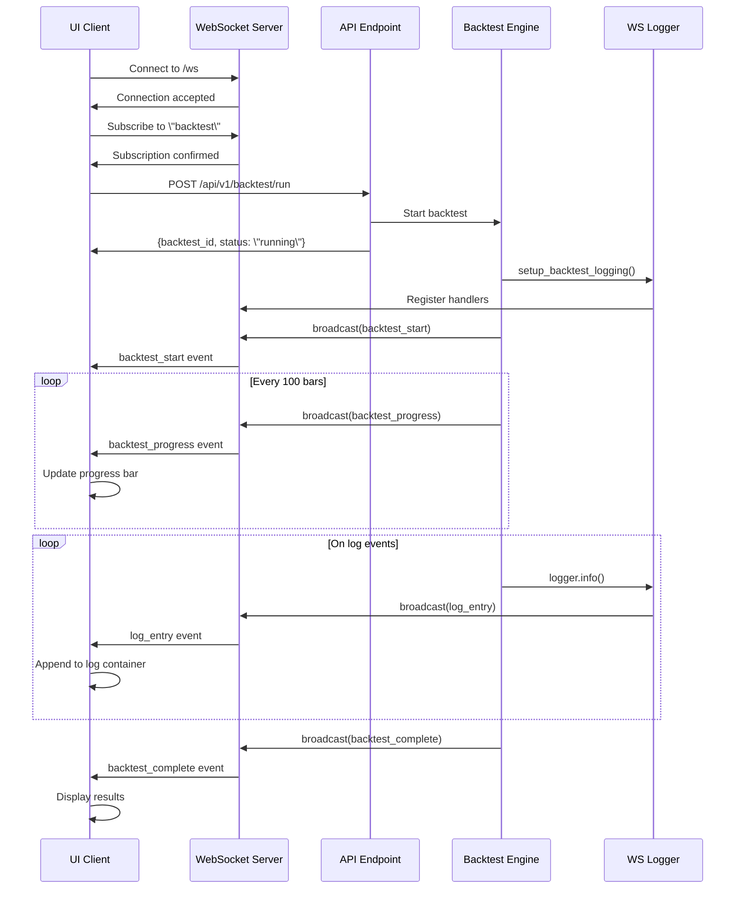

# WebSocket Log Streaming Architecture

## Overview
Real-time backtest progress and log streaming via WebSocket.

## Architecture


## Components
- WebSocketLogHandler: Custom Python logging handler
- BacktestProgressStreamer: Backtest lifecycle events
- WebSocket Client: TypeScript client with reconnection
- BacktestRunner UI: Real-time display component

## Usage

### Backend Integration
```python
from src.api.ws_logger import setup_backtest_logging

# Setup WebSocket logging
logger, progress_streamer = setup_backtest_logging(backtest_id)

# Use logger for real-time logs
logger.info(\"Backtest started\")

# Broadcast progress
await progress_streamer.update_progress(
    progress=50.0,
    status=\"Processing...\",
    trades_count=10
)
```

### Frontend Integration
```typescript
import { createBacktestClient } from '$lib/ws-client';

// Connect to WebSocket
const client = await createBacktestClient('http://localhost:8000');

// Handle events
client.on('backtest_progress', (message) => {
  console.log('Progress:', message.data.progress);
});
```

## Message Types
- `backtest_start`: Backtest parameters
- `backtest_progress`: Progress percentage, bars processed, trades, P&L
- `log_entry`: Real-time log messages with level, timestamp, module
- `backtest_complete`: Final metrics (balance, trades, Sharpe, drawdown)
- `backtest_error`: Error details

## Testing
- `tests/api/test_ws_logger.py`: Unit tests (>80% coverage)
- `tests/e2e/test_backtest_streaming_e2e.py`: E2E integration tests
- `quantmind-ide/src/lib/components/BacktestRunner.test.ts`: UI component tests

Run with: `pytest tests/api/test_ws_logger.py -v` and `pytest tests/e2e/ -v`
